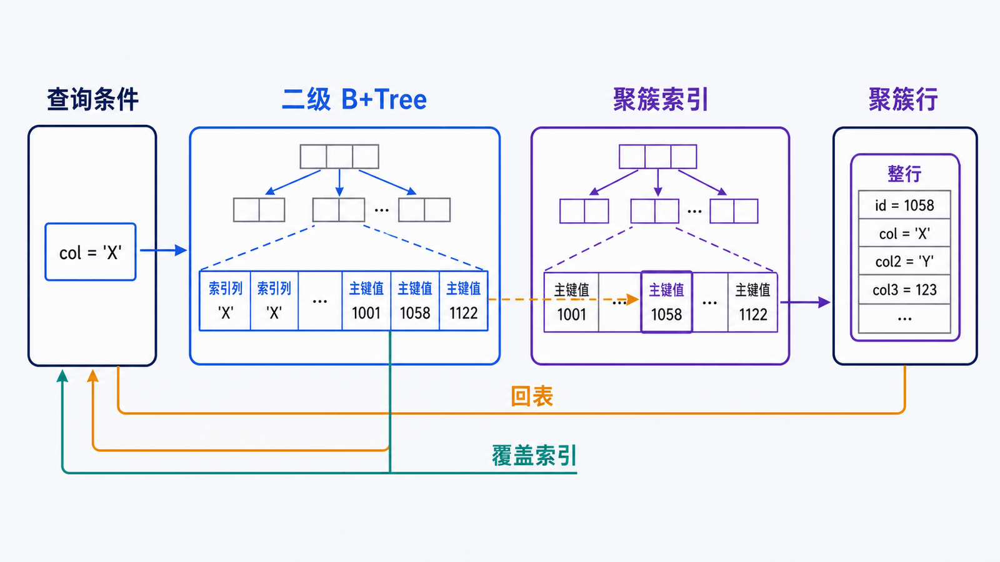
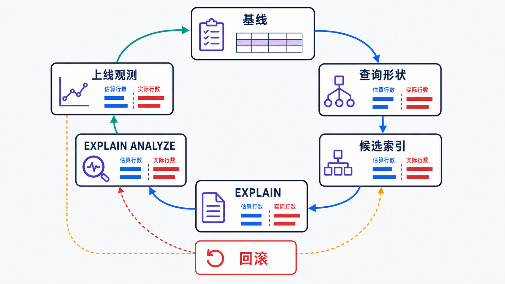

> 索引不是“给常用列加一个结构”，而是为具体的过滤、连接、排序和返回列设计访问路径，并用实测证明收益大于写入与存储成本。

## 前置知识与学习目标

请先理解 InnoDB 聚簇索引、单表条件和多表连接。完成本篇后，你应该能够：

- 解释聚簇索引、二级索引、回表和覆盖索引；
- 从等值过滤、范围、排序和 LIMIT 推导复合索引顺序；
- 阅读 `EXPLAIN` 的估算字段，并用 `EXPLAIN ANALYZE` 对比实测；
- 形成“基线—假设—变更—验证—回滚”的调优闭环。

## 一条慢查询的形状

订单列表接口查询某客户的已支付订单，按时间倒序翻页：

```sql
SELECT id, customer_id, status, total_amount, created_at
FROM orders
WHERE customer_id = 42
  AND status = 'paid'
ORDER BY created_at DESC, id DESC
LIMIT 20;
```

它包含两个等值条件、两个稳定排序键和一个小 `LIMIT`。候选复合索引是：

```sql
CREATE INDEX idx_orders_customer_status_created_id
ON orders (customer_id, status, created_at DESC, id DESC);
```

索引前缀先定位客户和状态，再按目标顺序读取时间与 ID。是否最优仍取决于数据分布、其他查询、写入量和优化器估算，必须验证。

## InnoDB 索引如何找到整行

<!-- figure:s08-f01:start -->



<!-- figure:s08-f01:end -->

InnoDB 的主键索引是聚簇索引，叶子节点保存整行。普通二级索引叶子保存“索引列 + 主键值”：

```text
二级索引条件 -> 找到主键值 -> 回到聚簇索引取其余列
```

如果查询所需列都能从二级索引获得，就可能成为覆盖索引，减少回表。但为了覆盖所有接口列不断扩宽索引，会增加磁盘、buffer pool 占用和每次写入维护成本。

主键应短、稳定、递增趋势良好。过宽的主键会复制进每个二级索引，放大整体空间。

## 复合索引不是“最左前缀口诀”

设计时依次问：

1. 哪些条件是高频且稳定的等值过滤？
2. 第一个范围条件在哪里？
3. 后续列能否继续服务排序或覆盖？
4. 选择性和数据倾斜如何？
5. 该索引能复用哪些已有索引，是否产生冗余前缀？

索引 `(customer_id, status, created_at, id)` 通常可支持只使用 `customer_id`，以及 `customer_id + status` 的前缀查询；不能自动高效支持只按 `status` 查询。

范围条件之后的列仍可能用于索引条件下推、覆盖或部分排序，但不能简单承诺都能缩小 B+Tree 定位范围。看计划和实测，而不是只背规则。

## 建立优化前基线

<!-- figure:s08-f02:start -->



<!-- figure:s08-f02:end -->

先保存查询文本、参数分布、表行数、响应时间和计划：

```sql
EXPLAIN FORMAT=TREE
SELECT id, customer_id, status, total_amount, created_at
FROM orders
WHERE customer_id = 42
  AND status = 'paid'
ORDER BY created_at DESC, id DESC
LIMIT 20;
```

传统表格格式常关注：

| 字段            | 含义                     | 不能怎样误读                       |
| --------------- | ------------------------ | ---------------------------------- |
| `type`          | 访问类型                 | `ALL` 不一定错，小表扫描可能最便宜 |
| `possible_keys` | 候选索引                 | 出现不代表会使用                   |
| `key`           | 实际选择                 | 非空不代表计划就好                 |
| `rows`          | 预计读取行数             | 是估算，不是实际值                 |
| `filtered`      | 条件后预计保留比例       | 依赖统计信息                       |
| `Extra`         | 覆盖、排序、临时表等补充 | `Using filesort` 不等于一定落磁盘  |

在隔离或可控环境执行：

```sql
EXPLAIN ANALYZE
SELECT id, customer_id, status, total_amount, created_at
FROM orders
WHERE customer_id = 42
  AND status = 'paid'
ORDER BY created_at DESC, id DESC
LIMIT 20;
```

比较估算行数与实际行数、迭代器循环次数和耗时。如果偏差大，检查统计信息与数据倾斜：

```sql
ANALYZE TABLE orders;
```

直方图可帮助没有合适索引的列分布估算，但不是索引替代品。

## 让谓词保持可索引

同一语义可有不同访问形状：

```sql
-- 函数包裹列，通常难以直接使用 created_at 的普通范围索引
WHERE DATE(created_at) = '2026-07-01'

-- 改写为左闭右开的范围
WHERE created_at >= '2026-07-01'
  AND created_at < '2026-07-02'
```

其他常见问题包括隐式类型转换、前导通配符、对索引列做算术运算，以及连接两侧字符集/类型不一致。不要把“未走索引”单独当根因；真正目标是降低总体延迟、资源消耗和抖动。

## 可回滚的索引变更

索引上线前：

1. 检查重复或前缀冗余索引；
2. 估算构建时间、临时空间和元数据锁；
3. 在相似数据量验证读写性能；
4. 上线后观察查询延迟、buffer pool、I/O 和写入吞吐；
5. 保留明确回滚方案。

删除疑似无用索引前可先设为 invisible，让优化器默认忽略：

```sql
ALTER TABLE orders
ALTER INDEX idx_orders_customer_status_created_id INVISIBLE;

-- 确认回归后恢复
ALTER TABLE orders
ALTER INDEX idx_orders_customer_status_created_id VISIBLE;
```

主键不能设为 invisible。隐藏索引仍有写维护成本，只适合风险验证，不是长期清理完成态。

## 常见误区和适用边界

- 索引越多，写入、更新、删除和缓存压力越大。
- 低选择性列并非永远不能建索引；与其他列组合、覆盖和排序仍可能有价值。
- `SELECT *` 会增加回表与网络成本，但把它改成列清单不保证自动变快。
- `Using filesort` 是算法标签，是否成为瓶颈要结合行数、LIMIT 和实测。
- 开慢查询日志会有成本，应配置阈值、采样/保留和敏感信息治理。

## 自检题

1. 为什么二级索引过多会放大主键宽度的成本？
2. `rows = 100` 是实际读取 100 行吗？
3. 删除索引前为什么可以先设为 invisible？

<details>
<summary>查看答案</summary>

1. 每个 InnoDB 二级索引叶子都保存主键值，主键越宽，所有二级索引越大。
2. 不是。传统 EXPLAIN 的 `rows` 是估算；实际行数要看 `EXPLAIN ANALYZE` 等运行证据。
3. 可在保留索引定义的情况下让优化器默认忽略，观察计划和业务回归，并能快速恢复可见性。

</details>

## 本篇总结

索引设计从查询形状和数据分布出发，以执行计划和实测结束。单个字段或一句“最左前缀”不足以证明优化成立，完整闭环还必须覆盖写入代价、上线观测与回滚。

## 下一篇衔接

下一篇沿用 `(created_at, id)` 稳定顺序，解释百万行后的 OFFSET 为什么昂贵，并比较浅页、延迟关联和 Keyset 分页。

## 资料来源

- [How MySQL Uses Indexes](https://dev.mysql.com/doc/refman/8.4/en/mysql-indexes.html)
- [InnoDB Clustered and Secondary Indexes](https://dev.mysql.com/doc/refman/8.4/en/innodb-index-types.html)
- [EXPLAIN Statement](https://dev.mysql.com/doc/refman/8.4/en/explain.html)
- [Invisible Indexes](https://dev.mysql.com/doc/refman/8.4/en/invisible-indexes.html)
- [Optimizer Statistics](https://dev.mysql.com/doc/refman/8.4/en/optimizer-statistics.html)
