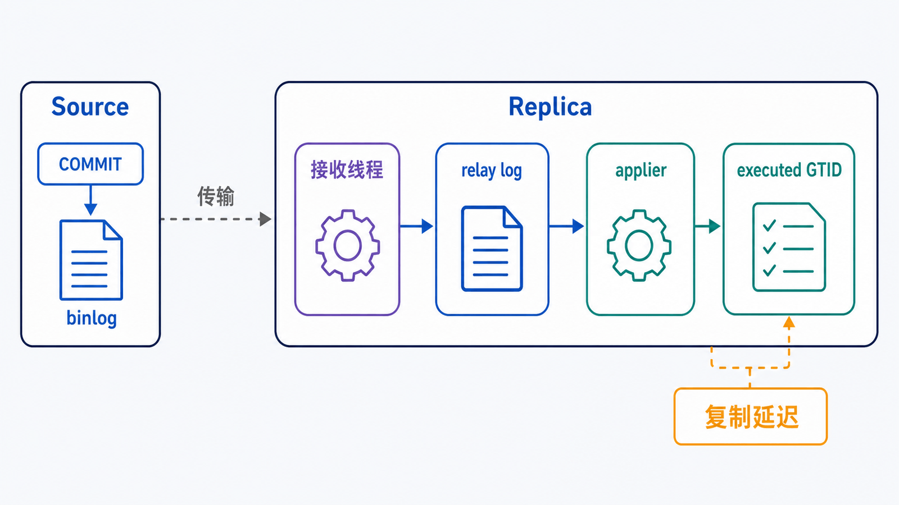
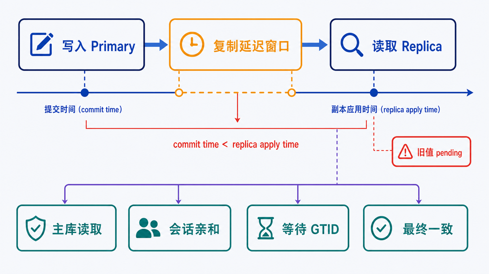
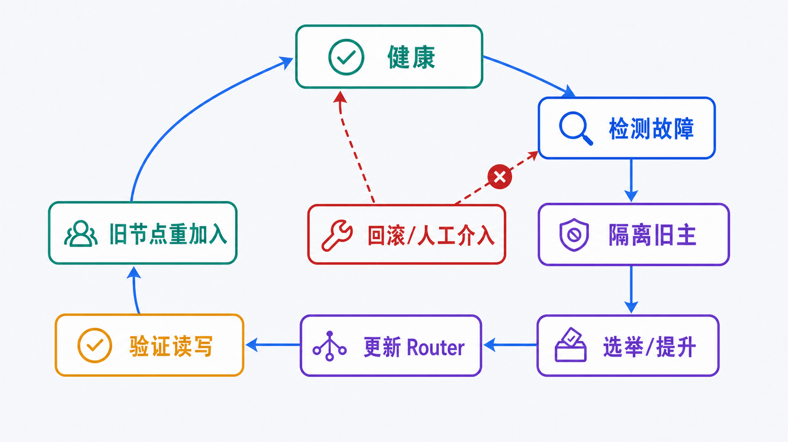

> 高可用不是“有一台副本”。它是一条可演练的控制链：检测故障、隔离旧主、选出可用主、更新路由、验证数据并决定是否回滚。

## 前置知识与学习目标

请先理解事务、binlog、RPO 与 RTO。完成本篇后，你应该能够：

- 解释 source、replica、relay log、GTID 和复制延迟；
- 区分异步复制扩读与 InnoDB Cluster 自动故障转移；
- 设计读写路由并处理读后写一致性；
- 用可观测指标和故障演练验证可用性，而不是只看拓扑图。

## 异步复制的数据流

<!-- figure:s12-f01:start -->



<!-- figure:s12-f01:end -->

MySQL 8.4 使用 **source/replica（源库/副本）** 术语。旧命令中的 `MASTER`/`SLAVE` 仅作为兼容历史出现。

1. 源库事务提交并写入 binlog；
2. 副本接收线程拉取事件，写入本地 relay log；
3. applier 线程重放事件；
4. 副本的 executed GTID 集合随应用进度推进。

GTID 为每个事务提供全局标识，减少手工维护文件和位置的复杂度。简化配置示意：

```sql
CHANGE REPLICATION SOURCE TO
  SOURCE_HOST = 'mysql-source',
  SOURCE_PORT = 3306,
  SOURCE_USER = 'repl',
  SOURCE_PASSWORD = 'managed-outside-sql-history',
  SOURCE_AUTO_POSITION = 1;

START REPLICA;
SHOW REPLICA STATUS\G
```

这段命令只展示接口，不包含账户、TLS、初始数据同步、GTID 模式和防火墙等前置步骤。凭据不应保留在共享 SQL 历史中。

异步复制默认允许源库提交后再由副本追赶，因此副本可能落后。它能扩展读取、承载分析或备份，但不自动等于零数据丢失故障切换。

## 读写分离的真正难点是一致性

<!-- figure:s12-f02:start -->



<!-- figure:s12-f02:end -->

最简单路由是：写入和强一致读取到主库，允许陈旧的读取到副本。

```text
客户端 -> Router/代理 -> 主库：INSERT/UPDATE/DELETE、读后写
                    -> 副本：报表、搜索、可容忍延迟的读取
```

用户刚支付订单，下一请求若立即读副本，可能仍看到 `pending`。常见策略：

- 写后一定时间内保持主库会话亲和；
- 把关键读固定到主库；
- 把提交事务的 GTID 返回给应用，在副本等待该 GTID 执行后再读；
- 业务页面展示“处理中”，显式接受最终一致性。

选择取决于延迟预算和正确性，不应让代理仅按 SQL 首词机械分类。事务、存储过程、临时表和会话状态都可能要求连接粘性。

## InnoDB Cluster 与 MySQL Router

InnoDB Cluster 以 Group Replication 为核心，由 MySQL Shell AdminAPI 管理，MySQL Router 根据集群元数据提供读写端点。常见三节点单主模式中：

- 多数派维护成员视图；
- 一个 primary 接受写入；
- primary 故障时组内选举新的 primary；
- Router 刷新路由，把新连接送往可写节点。

三节点能容忍一个节点故障并维持多数派，不代表可以忽略跨故障域、网络分区、备份或容量。Group Replication 要求业务表使用 InnoDB，并对主键、事务大小和不支持特性有明确约束。

| 方案           | 主要目标                             | 自动选主     | 典型一致性               |
| -------------- | ------------------------------------ | ------------ | ------------------------ |
| 单源异步复制   | 扩读、灾备基础                       | 需外部编排   | 副本可能延迟             |
| 半同步复制     | 降低源库提交后事件未到任何副本的风险 | 仍需外部编排 | 确认收到日志不等于已应用 |
| InnoDB Cluster | 组成员管理与自动故障转移             | 支持         | 由组复制与一致性选项控制 |

## 一次故障转移的状态变化

<!-- figure:s12-f03:start -->



<!-- figure:s12-f03:end -->

完整流程应包含：

1. **检测**：连接、心跳、成员状态或主库不可写达到阈值；
2. **隔离**：防止旧主恢复后继续接受写入，避免双主；
3. **选举/提升**：选择数据足够新且满足策略的节点；
4. **路由更新**：新连接和连接池切换到新主；
5. **验证**：关键表可读写、GTID 连续、延迟和错误率正常；
6. **修复旧节点**：重新加入前校验数据，不能直接当作健康副本；
7. **复盘**：记录实际 RTO、是否丢数据、告警和人工步骤。

应用必须能处理切换期间的连接中断、事务结果不确定和幂等重试。一次 `COMMIT` 返回前连接断开时，不能假设事务一定失败；应通过业务幂等键查询最终状态。

## 监控与演练指标

至少观察：

- primary/成员角色与可写性；
- received GTID 与 executed GTID 差距；
- applier 队列、错误和复制延迟；
- Router 后端健康、连接失败率与切换次数；
- 事务提交延迟、连接池耗尽和只读错误；
- 故障检测时间、选举时间、路由恢复时间、端到端 RTO；
- 切换后业务不变量和数据丢失窗口。

每季度或重大版本变更后，在隔离环境演练：杀主进程、断网络、磁盘只读、单节点延迟、Router 重启和旧主重新加入。

## 常见误区和适用边界

- “Seconds_Behind_Source = 0” 不是完整健康证明；该指标可能为 `NULL`，也不能覆盖所有队列与业务一致性。
- 副本数量越多，源库发送和运维成本越高。
- 自动故障转移不能代替备份，错误事务会传播到所有成员。
- 双主写入不是简单提高写吞吐，会引入冲突、顺序和自增键治理。
- 老旧 MHA/代理名称清单不是现代架构方案；新系统优先评估官方 InnoDB Cluster/Router 或托管服务能力。

## 自检题

1. 异步副本为什么可能读不到刚提交的订单？
2. 故障转移时为什么必须先隔离旧主？
3. 三节点集群能否替代备份？

<details>
<summary>查看答案</summary>

1. 源库提交后，事件还要传输并由副本应用，期间存在复制延迟。
2. 防止旧主恢复后继续接受写入，与新主形成分叉或双主。
3. 不能。误删、逻辑错误和权限事故会复制到成员，备份提供独立恢复点。

</details>

## 本篇总结

高可用由复制、共识/选举、隔离、路由、应用重试和观测共同组成。读写分离首先是数据一致性设计，其次才是流量分配。

## 下一篇衔接

最后一篇把全系列能力收束为统一诊断闭环：从连接、认证、服务、锁、慢查询和复制故障中收集证据，安全修复并验证。

## 资料来源

- [MySQL Replication](https://dev.mysql.com/doc/refman/8.4/en/replication.html)
- [Replication with GTIDs](https://dev.mysql.com/doc/refman/8.4/en/replication-gtids.html)
- [Group Replication](https://dev.mysql.com/doc/refman/8.4/en/group-replication.html)
- [MySQL InnoDB Cluster](https://dev.mysql.com/doc/mysql-shell/8.4/en/mysql-innodb-cluster.html)
- [MySQL Router](https://dev.mysql.com/doc/mysql-router/8.4/en/)
