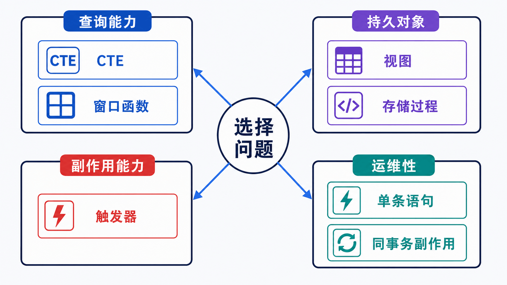

> 高级特性的价值不在于“把逻辑都放进数据库”，而在于选择一个边界清楚、可测试、可观测、可迁移的实现位置。

## 前置知识与学习目标

请先理解事务、逻辑查询顺序、多表连接和执行计划。完成本篇后，你应该能够：

- 按作用域区分 CTE、视图、窗口函数、触发器和存储程序；
- 为订单报表选择可读且可验证的数据库对象；
- 识别隐藏副作用、权限、部署顺序和版本迁移风险；
- 判断什么逻辑不应下沉到数据库。

## 先用选择框架，而不是功能清单

<!-- figure:s10-f01:start -->



<!-- figure:s10-f01:end -->

| 能力     | 生命周期         | 最擅长解决                     | 主要风险                            |
| -------- | ---------------- | ------------------------------ | ----------------------------------- |
| CTE      | 单条语句         | 拆分查询阶段、递归层级         | 复杂查询仍需看是否合并或物化        |
| 窗口函数 | 单条查询结果     | 排名、累计、同组比较且不折叠行 | 排序与分区可能消耗大量内存/临时空间 |
| 视图     | 持久数据库对象   | 复用查询接口、限制列可见性     | 依赖链、权限和性能被隐藏            |
| 触发器   | 表事件副作用     | 强制审计等必须随写入发生的动作 | 隐藏写入、递归式耦合、排错困难      |
| 存储过程 | 可调用数据库程序 | 靠近数据的原子批处理           | 版本管理、测试、可移植性和资源占用  |
| 存储函数 | 表达式中的返回值 | 小型确定性计算                 | 被逐行调用时成本高，副作用限制多    |

先问四个问题：逻辑需要跨应用复用吗？必须与数据变更同事务吗？调用方能否看到副作用？失败时如何回滚和观测？

## CTE：给复杂查询命名阶段

找出每位客户的成交总额：

```sql
WITH customer_sales AS (
    SELECT
        customer_id,
        COUNT(*) AS order_count,
        SUM(total_amount) AS sales_amount
    FROM orders
    WHERE status IN ('paid', 'shipped')
    GROUP BY customer_id
)
SELECT c.id, c.display_name, s.order_count, s.sales_amount
FROM customer_sales AS s
JOIN customers AS c ON c.id = s.customer_id
WHERE s.sales_amount >= 500
ORDER BY s.sales_amount DESC, c.id;
```

CTE 提高的是表达结构，不保证自动更快。优化器可能合并或物化它；重复引用、递归或大中间集时尤其要检查 `EXPLAIN ANALYZE`。

## 窗口函数：保留明细同时计算同组关系

给每位客户的订单按金额排名：

```sql
SELECT
    id,
    customer_id,
    total_amount,
    RANK() OVER (
        PARTITION BY customer_id
        ORDER BY total_amount DESC
    ) AS amount_rank,
    SUM(total_amount) OVER (
        PARTITION BY customer_id
        ORDER BY created_at, id
        ROWS BETWEEN UNBOUNDED PRECEDING AND CURRENT ROW
    ) AS running_total
FROM orders
WHERE status IN ('paid', 'shipped');
```

`GROUP BY` 把一组折叠成一行；窗口函数保留每张订单，并在窗口内附加排名或累计值。累计窗口应显式写 frame，避免默认 frame 与并列排序键产生意外语义。

## 视图：稳定查询接口，但不是结果缓存

```sql
CREATE OR REPLACE VIEW v_order_summary AS
SELECT
    o.id AS order_id,
    o.customer_id,
    c.display_name AS customer_name,
    o.status,
    o.total_amount,
    o.created_at
FROM orders AS o
JOIN customers AS c ON c.id = o.customer_id;
```

调用方：

```sql
SELECT *
FROM v_order_summary
WHERE status = 'paid'
ORDER BY created_at DESC, order_id DESC;
```

普通视图保存查询定义，不保存物化结果。底层列重命名、权限或查询计划变化都会影响它。部署迁移应包含创建、依赖检查和回滚语句。

## 触发器：只承担必须隐藏在同一写入中的小副作用

审计订单状态变化：

```sql
CREATE TABLE order_status_audit (
    id BIGINT UNSIGNED PRIMARY KEY AUTO_INCREMENT,
    order_id BIGINT UNSIGNED NOT NULL,
    old_status VARCHAR(20) NOT NULL,
    new_status VARCHAR(20) NOT NULL,
    changed_at DATETIME NOT NULL DEFAULT CURRENT_TIMESTAMP,
    changed_by VARCHAR(288) NOT NULL
) ENGINE = InnoDB;

DELIMITER $$

CREATE TRIGGER trg_orders_status_audit
AFTER UPDATE ON orders
FOR EACH ROW
BEGIN
    IF NOT (OLD.status <=> NEW.status) THEN
        INSERT INTO order_status_audit (
            order_id, old_status, new_status, changed_by
        ) VALUES (
            NEW.id, OLD.status, NEW.status, CURRENT_USER()
        );
    END IF;
END$$

DELIMITER ;
```

`<=>` 是 NULL-safe equality。这里状态列非空，但写法明确表达比较语义。触发器与原更新同事务：审计写入失败，原更新也失败。

触发器不适合调用外部服务、编排长流程或隐藏大量业务规则。应用开发者看不到的额外写入会增加锁、复制和排错成本。

## 存储过程：需要显式事务和异常路径

存储过程适合少数靠近数据、需要统一原子边界的操作，但必须像应用代码一样版本化和测试：

```sql
DELIMITER $$

CREATE PROCEDURE cancel_pending_order(IN p_order_id BIGINT UNSIGNED)
MODIFIES SQL DATA
BEGIN
    DECLARE EXIT HANDLER FOR SQLEXCEPTION
    BEGIN
        ROLLBACK;
        RESIGNAL;
    END;

    START TRANSACTION;

    UPDATE orders
    SET status = 'cancelled'
    WHERE id = p_order_id AND status = 'pending';

    IF ROW_COUNT() <> 1 THEN
        SIGNAL SQLSTATE '45000'
          SET MESSAGE_TEXT = 'order not found or not pending';
    END IF;

    COMMIT;
END$$

DELIMITER ;
```

输入是订单 ID；成功输出是恰好一行状态变化；失败会回滚并抛出明确错误。若调用方外层已经管理事务，过程内部 `START TRANSACTION`/`COMMIT` 的边界可能冲突，接口契约必须提前确定。

## 什么时候不适用

- 需要跨服务调用、重试编排和可视化工作流：放在应用或任务系统。
- 规则频繁变化且需要 A/B、灰度和单元测试：通常放在应用层。
- 只是为了“少传数据”就写复杂存储过程：先测量网络、执行计划和维护成本。
- 以视图隐藏一个本来就慢的查询：视图不会自动缓存结果。
- 用触发器修补缺失的应用事件模型：隐藏副作用会让一致性问题更难定位。

## 自检题

1. 窗口函数与 `GROUP BY` 对结果行数的影响有何不同？
2. 普通视图会缓存查询结果吗？
3. 为什么触发器应保持短小且副作用明确？

<details>
<summary>查看答案</summary>

1. `GROUP BY` 折叠组；窗口函数保留原行并追加组内计算。
2. 不会。普通视图保存定义，查询时仍访问底层对象。
3. 它随表写入隐式执行，会影响锁、性能、复制与失败路径；逻辑越大，排错和变更风险越高。

</details>

## 本篇总结

高级能力的统一选择标准是作用域、原子性、可见副作用和可运维性。数据库能做某件事，不等于它就是最合适的实现层。

## 下一篇衔接

下一篇把“数据不能丢多久、服务多久恢复”转成 RPO/RTO，并设计全量备份、binlog、异地副本和恢复演练组成的可恢复链。

## 资料来源

- [WITH (Common Table Expressions)](https://dev.mysql.com/doc/refman/8.4/en/with.html)
- [Window Function Concepts and Syntax](https://dev.mysql.com/doc/refman/8.4/en/window-functions-usage.html)
- [Using Views](https://dev.mysql.com/doc/refman/8.4/en/views.html)
- [Using Triggers](https://dev.mysql.com/doc/refman/8.4/en/triggers.html)
- [Stored Objects](https://dev.mysql.com/doc/refman/8.4/en/stored-objects.html)
