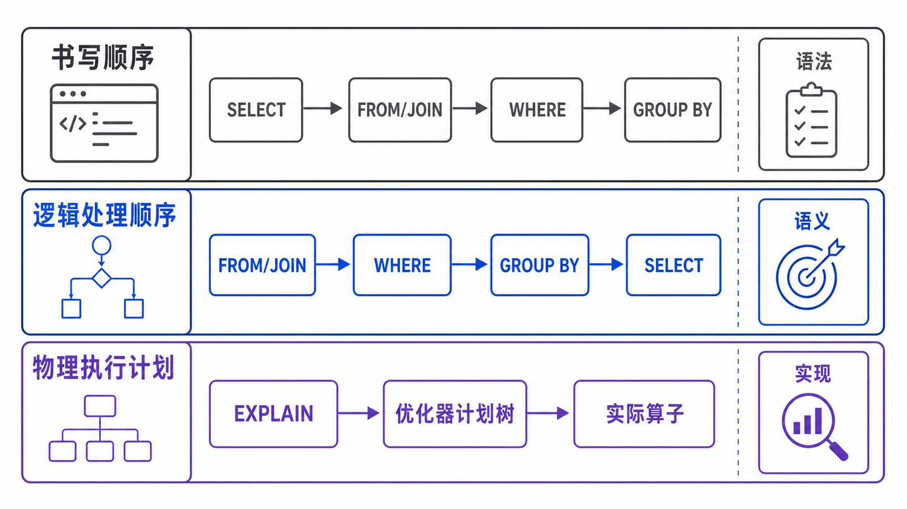

> “FROM 先于 SELECT”是一种理解 SQL 语义的逻辑模型，不是服务器逐行执行的固定脚本。优化器可以改写查询、重排连接并选择不同算法。

## 前置知识与学习目标

请先掌握 `WHERE`、`GROUP BY`、`HAVING`、`SELECT`、`ORDER BY` 和 `LIMIT`。完成本篇后，你应该能够：

- 区分语法书写顺序、逻辑处理顺序和物理执行计划；
- 用每个阶段的中间关系解释别名可见性和聚合错误；
- 知道何时用派生表或 CTE 显式创建新的查询块；
- 用 `EXPLAIN` 与 `EXPLAIN ANALYZE` 验证实际访问路径。

## 三种“顺序”不要混在一起

<!-- figure:s06-f01:start -->



<!-- figure:s06-f01:end -->

语法通常按下面顺序书写：

```text
SELECT -> FROM/JOIN -> WHERE -> GROUP BY -> HAVING -> ORDER BY -> LIMIT
```

用于解释结果语义的简化逻辑顺序是：

```text
FROM/JOIN -> WHERE -> GROUP BY/聚合 -> HAVING
-> SELECT -> DISTINCT -> ORDER BY -> LIMIT
```

物理执行计划则由优化器决定。它可能先走某个索引、下推条件、合并派生表或改变连接顺序，只要结果仍符合 SQL 语义。

## 用中间关系走一遍查询

问题是：“找出 2026 年 7 月已成交金额至少 500 元的客户，按金额倒序取前 10 名。”

```sql
SELECT
    customer_id,
    COUNT(*) AS paid_order_count,
    SUM(total_amount) AS paid_total
FROM orders
WHERE status IN ('paid', 'shipped')
  AND created_at >= '2026-07-01'
  AND created_at < '2026-08-01'
GROUP BY customer_id
HAVING SUM(total_amount) >= 500
ORDER BY paid_total DESC, customer_id ASC
LIMIT 10;
```

| 逻辑阶段      | 输入       | 输出变化                                  |
| ------------- | ---------- | ----------------------------------------- |
| `FROM orders` | 表         | 建立本查询块的初始行与列                  |
| `WHERE`       | 订单行     | 只保留时间和状态满足条件的行              |
| `GROUP BY`    | 过滤后的行 | 按 `customer_id` 形成一客户一组           |
| 聚合          | 每个组     | 计算订单数和金额和                        |
| `HAVING`      | 分组结果   | 排除金额不足 500 的组                     |
| `SELECT`      | 保留的组   | 生成别名 `paid_order_count`、`paid_total` |
| `ORDER BY`    | 投影结果   | 按金额和客户 ID 得到稳定顺序              |
| `LIMIT`       | 已排序结果 | 只返回前 10 行                            |

这个表解释“结果为什么正确”，不承诺数据库真的物化八张临时表。

## 别名为什么在 WHERE 不可用

下面的写法错误：

```sql
SELECT total_amount * 0.94 AS net_amount
FROM orders
WHERE net_amount >= 500;
```

在同一查询块的逻辑语义中，`WHERE` 处理时 `SELECT` 别名还不存在。可以重复表达式，或显式创建外层查询块：

```sql
SELECT id, net_amount
FROM (
    SELECT id, total_amount * 0.94 AS net_amount
    FROM orders
) AS priced_orders
WHERE net_amount >= 500;
```

MySQL 允许在 `GROUP BY`、`HAVING` 和 `ORDER BY` 中引用选择列表别名，但跨数据库系统的可移植性规则可能不同。长期维护代码应优先保证语义清楚。

## WHERE 与 HAVING 的错误迁移

聚合结果不能在 `WHERE` 中过滤：

```sql
-- 错误：WHERE 阶段还没有 SUM 结果
SELECT customer_id, SUM(total_amount) AS total
FROM orders
WHERE SUM(total_amount) >= 500
GROUP BY customer_id;
```

正确做法是先过滤订单行，再在 `HAVING` 过滤分组：

```sql
SELECT customer_id, SUM(total_amount) AS total
FROM orders
WHERE status IN ('paid', 'shipped')
GROUP BY customer_id
HAVING SUM(total_amount) >= 500;
```

如果外层业务还要按 `total` 做更多行级条件，可把聚合查询放进 CTE 或派生表，再由外层 `WHERE` 处理。

## 用执行计划验证物理路径

```sql
EXPLAIN FORMAT=TREE
SELECT id, customer_id, total_amount
FROM orders
WHERE customer_id = 1
ORDER BY created_at DESC, id DESC
LIMIT 20;
```

`EXPLAIN` 显示优化器估算和计划；`EXPLAIN ANALYZE` 会实际执行并返回迭代器的估算/实测行数与时间：

```sql
EXPLAIN ANALYZE
SELECT id, customer_id, total_amount
FROM orders
WHERE customer_id = 1
ORDER BY created_at DESC, id DESC
LIMIT 20;
```

对写语句、昂贵查询或生产大表不能无条件运行 `EXPLAIN ANALYZE`，因为它会真正执行查询。先在隔离环境和可控数据集验证。

## 常见误区和适用边界

- “逻辑顺序”用于推导语义，不用于预测 I/O 次数或连接算法。
- 优化器下推 `WHERE` 条件不违反逻辑模型，只要结果等价。
- `ORDER BY` 可以引用 `SELECT` 别名，不代表该别名在所有子句都存在。
- `HAVING` 虽可过滤非聚合条件，但能提前在 `WHERE` 过滤时应清晰表达行级语义。
- `LIMIT` 是逻辑上的最后截取；物理计划可能利用索引提前停止读取。

## 自检题

1. 为什么 `WHERE SUM(total_amount) > 500` 不成立？
2. 逻辑顺序和 `EXPLAIN` 分别回答什么问题？
3. 如何让 `SELECT` 别名可被另一个 `WHERE` 使用？

<details>
<summary>查看答案</summary>

1. `WHERE` 在分组和聚合之前处理，此时没有每组的 `SUM` 值。
2. 逻辑顺序解释结果语义；`EXPLAIN` 描述优化器选择的物理访问路径和估算。
3. 把原查询放入派生表或 CTE，别名成为外层查询可见的列。

</details>

## 本篇总结

先用逻辑顺序证明查询结果，再用执行计划观察数据库如何得到结果。把两者区分开，才能同时解释 SQL 正确性与性能。

## 下一篇衔接

下一篇把 `FROM` 扩展为客户、订单、明细和商品的连接，重点处理连接基数、`NULL` 扩展行、重复计数与 `NOT EXISTS`。

## 资料来源

- [SELECT Statement](https://dev.mysql.com/doc/refman/8.4/en/select.html)
- [Problems with Column Aliases](https://dev.mysql.com/doc/refman/8.4/en/problems-with-alias.html)
- [EXPLAIN Statement](https://dev.mysql.com/doc/refman/8.4/en/explain.html)
- [Understanding the Query Execution Plan](https://dev.mysql.com/doc/refman/8.4/en/execution-plan-information.html)
