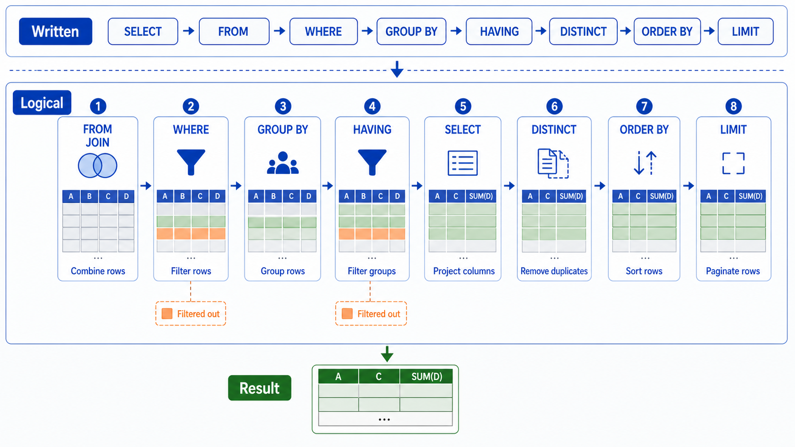

> SQL 查询语句有其固定的执行顺序。



## 执行顺序

| 顺序 | 关键字   | 说明         |
| ---- | -------- | ------------ |
| 1    | FROM     | 从哪个表开始 |
| 2    | ON       | 连接条件     |
| 3    | JOIN     | 连接表       |
| 4    | WHERE    | 过滤条件     |
| 5    | GROUP BY | 分组         |
| 6    | HAVING   | 分组后过滤   |
| 7    | SELECT   | 选择列       |
| 8    | DISTINCT | 去重         |
| 9    | ORDER BY | 排序         |
| 10   | LIMIT    | 限制条数     |

## 示例

```sql
SELECT DISTINCT name, COUNT(*) AS cnt
FROM users
WHERE age > 18
GROUP BY name
HAVING cnt > 2
ORDER BY cnt DESC
LIMIT 10;
```

## 小结

- **FROM** → **WHERE** → **GROUP BY** → **HAVING** → **SELECT** → **ORDER BY** → **LIMIT**
