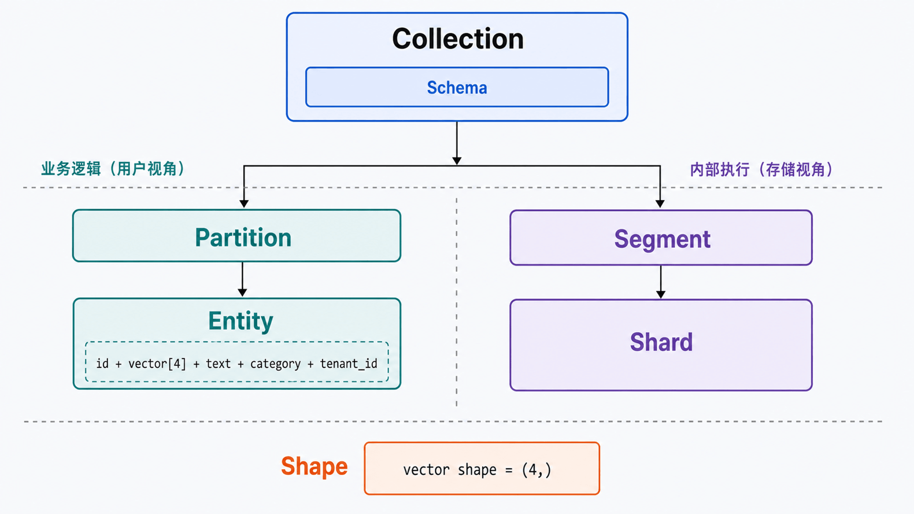
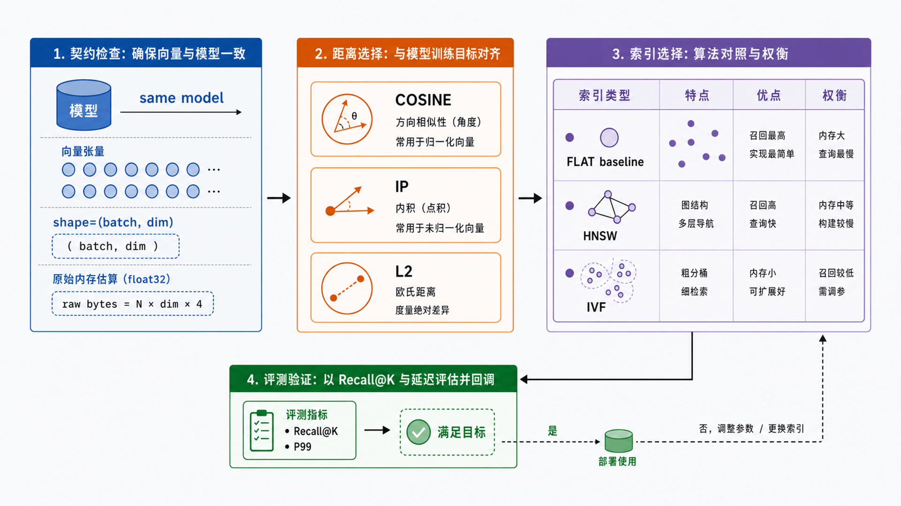
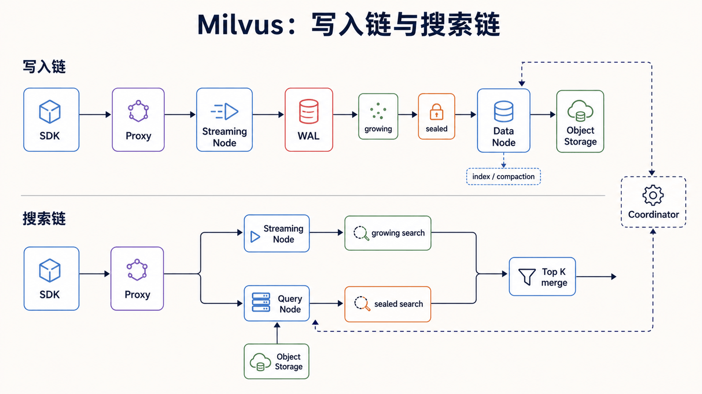

## 前置知识与学习目标

阅读前只需了解 Python 列表和“模型把文本转换成数字”这一事实，不要求有分布式系统经验。

学完本篇，你应该能够：

1. 解释向量数据库解决的问题，以及它不负责什么。
2. 区分 Collection、Schema、Entity、Partition、Segment 和 Index。
3. 根据向量 Shape 与模型训练方式选择距离度量。
4. 说清一次写入和一次搜索在 Milvus 各层之间如何流转。
5. 用 Milvus Lite 完成可复现的最小写入与检索实验。

## 从一个真实问题切入

假设我们要为 SaaS 产品构建 FAQ 检索。每条文档切片都包含固定的数据契约：

| 字段        | 示例                       | 作用                     |
| ----------- | -------------------------- | ------------------------ |
| `id`        | `101`                      | 稳定主键                 |
| `vector`    | `[0.92, 0.11, 0.31, 0.08]` | 文本的 4 维演示向量      |
| `text`      | `"如何重置密码"`           | 返回给应用的原文         |
| `category`  | `"account"`                | 业务过滤字段             |
| `tenant_id` | `"acme"`                   | 租户边界，防止跨租户召回 |

真实 Embedding 常有数百到数千维；这里使用 4 维，只为让 Shape 和距离计算可见。业务请求“ACME 租户怎样修改登录密码”会先变成查询向量，再在 `tenant_id == "acme"` 的候选中寻找近邻。

关系型数据库擅长精确条件、连接和事务；向量数据库擅长“表达不同但语义接近”的近邻检索。生产系统通常同时需要两者，而不是二选一。

## 核心数据模型

<!-- s01-f01:start -->



<!-- s01-f01:end -->

### Collection 与 Schema

Collection 是数据和索引配置的顶层容器，类似一张带向量列的表。Schema 定义字段名、类型、主键、向量维度和是否允许动态字段。

同一向量字段的维度必须固定。若 Collection 声明 `dim=4`，写入 3 维或 5 维向量都应视为数据契约错误，而不是由数据库自动补齐。

### Entity、Partition 与 Segment

- **Entity**：一条逻辑记录，例如一条 FAQ 切片。
- **Partition**：用户可见的逻辑分区，可缩小加载或搜索范围；不应为每个小租户机械创建一个分区。
- **Segment**：Milvus 内部的物理数据单元。新数据进入 growing segment，达到条件后成为 sealed segment，并可构建索引。
- **Shard**：写入通道的水平切分，主要影响写入并行度，不等同于 Partition。

关键边界是：Partition 属于业务数据组织，Segment 和 Shard 属于存储与执行组织。把三者都理解成“分表”会导致错误的容量设计。

## 向量 Shape、距离与索引

<!-- s01-f03:start -->



<!-- s01-f03:end -->

### Shape 是第一条运行时契约

一次批量写入可表示为矩阵：

```text
vectors.shape = (batch_size, dimension)
示例：3 条 FAQ × 4 维向量 = (3, 4)

query_vectors.shape = (query_count, dimension)
示例：1 个问题 × 4 维向量 = (1, 4)
```

Embedding 模型、文档向量和查询向量必须属于同一向量空间。仅仅维度相同并不够：换模型后即使仍是 768 维，旧向量与新查询也可能不可比较。

### 距离度量由模型语义决定

| 度量     | 直觉                   | 常见前提                  |
| -------- | ---------------------- | ------------------------- |
| `COSINE` | 比较方向，弱化长度影响 | 文本 Embedding 的常见选择 |
| `IP`     | 内积越大越相似         | 模型训练目标明确使用内积  |
| `L2`     | 欧氏距离越小越接近     | 空间距离本身有意义        |

不要根据“哪个指标跑分高”盲选。先查看 Embedding 模型文档，再用自己的查询集验证 Recall@K、延迟和业务命中率。

### 索引是召回、延迟与资源的交换

- `FLAT` 逐个比较，精确但数据量大时慢，适合作为召回基线。
- `HNSW` 用图导航逼近近邻，低延迟但占用更多内存，构建也更重。
- `IVF_FLAT` 先定位若干聚类桶再搜索，可用 `nprobe` 调整召回与延迟。

索引参数没有脱离数据规模、过滤选择性和延迟目标的“最佳值”。正确做法是保留一小份 FLAT 基线，对候选参数做同一数据集、同一查询集的对照实验。

## 架构与调用链

<!-- s01-f02:start -->



<!-- s01-f02:end -->

Milvus 当前架构按职责分成四层：

1. **Access Layer**：无状态 Proxy 接收 SDK/REST 请求、校验并汇总结果。
2. **Coordinator**：维护拓扑，调度 DDL、流式服务、查询和历史数据任务。
3. **Worker Nodes**：Streaming Node 处理 WAL、growing data 与实时查询；Query Node 搜索 sealed data；Data Node 做 compaction 与索引构建。
4. **Storage**：etcd 保存元数据，对象存储保存日志快照和索引文件，WAL 保证写入可恢复。

### 写入状态变化

```text
SDK insert
  -> Proxy 校验 Schema 与 Shape
  -> Streaming Node 先写 WAL
  -> growing segment（可被实时查询）
  -> sealed segment
  -> Data Node 构建索引并写入对象存储
  -> Query Node 加载新索引
```

`insert` 返回不等于“所有副本已完成索引构建”。如果业务要求写后立刻可见，需要同时定义一致性级别、超时和重试策略。

### 搜索调用链

```text
SDK search
  -> Proxy 路由
  -> Streaming Node 搜 growing data
  -> Query Node 搜 sealed segments
  -> 节点内 Top K 归并
  -> Proxy 全局归并
  -> 返回 id、distance 与 output_fields
```

这解释了为什么过滤条件、加载状态、segment 数量和 Top K 都会影响延迟；“向量距离计算”只是整条链中的一部分。

## 最小可复现实验

Milvus Lite 将数据放在本地文件中，适合学习、单元测试和原型，不代表分布式生产拓扑。

```bash
python -m pip install -U pymilvus
```

```python
from pymilvus import MilvusClient

COLLECTION = "faq_chunks"
client = MilvusClient("milvus_demo.db")

if client.has_collection(collection_name=COLLECTION):
    client.drop_collection(collection_name=COLLECTION)

client.create_collection(
    collection_name=COLLECTION,
    dimension=4,
    metric_type="COSINE",
)

rows = [
    {
        "id": 101,
        "vector": [0.92, 0.11, 0.31, 0.08],
        "text": "如何重置密码",
        "category": "account",
        "tenant_id": "acme",
    },
    {
        "id": 102,
        "vector": [0.88, 0.14, 0.29, 0.10],
        "text": "修改登录凭据",
        "category": "account",
        "tenant_id": "acme",
    },
    {
        "id": 201,
        "vector": [0.10, 0.90, 0.18, 0.20],
        "text": "查看发票",
        "category": "billing",
        "tenant_id": "other",
    },
]

insert_result = client.insert(collection_name=COLLECTION, data=rows)
assert insert_result["insert_count"] == 3

result = client.search(
    collection_name=COLLECTION,
    data=[[0.90, 0.12, 0.30, 0.09]],
    filter='tenant_id == "acme"',
    limit=2,
    output_fields=["text", "category", "tenant_id"],
)

assert len(result) == 1                 # 一个查询向量
assert len(result[0]) == 2              # Top 2
assert all(hit["entity"]["tenant_id"] == "acme" for hit in result[0])
print(result[0])
```

输入 Shape 是 `(1, 4)`，输出 Shape 是 `list[query][hit]`。如果写入向量不是 4 维、过滤字段类型不一致、Collection 不存在或服务不可达，示例应失败并暴露问题；不要用空结果吞掉这些异常。

## 常见误区与适用边界

### 误区 1：向量数据库会生成 Embedding

Milvus 负责存储、索引和检索。Embedding 模型、分块策略、去重、重排和答案生成仍由应用负责。

### 误区 2：距离分数可以跨模型比较

分数只在同一模型、同一归一化方式和同一度量下有意义。换模型后需要重建向量，并重新校准阈值。

### 误区 3：Partition 越多越快

过多 Partition 会增加元数据和调度成本。多租户通常先评估标量字段过滤；只有明确的加载隔离或生命周期边界才考虑 Partition。

### 什么时候不适用

- 只有几千条记录且无需近邻检索：进程内库或现有数据库扩展可能更简单。
- 核心需求是强事务、复杂 Join 或精确聚合：关系型数据库仍是主系统。
- 没有离线评测集：先建立相关性基线，否则无法判断索引调优是否真的有效。

## 自检题

1. Collection、Partition、Segment 分别解决什么问题？
2. 为什么“都是 768 维”仍不能保证两组向量可以比较？
3. 一次搜索为何可能同时访问 Streaming Node 和 Query Node？

<details>
<summary>查看答案</summary>

1. Collection 定义顶层数据契约；Partition 是用户可见的逻辑范围；Segment 是 Milvus 内部的物理执行与存储单元。
2. 维度只是 Shape；不同模型或不同归一化方式会定义不同向量空间和分数语义。
3. 新写入的 growing data 由 Streaming Node 服务，sealed data 由 Query Node 搜索，最终再归并 Top K。

</details>

## 本篇总结

Milvus 的核心不是“把数组存起来”，而是用 Schema 固定数据契约，用 Segment 和索引管理数据状态，再通过分离的访问、协调、执行与存储层完成可扩展检索。调优前先固定 Embedding、Shape、度量、过滤条件和评测集。

## 下一篇衔接

下一篇把这个模型落到部署：如何在 Lite、Standalone 和 Distributed 之间选择，如何估算资源，以及怎样建立安全、监控、备份和故障边界。

## 资料来源

- [Milvus Architecture Overview](https://milvus.io/docs/architecture_overview.md)
- [Milvus Quickstart](https://milvus.io/docs/quickstart.md)
- [Create Collection](https://milvus.io/docs/create-collection.md)
- [Milvus 文档首页](https://milvus.io/docs/)
