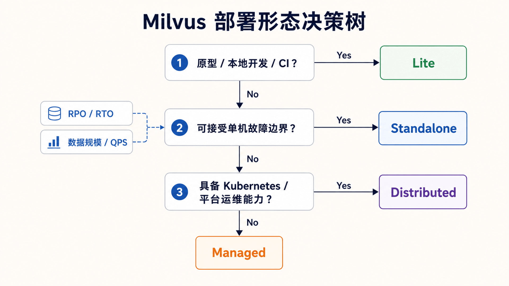
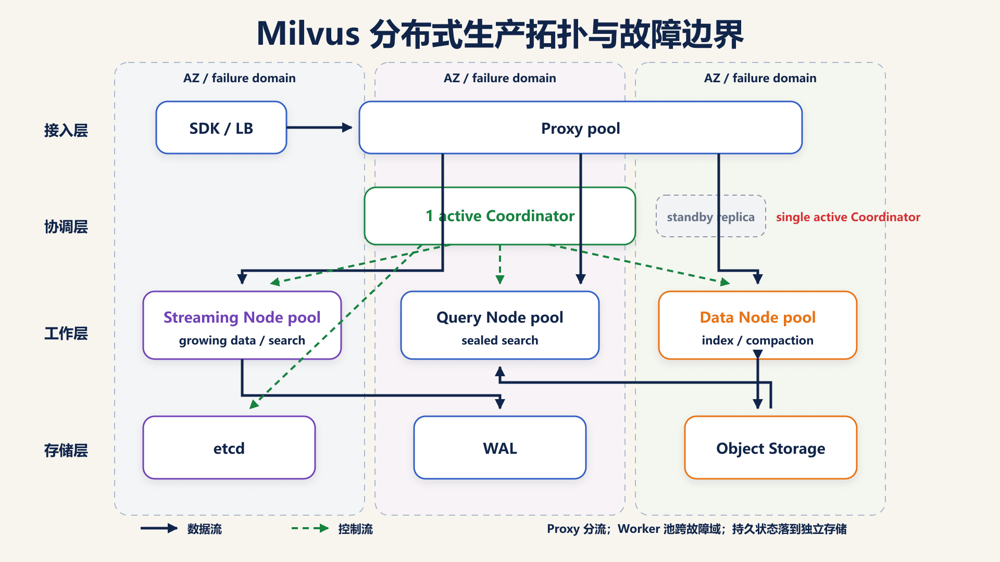
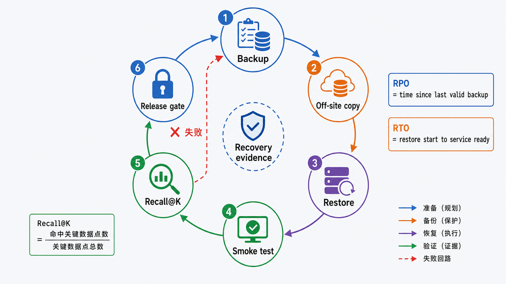

## 前置知识与学习目标

本文依赖上一篇的 Collection、Segment、索引和写入/搜索调用链。请先准备 Docker；若选择集群模式，还需要 Kubernetes、StorageClass 和基本可观测性知识。

学完本篇，你应该能够：

1. 根据数据规模、可用性目标和运维能力选择部署形态。
2. 用向量数量与维度估算资源下限，而不是照抄固定配置。
3. 部署并验证 Standalone，区分“端口可达”和“业务可用”。
4. 建立认证、网络、TLS、监控、备份与恢复检查表。
5. 按故障边界定位 SDK、Proxy、WAL、对象存储和计算节点问题。

## 先选择部署形态

<!-- s02-f01:start -->



<!-- s02-f01:end -->

仍以多租户 FAQ 检索为例。部署决策应从恢复目标和负载开始，而不是从 YAML 开始。

| 形态        | 合适场景                         | 不提供的能力                       |
| ----------- | -------------------------------- | ---------------------------------- |
| Milvus Lite | 本地学习、CI、单进程原型         | 分布式扩缩容和生产级高可用         |
| Standalone  | 开发、验收、中小规模单机工作负载 | 节点级容灾；主机故障会造成中断     |
| Distributed | 生产、多节点、独立扩展读写和索引 | 零运维；仍需规划存储、监控和恢复   |
| 托管服务    | 希望减少平台运维                 | 对成本、网络与供应商边界的完全控制 |

如果允许维护窗口，RPO/RTO 不严格，Standalone 往往是更可控的起点。若要求节点故障时继续服务、独立扩展 Query/Data/Streaming 负载，才进入 Distributed 设计。

## 容量估算：先算下限，再压测

密集 `FLOAT_VECTOR` 的原始向量体积下限为：

```text
raw_vector_bytes = vector_count × dimension × 4
```

一千万条 768 维 float32 向量约为：

```text
10,000,000 × 768 × 4 ≈ 30.72 GB（十进制）
```

这还不包括 HNSW/IVF 索引、标量字段、WAL、segment、对象存储副本、临时构建空间、缓存和系统开销。生产容量至少需要同时测量：

- P50/P95/P99 查询延迟与 Recall@K。
- 峰值写入速率和 sealed segment/索引追赶时间。
- 常驻内存、对象存储、etcd 与 WAL 的增长率。
- 节点或依赖故障后的恢复时间。

官方 Standalone 基线要求至少 8 GB RAM，推荐 16 GB；真实配置仍应由自己的数据规模和查询模式决定。etcd 对磁盘 fsync 延迟敏感，慢盘可能表现成选举和元数据抖动，而不是简单的“查询变慢”。

## Standalone 最小部署

官方提供安装脚本。脚本跟随当前发布线变化，正式环境应在验证后固定脚本校验值和镜像版本，不要在每次部署时无条件跟随 `master`。

```bash
curl -sfL \
  https://raw.githubusercontent.com/milvus-io/milvus/master/scripts/standalone_embed.sh \
  -o standalone_embed.sh

bash standalone_embed.sh start
docker ps --filter name=milvus
```

默认 SDK 端口为 `19530`，WebUI 可通过 `http://127.0.0.1:9091/webui/` 检查。Windows 用户应在 WSL 2 的 Linux 文件系统中存放容器挂载数据，避免跨文件系统 I/O 与一致性问题。

### 用业务动作验证，而不只看进程

```python
from pymilvus import MilvusClient

client = MilvusClient(uri="http://127.0.0.1:19530")
assert client.list_collections() is not None

name = "deployment_smoke_test"
if client.has_collection(collection_name=name):
    client.drop_collection(collection_name=name)

client.create_collection(collection_name=name, dimension=4)
client.insert(
    collection_name=name,
    data=[{"id": 1, "vector": [1.0, 0.0, 0.0, 0.0], "text": "ok"}],
)
hits = client.search(
    collection_name=name,
    data=[[1.0, 0.0, 0.0, 0.0]],
    limit=1,
    output_fields=["text"],
)
assert hits[0][0]["entity"]["text"] == "ok"
client.drop_collection(collection_name=name)
```

这个 smoke test 验证连接、DDL、写入、可见性、搜索和清理。失败时保留异常类型与服务端日志；不要把所有异常转换成 `False`。

## 从 Standalone 到 Distributed

<!-- s02-f02:start -->



<!-- s02-f02:end -->

Distributed 不是“多启动几个 Standalone”。它把访问、协调、流式处理、查询、历史数据处理和存储依赖放进明确拓扑，并通过 Kubernetes 管理副本与资源。

典型职责边界：

```text
客户端 -> Ingress/Load Balancer -> Proxy
Proxy -> Coordinator / Streaming Node / Query Node
Data Node -> compaction 与索引构建
所有计算层 -> etcd + WAL Storage + Object Storage
```

推荐使用 Milvus Operator 或受支持的 Helm 部署流程，先确认：

1. StorageClass 的性能和回收策略。
2. etcd、对象存储、WAL 的高可用与备份责任人。
3. Proxy、Query、Data、Streaming 负载能否分别扩缩。
4. Pod 中断预算、反亲和、跨可用区成本和网络时延。
5. 升级前的兼容矩阵、回滚路径与恢复演练。

不要把 `kubectl get pods` 全绿当作完成。至少应跑写入与检索 smoke test、杀死一个非关键副本、观察告警，再验证服务恢复。

## 配置与安全边界

### 版本和配置

- 固定 Milvus、Operator、依赖镜像与配置版本。
- 将自定义配置作为最小覆盖层管理，并在升级前比较默认值变化。
- 分离开发、预发和生产的 Collection 与凭据。
- 为写入批次、查询 Top K、超时和重试设置应用侧上限。

### 认证、网络与 TLS

生产环境至少需要：

1. 启用 Milvus 认证并为应用使用最小权限账号。
2. 只在私有网络暴露服务，限制安全组与 NetworkPolicy。
3. 在受信入口或 Milvus 支持的链路启用 TLS，验证证书而不是关闭校验。
4. 将 token、对象存储密钥和 TLS 私钥放进 Secret 管理系统。
5. 定期轮换凭据，并验证旧凭据已失效。

认证解决“谁可以请求”，TLS 解决“链路是否可窃听或篡改”，网络策略解决“谁能到达端口”；三者不可互相替代。

## 可观测性与告警

监控要覆盖用户结果、计算层和持久层：

| 层级      | 关键观察                      | 典型动作                        |
| --------- | ----------------------------- | ------------------------------- |
| 业务      | Recall@K、空结果率、P99       | 回滚模型/索引参数，检查过滤条件 |
| Proxy/SDK | 请求率、错误率、超时、重试    | 检查入口、连接池和负载均衡      |
| Query     | 加载状态、搜索延迟、内存      | 调整副本、加载范围或索引        |
| Data/流式 | 写入积压、segment、compaction | 控制批次，扩容执行节点          |
| 存储      | etcd fsync、WAL、对象存储错误 | 先保护持久层，再处理计算层      |

日志必须包含请求时间、Collection、操作类型、错误码和 trace id，但不得写入 token、完整向量或敏感原文。

## 备份、恢复与升级

<!-- s02-f03:start -->



<!-- s02-f03:end -->

“已经生成备份文件”不等于可恢复。备份策略必须写清：

- 备份覆盖哪些 Collection、元数据和对象存储。
- 备份频率、保留期、加密、异地副本和校验方式。
- RPO（最多可丢多少数据）与 RTO（多久恢复服务）。
- 恢复到哪个 Milvus/依赖版本，以及由谁执行。

使用官方 Milvus Backup 等受支持工具时，先在预发环境做完整恢复演练：恢复到新命名空间，验证 Collection 数量、实体数量、抽样查询和权限，再宣布备份有效。升级前执行相同演练，并保留元数据迁移与回滚路径。

## 故障定位顺序

### 连接超时

```text
DNS/端口 -> Ingress/Service -> Proxy 日志 -> 认证/TLS -> SDK 超时
```

### 写入成功但搜不到

```text
Collection/向量字段 -> 一致性级别 -> 过滤条件 -> growing/sealed 状态
-> 索引与加载状态 -> Embedding 模型是否一致
```

### 延迟突然上升

```text
请求量与 Top K -> 过滤选择性 -> 新写入/索引积压 -> Query Node 内存
-> 对象存储延迟 -> etcd/WAL 健康 -> 最近配置或模型变更
```

先确认哪个边界失败，再扩容。盲目增加 Query Node 无法修复慢 etcd、错误过滤或坏的 Embedding。

## 常见误区与适用边界

### 误区 1：Standalone 可以通过容器重启变成高可用

容器自动重启只处理进程失败；主机、磁盘和可用区故障仍是单点。

### 误区 2：只备份对象存储就足够

恢复还依赖元数据、版本兼容与一致的恢复流程。缺少演练的备份只是未经验证的文件。

### 误区 3：重试越多越可靠

无上限重试会放大故障。写入应使用稳定主键保证幂等，并采用退避、抖动、超时预算和最大尝试次数。

### 什么时候不适用

团队没有 Kubernetes 和分布式存储运维能力时，不应仅因“以后可能变大”直接自建集群。先用 Lite/Standalone 验证相关性和负载，或选择托管方案。

## 自检题

1. 为什么 `N × dim × 4` 只是容量下限？
2. 端口可达后，最小业务 smoke test 还应覆盖哪些动作？
3. 为什么 Query 延迟上升不一定应扩容 Query Node？

<details>
<summary>查看答案</summary>

1. 它只计算 float32 原始向量，不含索引、标量字段、WAL、segment、副本、缓存和临时空间。
2. 至少覆盖 DDL、写入、可见性、搜索、结果断言和清理。
3. 根因可能是错误过滤、写入/索引积压、对象存储、etcd/WAL、模型变更或入口过载；需要先定位故障边界。

</details>

## 本篇总结

部署 Milvus 的主线是“目标—容量—拓扑—验证—恢复”：先定义负载和 RPO/RTO，再选择 Lite、Standalone 或 Distributed；用业务 smoke test 验证；用认证、网络、TLS、监控和恢复演练闭合生产风险。

## 下一步衔接

Milvus 系列正文到此完成。下一步可基于同一 FAQ 数据集建立离线查询集，对 FLAT、HNSW 与 IVF 参数进行 Recall@K、P99 和成本对照；若需要更轻量的过滤感知检索与 Python SDK 工作流，可继续阅读 Qdrant 系列。

## 资料来源

- [Run Milvus in Docker](https://milvus.io/docs/install_standalone-docker.md)
- [Requirements for Installing Milvus Standalone](https://milvus.io/docs/prerequisite-docker.md)
- [Milvus Architecture Overview](https://milvus.io/docs/architecture_overview.md)
- [Run Milvus in Kubernetes with Milvus Operator](https://milvus.io/docs/install_cluster-milvusoperator.md)
- [Milvus Backup](https://milvus.io/docs/milvus_backup_overview.md)
