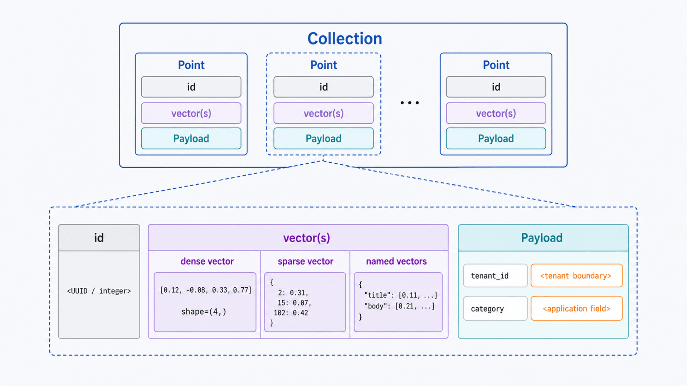
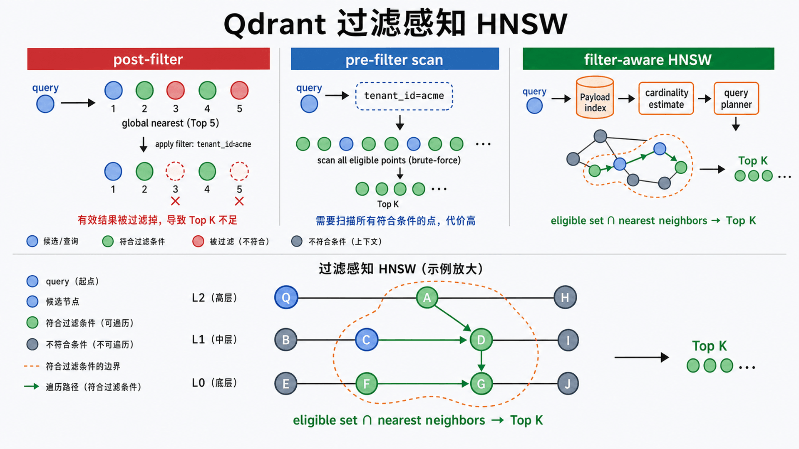
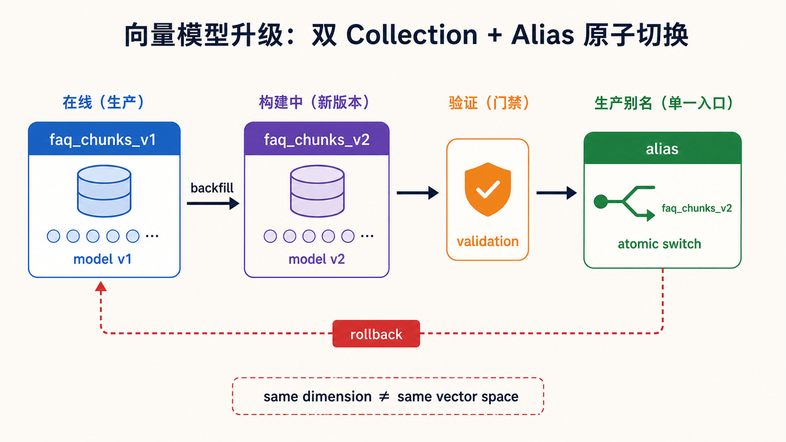

## 前置知识与学习目标

阅读前只需了解 Python 字典和 Embedding 的基本含义。

学完本篇，你应该能够：

1. 用 Collection、Point、Vector 和 Payload 描述 Qdrant 数据模型。
2. 解释向量 Shape、距离度量与分数的关系。
3. 解释 Qdrant 为什么能把业务过滤与 HNSW 检索结合。
4. 用当前 Python Client 的 `query_points` 完成过滤检索。
5. 判断 Qdrant、关系型数据库和进程内检索各自的边界。

## 从多租户 FAQ 开始

我们继续使用同一数据契约：

```text
id         : 101
vector     : [0.92, 0.11, 0.31, 0.08]
text       : "如何重置密码"
category   : "account"
tenant_id  : "acme"
```

用户问题先由同一个 Embedding 模型编码成查询向量。检索目标不是全库中“最像的文本”，而是：

> 在 `tenant_id = acme` 且 `category = account` 的数据中，找语义最接近的 Top K。

这里有两个同时存在的约束：向量相似度决定“像不像”，Payload 过滤决定“有没有资格参与比较”。忽略第二个约束会造成跨租户数据泄露。

## 核心数据模型

<!-- s03-f01:start -->



<!-- s03-f01:end -->

### Collection

Collection 是 Point 的命名集合，也是向量配置、分片、副本、优化器和量化策略的边界。同一个向量字段必须使用一致的维度与距离度量。

一个业务不要机械地为每个租户建 Collection。大量小 Collection 会带来过多 shard 和调度开销；常见多租户方案是共享 Collection，并为 `tenant_id` 创建 Payload 索引。

### Point

Point 是 Qdrant 的基本记录：

```text
Point = id + vector(s) + optional payload
```

- `id` 可为无符号整数或 UUID，应该由稳定业务键推导，便于幂等 Upsert。
- `vector` 可以是 dense、sparse 或 multivector；也可以使用 named vectors 保存不同语义空间。
- `payload` 是 JSON 结构化数据，支持 keyword、integer、float、boolean、geo、datetime、text 等过滤语义。

不要把大二进制文件直接塞入 Payload。通常保存对象存储 URI、摘要和用于过滤/返回的必要元数据。

## Shape 与距离语义

假设 Collection 的 dense vector 配置是 4 维：

```text
单点向量 shape     = (4,)
批量写入 shape     = (batch_size, 4)
单查询 shape       = (4,)
```

维度错误应在写入边界被拒绝。模型版本变化则更隐蔽：新旧模型可能维度相同，但向量空间不同，所以应将 `embedding_model` 与 `embedding_version` 写入发布元数据，并通过新 Collection + alias 原子切换。

Qdrant 常用距离包括：

| 配置        | 分数解释                              | 使用前提           |
| ----------- | ------------------------------------- | ------------------ |
| `COSINE`    | Qdrant 上传时归一化，并以点积高效计算 | 常见文本 Embedding |
| `DOT`       | 内积越大通常越相似                    | 模型以点积目标训练 |
| `EUCLID`    | 欧氏距离越小越接近                    | 绝对空间距离有意义 |
| `MANHATTAN` | L1 距离                               | 模型和数据明确适用 |

不同度量的 score 方向和范围可能不同，阈值不能照搬。上线前必须用标注查询集校准。

## HNSW 与过滤如何协作

<!-- s03-f02:start -->



<!-- s03-f02:end -->

HNSW 把 Point 组织成多层近邻图，从稀疏高层快速接近目标区域，再在稠密底层精搜。它用较少距离计算换取近似结果，主要参数体现三组交换：

- `m`：图连接度；更大通常提高召回，也增加内存和构建成本。
- `ef_construct`：构建时搜索宽度；更大通常构图更充分但更慢。
- 查询时搜索宽度：更大通常提高召回但增加延迟。

### 为什么过滤不是简单的“先搜再删”

如果先取全库 Top 10 再过滤 `tenant_id`，可能一个合格结果都不剩；如果先扫描 Payload 再对候选暴力计算，低选择性过滤又可能很慢。

Qdrant 会按 segment 估算过滤基数，并在全扫描、Payload 索引、可过滤向量索引等策略之间规划。Payload 索引还可扩展 HNSW 的过滤能力，因此官方建议对常用过滤字段尽早建索引，最好在大规模写入前完成。

这不是“过滤永远让查询更快”。高基数、低选择性、组合条件和数据分布都会改变计划，仍需用真实过滤分布压测。

## 最小可复现实验

Python Client 的本地内存模式适合教程和测试，不代表服务端持久化或集群行为。

```bash
python -m pip install -U qdrant-client
```

```python
from qdrant_client import QdrantClient, models

COLLECTION = "faq_chunks"
client = QdrantClient(":memory:")

client.create_collection(
    collection_name=COLLECTION,
    vectors_config=models.VectorParams(
        size=4,
        distance=models.Distance.COSINE,
    ),
)

# 常用过滤字段先建 Payload 索引。
client.create_payload_index(
    collection_name=COLLECTION,
    field_name="tenant_id",
    field_schema=models.PayloadSchemaType.KEYWORD,
)

client.upsert(
    collection_name=COLLECTION,
    points=[
        models.PointStruct(
            id=101,
            vector=[0.92, 0.11, 0.31, 0.08],
            payload={
                "text": "如何重置密码",
                "category": "account",
                "tenant_id": "acme",
            },
        ),
        models.PointStruct(
            id=102,
            vector=[0.88, 0.14, 0.29, 0.10],
            payload={
                "text": "修改登录凭据",
                "category": "account",
                "tenant_id": "acme",
            },
        ),
        models.PointStruct(
            id=201,
            vector=[0.10, 0.90, 0.18, 0.20],
            payload={
                "text": "查看发票",
                "category": "billing",
                "tenant_id": "other",
            },
        ),
    ],
)

response = client.query_points(
    collection_name=COLLECTION,
    query=[0.90, 0.12, 0.30, 0.09],
    query_filter=models.Filter(
        must=[
            models.FieldCondition(
                key="tenant_id",
                match=models.MatchValue(value="acme"),
            )
        ]
    ),
    with_payload=True,
    limit=2,
)

assert len(response.points) == 2
assert all(point.payload["tenant_id"] == "acme" for point in response.points)
print([(point.id, point.score, point.payload["text"]) for point in response.points])
```

### 输入、输出与失败边界

| 阶段          | 输入                        | 输出/状态                |
| ------------- | --------------------------- | ------------------------ |
| 建 Collection | `size=4`, `COSINE`          | 固定向量契约             |
| Upsert        | `list[PointStruct]`         | 同 ID 覆盖，其他 ID 新增 |
| Query         | 4 维 query + Filter + limit | `QueryResponse.points`   |

常见失败包括 Collection 不存在、向量维度错误、Payload 类型与过滤条件不匹配、服务不可达和超时。空列表只表示“没有命中”，不应被用来替代异常。

## 数据组织与索引选择

<!-- s03-f03:start -->



<!-- s03-f03:end -->

### 一个还是多个 Collection

优先把共享模型、相同维度与相同生命周期的数据放在同一 Collection。以下情况适合拆分：

- Embedding 模型或维度不同。
- 安全、保留期或备份边界必须物理隔离。
- 工作负载和扩缩策略完全不同。

模型升级时可新建 `faq_chunks_v2`，离线回填并验收，再用 alias 原子切换；不要原地混写两种模型的向量。

### Payload 索引

为高频过滤字段建与类型匹配的索引，例如 `tenant_id: keyword`、`price: float`。索引会占用资源；不要为所有 Payload 字段预防性建索引。

## 常见误区与适用边界

### 误区 1：Top K 是“正确答案”

Top K 只表示当前向量空间、过滤条件和索引参数下最接近的候选。RAG 仍需要质量评测、可能的重排和来源约束。

### 误区 2：Payload 只是展示字段

Payload 同时承担过滤、分组、返回和多租户边界。字段类型设计错误会直接影响正确性和查询计划。

### 误区 3：Upsert 天然解决全部一致性问题

稳定 ID 能让重复写入幂等，但不能自动解决并发版本覆盖、跨系统事务或删除与重建的竞态。

### 什么时候不适用

- 数据很少、只做离线实验：NumPy/FAISS 等进程内方案更简单。
- 主要需求是强事务和复杂 Join：让关系型数据库保存事实，Qdrant 保存可重建的检索投影。
- 没有租户过滤测试：不要把多租户检索直接暴露给生产流量。

## 自检题

1. Point 由哪三部分组成？
2. 为什么“先全库 Top 10，再按租户过滤”可能返回空结果？
3. 模型升级时为什么推荐新 Collection + alias？

<details>
<summary>查看答案</summary>

1. 稳定 ID、一个或多个 Vector，以及可选 Payload。
2. 全局最相似的 10 条可能全属于其他租户，后过滤会删除全部合格候选；过滤应进入查询计划。
3. 它避免在同一向量空间混写新旧模型，并允许离线回填、验收和原子切换/回滚。

</details>

## 本篇总结

Qdrant 用 Collection 固定向量配置，用 Point 统一 ID、Vector 与 Payload，再用过滤感知的查询计划协调 HNSW 与业务条件。正确性首先来自数据契约和租户过滤，其次才是索引参数。

## 下一篇衔接

下一篇把内存实验升级为服务：选择单机或分布式部署，配置持久化、端口、API Key、TLS、监控、shard/replica 与 snapshot 恢复边界。

## 资料来源

- [Qdrant Manage Data](https://qdrant.tech/documentation/manage-data/)
- [Qdrant Collections](https://qdrant.tech/documentation/manage-data/collections/)
- [Qdrant Payload](https://qdrant.tech/documentation/concepts/payload/)
- [Qdrant Search and Query Planning](https://qdrant.tech/documentation/search/search/)
- [Qdrant Local Quickstart](https://qdrant.tech/documentation/quick-start/)
