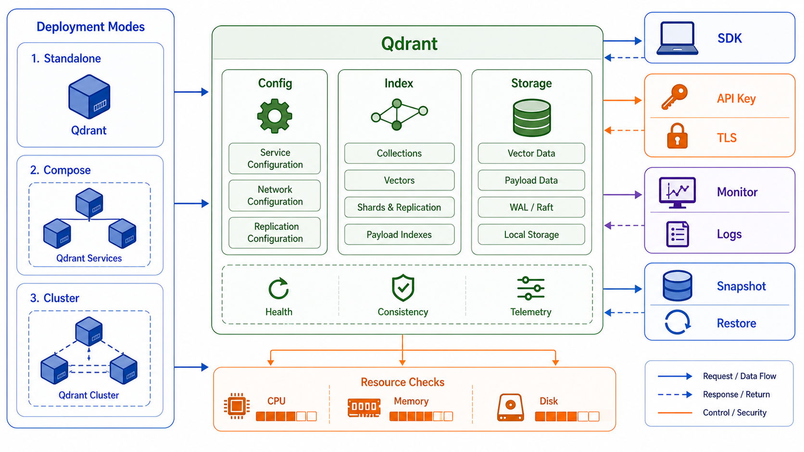

## 概述

Qdrant 支持多种部署方式，从轻量级的单机部署到生产级别的高可用集群。本文将详细介绍 Qdrant 的安装部署方法、环境配置和性能优化技巧。



### 部署方式

| 方式               | 适用场景   | 优点     |
| ------------------ | ---------- | -------- |
| **Docker**         | 开发测试   | 快速简单 |
| **Docker Compose** | 单机生产   | 配置灵活 |
| **Kubernetes**     | 大规模部署 | 高可用   |
| **源码编译**       | 定制需求   | 灵活     |

## Docker 部署

### 环境要求

| 要求   | 最小   | 推荐       |
| ------ | ------ | ---------- |
| CPU    | 2 核   | 4+ 核      |
| 内存   | 2 GB   | 8+ GB      |
| 磁盘   | 10 GB  | 50+ GB SSD |
| Docker | 20.10+ | 最新版     |

### 快速启动

```bash
# 拉取镜像
docker pull qdrant/qdrant:latest

# 运行容器
docker run -p 6333:6333 \
    -p 6334:6334 \
    -v qdrant_storage:/qdrant/storage \
    qdrant/qdrant:latest

# 后台运行
docker run -d \
    --name qdrant \
    -p 6333:6333 \
    -p 6334:6334 \
    -v qdrant_storage:/qdrant/storage \
    qdrant/qdrant:latest

# 查看日志
docker logs -f qdrant

# 停止容器
docker stop qdrant
docker rm qdrant
```

### Docker Compose 部署

```yaml
# docker-compose.yml
version: "3.8"

services:
  qdrant:
    image: qdrant/qdrant:latest
    ports:
      - "6333:6333" # REST API
      - "6334:6334" # gRPC API
    volumes:
      - qdrant_data:/qdrant/storage
    environment:
      - QDRANT__SERVICE__HTTP_PORT=6333
      - QDRANT__SERVICE__GRPC_PORT=6334
      - QDRANT__STORAGE__SNAPSHOTS_PATH=/qdrant/snapshots

volumes:
  qdrant_data:
```

```bash
# 启动
docker-compose up -d

# 查看状态
docker-compose ps

# 查看日志
docker-compose logs -f
```

## 配置优化

### 服务配置

```yaml
# config/config.yaml
service:
  # HTTP 服务端口
  http_port: 6333

  # gRPC 服务端口
  grpc_port: 6334

  # 并发限制
  max_request_size_mb: 32

  # 超时设置
  request_timeout_ms: 5000

storage:
  # 存储路径
  storage_path: /qdrant/storage

  # 快照路径
  snapshots_path: /qdrant/snapshots

  # 优化参数
  on_disk_payload: true
  memmap_threshold_kb: 20000
```

### 索引配置

```yaml
# HNSW 索引配置
hnsw_index:
  # 内存映射阈值
  on_disk: true

  # M 参数（连接数）
  m: 16

  # 构建参数
  ef_construct: 100

  # 全扫描阈值
  full_scan_threshold: 10000

  # 跳过默认索引
  skip_default_index: false
```

### 日志配置

```yaml
# 日志配置
log_level: INFO

# 日志文件
log_file: /var/log/qdrant.log

# 日志轮转
log_rotation:
  max_size_mb: 100
  max_age_days: 7
```

## Kubernetes 部署

### Helm Chart 部署

```bash
# 添加 Helm 仓库
helm repo add qdrant https://qdrant.github.io/qdrant-helm
helm repo update

# 安装
helm install my-qdrant qdrant/qdrant

# 查看部署
kubectl get pods
kubectl get svc
```

### 自定义配置

```bash
# values.yaml
replicaCount: 3

service:
  type: LoadBalancer
  httpPort: 6333
  grpcPort: 6334

persistence:
  enabled: true
  storageClass: "fast-ssd"
  size: 100Gi

resources:
  limits:
    cpu: "2"
    memory: 8Gi
  requests:
    cpu: "1"
    memory: "4Gi"
```

### 生产配置

```yaml
# 生产环境配置
replicaCount: 5

config:
  service:
    max_request_size_mb: 128

  storage:
    memmap_threshold_kb: 20000
    on_disk_payload: true

autoscaling:
  enabled: true
  minReplicas: 3
  maxReplicas: 10
  targetCPUUtilizationPercentage: 80
```

## Python SDK 连接

### 安装 SDK

```bash
# pip 安装
pip install qdrant-client

# 或使用 Poetry
poetry add qdrant-client
```

### 基本连接

```python
from qdrant_client import QdrantClient
from qdrant_client.models import VectorParams, Distance

# 连接到本地 Qdrant
client = QdrantClient("localhost", port=6333)

# 连接到远程服务器
client = QdrantClient(
    host="qdrant.example.com",
    port=6333,
    api_key="your-api-key"  # 如果启用了认证
)

# 连接到集群
client = QdrantClient(
    url="https://cluster.qdrant.cloud",
    api_key="your-api-key"
)
```

### 连接池配置

```python
# 连接池配置
client = QdrantClient(
    host="localhost",
    port=6333,
    timeout=60,              # 超时时间（秒）
    prefer_grpc=True,         # 优先使用 gRPC
    https=False,             # 使用 HTTPS
    checkCompatibility=False  # 跳过版本检查
)
```

## 认证和授权

### 启用认证

```bash
# 使用环境变量启用认证
docker run -d \
    -p 6333:6333 \
    -p 6334:6334 \
    -e QDRANT__SERVICE__API_KEY=your-secret-key \
    qdrant/qdrant:latest
```

### API Key 认证

```python
# 使用 API Key
client = QdrantClient(
    url="http://localhost:6333",
    api_key="your-api-key"
)

# 创建 Collection（需要认证）
client.create_collection(
    collection_name="private_collection",
    vectors_config=VectorParams(size=768, distance=Distance.COSINE)
)
```

## TLS 配置

### 生成证书

```bash
# 生成自签名证书
openssl req -x509 -newkey rsa:4096 -keyout key.pem -out cert.pem -days 365 -nodes

# 使用证书启动
docker run -d \
    -p 6333:6333 \
    -v $(pwd)/cert.pem:/cert.pem \
    -v $(pwd)/key.pem:/key.pem \
    -e QDRANT__SERVICE__SSL_KEY=/key.pem \
    -e QDRANT__SERVICE__SSL_CERT=/cert.pem \
    qdrant/qdrant:latest
```

### HTTPS 连接

```python
# HTTPS 连接
client = QdrantClient(
    url="https://localhost:6333",
    ssl=True,
    cert_path="/path/to/cert.pem"
)
```

## 性能优化

### 批量操作

```python
# 批量插入
batch_size = 1000

for i in range(0, len(points), batch_size):
    batch = points[i:i+batch_size]
    client.upsert(
        collection_name="my_collection",
        points=batch
    )
```

### 并发优化

```python
import asyncio
from qdrant_client import AsyncQdrantClient

async def batch_insert(points):
    # 异步客户端
    async_client = AsyncQdrantClient("localhost", port=6333)

    await async_client.upsert(
        collection_name="test",
        points=points
    )

    await async_client.close()

# 使用
asyncio.run(batch_insert(all_points))
```

### 索引优化

```python
# 创建优化索引
client.create_collection(
    collection_name="optimized",
    vectors_config=VectorParams(size=768, distance=Distance.COSINE),
    hnsw_config=HnswConfigDiff(
        m=16,              # 连接数（高 = 准确，低 = 快）
        ef_construct=256    # 构建参数（高 = 准确 = 慢）
    )
)

# 重建索引优化
client.recreate_collection(
    collection_name="my_collection",
    vectors_config=VectorParams(size=768, distance=Distance.COSINE)
)
```

## 监控和日志

### 健康检查

```bash
# HTTP 健康检查
curl http://localhost:6333/health

# 带认证
curl -H "api-key: your-key" http://localhost:6333/health

# 查看版本
curl http://localhost:6333/version
```

### 指标监控

```python
# 通过客户端获取指标
from qdrant_client.models import Distance, VectorParams

# 创建带指标的 Collection
client.create_collection(
    collection_name="monitored",
    vectors_config=VectorParams(size=768, distance=Distance.COSINE)
)

# Prometheus 指标端点
# GET /metrics
```

### 日志管理

```bash
# 查看容器日志
docker logs qdrant

# 实时日志
docker logs -f qdrant

# 日志级别设置
# config.yaml
log_level: DEBUG  # DEBUG, INFO, WARN, ERROR
```

## 备份和恢复

### 快照 API

```bash
# 创建快照
curl -X POST "http://localhost:6333/collections/my_collection/snapshots"

# 列出快照
curl "http://localhost:6333/collections/my_collection/snapshots"

# 下载快照
curl -O "http://localhost:6333/collections/my_collection/snapshots/my-snapshot.snapshot"
```

### Python 快照操作

```python
# 创建快照
client.create_snapshot(collection_name="my_collection")

# 列出快照
snapshots = client.list_snapshots(collection_name="my_collection")
for snapshot in snapshots:
    print(f"{snapshot.name}: {snapshot.creation_time}")

# 恢复快照
client.recover_from_snapshot(
    collection_name="my_collection",
    location="http://backup-server/snapshot.snapshot"
)
```

## 常见问题

### 问题 1：内存不足

```bash
# 增加内存限制
docker run -m 8g qdrant/qdrant:latest
```

### 问题 2：连接超时

```python
# 增加超时时间
client = QdrantClient(
    host="localhost",
    port=6333,
    timeout=120  # 120 秒
)
```

### 问题 3：磁盘空间不足

```bash
# 清理旧数据
curl -X DELETE "http://localhost:6333/collections/old_collection"

# 压缩存储
client.optimize(
    collection_name="my_collection",
    optimizer_config=OptimizersConfigDiff(
        index_threshold_kb=1024
    )
)
```
