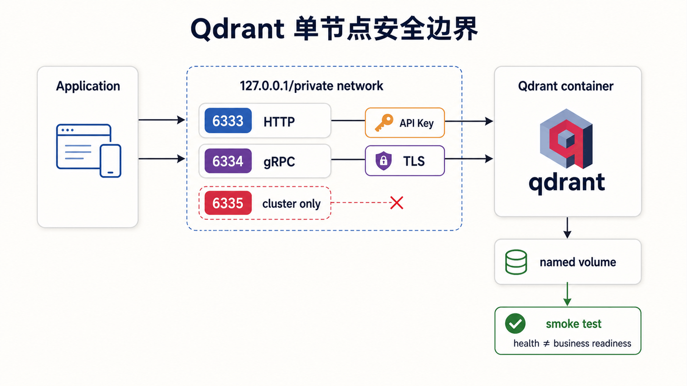
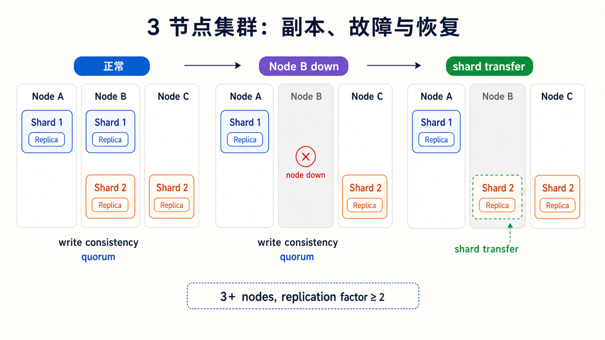
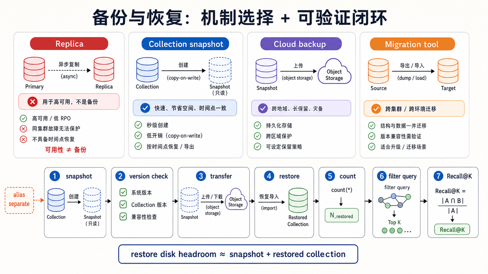

## 前置知识与学习目标

本文依赖上一篇的 Collection、Point、Payload、HNSW 和过滤查询。请准备 Docker；分布式部分还需要基本的 shard、replica 和 quorum 概念。

学完本篇，你应该能够：

1. 为开发、单机生产和高可用生产选择合适拓扑。
2. 正确规划 `6333/6334/6335` 端口、持久卷和网络边界。
3. 配置 API Key、TLS、私网绑定和最小权限。
4. 解释 shard 与 replica 如何影响容量和故障恢复。
5. 使用 metrics、health endpoint 和 snapshot 建立运维闭环。

## 从目标而不是命令开始

为多租户 FAQ 检索先写清四个目标：

| 目标     | 示例                                    |
| -------- | --------------------------------------- |
| 数据规模 | 1000 万 Point，768 维 float32           |
| 性能     | 过滤查询 P99 < 150 ms，Recall@10 ≥ 0.92 |
| 可用性   | 单节点故障不停止读写                    |
| 恢复     | RPO ≤ 1 小时，RTO ≤ 2 小时              |

若没有这些目标，就无法判断单节点是否足够、需要多少 replica、snapshot 多久一次，或磁盘应该有多少余量。

## 部署形态与边界

| 形态                 | 合适场景                   | 主要边界                           |
| -------------------- | -------------------------- | ---------------------------------- |
| Python Local Mode    | 单元测试、原型             | 不验证网络、进程和集群行为         |
| 单节点 Docker        | 开发、验收、可停机工作负载 | 主机/磁盘故障会中断                |
| 自建 3+ 节点集群     | 需要节点级容错与水平扩展   | 需要负载均衡、监控、备份和升级能力 |
| Qdrant Cloud/Private | 希望减少平台运维           | 成本、网络和供应商边界             |

官方分布式指南把“3 个以上节点、每个 shard 至少 2 个 replica”作为强调韧性的基线。两节点复制能承受短暂节点不可用，但永久丢失一个节点后缺少多数派恢复余地；具体拓扑仍需故障演练。

## 单节点 Docker：可复现起点

<!-- s04-f01:start -->



<!-- s04-f01:end -->

Qdrant 使用三个端口：

- `6333`：HTTP API、Dashboard、health 与 metrics。
- `6334`：gRPC API。
- `6335`：集群节点内部通信，仅分布式部署需要。

Windows/WSL 使用 bind mount 可能遇到文件系统问题，开发环境优先用 Docker named volume：

```bash
docker volume create qdrant_storage

docker run --name qdrant-dev \
  -p 127.0.0.1:6333:6333 \
  -p 127.0.0.1:6334:6334 \
  -v qdrant_storage:/qdrant/storage \
  qdrant/qdrant
```

这里绑定 `127.0.0.1`，避免默认服务意外暴露到外网。正式部署应固定经过验证的镜像版本；`latest` 适合短期试用，不适合可审计发布。

### 分层验证

```bash
curl --fail http://127.0.0.1:6333/healthz
curl --fail http://127.0.0.1:6333/readyz
curl --fail http://127.0.0.1:6333/metrics | head
```

health 只证明进程响应。还需要上一篇的 create/upsert/query/delete smoke test，才能验证持久化路径、Collection 操作和检索结果。

重启验证也不可省略：写入测试 Point，重启容器，再按 ID retrieve；否则可能直到事故才发现卷没有正确挂载。

## 容量与存储

原始 float32 向量下限仍是：

```text
raw_vector_bytes = point_count × dimension × 4
```

还要计算：

- HNSW 图和 Payload 索引。
- Payload、segment 元数据和 WAL。
- replica 带来的完整数据副本。
- snapshot 文件和恢复时的临时空间。
- 优化、量化或索引重建期间的峰值空间。

磁盘型工作负载使用 SSD，不要把随机读写放在 HDD。向量和 HNSW 可配置在内存或 on-disk/memmap；选择依据是热数据比例、P99、RAM 预算和真实压测，而不是只看平均延迟。

## 安全：四道独立边界

自托管开源 Qdrant 默认没有认证，且可能监听所有接口，不能直接暴露到互联网。

### 1. API Key

```bash
docker run --name qdrant-secure \
  -p 127.0.0.1:6333:6333 \
  -e QDRANT__SERVICE__API_KEY="replace-with-secret" \
  -v qdrant_storage:/qdrant/storage \
  qdrant/qdrant
```

不要把真实密钥写进 shell 历史、Compose 文件或文章仓库。生产中使用 Secret 管理器，并为只查询的消费者使用只读或细粒度凭据。

### 2. TLS

API Key 在明文 HTTP 上传输会泄露。应在 Qdrant 或受信入口启用 TLS，并让客户端验证 CA 与主机名。禁止用 `verify=False` 解决证书问题。

### 3. 网络

服务绑定私网地址，用防火墙、安全组或 NetworkPolicy 只允许应用与运维入口访问。`6335` 只允许集群节点互通。

### 4. 审计与轮换

记录认证结果、方法、Collection 和主体，但不记录密钥、完整 Payload 或向量。轮换时并行发放新凭据、迁移客户端、撤销旧凭据，再验证旧凭据确实失败。

## Shard、Replica 与写入一致性

<!-- s04-f02:start -->



<!-- s04-f02:end -->

- **Shard** 把一个 Collection 的 Point 分布到不同节点，用于容量与吞吐扩展。
- **Replica** 保存 shard 的副本，用于读扩展和容错。
- **Replication factor** 增加存储与写入成本，不会免费获得一致性。

规划时避免两个极端：一个超大 shard 难以扩展；过多小 shard 又增加调度、连接和恢复开销。每个 Collection 都有自己的 shard，按用户创建大量 Collection 会放大问题。

一个节点故障时，是否继续服务取决于副本位置、写一致性设置、集群多数派和失败类型。发布前至少演练：

1. 停止一个节点。
2. 验证读写和延迟。
3. 恢复节点并观察 shard transfer。
4. 永久丢弃一个测试节点，验证从副本恢复。

## 监控与告警

Qdrant 提供：

- `/metrics`：Prometheus/OpenMetrics 节点指标；多节点需逐节点抓取。
- `/telemetry`：单 peer 视角的运行信息。
- `/cluster/telemetry`：集群聚合视角。
- `/healthz`、`/livez`、`/readyz`：基础健康检查，始终公开，不能承载敏感信息。

建议告警至少覆盖：

| 信号                 | 说明                         |
| -------------------- | ---------------------------- |
| P95/P99 与错误率     | 用户直接感知                 |
| 内存、磁盘和剩余空间 | 索引/恢复失败的前兆          |
| segment 与优化积压   | 写入后索引追赶能力           |
| shard transfer       | 节点恢复与再平衡             |
| Payload 过滤分布     | 查询计划变化的重要输入       |
| Recall@K/空结果率    | 仅靠系统指标看不到的质量退化 |

## Snapshot 与恢复

<!-- s04-f03:start -->



<!-- s04-f03:end -->

Collection snapshot 包含该 Collection 的数据、配置和预构建索引，但不包含 alias。默认容器路径是 `/qdrant/snapshots`。

```bash
curl -X POST \
  -H "api-key: $QDRANT_API_KEY" \
  http://127.0.0.1:6333/collections/faq_chunks/snapshots
```

重要边界：

- 分布式部署需要按节点分别创建相关 snapshot；单个文件只覆盖其所在节点的数据。
- 恢复期间同时存在 snapshot 与恢复数据，磁盘需预留额外空间。
- 目标版本应与源 minor 版本相同或最多高一个 minor 版本，并在实际版本组合上演练。
- alias 需单独迁移和验证。
- Cloud Backup、Collection snapshot 与迁移工具解决的问题不同，不能混为“备份”。

恢复验收应比较 Collection 配置、Point 数、抽样 Payload、过滤查询、Recall@K 和 alias 指向，而不只是看到 HTTP 200。

## 生产发布检查顺序

```text
固定版本
  -> 容量与过滤压测
  -> 持久卷和重启验证
  -> API Key + TLS + 私网
  -> shard/replica 故障演练
  -> metrics/日志/质量告警
  -> snapshot + 异机恢复演练
  -> 灰度流量
```

每一步都应有可回滚状态。模型升级使用新 Collection 回填和 alias 原子切换，避免在原 Collection 混写两个向量空间。

## 故障排查

### 服务可达但查询超时

依次检查入口负载、查询 Top K、过滤选择性、Payload 索引、segment 优化、内存/磁盘、shard transfer 和客户端超时。不要先无限增加重试。

### 重启后数据消失

检查容器实际挂载、卷名、Qdrant storage 路径和启动用户权限。重新创建容器前先保护现有卷，不要用清理命令试错。

### 节点恢复很慢

检查副本位置、网络、磁盘 I/O、snapshot/transfer 空间和同时进行的优化任务。恢复本身就是高 I/O 工作负载，需要容量预算。

## 常见误区与适用边界

### 误区 1：有两个副本就等于有备份

副本会同步误删除和逻辑损坏；snapshot/backup 提供时间点恢复，两者职责不同。

### 误区 2：健康端点 200 就表示检索正确

它只表示服务进程的基础状态。模型错配、过滤错误和 Recall 下降必须通过业务测试发现。

### 误区 3：按租户建 Collection 隔离最简单

大量 Collection 会带来大量 shard。除非有明确物理隔离、生命周期或模型边界，优先共享 Collection + `tenant_id` Payload 索引。

### 什么时候不适用

没有多节点运维和恢复演练能力时，不要把自建分布式集群当作默认答案。单节点适合可停机业务；严格 SLA 则考虑托管或具备成熟平台能力后再自建。

## 自检题

1. Qdrant 三个默认端口分别承担什么职责？
2. Replica 为什么不能替代 snapshot？
3. 为什么多节点 `/metrics` 必须逐 peer 抓取？

<details>
<summary>查看答案</summary>

1. `6333` 提供 HTTP、Dashboard、health/metrics；`6334` 提供 gRPC；`6335` 用于集群内部通信。
2. Replica 同步当前状态，也会同步逻辑删除或损坏；snapshot 提供可保留的时间点恢复材料。
3. `/metrics` 只报告当前 peer，经过负载均衡只抓一个地址会遗漏其他节点。

</details>

## 本篇总结

Qdrant 生产化不是把容器放到服务器上，而是同时设计数据持久化、安全边界、shard/replica、质量与系统监控，以及经过演练的恢复路径。部署成功的证据是故障和恢复测试，不是进程列表。

## 下一篇衔接

下一篇进入 Python SDK：把 Collection 契约、Payload 索引、幂等 Upsert、`query_points`、scroll 分页、批处理、异步并发和错误分类组合成一条可维护的数据访问层。

## 资料来源

- [Qdrant Installation](https://qdrant.tech/documentation/installation/)
- [Qdrant Security](https://qdrant.tech/documentation/security/)
- [Distributed Deployment](https://qdrant.tech/documentation/distributed_deployment/)
- [Monitoring & Telemetry](https://qdrant.tech/documentation/ops-monitoring/monitoring/)
- [Snapshots](https://qdrant.tech/documentation/operations/snapshots/)
- [Production Checklist](https://qdrant.tech/documentation/production-checklist/)
