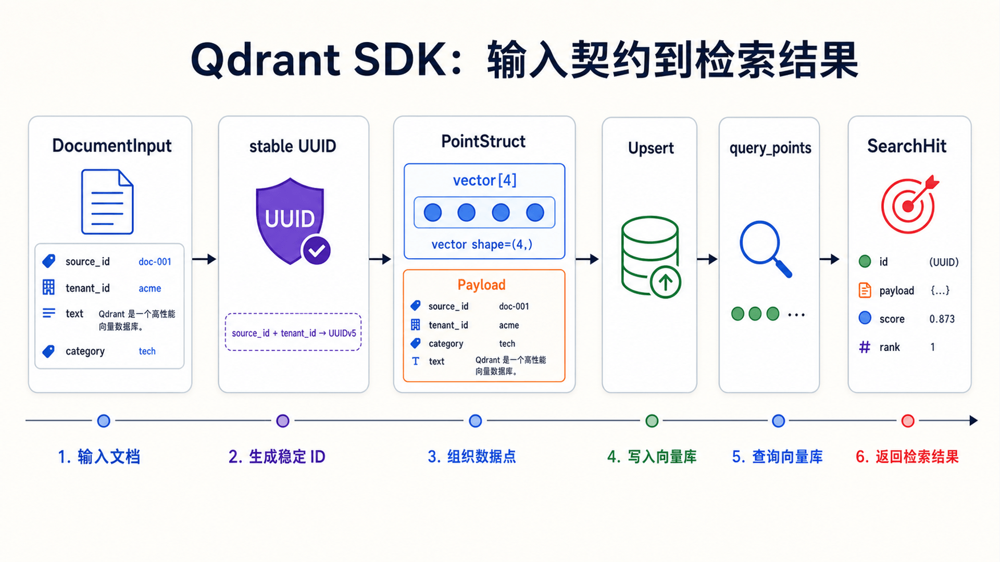
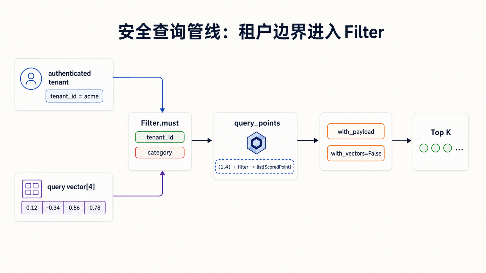
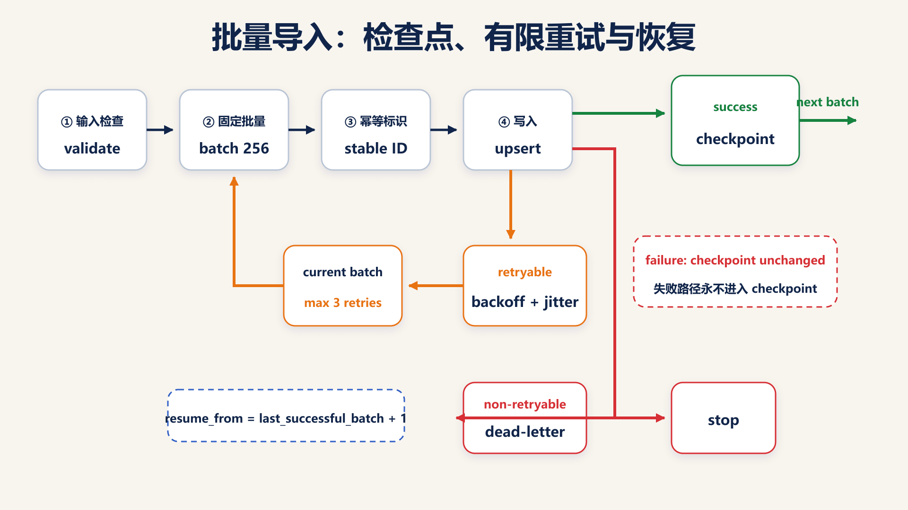

## 前置知识与学习目标

本文依赖前两篇的 Point/Payload、过滤感知 HNSW、持久化与安全边界。示例使用 `qdrant-client` 当前统一查询入口 `query_points`，不再沿用旧教程中的 `client.search`。

学完本篇，你应该能够：

1. 把 Collection 配置写成可验证的数据契约。
2. 用稳定 ID 和 Upsert 实现可重试写入。
3. 正确组合 `query_points`、Filter、Payload 与返回字段。
4. 区分相似度检索分页和全量数据遍历。
5. 为批处理、异步并发、超时和异常建立明确边界。

## 先定义接口契约

<!-- s05-f01:start -->



<!-- s05-f01:end -->

多租户 FAQ 数据访问层接收：

```text
DocumentInput
  source_id   : str       # 业务稳定键
  vector      : list[float], shape=(4,)
  text        : str
  category    : str
  tenant_id   : str
  version     : int
```

返回搜索结果：

```text
SearchHit
  point_id    : UUID
  score       : float
  text        : str
  category    : str
  tenant_id   : str
  version     : int
```

数据契约先于 SDK 调用。没有契约时，维度错误、跨租户查询和并发旧版本覆盖只能在运行时偶然暴露。

## 连接与配置

```bash
python -m pip install -U qdrant-client
```

```python
import os
from qdrant_client import QdrantClient

client = QdrantClient(
    url=os.environ.get("QDRANT_URL", "http://127.0.0.1:6333"),
    api_key=os.environ.get("QDRANT_API_KEY"),
    timeout=10.0,
)
```

失败边界：

- `QDRANT_URL` 由部署环境提供，不在代码中硬编码生产域名。
- API Key 从 Secret 注入，不打印、不提交。
- 客户端超时必须小于上游请求总预算，并为重试预留时间。
- HTTPS 证书校验失败应修复 CA/主机名，不应关闭校验。

## 幂等地初始化 Collection

初始化逻辑不应使用 `recreate_collection`，因为它会删除现有数据。创建前检查存在性；已存在时还要比较配置，而不是直接视为成功。

```python
from qdrant_client import models

COLLECTION = "faq_chunks_v1"
VECTOR_SIZE = 4

if not client.collection_exists(collection_name=COLLECTION):
    client.create_collection(
        collection_name=COLLECTION,
        vectors_config=models.VectorParams(
            size=VECTOR_SIZE,
            distance=models.Distance.COSINE,
        ),
    )

    # 在批量导入前创建高频过滤字段索引。
    client.create_payload_index(
        collection_name=COLLECTION,
        field_name="tenant_id",
        field_schema=models.PayloadSchemaType.KEYWORD,
    )
    client.create_payload_index(
        collection_name=COLLECTION,
        field_name="category",
        field_schema=models.PayloadSchemaType.KEYWORD,
    )
```

生产代码应读取 `get_collection` 结果，断言 vector size、distance 与预期一致。若不一致，停止发布并迁移到新 Collection；不要自动删除或“修复”生产数据。

## 稳定 ID 与幂等 Upsert

随机 ID 会让重试产生重复 Point。可用业务稳定键通过固定命名空间生成 UUID：

```python
from dataclasses import dataclass
from uuid import NAMESPACE_URL, uuid5


@dataclass(frozen=True)
class DocumentInput:
    source_id: str
    vector: list[float]
    text: str
    category: str
    tenant_id: str
    version: int


def point_id(doc: DocumentInput) -> str:
    key = f"faq:{doc.tenant_id}:{doc.source_id}"
    return str(uuid5(NAMESPACE_URL, key))


def to_point(doc: DocumentInput) -> models.PointStruct:
    if len(doc.vector) != VECTOR_SIZE:
        raise ValueError(
            f"vector dimension must be {VECTOR_SIZE}, got {len(doc.vector)}"
        )
    if not doc.tenant_id:
        raise ValueError("tenant_id must not be empty")

    return models.PointStruct(
        id=point_id(doc),
        vector=doc.vector,
        payload={
            "source_id": doc.source_id,
            "text": doc.text,
            "category": doc.category,
            "tenant_id": doc.tenant_id,
            "version": doc.version,
        },
    )
```

```python
documents = [
    DocumentInput(
        source_id="account/reset-password",
        vector=[0.92, 0.11, 0.31, 0.08],
        text="如何重置密码",
        category="account",
        tenant_id="acme",
        version=1,
    ),
    DocumentInput(
        source_id="account/change-credentials",
        vector=[0.88, 0.14, 0.29, 0.10],
        text="修改登录凭据",
        category="account",
        tenant_id="acme",
        version=1,
    ),
]

client.upsert(
    collection_name=COLLECTION,
    points=[to_point(doc) for doc in documents],
    wait=True,
)
```

同一 `tenant_id + source_id` 的重试会覆盖同一 Point，因此对“至少一次投递”是幂等的。但版本并发仍需应用控制：旧任务不能覆盖新 `version`，必要时在写入前比较当前版本或使用外部事件序列保证顺序。

## 使用 query_points 进行过滤检索

<!-- s05-f02:start -->



<!-- s05-f02:end -->

```python
def search_faq(
    query_vector: list[float],
    *,
    tenant_id: str,
    category: str | None = None,
    limit: int = 5,
) -> list[models.ScoredPoint]:
    if len(query_vector) != VECTOR_SIZE:
        raise ValueError("query vector has an invalid dimension")
    if not 1 <= limit <= 50:
        raise ValueError("limit must be between 1 and 50")

    must = [
        models.FieldCondition(
            key="tenant_id",
            match=models.MatchValue(value=tenant_id),
        )
    ]
    if category is not None:
        must.append(
            models.FieldCondition(
                key="category",
                match=models.MatchValue(value=category),
            )
        )

    response = client.query_points(
        collection_name=COLLECTION,
        query=query_vector,
        query_filter=models.Filter(must=must),
        with_payload=["text", "category", "tenant_id", "version"],
        with_vectors=False,
        limit=limit,
    )
    return response.points
```

```python
hits = search_faq(
    [0.90, 0.12, 0.30, 0.09],
    tenant_id="acme",
    category="account",
    limit=2,
)

assert all(hit.payload["tenant_id"] == "acme" for hit in hits)
for hit in hits:
    print(hit.id, hit.score, hit.payload["text"])
```

`with_vectors=False` 避免返回大向量；`with_payload` 只选业务需要字段。租户条件必须由服务端可信上下文注入，不能直接相信客户端提交的任意 `tenant_id`。

## Query 分页与 Scroll 不是一回事

相似度检索的结果随查询向量、索引状态和并发写入变化。大 `offset` 还会增加计算，因此不适合“遍历整个 Collection”。

全量导出、迁移或离线检查应使用 `scroll`：

```python
next_offset = None

while True:
    points, next_offset = client.scroll(
        collection_name=COLLECTION,
        scroll_filter=models.Filter(
            must=[
                models.FieldCondition(
                    key="tenant_id",
                    match=models.MatchValue(value="acme"),
                )
            ]
        ),
        limit=100,
        offset=next_offset,
        with_payload=True,
        with_vectors=False,
    )

    for point in points:
        process(point)

    if next_offset is None:
        break
```

输入 `offset` 是服务端返回的游标，不是客户端自增页码。导出期间若有并发写入，要定义快照语义或接受弱一致遍历，不能假设得到事务快照。

## 更新、删除与生命周期

```python
# 只更新 Payload，不重新发送向量。
client.set_payload(
    collection_name=COLLECTION,
    payload={"category": "security"},
    points=[point_id(documents[0])],
    wait=True,
)

# 按稳定 ID 删除。
client.delete(
    collection_name=COLLECTION,
    points_selector=models.PointIdsList(
        points=[point_id(documents[0])]
    ),
    wait=True,
)
```

批量按 Filter 删除前先用相同 Filter 做 count/scroll 抽样，记录预计影响数，并设置人工或自动上限。不要把空 Filter 当作“删除全部”的便捷接口。

## 批处理与可恢复写入

<!-- s05-f03:start -->



<!-- s05-f03:end -->

批次不是越大越好。它受请求体、网络、服务端内存、单批失败成本和上游超时共同约束。

```python
from collections.abc import Iterable, Iterator
from typing import TypeVar

T = TypeVar("T")


def batched(items: Iterable[T], size: int) -> Iterator[list[T]]:
    if size <= 0:
        raise ValueError("batch size must be positive")
    batch: list[T] = []
    for item in items:
        batch.append(item)
        if len(batch) == size:
            yield batch
            batch = []
    if batch:
        yield batch


for batch_no, batch in enumerate(batched(documents, 256), start=1):
    client.upsert(
        collection_name=COLLECTION,
        points=[to_point(doc) for doc in batch],
        wait=True,
    )
    save_checkpoint(batch_no)
```

每批成功后再保存 checkpoint。中断后从最后一个成功批次继续；稳定 ID 使重复提交安全。记录 Point 数、字节数、耗时和失败类别，才能找到合理批次。

### 错误分类与重试

| 类别                     | 是否重试 | 处理                         |
| ------------------------ | -------- | ---------------------------- |
| 维度错误、非法 Filter    | 否       | 修数据或代码，进入死信队列   |
| 认证/权限失败            | 否       | 停止并修复凭据               |
| 超时、连接重置、短暂 5xx | 有上限   | 指数退避 + 抖动 + 总时间预算 |
| Collection 配置不一致    | 否       | 停止发布，走迁移             |
| 429/过载                 | 有上限   | 尊重服务端信号并降低并发     |

不要捕获裸 `Exception` 后继续下一批。至少记录 batch id、尝试次数、异常类型和稳定 Point ID，且不得记录密钥或敏感正文。

## 异步并发的正确上限

```python
import asyncio
from qdrant_client import AsyncQdrantClient

async_client = AsyncQdrantClient(
    url=os.environ.get("QDRANT_URL", "http://127.0.0.1:6333"),
    api_key=os.environ.get("QDRANT_API_KEY"),
    timeout=10.0,
)


async def query_many(vectors: list[list[float]]) -> list[list[models.ScoredPoint]]:
    semaphore = asyncio.Semaphore(8)

    async def one(vector: list[float]) -> list[models.ScoredPoint]:
        async with semaphore:
            response = await async_client.query_points(
                collection_name=COLLECTION,
                query=vector,
                query_filter=models.Filter(
                    must=[
                        models.FieldCondition(
                            key="tenant_id",
                            match=models.MatchValue(value="acme"),
                        )
                    ]
                ),
                limit=5,
            )
            return response.points

    return await asyncio.gather(*(one(vector) for vector in vectors))
```

并发上限必须由 P99、错误率和服务端资源压测决定。`asyncio.gather` 不加信号量会把客户端队列直接变成服务端突发流量。

## 最小行为测试

下面的测试不依赖 Qdrant 服务，先验证最容易出错的稳定 ID、Shape 与分批逻辑：

```python
def test_contract_helpers() -> None:
    doc = DocumentInput(
        source_id="account/reset-password",
        vector=[1.0, 0.0, 0.0, 0.0],
        text="reset",
        category="account",
        tenant_id="acme",
        version=1,
    )

    assert point_id(doc) == point_id(doc)
    assert [len(batch) for batch in batched(range(5), 2)] == [2, 2, 1]

    bad = DocumentInput(
        source_id="bad",
        vector=[1.0, 0.0],
        text="bad",
        category="test",
        tenant_id="acme",
        version=1,
    )
    try:
        to_point(bad)
    except ValueError as error:
        assert "dimension" in str(error)
    else:
        raise AssertionError("invalid dimension must fail")
```

集成测试再使用 `QdrantClient(":memory:")` 或临时容器，覆盖 create → index → upsert → query → scroll → delete。生产 smoke test 使用真实 TLS 与只读/读写凭据分别验证权限边界。

## 常见误区与适用边界

### 误区 1：`recreate_collection` 适合初始化

它是破坏性重建，不是幂等建表。初始化必须检查存在性与配置，迁移应使用版本化 Collection 和 alias。

### 误区 2：分页就是不断增大 query offset

相似度 Top K 与全量遍历是两种任务。导出和扫描使用 scroll；面向用户的“加载更多”要明确结果稳定性和最大深度。

### 误区 3：捕获异常后重试就能可靠

数据契约、认证和配置错误不会被重试修复。只有明确的短暂故障才应在总预算内重试。

### 什么时候不适用

若只需要一次性离线近邻计算，直接使用数组库或本地索引更轻。若需要跨记录事务或事实主存，把 Qdrant 视为可重建检索投影，并由事务数据库和事件流程维护来源事实。

## 自检题

1. 为什么稳定 ID 是可恢复批量 Upsert 的前提？
2. `query_points` 与 `scroll` 分别解决什么问题？
3. 哪三类错误不应自动重试？

<details>
<summary>查看答案</summary>

1. 相同业务记录重试会覆盖同一 Point，不会重复插入；checkpoint 也可以安全回退一个批次。
2. `query_points` 按相似度和过滤条件取候选；`scroll` 按游标遍历 Point，适合导出、迁移和检查。
3. 数据契约/非法请求、认证权限、Collection 配置不一致等确定性错误。

</details>

## 本篇总结

可靠的 Qdrant SDK 层由五个边界组成：版本化 Collection 契约、稳定 Point ID、服务端强制租户 Filter、可恢复批次，以及分类后的有限重试。API 调用很短，真正的工程价值来自这些可验证约束。

## 下一步衔接

Qdrant 基础系列到此完成。下一步应把示例连接真实 Embedding 与离线评测集，加入 Recall@K、nDCG、P99、空结果率和跨租户负向用例，再用新 Collection + alias 演练模型升级。

## 资料来源

- [Qdrant Python Client](https://python-client.qdrant.tech/)
- [Qdrant Local Quickstart](https://qdrant.tech/documentation/quick-start/)
- [Qdrant Search](https://qdrant.tech/documentation/search/search/)
- [Qdrant Points](https://qdrant.tech/documentation/concepts/points/)
- [Qdrant Payload](https://qdrant.tech/documentation/concepts/payload/)
- [Qdrant Production Checklist](https://qdrant.tech/documentation/production-checklist/)
