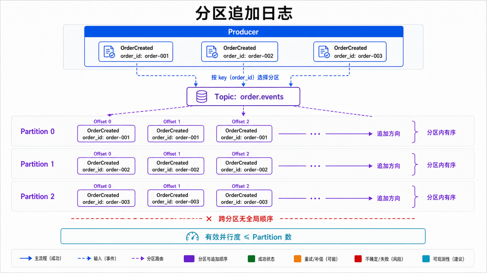
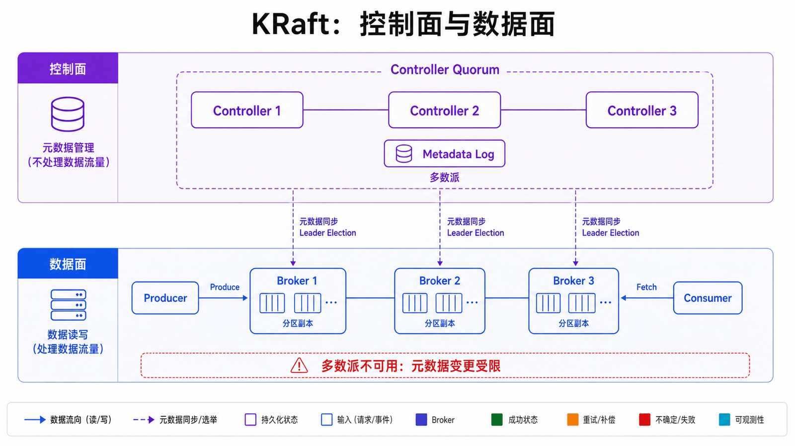
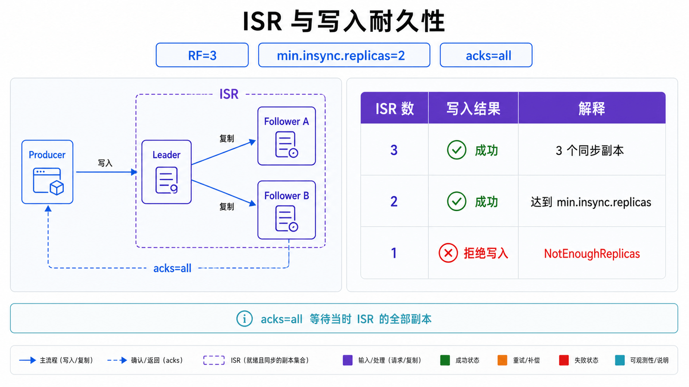
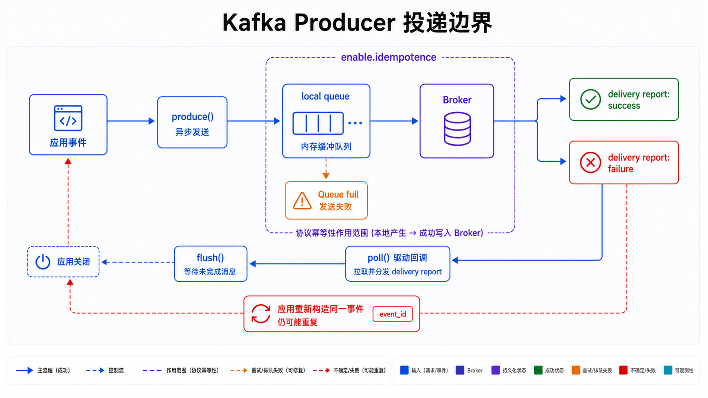
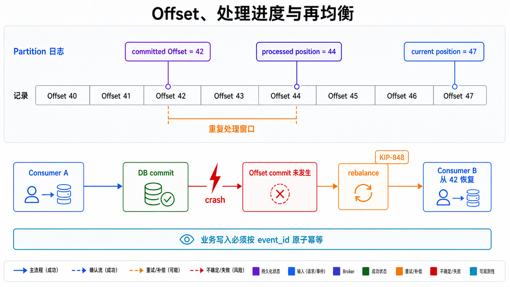

## 前置知识与学习目标

本文假设你已经读过系列第一篇，理解事件契约、at-least-once、Outbox 和业务幂等。示例以 Apache Kafka 4.3.1、KRaft 集群、`confluent-kafka` 2.15 和 Python 3.10+ 为验证基线。

读完后，你应当能够：

1. 从追加日志解释 Topic、Partition、Offset 和保留策略。
2. 说明 key、分区数与消费者组并行度之间的约束。
3. 推导 `acks=all`、ISR、`min.insync.replicas` 和副本因子的可用性边界。
4. 在业务事务成功后提交 Offset，并识别再均衡造成的重复窗口。
5. 用 lag、ISR、请求延迟和 KRaft 指标定位生产问题。

## 真实场景：订单事件需要保留、回放和多路消费

订单服务把 `OrderCreated` 写入 `order.events`。库存、风控、数据仓库分别使用独立消费者组读取同一日志；库存故障两小时后可以从已提交 Offset 继续，修复代码后也可以重置 Offset 重放历史事件。

这与“取走即删除”的任务队列不同：Kafka 把记录按保留策略存放在分区日志中，消费者只维护读取位置。保留时间决定还能回放多远，Offset 决定某个消费者组已经处理到哪里，两者不能混为一谈。

## 核心机制：分区追加日志

<!-- mq-figure:mq02-f01 -->



一个 Topic 被拆成多个 Partition。每个 Partition 是有序、只追加的记录序列，Offset 是记录在该分区内的位置，不是跨 Topic 的全局消息 ID。

生产者根据 key 选择分区。用 `order_id` 作为 key，可让同一订单的 `OrderCreated → OrderPaid → OrderCancelled` 进入同一分区并保持分区内顺序；不同订单可以分布到不同分区并行处理。

<!-- snippet: id=kafka-stable-partition-key mode=run python=3.10+ deps=stdlib -->

```python
import hashlib

def teaching_partition(key: str, partition_count: int) -> int:
    """教学用稳定映射；生产代码应使用客户端默认分区器。"""
    if partition_count <= 0:
        raise ValueError("partition_count must be positive")
    digest = hashlib.sha256(key.encode("utf-8")).digest()
    return int.from_bytes(digest[:8], "big") % partition_count

first = teaching_partition("order-20260713-001", 12)
assert first == teaching_partition("order-20260713-001", 12)
assert 0 <= first < 12
```

不能用 Python 内置 `hash()` 演示持久分区：默认哈希种子会随进程变化。生产中也不要自行复制分区算法；客户端升级、分区数变化或跨语言生产者都可能改变映射。若要扩分区，必须接受新记录映射变化，或在业务层设计虚拟分片。

## Broker、KRaft 与元数据控制面

<!-- mq-figure:mq02-f02 -->



Broker 保存分区副本并处理 Produce/Fetch 请求。Kafka 4.x 使用 KRaft 元数据仲裁，不再依赖 ZooKeeper：Controller Quorum 把 Topic、分区、副本、ACL 等元数据写入内部元数据日志，Broker 从中同步集群状态。

生产环境应把 Controller 与 Broker 的故障域、磁盘和监控纳入容量设计。单节点 combined 模式适合本地实验，不代表生产拓扑；Controller 多数派不可用时，集群无法完成需要元数据变更的操作。

本地快速实验可使用官方镜像：

```bash
docker run --name kafka -p 9092:9092 apache/kafka:4.3.1

docker exec kafka /opt/kafka/bin/kafka-topics.sh \
  --bootstrap-server localhost:9092 \
  --create --topic order.events --partitions 3 --replication-factor 1
```

这里的副本因子 1 只为单容器实验，不能支持 Broker 故障。生产参数必须由实际节点数、机架分布、RPO 和吞吐压测决定。

## 副本、Leader、ISR 与写入确认

<!-- mq-figure:mq02-f03 -->



每个 Partition 有一个 Leader 和若干 Follower。客户端向 Leader 写入；Follower 拉取日志。ISR 是当前与 Leader 保持足够同步的副本集合。

典型耐久配置是副本因子 3、`min.insync.replicas=2`、生产者 `acks=all`：只有当前 ISR 至少有两个成员，且所有 ISR 接受写入后，请求才成功。若 ISR 缩到 1，系统选择拒绝写入而不是降低既定耐久性。

这组配置不等于“绝不丢失”：还要避免 unclean leader election，跨故障域布置副本，监控 UnderMinIsr/OfflineReplica，并验证磁盘与备份恢复。`acks=all` 也不表示固定等待三个副本，它等待的是当时 ISR 中的全部副本。

## 生产者：异步批处理与幂等边界

<!-- mq-figure:mq02-f04 -->



`confluent-kafka` 的 `produce()` 先把消息放入本地队列；`poll()` 驱动回调，`flush()` 在关闭前等待未完成消息。必须处理本地队列已满、不可重试错误和最终投递失败，不能只检查函数是否返回。

<!-- snippet: id=kafka-reliable-producer mode=service python=3.10+ deps=confluent-kafka==2.15.0 service=kafka -->

```python
import json
import os

from confluent_kafka import KafkaException, Producer

def on_delivery(error, message) -> None:
    if error is not None:
        raise KafkaException(error)
    print(f"delivered {message.topic()}[{message.partition()}]@{message.offset()}")

producer = Producer(
    {
        "bootstrap.servers": os.environ["KAFKA_BOOTSTRAP_SERVERS"],
        "client.id": "order-service",
        "acks": "all",
        "enable.idempotence": True,
        "compression.type": "zstd",
    }
)

event = {
    "event_id": "evt-order-001-created-v1",
    "event_type": "OrderCreated",
    "aggregate_id": "order-001",
    "schema_version": 1,
}
producer.produce(
    "order.events",
    key=event["aggregate_id"],
    value=json.dumps(event).encode("utf-8"),
    on_delivery=on_delivery,
)
producer.poll(0)
if producer.flush(10) != 0:
    raise TimeoutError("messages still queued after shutdown deadline")
```

Kafka 3.0 起 Java Producer 默认启用幂等；非 Java 客户端仍应核对自身版本与配置。幂等生产者只去除同一会话内协议级重试造成的重复，应用在超时后重新构造并发送同一业务事件仍可能重复，`event_id` 不能省略。

## 消费者组、Offset 与再均衡

<!-- mq-figure:mq02-f05 -->



同一消费者组内，一个 Partition 在同一时刻只分配给一个消费者；因此有效并行度不会超过分区数。增加消费者但不增加分区，只会产生空闲实例。

消费者有三个容易混淆的位置：

- **当前读取位置**：下一次 `poll()` 从哪里取。
- **已处理位置**：业务代码实际完成到哪里。
- **已提交 Offset**：故障恢复时消费者组从哪里继续。

为实现 at-least-once，应在业务事务成功后存储/提交 Offset。崩溃发生在业务提交之后、Offset 提交之前时会重复处理，因此业务写入必须以 `event_id` 做原子幂等。

<!-- snippet: id=kafka-at-least-once-consumer mode=service python=3.10+ deps=confluent-kafka==2.15.0 service=kafka -->

```python
import os

from confluent_kafka import Consumer, KafkaException

consumer = Consumer(
    {
        "bootstrap.servers": os.environ["KAFKA_BOOTSTRAP_SERVERS"],
        "group.id": "inventory-service-v1",
        "auto.offset.reset": "earliest",
        "enable.auto.commit": False,
        "enable.auto.offset.store": False,
    }
)
consumer.subscribe(["order.events"])

try:
    while True:
        message = consumer.poll(1.0)
        if message is None:
            continue
        if message.error():
            raise KafkaException(message.error())
        process_in_database_transaction(message.value())
        consumer.store_offsets(message=message)
        consumer.commit(asynchronous=False)
finally:
    consumer.close()
```

示例用同步提交强调边界，生产系统通常按批次提交并处理批次内部分成功问题。不要在多线程工作线程中随意调用同一个 Consumer；应保持 poll 所在线程拥有 Consumer，并把完成进度安全汇总回来。

Kafka 4.0 起 KIP-848 新消费者再均衡协议已 GA，但仍需客户端显式启用且不同客户端支持进度不同。迁移前要核对 `confluent-kafka`/librdkafka 版本、现有分配策略和回滚方案，不能直接照搬 Java 客户端参数。

## 保留、压缩与回放边界

- `cleanup.policy=delete` 按时间或空间删除旧日志，适合事件历史。
- `cleanup.policy=compact` 最终保留每个 key 的最新值及 tombstone 语义，适合状态变更日志。
- 两者可以组合，但压缩不是立即发生，也不等价于数据库唯一约束。

重置 Offset 是有影响面的运维操作：先停止消费者组，导出计划，确认目标时间仍在保留范围内，使用 dry-run 查看新 Offset，再执行并观察重复副作用。回放到外部系统时尤其需要独立消费组、幂等和速率限制。

## 监控与故障边界

| 层         | 关键观测                                                 | 典型动作                          |
| ---------- | -------------------------------------------------------- | --------------------------------- |
| Controller | 活跃 Controller、元数据应用延迟、选举                    | 检查 KRaft Quorum 与网络          |
| 副本       | UnderReplicated、UnderMinISR、OfflineReplica、ISR shrink | 检查 Broker、磁盘、网络和机架故障 |
| Broker     | Produce/Fetch 延迟、请求队列、磁盘、网络空闲率           | 限流、扩容或迁移分区              |
| Consumer   | `records-lag-max`、poll 间隔、提交延迟、再均衡时长       | 优化处理、扩分区/消费者、检查卡死 |
| 业务       | 最老事件年龄、成功率、重复抑制、DLQ                      | 定位下游与数据错误                |

Lag 是差值，不是根因。生产速率突增、消费者变慢、再均衡、热分区和下游数据库锁都可能制造 lag。告警应同时观察 lag 的绝对值、增长率和最老事件年龄。

## 常见误区和适用边界

### “一个 Topic 就能保证全局顺序”

Kafka 只保证 Partition 内顺序。全局单分区会牺牲并行度与可用吞吐，通常应改为按业务聚合保证局部顺序。

### “提交 Offset 就是 ACK 当前消息”

提交的是每个 Partition 的下一读取位置。批处理、异步执行和再均衡会让“当前消息”这一说法失真。

### “Lag 高就增加消费者”

消费者数已等于分区数、热 key 集中在一个分区或瓶颈在数据库时，加实例无效。先按分区与处理阶段定位。

### 不在本文展开的边界

本文不深入 Kafka Streams、Connect、跨集群复制、Tiered Storage 和 ACL 配置。它们需要独立的容量、安全与升级方案。

## 自检题

<details>
<summary>1. 副本因子 3、min.insync.replicas=2、acks=all 时，ISR 只剩 1 会怎样？</summary>

写入应失败并返回副本不足错误。系统用可用性换取既定耐久性，不能静默降级为单副本成功。

</details>

<details>
<summary>2. 业务事务成功后、Offset 提交前消费者崩溃，会发生什么？</summary>

恢复后会从旧 Offset 再次读取，形成重复处理窗口。因此业务事务需要以 `event_id` 原子去重，而不是依赖 Offset 消除重复。

</details>

<details>
<summary>3. 为什么增加消费者不一定降低 lag？</summary>

组内并行度受分区数限制；热分区、慢 SQL、外部限流或频繁再均衡也可能是瓶颈。应先按分区和处理阶段观察速率与延迟。

</details>

## 总结与下一篇

Kafka 用分区日志统一了顺序、并行、保留和回放，用副本与 ISR 定义写入边界，用 Offset 表达消费进度。下一篇切换到 RabbitMQ，学习 Exchange、Queue、Confirm、ACK 和 Quorum Queue 如何形成面向任务与路由的可靠消息拓扑。

## 对应资料来源

- [Apache Kafka 4.3 Quickstart](https://kafka.apache.org/quickstart/)
- [Apache Kafka 4.3 Design](https://kafka.apache.org/43/design/design/)
- [Apache Kafka Topic Configurations](https://kafka.apache.org/43/configuration/topic-configs/)
- [Apache Kafka Monitoring](https://kafka.apache.org/43/operations/monitoring/)
- [Apache Kafka Consumer Rebalance Protocol](https://kafka.apache.org/43/operations/consumer-rebalance-protocol/)
- [Confluent Kafka Python Client](https://docs.confluent.io/kafka-clients/python/current/overview.html)
