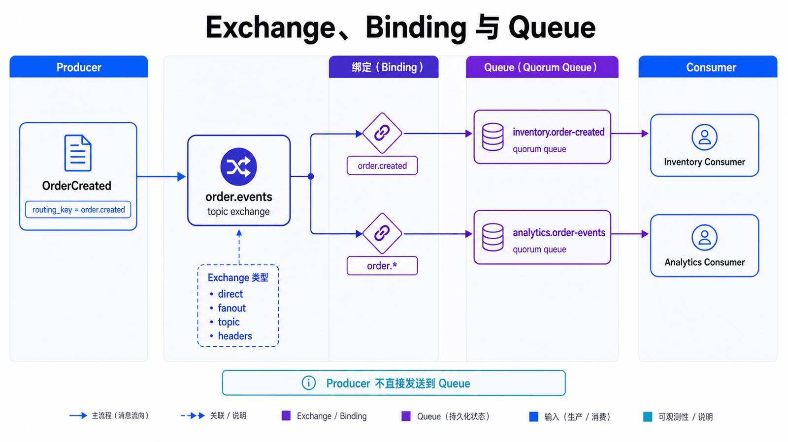
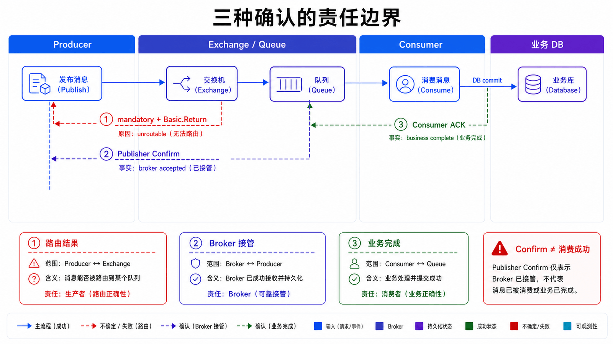
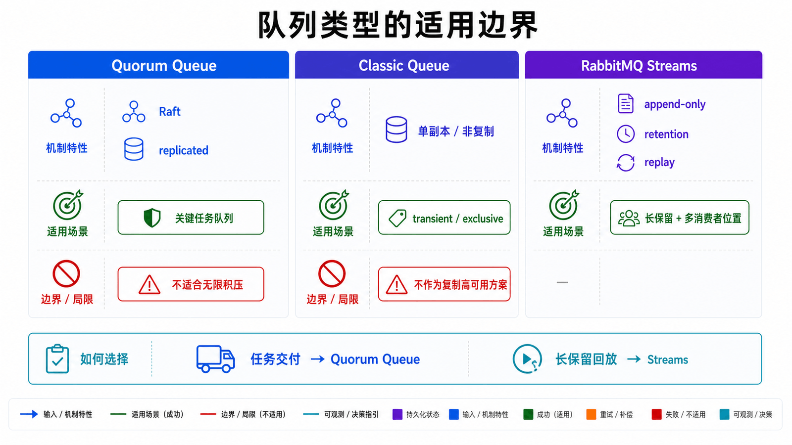
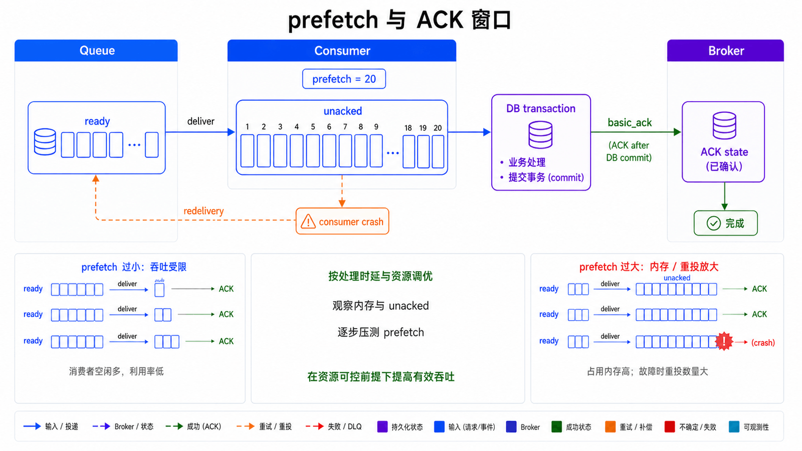
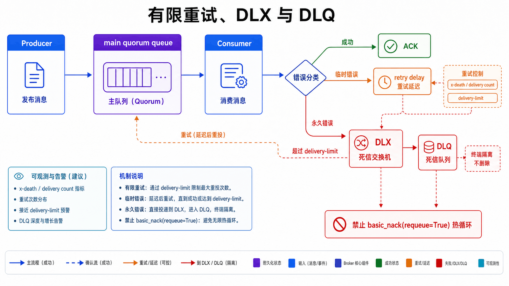

## 前置知识与学习目标

本文假设你已经理解系列第一篇的事件契约、at-least-once 和业务幂等。示例以 RabbitMQ 4.3.2、AMQP 0-9-1、Pika 1.4.1 和 Python 3.10+ 为验证基线。

读完后，你应当能够：

1. 从 Exchange、Binding、Queue 和 Consumer 解释一条消息的路由链路。
2. 区分 mandatory return、Publisher Confirm 与消费者 ACK 的责任边界。
3. 为关键业务声明 Quorum Queue，并说明它与经典队列、Streams 的取舍。
4. 设计有限重试、DLX 和毒消息隔离，避免立即 requeue 热循环。
5. 用 ready/unacked、consumer capacity、confirm、unroutable 和资源告警定位故障。

## 真实场景：同一个订单事件需要不同路由

订单服务发布 `OrderCreated`，库存队列必须处理，通知队列可以独立扩缩，审计队列需要长期保留失败记录。生产者不应知道每个消费者的队列名，只需把事件发布到 `orders.events` Exchange，并携带 `order.created` routing key。

RabbitMQ 的核心价值是把**发布地址**与**消费队列**通过 Binding 解耦。Exchange 只负责路由，不存储消息；真正承载积压与投递状态的是 Queue。

## 核心机制：Exchange、Binding 与 Queue

<!-- mq-figure:mq03-f01 -->



一次 AMQP 0-9-1 发布包含 Exchange、routing key、properties 和 body。Exchange 根据类型与 Binding 计算目标队列：

| Exchange  | 匹配方式                             | 适用示例                 |
| --------- | ------------------------------------ | ------------------------ |
| `direct`  | routing key 精确相等                 | `order.created` 单类任务 |
| `fanout`  | 忽略 routing key，广播全部绑定       | 配置刷新、无条件通知     |
| `topic`   | `*` 匹配一个词，`#` 匹配零个或多个词 | `order.*`、`order.#`     |
| `headers` | 根据消息头键值匹配                   | 少量需要多属性路由的场景 |

`topic` 的词以点分隔。`order.*` 匹配 `order.created`，但不匹配 `order.eu.created`；`order.#` 两者都可匹配。路由规则应通过自动化拓扑测试验证，不能依靠肉眼检查字符串。

默认 Exchange 名称为空字符串，每个队列自动以自身队列名绑定到它，适合入门，不适合表达复杂领域路由。

## 三种确认不是一回事

<!-- mq-figure:mq03-f02 -->



可靠发布需要同时处理三类信号：

1. **mandatory return**：消息到达 Exchange，但没有任何 Queue 匹配时，把消息返回生产者；若 `mandatory=False`，它可能被丢弃或交给 Alternate Exchange。
2. **Publisher Confirm**：broker 确认已经按目标队列类型接管发布。对 Quorum Queue，这意味着多数副本接受了消息。
3. **Consumer ACK/NACK**：消费者告诉 broker 业务处理是否完成；它与 Publisher Confirm 相互独立。

TCP 写入成功只证明字节交给了对端网络栈，不能替代上述应用层确认。连接在“broker 已接收、客户端未收到 confirm”时中断，生产者只能重发未确认消息，因此消费者仍要幂等。

## 可靠发布的最小实现

下面的 service 示例从环境变量读取连接，声明持久化 Topic Exchange 和 Quorum Queue，开启 Confirm，并要求无法路由的消息报错。

<!-- snippet: id=rabbitmq-reliable-publisher mode=service python=3.10+ deps=pika==1.4.1 service=rabbitmq -->

```python
import json
import os

import pika

parameters = pika.URLParameters(os.environ["AMQP_URL"])
parameters.heartbeat = 30
parameters.blocked_connection_timeout = 15

connection = pika.BlockingConnection(parameters)
try:
    channel = connection.channel()
    channel.exchange_declare(
        exchange="orders.events",
        exchange_type="topic",
        durable=True,
    )
    channel.queue_declare(
        queue="inventory.order-created.q",
        durable=True,
        arguments={"x-queue-type": "quorum"},
    )
    channel.queue_bind(
        exchange="orders.events",
        queue="inventory.order-created.q",
        routing_key="order.created",
    )
    channel.confirm_delivery()

    event = {
        "event_id": "evt-order-001-created-v1",
        "event_type": "OrderCreated",
        "aggregate_id": "order-001",
        "schema_version": 1,
    }
    confirmed = channel.basic_publish(
        exchange="orders.events",
        routing_key="order.created",
        body=json.dumps(event).encode("utf-8"),
        properties=pika.BasicProperties(
            content_type="application/json",
            delivery_mode=pika.DeliveryMode.Persistent,
            message_id=event["event_id"],
        ),
        mandatory=True,
    )
    if not confirmed:
        raise RuntimeError("broker did not confirm the publish")
finally:
    connection.close()
```

持久化 Exchange、durable Queue、persistent message 和 Publisher Confirm 解决的是不同层次，缺一项都可能留下故障窗口。不要在代码中硬编码 `guest/guest` 或远程主机；RabbitMQ 默认只允许 `guest` 从本机连接。

## Quorum Queue、经典队列与 Streams

<!-- mq-figure:mq03-f03 -->



RabbitMQ 4.x 已移除经典镜像队列。需要复制和高可用的长期关键队列，应优先评估基于 Raft 的 Quorum Queue：

- 发布确认在多数副本接受后返回。
- 支持 Publisher Confirm、手动 ACK、DLX 和 delivery limit。
- 需要奇数成员并跨故障域部署；多数成员永久丢失会影响可用性。
- 复制带来延迟与磁盘成本，不适合大量短命、独占或临时队列。

经典队列仍适合不要求复制的临时或低价值工作负载。若需求是超高吞吐、长积压、按 Offset 重放或大规模 fan-out，应评估 RabbitMQ Streams，而不是无限提高 Quorum Queue 的 prefetch 或堆积数。

## 消费者 ACK、prefetch 与业务事务

<!-- mq-figure:mq03-f04 -->



手动 ACK 应发生在业务事务提交之后，并且必须在接收该 delivery 的同一 Channel 上发送。连接或 Channel 在 ACK 前断开时，RabbitMQ 会自动重新入队未确认消息。

`prefetch_count` 限制每个消费者在途未确认数量：太小会让网络往返限制吞吐，太大会占用消费者内存并扩大故障重投批次。应以处理延迟、消息大小和下游连接池为依据压测，而不是把 `1` 称为普遍的“公平调度”。

<!-- snippet: id=rabbitmq-safe-consumer mode=service python=3.10+ deps=pika==1.4.1 service=rabbitmq -->

```python
import json
import os

import pika

def on_message(channel, method, properties, body) -> None:
    try:
        event = json.loads(body)
        process_in_database_transaction(
            event_id=event["event_id"],
            aggregate_id=event["aggregate_id"],
            payload=event,
        )
    except PermanentMessageError:
        channel.basic_nack(delivery_tag=method.delivery_tag, requeue=False)
    except TransientDependencyError:
        # 不立即 requeue；由 DLX/重试队列执行有限次数和退避。
        channel.basic_nack(delivery_tag=method.delivery_tag, requeue=False)
    else:
        channel.basic_ack(delivery_tag=method.delivery_tag)

connection = pika.BlockingConnection(pika.URLParameters(os.environ["AMQP_URL"]))
channel = connection.channel()
channel.basic_qos(prefetch_count=50)
channel.basic_consume(
    queue="inventory.order-created.q",
    on_message_callback=on_message,
    auto_ack=False,
)
channel.start_consuming()
```

`process_in_database_transaction` 必须把幂等记录与库存变更放在同一数据库事务。若先查 Redis、后改数据库、再写去重标记，任一步崩溃都会破坏原子性。

## 有限重试、DLX 与毒消息

<!-- mq-figure:mq03-f05 -->



立即 `basic_nack(requeue=True)` 会让不可恢复消息在消费者之间高速循环，消耗 CPU、网络和日志。可靠拓扑应区分：

- 瞬时错误：进入带 TTL 的重试队列，按 5 秒、30 秒、5 分钟等有限阶梯退避。
- 永久错误：schema 不兼容、权限或业务校验失败，直接进入 DLQ。
- 超过次数：进入 DLQ，保存原始事件、错误类别、首次/末次失败时间和尝试次数。

RabbitMQ 推荐使用 Policy 配置 DLX，避免把不可变 `x-arguments` 固化在应用声明中。Quorum Queue 从 RabbitMQ 4.0 起默认 delivery limit 为 20；生产系统仍应显式设置与验证，并为 DLQ 建立告警和重放审批。

重放不是把 DLQ 全部倒回原队列：先修复根因，抽样验证，按 `event_id` 保持幂等，限制速率，记录操作者、批次和结果，并允许停止。

## 流控、资源告警与监控

当队列或磁盘跟不上发布速率时，RabbitMQ 会把流控逐级传播到发布连接；内存或磁盘告警可在集群范围阻塞发布。Pika 的 `blocked_connection_timeout` 防止同步调用无限等待，但超时后的发布状态仍可能不确定，必须按 Confirm 账本处理。

| 信号                        | 含义                       | 优先检查                                  |
| --------------------------- | -------------------------- | ----------------------------------------- |
| `messages_ready`            | 尚未投递的积压             | 消费速率、消费者数量、下游延迟            |
| `messages_unacknowledged`   | 已投递但未确认             | 卡死处理、prefetch、ACK 泄漏              |
| consumer capacity           | 队列立即投递给消费者的能力 | 消费者是否饱和或不足                      |
| publish/confirm rate        | 发布与 broker 接管速率     | 磁盘、复制、网络、资源告警                |
| unroutable returned/dropped | 路由失败                   | Exchange、Binding、routing key、mandatory |
| connection/channel churn    | 连接复用是否异常           | 客户端生命周期与并发模型                  |

节点指标之外还要监控最老事件年龄、业务成功率、幂等命中和 DLQ。仅看 Queue 长度会漏掉 unacked 卡死和小流量高延迟。

## 常见误区和适用边界

### “durable Queue 就不会丢消息”

还需要 persistent message、Publisher Confirm、复制队列、消费者正确 ACK，以及经过验证的节点与备份恢复流程。

### “mandatory=True 等于发布成功”

mandatory 只处理无路由返回；Publisher Confirm 才表示 broker 是否接管。两者应同时使用并分别处理。

### “NACK 并 requeue 是最安全的重试”

不可恢复消息会形成热循环。应分类错误、限制次数、退避并进入 DLQ。

### 不在本文展开的边界

本文不深入 Federation、Shovel、跨地域复制、TLS/权限配置和集群滚动升级；这些需要单独的安全与灾备设计。

## 自检题

<details>
<summary>1. 消息获得 Publisher Confirm，为什么仍可能重复？</summary>

Confirm 可能已由 broker 发出但在网络中丢失，生产者无法确定结果而重发。消费者必须按业务 `event_id` 幂等。

</details>

<details>
<summary>2. ready 很低但 unacked 持续升高，最可能先检查什么？</summary>

检查消费者是否卡死、业务事务是否变慢、是否漏发 ACK，以及 prefetch 是否过大。此时盲目增加生产者或队列无助于恢复。

</details>

<details>
<summary>3. 什么场景不适合 Quorum Queue？</summary>

大量短命/独占队列、极低延迟且不需要复制的数据、超长积压或超高吞吐场景。后两者应评估 Streams。

</details>

## 总结与下一篇

RabbitMQ 通过 Exchange 和 Binding 提供灵活路由，通过 Confirm、ACK、Quorum Queue 和 DLX 明确可靠性边界。下一篇把 Kafka 与 RabbitMQ 放回同一故障模型，处理顺序、重复、双写、积压、毒消息和事故恢复。

## 对应资料来源

- [RabbitMQ 4.3 Documentation](https://www.rabbitmq.com/docs)
- [RabbitMQ Reliability Guide](https://www.rabbitmq.com/docs/reliability)
- [RabbitMQ Publishers](https://www.rabbitmq.com/docs/publishers)
- [RabbitMQ Consumer Acknowledgements and Publisher Confirms](https://www.rabbitmq.com/docs/confirms)
- [RabbitMQ Quorum Queues](https://www.rabbitmq.com/docs/quorum-queues)
- [RabbitMQ Flow Control](https://www.rabbitmq.com/docs/flow-control)
- [RabbitMQ Prometheus Monitoring](https://www.rabbitmq.com/docs/prometheus)
- [Pika 1.4.1 Usage Examples](https://pika.readthedocs.io/en/stable/examples.html)
