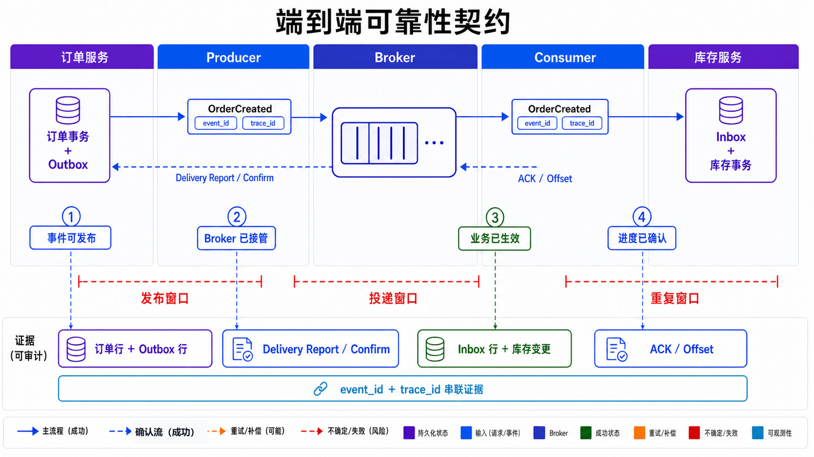
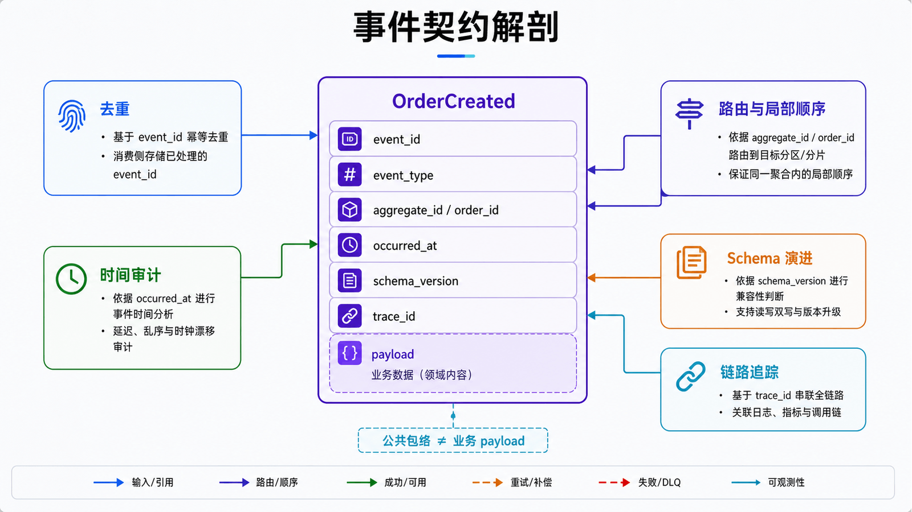
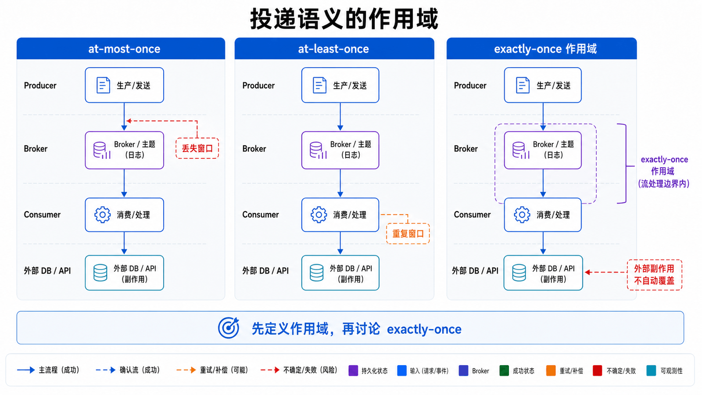
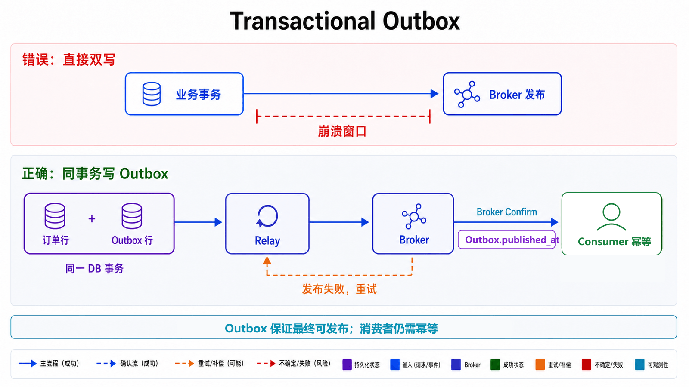
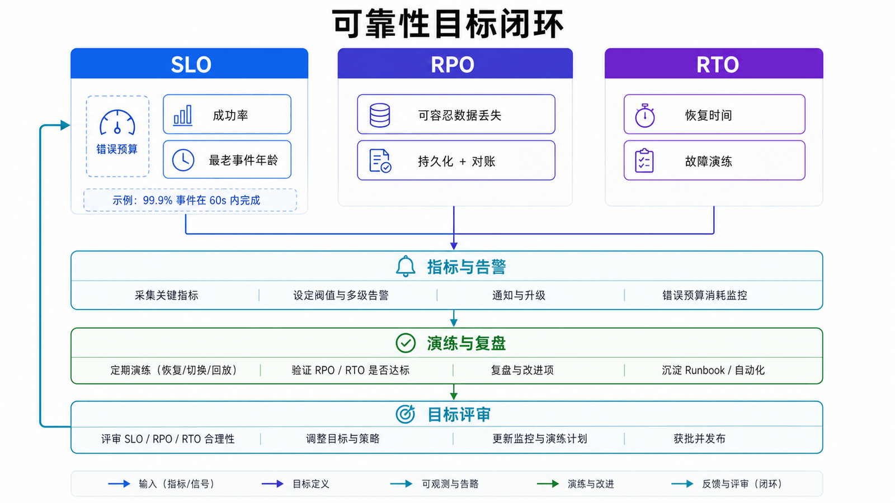

## 前置知识与学习目标

本文面向需要设计或运维消息系统的后端工程师。阅读前应理解 HTTP、数据库事务、JSON 和基本的故障重试；示例使用 Python 3.10+。

读完后，你应当能够：

1. 判断一个业务是否真的需要异步消息，而不是把消息队列当作默认组件。
2. 为事件定义可演进、可追踪的契约，并说清每次“确认”转移了哪一段责任。
3. 区分 at-most-once、at-least-once 与 exactly-once 的作用范围。
4. 用 Transactional Outbox 消除数据库与 broker 的双写窗口。
5. 把“可靠”翻译成可告警的 SLO、RPO 和 RTO，而不是配置项清单。

## 真实场景：订单已提交，谁负责通知库存

订单服务完成数据库事务后，需要通知库存、支付和通知服务。同步调用看似直接，却会把下游延迟与故障传播到下单链路；异步消息允许订单服务先完成自己的承诺，再由下游独立追赶。

消息队列解决的是**时间与故障域的解耦**，代价是系统必须处理重复、延迟、乱序、积压和最终一致性。若业务要求调用结束前拿到结果，或一次本地事务即可完成工作，引入 broker 反而会扩大运维面。

贯穿全系列的事件为 `OrderCreated`：订单 `order-20260713-001` 已被订单服务接受，库存服务要据此预留库存。这里的重点不是产品 API，而是谁在什么时刻承担数据不丢失的责任。

## 核心机制：责任沿链路逐段转移

<!-- mq-figure:mq01-f01 -->



一次消息处理至少跨越五个边界：

1. 业务事务把订单和待发送事件写入数据库。
2. Relay 从 Outbox 读取事件并交给 broker。
3. broker 完成持久化或复制后向生产者确认。
4. broker 把消息交给消费者；消费者完成业务事务后确认或提交进度。
5. 下游状态成为新的事实来源，监控系统持续检查延迟与失败。

生产者收到 ACK、Publisher Confirm 或成功回调，只能证明 broker 已按其语义接管消息；它不能证明库存已经预留。消费者 ACK 或提交 Offset 也不应早于业务事务完成，否则消费者崩溃时会留下“进度已前移、业务未落库”的空洞。

因此，可靠性设计应先写出失败矩阵：每个边界在“请求未到达、处理成功但响应丢失、处理失败、处理超时”时会发生什么，以及重试是否可能制造重复。

## 事件契约：让消息可演进、可定位

<!-- mq-figure:mq01-f02 -->



全系列统一使用下面的事件包络：

| 字段             | 示例                          | 责任                                 |
| ---------------- | ----------------------------- | ------------------------------------ |
| `event_id`       | `evt-01J2MQ...`               | 全局唯一，用于追踪和幂等             |
| `event_type`     | `OrderCreated`                | 表达已经发生的业务事实               |
| `aggregate_id`   | `order-20260713-001`          | 同一聚合的排序键                     |
| `occurred_at`    | `2026-07-13T14:20:00Z`        | 事件发生时间，不等同于入队时间       |
| `schema_version` | `1`                           | 支持兼容演进                         |
| `trace_id`       | `trace-7f3...`                | 串联 API、Relay、broker 和消费者日志 |
| `payload`        | `{"sku":"A-42","quantity":2}` | 最小必要业务数据                     |

事件名使用过去式，表示事实；`CreateOrder` 这类命令意味着接收方仍可拒绝，不能与事件混用。消费者必须对未知字段保持宽容，对缺失必需字段或不支持的版本明确失败，不能默默猜测。

<!-- snippet: id=mq-event-envelope mode=run python=3.10+ deps=stdlib -->

```python
from dataclasses import dataclass
from datetime import datetime
from typing import Any

@dataclass(frozen=True)
class Event:
    event_id: str
    event_type: str
    aggregate_id: str
    occurred_at: str
    schema_version: int
    trace_id: str
    payload: dict[str, Any]

    def validate(self) -> None:
        if not self.event_id or not self.aggregate_id:
            raise ValueError("event_id and aggregate_id are required")
        if self.schema_version != 1:
            raise ValueError(f"unsupported schema_version={self.schema_version}")
        datetime.fromisoformat(self.occurred_at.replace("Z", "+00:00"))

event = Event(
    event_id="evt-001",
    event_type="OrderCreated",
    aggregate_id="order-20260713-001",
    occurred_at="2026-07-13T14:20:00Z",
    schema_version=1,
    trace_id="trace-001",
    payload={"sku": "A-42", "quantity": 2},
)
event.validate()
assert event.event_type.endswith("Created")
```

## 投递语义：先写清范围，再谈 exactly-once

<!-- mq-figure:mq01-f03 -->



| 语义          | 进度时机                         | 可能结果           | 适用场景                                      |
| ------------- | -------------------------------- | ------------------ | --------------------------------------------- |
| At-most-once  | 处理前确认                       | 可能丢，不重复     | 可丢采样、低价值遥测                          |
| At-least-once | 处理成功后确认                   | 不轻易丢，可能重复 | 绝大多数业务事件                              |
| Exactly-once  | 在限定事务域内原子提交结果与进度 | 域内一次生效       | Kafka 事务内的读写、数据库内的 Inbox/业务事务 |

“Exactly-once”不是端到端魔法。Kafka 的幂等生产者约束单个生产会话的重复写入；事务可原子写入 Kafka Topic 和 Offset，但不能自动把第三方数据库或 HTTP 副作用纳入同一事务。跨系统时，仍要通过幂等业务键、Inbox/Outbox 或可补偿状态机保证**效果一次**。

选择语义时应从可接受损失和重复代价反推：支付扣款不能靠“希望不重复”，日志采样也不值得为零丢失付出无限成本。

## 双写窗口与 Transactional Outbox

<!-- mq-figure:mq01-f04 -->



“先提交订单，再发送消息”会在两步之间崩溃；“先发消息，再提交订单”则可能让消费者看到一个最终回滚的订单。Outbox 把业务行与事件意图写进同一个本地事务，再由独立 Relay 至少一次地发布。

<!-- snippet: id=mq-transactional-outbox mode=run python=3.10+ deps=stdlib -->

```python
import json
import sqlite3

def create_order(conn: sqlite3.Connection, order_id: str) -> None:
    event_id = f"evt:{order_id}:created:v1"
    with conn:
        conn.execute(
            "INSERT INTO orders(order_id, status) VALUES (?, ?)",
            (order_id, "CREATED"),
        )
        conn.execute(
            "INSERT INTO outbox(event_id, aggregate_id, payload, published) "
            "VALUES (?, ?, ?, 0)",
            (event_id, order_id, json.dumps({"event_type": "OrderCreated"})),
        )

db = sqlite3.connect(":memory:")
db.execute("CREATE TABLE orders(order_id TEXT PRIMARY KEY, status TEXT NOT NULL)")
db.execute(
    "CREATE TABLE outbox(event_id TEXT PRIMARY KEY, aggregate_id TEXT NOT NULL, "
    "payload TEXT NOT NULL, published INTEGER NOT NULL)"
)
create_order(db, "order-001")
assert db.execute("SELECT COUNT(*) FROM orders").fetchone()[0] == 1
assert db.execute("SELECT COUNT(*) FROM outbox WHERE published = 0").fetchone()[0] == 1
```

Relay 可能在“broker 已接收、Outbox 尚未标记”时崩溃，重启后会重复发布，所以消费者仍需幂等。Outbox 保证的是业务提交后事件最终可发布，不保证消费者天然只执行一次。

## SLO、RPO 与 RTO：把可靠性变成可观测契约

<!-- mq-figure:mq01-f05 -->



生产系统至少要定义以下指标：

- **端到端延迟**：`consumer_finished_at - occurred_at`，应观察 p95/p99，而非只有平均值。
- **积压年龄**：最老未处理事件的年龄，通常比单纯队列长度更能反映用户影响。
- **失败与重试率**：按 `event_type`、消费者和错误类别拆分。
- **重复抑制率**：命中幂等记录的次数，用于发现上游重发或确认丢失。
- **DLQ 流入与滞留**：必须有负责人、告警阈值和重放审计。

RPO 描述故障后最多可丢多少已接受事件；RTO 描述恢复消费能力需要多久。若业务要求 RPO=0，就必须验证 broker 复制、生产者确认、Outbox 和备份恢复，而不是只把队列声明为 durable。

一个可执行的初始 SLO 可以是：“99.9% 的 `OrderCreated` 在 60 秒内完成库存预留，24 小时窗口内不允许出现未解释的数据丢失，DLQ 事件 15 分钟内触发告警。”阈值必须根据基线流量和下游容量校准。

## 技术选型边界

| 问题       | Kafka 更匹配                         | RabbitMQ 更匹配                                  |
| ---------- | ------------------------------------ | ------------------------------------------------ |
| 消费模型   | 可回放的分区日志，多消费组独立读取   | 消息路由到队列，竞争消费者处理任务               |
| 顺序范围   | 分区内顺序，按 key 扩展              | 单队列/单活消费者顺序，复杂路由灵活              |
| 保留与回放 | 长期保留、重放、流式数据管道         | 处理后确认并删除；Streams 另有保留模型           |
| 路由       | Topic 与分区键为主                   | direct/fanout/topic/headers Exchange             |
| 运维重点   | 分区、副本、ISR、Offset、lag、再均衡 | Queue、unacked、confirm、prefetch、DLX、资源告警 |

选型不是吞吐排行榜。应先写清消息保留时间、并行度、顺序键、路由复杂度、回放需求、故障目标与团队运维能力，再做带故障注入的基准测试。

## 常见误区和适用边界

### “用了消息队列，服务就解耦了”

若事件 schema 无版本、生产者依赖消费者内部状态，或所有服务共享同一个重试策略，耦合只是从 HTTP 转移到了 broker。

### “ACK 成功等于业务成功”

确认只覆盖特定边界。必须明确是 broker 接收确认、消费者处理确认，还是业务数据库事务提交。

### “所有失败都重试”

权限错误、schema 不兼容和业务校验失败通常不可重试。无上限重试会把单点错误放大为重试风暴。

### 什么时候不适用消息队列

需要立即返回下游结果、业务量很小且单体事务足够、团队无法承担监控与恢复成本时，优先使用同步调用或数据库任务表。

## 自检题

<details>
<summary>1. 生产者收到 broker 确认后进程退出，能否断言库存已经预留？</summary>

不能。确认只说明 broker 按约定接管了消息；消费者是否收到、业务事务是否提交，需要独立的消费进度和端到端状态验证。

</details>

<details>
<summary>2. Outbox 为什么仍要求消费者幂等？</summary>

Relay 可能在发布成功但尚未标记 Outbox 时崩溃，恢复后再次发布同一 `event_id`。Outbox 消除双写丢失窗口，但保留至少一次发布带来的重复可能。

</details>

<details>
<summary>3. 选择 Kafka 或 RabbitMQ 前，至少要明确哪四类约束？</summary>

消息保留与回放、顺序范围和并行度、路由模型、可靠性与恢复目标；还应补充峰值流量、消息大小和团队运维能力。

</details>

## 总结与下一篇

消息系统的起点不是 broker 配置，而是事件契约、责任边界和失败语义。下一篇进入 Kafka：观察分区日志如何把顺序、并行、保留、副本和消费进度组合成可回放的数据系统。

## 对应资料来源

- [Apache Kafka 4.3 Design](https://kafka.apache.org/43/design/design/)
- [RabbitMQ Reliability Guide](https://www.rabbitmq.com/docs/reliability)
- [Transactional Outbox Pattern](https://microservices.io/patterns/data/transactional-outbox)
- [Idempotent Consumer Pattern](https://microservices.io/patterns/communication-style/idempotent-consumer.html)
- [AWS Builders' Library: Timeouts, retries and backoff with jitter](https://aws.amazon.com/builders-library/timeouts-retries-and-backoff-with-jitter/)
