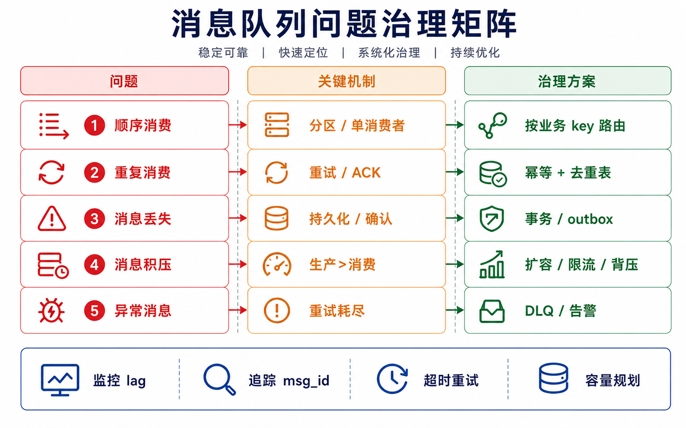

## 概述

消息队列在实际应用中会遇到各种问题，本篇文章总结常见问题及解决方案。



## 常见问题类型

| 问题 | 说明 | 解决方案 |
|------|------|----------|
| **顺序消费** | 消息消费的先后顺序 | 单队列单消费者、消息分区 |
| **重复消费** | 消息被重复投递 | 幂等处理、唯一标识 |
| **消息丢失** | 消息在传输过程中丢失 | 确认机制、持久化、事务 |
| **消息积压** | 消费能力不足 | 增加消费者、限流、背压 |
| **消息堆积** | 生产速度大于消费速度 | 扩容、丢弃策略、分级处理 |

## 顺序消费问题

### 问题描述

消息队列中的消息需要按顺序消费，但多消费者并发消费可能打乱顺序。

### 解决方案

**方案一：单队列单消费者**

```python
# 保证同一条消息只被一个消费者处理
channel.basic_qos(prefetch_count=1)
```

**方案二：消息分区**

```python
# 相同业务 ID 的消息发送到相同分区
def get_partition(key):
    return hash(key) % partition_count
```

**方案三：全局队列**

```python
# 使用单一队列，配合顺序锁
class MessageQueue:
    def consume(self, msg):
        with self.order_lock(msg.key):
            self.process(msg)
```

## 重复消费问题

### 问题描述

由于网络波动或重试机制，消息可能被重复投递。

### 解决方案

**幂等处理**

```python
# Redis 实现幂等
def process_message(msg):
    msg_id = msg['id']
    if redis.exists(f'idempotent:{msg_id}'):
        return  # 已处理，跳过

    # 处理业务逻辑
    do_something(msg)

    # 标记已处理，设置过期时间
    redis.setex(f'idempotent:{msg_id}', 'processed', 3600)
```

**数据库唯一约束**

```sql
-- 通过数据库唯一索引防止重复插入
INSERT INTO order_log (msg_id, ...)
VALUES (:msg_id, ...)
ON DUPLICATE KEY UPDATE ...;
```

**消息去重表**

```python
class MessageDeduplicator:
    def __init__(self, db):
        self.db = db

    def is_duplicate(self, msg_id):
        sql = "SELECT 1 FROM msg_dedup WHERE msg_id = %s"
        return self.db.query(sql, (msg_id,)) is not None

    def mark_processed(self, msg_id):
        sql = "INSERT INTO msg_dedup (msg_id) VALUES (%s)"
        self.db.execute(sql, (msg_id,))
```

## 消息丢失问题

### 问题描述

消息在生产、传输、消费过程中可能丢失。

### 解决方案

**生产者确认**

```python
# RabbitMQ 确认机制
channel.confirm_delivery()
try:
    channel.basic_publish(
        exchange='',
        routing_key='hello',
        body='Hello World!',
        properties=pika.BasicProperties(
            delivery_mode=2,  # 持久化
        )
    )
except Exception as e:
    print(f"发送失败: {e}")
```

**消费者手动确认**

```python
def callback(ch, method, properties, body):
    try:
        process_message(body)
        ch.basic_ack(delivery_tag=method.delivery_tag)
    except Exception as e:
        ch.basic_nack(delivery_tag=method.delivery_tag, requeue=True)
```

**消息持久化**

```python
# RabbitMQ 队列持久化
channel.queue_declare(queue='hello', durable=True)

# Kafka 生产者配置
producer_config = {
    'acks': 'all',           # 等待所有副本确认
    'retries': 3,            # 重试次数
    'enable.idempotence': True,  # 幂等生产者
}
```

## 消息积压问题

### 问题描述

消费速度跟不上生产速度，导致消息积压。

### 解决方案

**增加消费者**

```python
# Kafka 消费者组
for _ in range(consumer_count):
    threading.Thread(target=consume_messages).start()
```

**批量消费**

```python
def batch_consume():
    messages = consumer.poll(timeout_ms=1000)
    if messages:
        batch_process(messages)
```

**限时处理**

```python
def quick_process(msg):
    start = time.time()
    result = do_process(msg)
    if time.time() - start > 1:  # 超过1秒，进入慢队列
        slow_queue.put(msg)
    return result
```

## 最佳实践

1. **消息幂等**：所有消费者都必须实现幂等处理
2. **消息持久化**：重要消息必须持久化存储
3. **消费者确认**：使用手动确认机制，避免消息丢失
4. **监控告警**：实时监控队列深度和消费延迟
5. **定期清理**：设置消息过期时间，避免无限堆积
