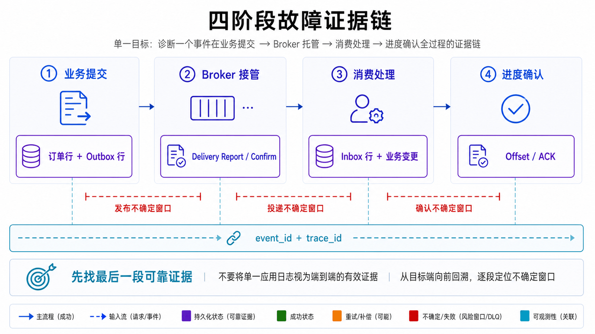
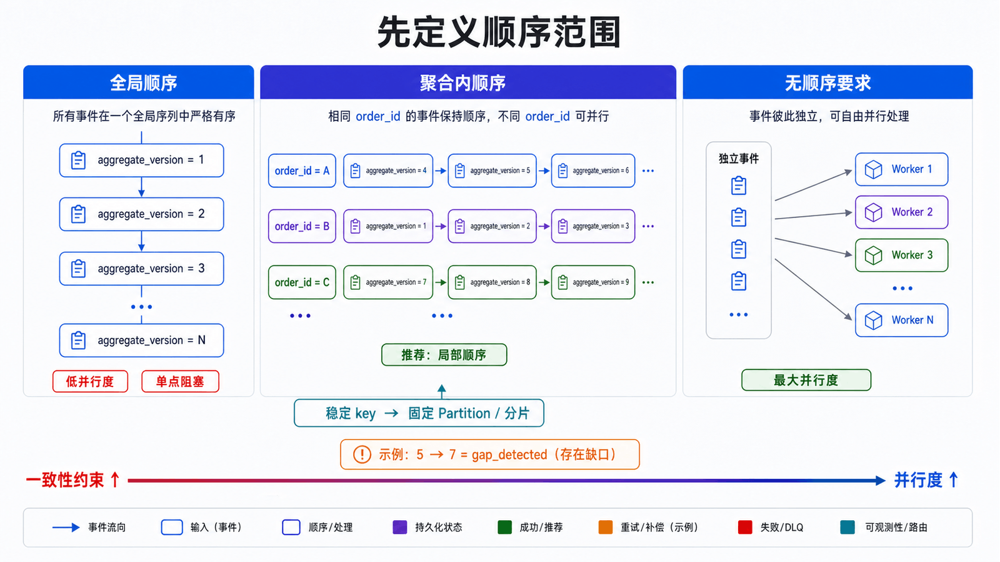
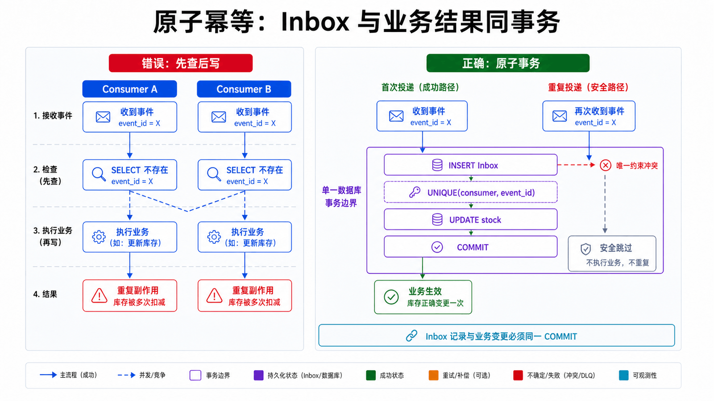
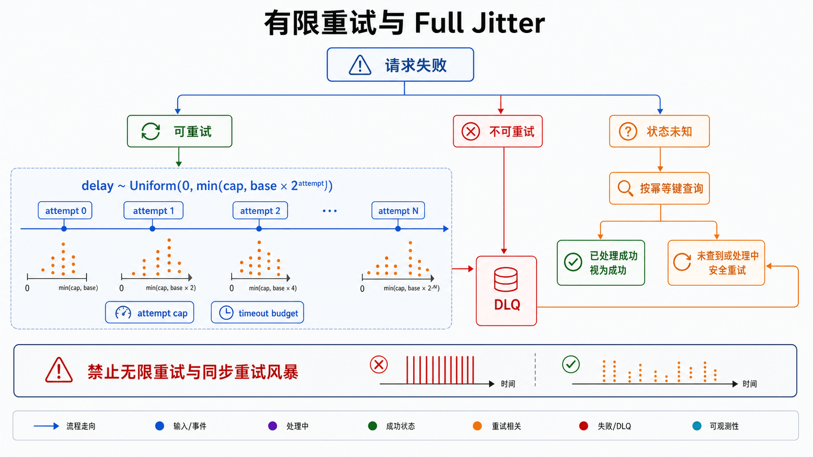
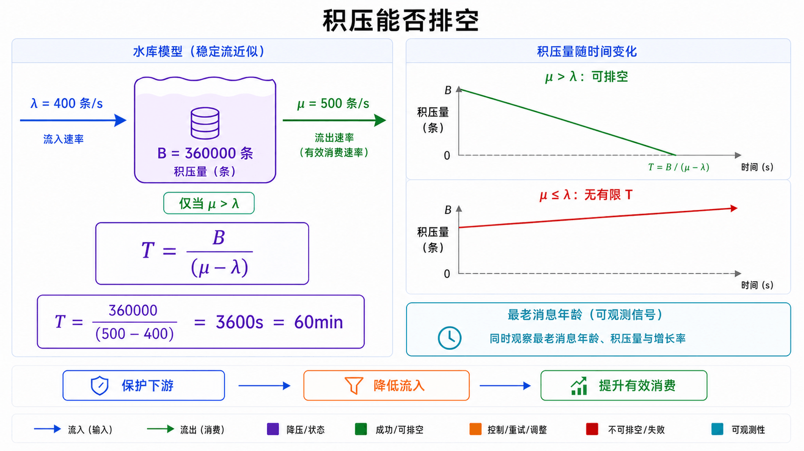
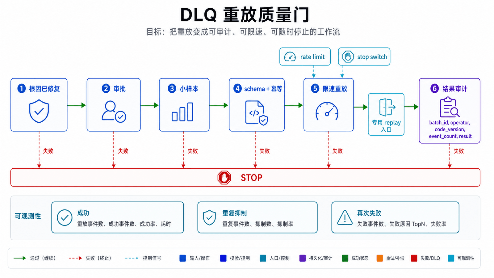

## 前置知识与学习目标

本文是系列收束篇，假设你已经理解事件契约、Kafka 的 Partition/Offset 和 RabbitMQ 的 Queue/ACK。目标不是再列一遍产品配置，而是建立跨 broker 的生产治理方法。

读完后，你应当能够：

1. 从生产、broker、消费和业务事务四个阶段定位“丢失”或“重复”。
2. 用稳定排序键、原子幂等和 Outbox 关闭常见一致性窗口。
3. 计算积压是否能够排空，并制定限流、扩容和降级顺序。
4. 为重试、DLQ、回放和毒消息建立可审计运行手册。
5. 根据保留、路由、顺序、吞吐和团队能力选择 Kafka 或 RabbitMQ。

## 真实场景：一次库存事故为何同时出现重复与积压

库存数据库慢查询使消费耗时从 50 ms 升到 3 s。消费者超时后反复重试，Kafka 组频繁再均衡，RabbitMQ 消息被立即 requeue；与此同时，部分请求已成功提交库存但未提交 Offset/ACK，于是同一 `event_id` 再次到达。

表面现象是 lag、ready、unacked、错误日志一起上涨，真正根因却在下游数据库。若值班人员只“增加消费者”，会进一步耗尽连接池；若直接清空队列，又会造成业务数据丢失。

## 统一故障模型：先确定责任边界

<!-- mq-figure:mq04-f01 -->



对每条 `OrderCreated`，应记录以下阶段状态：

| 阶段        | 可验证证据                               | 典型不确定窗口                 |
| ----------- | ---------------------------------------- | ------------------------------ |
| 业务提交    | 订单行与 Outbox 行处于同一事务           | 业务已提交但事件未发布         |
| broker 接管 | Kafka delivery report / RabbitMQ Confirm | broker 已接收但确认丢失        |
| 消费处理    | Inbox/幂等记录与业务变更同事务           | 业务已提交但 Offset/ACK 未成功 |
| 进度确认    | Kafka committed Offset / RabbitMQ ACK    | 确认成功但监控或审计缺失       |

排障时用 `event_id` 和 `trace_id` 串起四段证据。不要把“生产日志打印成功”“队列中没有消息”或“消费者收到过”单独视为端到端成功。

## 顺序治理：先定义顺序范围

<!-- mq-figure:mq04-f02 -->



业务通常需要的是同一订单、账户或设备的局部顺序，而非全局顺序。全局单队列会把吞吐和可用性压到一个串行点。

- Kafka：以 `aggregate_id` 为 key，保证同一聚合进入同一 Partition；一个组内该 Partition 同时只由一个消费者处理。
- RabbitMQ：需要严格队列顺序时使用单活消费者；需要扩展时可按稳定业务键把消息分散到固定数量的分片队列。
- 业务层：事件带 `aggregate_version`，消费者拒绝或暂存明显缺失前序版本的事件。

分区数或分片数改变会改变 key 映射，因此扩容需要迁移计划。不能使用进程随机化的 `hash()` 作为跨重启路由规则。

<!-- snippet: id=mq-version-ordering mode=run python=3.10+ deps=stdlib -->

```python
def accept_version(last_version: int, incoming_version: int) -> str:
    if incoming_version <= last_version:
        return "duplicate_or_stale"
    if incoming_version != last_version + 1:
        return "gap_detected"
    return "apply"

assert accept_version(4, 5) == "apply"
assert accept_version(5, 5) == "duplicate_or_stale"
assert accept_version(5, 7) == "gap_detected"
```

版本检查不能代替 broker 顺序，只是把静默乱序变成可观测状态。遇到 gap 应有限等待或触发状态回源，不能永久阻塞整个分区。

## 重复治理：幂等记录必须与业务结果原子提交

<!-- mq-figure:mq04-f03 -->



“先查 Redis 是否存在，再执行业务，最后写 Redis”不是可靠幂等：并发消费者可能同时通过检查，进程也可能在业务提交后、写标记前崩溃。

关系数据库中可使用 `(consumer_name, event_id)` 唯一约束，并在同一事务内插入 Inbox 与更新业务状态。重复插入触发唯一约束后，整个事务回滚或安全跳过。

<!-- snippet: id=mq-atomic-idempotent-consumer mode=run python=3.10+ deps=stdlib -->

```python
import sqlite3

def reserve_once(conn: sqlite3.Connection, event_id: str, sku: str, quantity: int) -> bool:
    try:
        with conn:
            conn.execute(
                "INSERT INTO inbox(consumer, event_id) VALUES (?, ?)",
                ("inventory-v1", event_id),
            )
            conn.execute(
                "UPDATE stock SET reserved = reserved + ? WHERE sku = ?",
                (quantity, sku),
            )
    except sqlite3.IntegrityError:
        return False
    return True

db = sqlite3.connect(":memory:")
db.execute("CREATE TABLE inbox(consumer TEXT, event_id TEXT, PRIMARY KEY(consumer, event_id))")
db.execute("CREATE TABLE stock(sku TEXT PRIMARY KEY, reserved INTEGER NOT NULL)")
db.execute("INSERT INTO stock VALUES ('A-42', 0)")

assert reserve_once(db, "evt-001", "A-42", 2) is True
assert reserve_once(db, "evt-001", "A-42", 2) is False
assert db.execute("SELECT reserved FROM stock WHERE sku='A-42'").fetchone()[0] == 2
```

若副作用是第三方 HTTP 调用，应把调用建模为带幂等键的状态机，或由本地 Outbox 驱动另一个可重试步骤。不要在数据库事务中长时间持锁等待外部网络。

## 双写丢失治理：Outbox、Confirm 与对账

Outbox 负责“业务提交后事件最终可发布”；Confirm/Delivery Report 负责“broker 是否接管”；消费者 Inbox 负责“重复事件只产生一次业务效果”。三者是互补关系。

仍需定期对账：

1. 查找超过阈值仍未发布的 Outbox 行。
2. 对比已发布事件与 broker/消费者审计记录。
3. 查找订单已完成但库存状态缺失等业务不变量。
4. 通过受控补发修复，而不是直接改 Offset 或删除队列。

对账是检测未知故障的最后防线，不能被“理论上不会丢”替代。

## 重试治理：分类、限次、退避与抖动

<!-- mq-figure:mq04-f04 -->



重试只适合瞬时故障。应先分类：

- 可重试：短暂超时、限流、主从切换。
- 不可重试：schema 不兼容、权限拒绝、业务校验失败。
- 状态未知：请求可能成功但响应丢失，必须先用幂等键查询或安全重试。

<!-- snippet: id=mq-bounded-backoff mode=run python=3.10+ deps=stdlib -->

```python
import random

def retry_delays(base: float, cap: float, attempts: int, seed: int) -> list[float]:
    if attempts < 0 or attempts > 8:
        raise ValueError("attempts must be between 0 and 8")
    rng = random.Random(seed)
    return [rng.uniform(0, min(cap, base * (2**attempt))) for attempt in range(attempts)]

delays = retry_delays(base=1.0, cap=30.0, attempts=5, seed=7)
assert len(delays) == 5
assert all(0 <= delay <= 30 for delay in delays)
assert retry_delays(1.0, 30.0, 5, 7) == delays
```

总尝试次数、单次超时和总时间预算必须有上限。抖动用于避免大量消费者在同一时刻重试；DLQ 用于隔离超过预算或不可恢复的消息。禁止无限循环和立即 requeue。

## 积压治理：先判断能否排空

<!-- mq-figure:mq04-f05 -->



设生产速率为 `λ`（条/秒）、稳定消费速率为 `μ`、当前积压为 `B`。只有 `μ > λ` 时，理论排空时间才存在：

`T = B / (μ - λ)`

<!-- snippet: id=mq-backlog-drain-time mode=run python=3.10+ deps=stdlib -->

```python
def drain_seconds(backlog: int, produce_rate: float, consume_rate: float) -> float:
    if backlog < 0 or produce_rate < 0 or consume_rate <= produce_rate:
        raise ValueError("drain requires backlog >= 0 and consume_rate > produce_rate")
    return backlog / (consume_rate - produce_rate)

assert drain_seconds(360_000, produce_rate=400, consume_rate=500) == 3600
```

公式是假设速率稳定的第一估算，不包含热分区、重试、批处理和下游限流。生产治理应同时看每分区/队列速率、最老消息年龄和下游容量。

积压事故的动作顺序：

1. 保护下游：限制并发，停止制造重试风暴。
2. 找到瓶颈：数据库、外部 API、热 key、再均衡还是 broker 资源。
3. 降低流入：入口限流、暂停非关键生产者或按业务降级。
4. 提升有效消费：优化慢路径，再在分区/队列允许时扩容。
5. 估算排空时间并持续更新；无法满足 SLO 时启动业务补偿。

不要在未保存审计证据前清空 Topic、Queue 或 DLQ。

## DLQ 重放运行手册

<!-- mq-figure:mq04-f06 -->



DLQ 不是垃圾桶。每条记录至少包含原始 `event_id`、来源、错误分类、尝试次数、首次/末次失败时间和代码版本。

标准重放流程：

1. 冻结相关部署并确认根因已修复。
2. 导出待重放 ID、数量和业务影响，取得审批。
3. 用隔离环境或小样本验证 schema 与幂等。
4. 以受控速率发布到专用 replay 入口，而非直接修改 broker 内部状态。
5. 观察成功、重复抑制、再次失败和下游负载。
6. 保存批次、操作者、时间、版本和结果，支持停止与回滚。

## Kafka 与 RabbitMQ 选型矩阵

| 决策维度 | Kafka                         | RabbitMQ                                   |
| -------- | ----------------------------- | ------------------------------------------ |
| 核心抽象 | 可保留、可回放的分区日志      | Exchange 路由到 Queue 的消息代理           |
| 多消费者 | 多消费组独立进度              | 多 Queue 绑定或竞争消费者                  |
| 顺序     | Partition 内                  | Queue/单活消费者；可分片扩展               |
| 路由     | Topic、key、应用逻辑          | direct/fanout/topic/headers                |
| 长期积压 | 擅长，但需规划保留与磁盘      | Quorum Queue 不宜无限积压；可评估 Streams  |
| 运维风险 | 分区热点、ISR、再均衡、Offset | 路由丢失、unacked、prefetch、DLX、资源告警 |

最终选择必须经过代表性消息大小、峰值速率、故障注入和恢复演练。若团队无法运维两套系统，不要因为单个功能同时引入 Kafka 与 RabbitMQ。

## 常见误区和适用边界

### “所有消费者都必须严格全局有序”

多数业务只需聚合内顺序。全局串行会让一个慢事件阻塞所有实体。

### “去重表会无限增长，所以用短 TTL Redis”

保留期应覆盖 broker 最大重放窗口、DLQ 保存期和人工恢复时间。可按时间分区归档，但不能先用短 TTL 破坏正确性。

### “积压时扩容消费者即可”

分区数、热 key、数据库连接池和外部限流都可能限制有效吞吐。扩容前先测 `μ` 是否真的上升。

### 本篇边界

本文提供跨产品治理框架，不替代具体集群的容量模型、灾备架构、安全审计和变更流程。

## 自检题

<details>
<summary>1. 为什么业务成功但 ACK/Offset 提交失败会产生重复，而不是丢失？</summary>

broker 仍认为消息未完成，恢复后会再次投递旧进度。只要业务事务以 `event_id` 原子幂等，重复不会产生第二次业务效果。

</details>

<details>
<summary>2. 当前积压 36 万条，生产 400 条/秒，消费 500 条/秒，理论多久排空？</summary>

净消费速率为 100 条/秒，理论需要 3600 秒，即 60 分钟。实际还要考虑重试、热分区和速率波动。

</details>

<details>
<summary>3. DLQ 重放前最重要的三个门是什么？</summary>

根因和代码已修复；样本验证 schema 与幂等；重放有审批、限速、监控和可停止机制。缺一项都可能把原事故再次放大。

</details>

## 总结与下一步

可靠消息系统依靠可验证的责任链，而非某个“绝不丢失”开关：Outbox 关闭双写窗口，Confirm/ACK/Offset 表达边界，原子幂等吸收重复，有限重试和 DLQ 隔离失败，容量公式与业务指标指导恢复。

下一步应把本文清单落成三类演练：生产者确认丢失、消费者业务成功但确认失败、下游降速导致持续积压。每次演练都要验证告警、运行手册、审计和恢复时间。

## 对应资料来源

- [Apache Kafka Message Delivery Semantics](https://kafka.apache.org/43/design/design/#message-delivery-semantics)
- [Apache Kafka Monitoring](https://kafka.apache.org/43/operations/monitoring/)
- [Confluent Kafka Python Delivery Guarantees](https://docs.confluent.io/kafka-clients/python/current/overview.html)
- [RabbitMQ Reliability Guide](https://www.rabbitmq.com/docs/reliability)
- [RabbitMQ Queues and Ordering](https://www.rabbitmq.com/docs/queues)
- [RabbitMQ Quorum Queues](https://www.rabbitmq.com/docs/quorum-queues)
- [Transactional Outbox Pattern](https://microservices.io/patterns/data/transactional-outbox)
- [Idempotent Consumer Pattern](https://microservices.io/patterns/communication-style/idempotent-consumer.html)
- [AWS Builders' Library: Timeouts, retries and backoff with jitter](https://aws.amazon.com/builders-library/timeouts-retries-and-backoff-with-jitter/)
