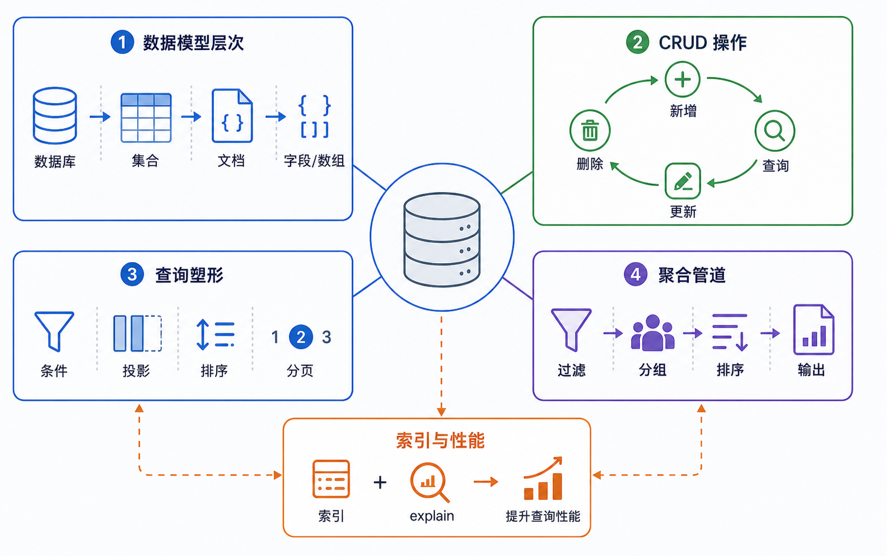

> MongoDB 是一款强大、灵活、易于扩展的通用型数据库，采用文档存储模式。



## MongoDB 特点

| 特性 | 说明 |
|------|------|
| **易用性** | 文档模型灵活，无需预定义模式 |
| **易扩展** | 横向扩展能力强，自动处理数据分割 |
| **高性能** | 尽可能使用内存作为缓存 |
| **功能丰富** | 支持索引、聚合、文件存储等 |

## 核心概念

### 文档

**文档是 MongoDB 的核心概念**，文档就是键值对的有序集。

```javascript
// 文档示例
{
    "name": "test",
    "age": 18,
    "tags": ["python", "mongodb"]
}
```

> **注意**：
> - 文档中的键/值对是有序的
> - 键是字符串，除少数情况外可使用任意 UTF-8 字符
> - MongoDB 区分类型和大小写
> - 文档不能有重复的键

### 集合

**集合就是一组文档**，相当于关系型数据库的表。

```javascript
// 插入文档时自动创建集合
db.blog.posts.insertOne({
    "title": "MongoDB 入门",
    "author": "张三"
})
```

### 数据库

**多个文档组成集合，多个集合组成数据库**。

```javascript
// 切换数据库
use mydb

// 查看所有数据库
show dbs
```

### 特殊数据库

| 数据库 | 作用 |
|--------|------|
| **admin** | root 数据库，拥有所有权限 |
| **local** | 本地集合，不可复制 |
| **config** | 分片设置信息 |

## 基本操作

### 插入

```javascript
// 插入单条
db.posts.insertOne({
    "title": "MongoDB 入门",
    "author": "张三",
    "content": "内容...",
    "tags": ["数据库", "MongoDB"],
    "views": 100
})

// 插入多条
db.posts.insertMany([
    {"title": "文章1", "author": "李四"},
    {"title": "文章2", "author": "王五"}
])
```

### 查询

```javascript
// 查询所有
db.posts.find()

// 条件查询
db.posts.find({"author": "张三"})

// 查询一条
db.posts.findOne({"author": "张三"})

// 比较运算符
db.posts.find({"views": {"$gt": 100}})  // views > 100
db.posts.find({"views": {"$gte": 100}})  // views >= 100
db.posts.find({"views": {"$lt": 100}})  // views < 100
db.posts.find({"views": {"$lte": 100}}) // views <= 100

// 逻辑运算符
db.posts.find({"$and": [{"views": {"$gt": 50}}, {"author": "张三"}]})
db.posts.find({"$or": [{"author": "张三"}, {"author": "李四"}]})

// 正则查询
db.posts.find({"title": /MongoDB/})

// 字段选择
db.posts.find({}, {"title": 1, "author": 1, "_id": 0})

// 分页
db.posts.find().skip(10).limit(10)

// 排序
db.posts.find().sort({"views": -1})  // 降序
db.posts.find().sort({"views": 1})   // 升序
```

### 更新

```javascript
// 更新单条
db.posts.updateOne(
    {"title": "MongoDB 入门"},
    {"$set": {"views": 200}}
)

// 更新多条
db.posts.updateMany(
    {"author": "张三"},
    {"$set": {"author": "李四"}}
)

// $inc 递增
db.posts.updateOne(
    {"title": "MongoDB 入门"},
    {"$inc": {"views": 1}}
)

// $push 添加到数组
db.posts.updateOne(
    {"title": "MongoDB 入门"},
    {"$push": {"tags": "数据库"}}
)
```

### 删除

```javascript
// 删除单条
db.posts.deleteOne({"title": "文章1"})

// 删除多条
db.posts.deleteMany({"author": "李四"})

// 删除集合
db.posts.drop()

// 删除数据库
db.dropDatabase()
```

## 聚合操作

```javascript
// 统计数量
db.posts.countDocuments({"author": "张三"})

// 分组统计
db.posts.aggregate([
    {"$group": {
        "_id": "$author",
        "count": {"$sum": 1},
        "total_views": {"$sum": "$views"}
    }}
])

// 排序
db.posts.aggregate([
    {"$group": {
        "_id": "$author",
        "count": {"$sum": 1}
    }},
    {"$sort": {"count": -1}}
])
```

## 索引操作

```javascript
// 创建索引
db.posts.createIndex({"title": 1})  // 升序
db.posts.createIndex({"author": 1, "views": -1})  // 复合索引

// 查看索引
db.posts.getIndexes()

// 删除索引
db.posts.dropIndex("title_1")
```

## 聚合管道进阶

### 常用管道操作符

```javascript
// $match - 筛选阶段
db.orders.aggregate([
    { $match: { status: "completed", amount: { $gt: 100 } } }
])

// $group - 分组阶段
db.sales.aggregate([
    { $group: {
        _id: "$product",
        total_amount: { $sum: "$amount" },
        count: { $sum: 1 },
        avg_price: { $avg: "$price" }
    }}
])

// $sort - 排序阶段
db.articles.aggregate([
    { $group: { _id: "$author", count: { $sum: 1 } } },
    { $sort: { count: -1 } }  // 降序
])

// $limit - 限制数量
db.articles.aggregate([
    { $sort: { views: -1 } },
    { $limit: 10 }  // 前10篇
])

// $skip - 跳过数量（分页）
db.articles.aggregate([
    { $skip: 20 },  // 跳过前20条
    { $limit: 10 }  // 返回10条
])
```

### 复杂聚合示例

```javascript
// 完整统计示例
db.orders.aggregate([
    // 第一阶段：筛选已支付订单
    { $match: { status: "paid" } },
    
    // 第二阶段：按月份和产品分组
    { $group: {
        _id: {
            month: { $substr: ["$date", 0, 7] },
            product: "$product"
        },
        total_amount: { $sum: "$amount" },
        count: { $sum: 1 },
        max_amount: { $max: "$amount" },
        min_amount: { $min: "$amount" },
        avg_amount: { $avg: "$amount" }
    }},
    
    // 第三阶段：计算利润率
    { $project: {
        _id: 0,
        month: "$_id.month",
        product: "$_id.product",
        total_amount: 1,
        count: 1,
        max_amount: 1,
        min_amount: 1,
        avg_amount: { $round: ["$avg_amount", 2] }
    }},
    
    // 第四阶段：排序
    { $sort: { total_amount: -1 } },
    
    // 第五阶段：限制结果
    { $limit: 20 }
])
```

### 数组操作

```javascript
// $push - 添加到数组
db.students.updateOne(
    { _id: 1 },
    { $push: { scores: 95 } }
)

// $push + $each - 批量添加
db.students.updateOne(
    { _id: 1 },
    { $push: { scores: { $each: [90, 85, 88] } } }
)

// $addToSet - 不重复添加
db.students.updateOne(
    { _id: 1 },
    { $addToSet: { courses: "Python" } }
)

// $pull - 删除数组元素
db.students.updateOne(
    { _id: 1 },
    { $pull: { scores: { $lt: 60 } } }  // 删除小于60分的成绩
)

// $pop - 删除数组首尾元素
db.students.updateOne(
    { _id: 1 },
    { $pop: { scores: 1 } }  // 1删除末尾，-1删除开头
)

// $size - 数组长度
db.students.aggregate([
    { $project: {
        name: 1,
        score_count: { $size: "$scores" }
    }}
])

// $filter - 过滤数组
db.students.aggregate([
    { $project: {
        name: 1,
        passing_scores: {
            $filter: {
                input: "$scores",
                as: "score",
                cond: { $gte: ["$$score", 60] }
            }
        }
    }}
])
```

### 条件运算符进阶

```javascript
// $cond - 条件表达式
db.sales.aggregate([
    { $project: {
        product: 1,
        amount: 1,
        discount: {
            $cond: [
                { $gte: ["$amount", 1000] },
                { $multiply: ["$amount", 0.1] },  // 1000以上打9折
                { $multiply: ["$amount", 0.05] }   // 其他打95折
            ]
        }
    }}
])

// $ifNull - 空值处理
db.items.aggregate([
    { $project: {
        name: 1,
        description: { $ifNull: ["$description", "暂无描述"] }
    }}
])

// $switch - 多条件分支
db.products.aggregate([
    { $project: {
        name: 1,
        price: 1,
        category: {
            $switch: {
                branches: [
                    { case: { $gte: ["$price", 1000] }, then: "高端" },
                    { case: { $gte: ["$price", 500] }, then: "中端" }
                ],
                default: "入门"
            }
        }
    }}
])
```

## Python 操作 MongoDB

```python
from pymongo import MongoClient

# 连接数据库
client = MongoClient('mongodb://localhost:27017/')
db = client['mydb']
collection = db['posts']

# 插入
collection.insert_one({"title": "MongoDB", "author": "张三"})

# 查询
result = collection.find_one({"author": "张三"})
results = collection.find({"views": {"$gt": 100}})

# 更新
collection.update_one(
    {"title": "MongoDB"},
    {"$set": {"views": 200}}
)

# 删除
collection.delete_one({"title": "MongoDB"})
```

## 小结

- **文档**：MongoDB 的基本数据单元，类似 JSON
- **集合**：文档的集合，相当于表
- **数据库**：集合的容器
- **CRUD**：insert、find、update、delete
- **聚合管道**：多阶段数据处理，支持复杂统计分析
- **数组操作**：$push、$pull、$filter 等数组操作符
- **条件表达式**：$cond、$ifNull、$switch 处理复杂逻辑
- **索引**：提升查询性能
