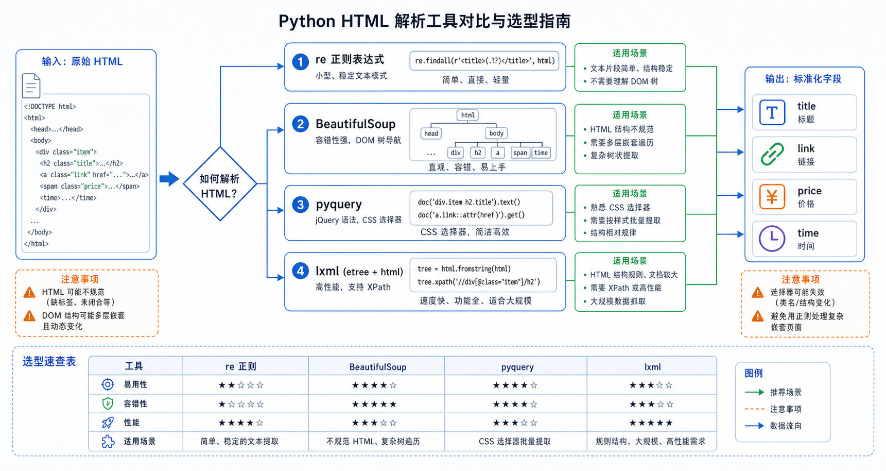

> 在爬虫程序中，获取到网页源代码后，需要从海量 HTML 代码中提取出有用的数据。常用的解析库有三种：re、BeautifulSoup、pyquery。



## 正则表达式 re

### 简介

**正则表达式**是用于匹配字符串的强大工具，可以检查、提取、替换字符串中的特定模式。

> re 是 Python 的内置模块，无需安装。

### 基本语法

#### 元字符

| 元字符 | 说明 | 示例 |
|--------|------|------|
| `.` | 匹配任意字符 | `a.c` 匹配 "abc" |
| `\d` | 匹配数字 | `\d+` 匹配 "123" |
| `\w` | 匹配字母、数字、下划线 | `\w+` 匹配 "hello_123" |
| `\s` | 匹配空白字符 | `a\sb` 匹配 "a b" |
| `^` | 匹配字符串开头 | `^hello` 匹配 "hello world" |
| `$` | 匹配字符串结尾 | `world$` 匹配 "hello world" |
| `[]` | 匹配字符集合 | `[aeiou]` 匹配元音字母 |
| `()` | 分组 | `(\d+)-(\d+)` 提取组 |

#### 数量词

| 数量词 | 说明 | 示例 |
|--------|------|------|
| `*` | 0次或多次 | `a*` 匹配 ""、"a"、"aaa" |
| `+` | 1次或多次 | `a+` 匹配 "a"、"aaa" |
| `?` | 0次或1次 | `https?` 匹配 "http"、"https" |
| `{n}` | 恰好n次 | `\d{11}` 匹配11位数字 |
| `{n,m}` | n到m次 | `\d{3,4}` 匹配3-4位数字 |

### 常用方法

```python
import re

text = "张三的电话是13800138000，李的是13900139000"

# match: 从开头匹配
result = re.match(r"张三", text)
print(result.group())  # 张三

# search: 搜索第一个匹配
result = re.search(r"\d{11}", text)
print(result.group())  # 13800138000

# findall: 找出所有匹配
results = re.findall(r"\d{11}", text)
print(results)  # ['13800138000', '13900139000']

# sub: 替换
result = re.sub(r"\d{11}", "****", text)
print(result)  # 张三的电话是****，李的是****

# split: 分割
result = re.split(r"[，,]", "苹果,香蕉,葡萄")
print(result)  # ['苹果', '香蕉', '葡萄']
```

### 贪婪与非贪婪

```python
import re

html = "<div>hello</div><div>world</div>"

# 贪婪匹配
result = re.findall(r"<div>.*</div>", html)
print(result)  # ['<div>hello</div><div>world</div>']

# 非贪婪匹配（推荐）
result = re.findall(r"<div>.*?</div>", html)
print(result)  # ['<div>hello</div>', '<div>world</div>']
```

### 分组提取

```python
import re

text = "邮箱是 test@example.com，电话是 010-12345678"

# 提取邮箱和电话号码
pattern = r"(\w+)@(\w+\.\w+)|(\d{3})-(\d{8})"
matches = re.findall(pattern, text)
print(matches)
```

## BeautifulSoup

### 简介

**BeautifulSoup** 是一个 Python 库，用于从 HTML 和 XML 文件中提取数据。提供简单的方法来导航、搜索和修改解析树。

### 安装

```bash
pip install beautifulsoup4 lxml
```

### 基本使用

```python
from bs4 import BeautifulSoup

html = """
<html>
<head><title>测试</title></head>
<body>
    <div class="content">
        <h1>标题</h1>
        <p class="text">段落内容</p>
        <a href="http://example.com">链接</a>
    </div>
</body>
</html>
"""

soup = BeautifulSoup(html, 'lxml')

# 格式化输出
print(soup.prettify())

# 获取标题
title = soup.title.string
print(title)  # 测试

# 获取文本
text = soup.get_text()
print(text)
```

### 选择器

#### CSS 选择器

```python
from bs4 import BeautifulSoup

html = """
<div class="container">
    <div class="item" id="first">第一项</div>
    <div class="item">第二项</div>
    <div class="item">第三项</div>
</div>
"""

soup = BeautifulSoup(html, 'lxml')

# class 选择器
items = soup.select('.item')
for item in items:
    print(item.string)

# id 选择器
first_item = soup.select_one('#first')
print(first_item.string)  # 第一项

# 层级选择器
container = soup.select_one('.container')
inner_items = container.select('.item')
```

#### find/find_all 方法

```python
from bs4 import BeautifulSoup

html = """
<ul>
    <li class="fruit apple">苹果</li>
    <li class="fruit banana">香蕉</li>
    <li class="fruit orange">橙子</li>
</ul>
"""

soup = BeautifulSoup(html, 'lxml')

# find_all: 查找所有
all_li = soup.find_all('li')
print([li.string for li in all_li])

# find: 查找第一个
first_li = soup.find('li')
print(first_li.string)

# 按属性查找
apple = soup.find('li', class_='apple')
print(apple.string)  # 苹果

# 按 id 查找
item = soup.find('li', id='apple')
```

### 获取属性和文本

```python
from bs4 import BeautifulSoup

html = '<a href="http://example.com" title="示例链接">点击这里</a>'
soup = BeautifulSoup(html, 'lxml')

a_tag = soup.find('a')

# 获取属性
href = a_tag['href']
print(href)  # http://example.com

title = a_tag.get('title')
print(title)  # 示例链接

# 获取文本
text = a_tag.string
print(text)  # 点击这里

text2 = a_tag.get_text()
print(text2)  # 点击这里
```

## pyquery

### 简介

**pyquery** 让你使用 jQuery 语法来操作 HTML，操作简单方便。

### 安装

```bash
pip install pyquery
```

### 基本使用

```python
from pyquery import PyQuery as pq

html = """
<div class="container">
    <ul id="list">
        <li class="item">项目1</li>
        <li class="item">项目2</li>
        <li class="item active">项目3</li>
    </ul>
</div>
"""

doc = pq(html)

# 获取元素
items = doc('.item')
print(items.text())

# 获取文本
first_item = doc('.item').eq(0)
print(first_item.text())

# 获取属性
link = doc('#list')
print(link.attr('id'))
```

### jQuery 语法示例

```python
from pyquery import PyQuery as pq

html = """
<div class="wrapper">
    <div class="content">
        <h1 id="title">标题</h1>
        <p class="intro">介绍文字</p>
    </div>
</div>
"""

doc = pq(html)

# 获取文本
title = doc('#title').text()
print(title)  # 标题

intro = doc('.intro').text()
print(intro)  # 介绍文字

# 获取属性
content_div = doc('.content')
print(content_div.attr('class'))

# 遍历元素
items = doc('.item')
for item in items.items():
    print(item.text())
```

## lxml 高速解析库

### 简介

**lxml** 是 Python 中速度最快的 XML 和 HTML 解析库，基于 C 语言实现，性能远超 BeautifulSoup。

### 安装

```bash
pip install lxml
```

### 基本使用

```python
from lxml import etree

html = """
<html>
<head><title>测试</title></head>
<body>
    <div class="container">
        <h1 class="title">标题</h1>
        <a href="https://example.com">链接</a>
    </div>
</body>
</html>
"""

# 解析 HTML
tree = etree.HTML(html)

# 获取标题
title = tree.xpath('//h1[@class="title"]/text()')[0]
print(title)  # 标题

# 获取所有链接
links = tree.xpath('//a/@href')
print(links)  # ['https://example.com']

# 获取 div 内容
content = tree.xpath('//div[@class="container"]')[0]
print(etree.tostring(content, encoding='unicode'))
```

### HTML 解析

```python
from lxml import html
from lxml import etree

html_string = """
<div class="product">
    <h2 class="name">产品名称</h2>
    <span class="price">99.9</span>
    <ul class="tags">
        <li>电子产品</li>
        <li>热销</li>
    </ul>
</div>
"""

tree = html.fromstring(html_string)

# 使用 CSS 选择器
name = tree.cssselect('.name')[0].text
price = tree.cssselect('.price')[0].text
tags = [li.text for li in tree.cssselect('.tags li')]

print(f"产品: {name}, 价格: {price}, 标签: {tags}")
```

### XML 解析

```python
from lxml import etree

xml_string = """
<?xml version="1.0"?>
<catalog>
    <book id="1">
        <title>Python编程</title>
        <author>张三</author>
        <price>99.00</price>
    </book>
    <book id="2">
        <title>数据结构</title>
        <author>李四</author>
        <price>88.00</price>
    </book>
</catalog>
"""

tree = etree.fromstring(xml_string)

# 获取所有书籍
books = tree.xpath('//book')
for book in books:
    title = book.xpath('./title/text()')[0]
    author = book.xpath('./author/text()')[0]
    price = book.xpath('./price/text()')[0]
    book_id = book.get('id')
    print(f"ID: {book_id}, 书名: {title}, 作者: {author}, 价格: {price}")
```

## XPath 高级定位

### XPath 基础语法

| 表达式 | 说明 | 示例 |
|--------|------|------|
| `/` | 根节点 | `/html` |
| `//` | 任意位置 | `//div` |
| `.` | 当前节点 | `.//span` |
| `..` | 父节点 | `../..` |
| `@` | 属性 | `//div[@class="name"]` |
| `[]` | 条件 | `//li[3]` |
| `text()` | 文本内容 | `//h1/text()` |

### 常用 XPath 示例

```python
from lxml import html

html_string = """
<div class="container">
    <div class="item" id="item1">
        <h2>标题1</h2>
        <p class="desc">描述1</p>
        <span class="price">99</span>
    </div>
    <div class="item" id="item2">
        <h2>标题2</h2>
        <p class="desc">描述2</p>
        <span class="price">199</span>
    </div>
</div>
"""

tree = html.fromstring(html_string)

# 选择所有 item
items = tree.xpath('//div[@class="item"]')

# 选择第一个 item
first_item = tree.xpath('//div[@class="item"][1]')

# 选择包含特定文本的元素
element = tree.xpath('//*[contains(text(), "标题1")]')

# 选择属性值
price = tree.xpath('//div[@id="item1"]/span[@class="price"]/text()')[0]
print(f"价格: {price}")  # 99

# 选择多个条件
items = tree.xpath('//div[@class="item" and @id]')

# 位置选择
third_item = tree.xpath('//div[@class="item"][position()=3]')

# 轴选择
sibling = tree.xpath('//h2[text()="标题1"]/following-sibling::p/text()')[0]
print(f"兄弟元素: {sibling}")  # 描述1
```

### XPath 函数

```python
from lxml import html

html_string = """
<div class="products">
    <p class="name">苹果 Apple</p>
    <p class="name">香蕉 BANANA</p>
    <p class="price">99.5</p>
    <p class="price">199.8</p>
</div>
"""

tree = html.fromstring(html_string)

# contains() - 包含
names = tree.xpath('//p[contains(@class, "name")]/text()')
print(names)  # ['苹果 Apple', '香蕉 BANANA']

# starts-with() - 开头
names = tree.xpath('//p[starts-with(@class, "name")]/text()')
print(names)  # ['苹果 Apple', '香蕉 BANANA']

# normalize-space() - 去除空格
text = tree.xpath('//p[@class="name"]/normalize-space(text())')

# string-length() - 字符串长度
long_names = tree.xpath('//p[string-length(text()) > 5]/text()')
print(long_names)  # ['苹果 Apple', '香蕉 BANANA']

# position() - 位置
first_two = tree.xpath('//p[@class="price"][position() <= 2]/text()')
print(first_two)  # ['99.5', '199.8']
```

### 提取复杂数据

```python
from lxml import html

html_string = """
<table class="data">
    <tr>
        <th>姓名</th>
        <th>年龄</th>
        <th>职业</th>
    </tr>
    <tr>
        <td>张三</td>
        <td>25</td>
        <td>工程师</td>
    </tr>
    <tr>
        <td>李四</td>
        <td>30</td>
        <td>设计师</td>
    </tr>
</table>
"""

tree = html.fromstring(html_string)

# 提取表格数据
rows = tree.xpath('//table[@class="data"]//tr')

data = []
headers = rows[0].xpath('th/text()')  # ['姓名', '年龄', '职业']

for row in rows[1:]:  # 跳过表头
    cells = row.xpath('td/text()')
    person = dict(zip(headers, cells))
    data.append(person)

print(data)
# [{'姓名': '张三', '年龄': '25', '职业': '工程师'},
#  {'姓名': '李四', '年龄': '30', '职业': '设计师'}]
```

## 中文编码处理

### 常见编码问题

```python
from bs4 import BeautifulSoup

# 乱码示例
html = '<html><body><p>中文内容</p></body></html>'

# 正确的编码处理
soup = BeautifulSoup(html, 'lxml', from_encoding='utf-8')
print(soup.get_text())  # 中文内容

# 自动检测编码
import chardet

response = requests.get('https://example.com')
encoding = chardet.detect(response.content)['encoding']
print(f"检测到的编码: {encoding}")

soup = BeautifulSoup(response.content, 'lxml', from_encoding=encoding)
```

### 编码转换

```python
# 字节转字符串
byte_string = b'\xe4\xb8\xad\xe6\x96\x87'
text = byte_string.decode('utf-8')
print(text)  # 中文

# 字符串转字节
text = '中文'
byte_string = text.encode('utf-8')

# 编码转换
gbk_text = text.encode('gbk')
utf8_text = gbk_text.decode('gbk').encode('utf-8')
```

## 解析库对比

| 特性 | re | BeautifulSoup | pyquery | lxml |
|------|-----|---------------|---------|------|
| 学习难度 | 中等 | 简单 | 简单 | 中等 |
| 速度 | 快 | 较慢 | 较慢 | 最快 |
| 功能 | 字符串匹配 | DOM 操作 | jQuery 语法 | XPath+CSS |
| 适用场景 | 结构化文本 | HTML/XML | HTML | HTML/XML |

> **建议**：先学习 re 基础，再学习 BeautifulSoup，最后根据需要学习 pyquery 和 lxml。

## 小结

- **re**：正则表达式，适合精确匹配
- **BeautifulSoup**：DOM 解析，适合复杂 HTML 结构
- **pyquery**：jQuery 语法，适合前端开发者
- **lxml**：高速解析库，基于 XPath 和 CSS 选择器，性能最佳
- **XPath**：强大的节点定位语言，支持复杂条件查询
- **编码处理**：使用 chardet 自动检测编码，解决中文乱码问题
