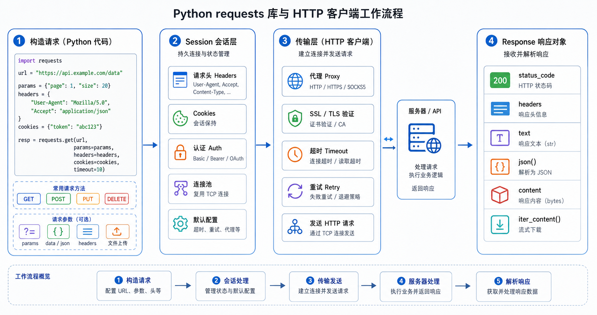

> requests 是 Python 中最流行的 HTTP 库，简洁易用的 API 使其成为网络请求的首选工具。



## 基本用法

### GET 请求

```python
import requests

# 简单 GET
response = requests.get("https://api.example.com/users")
print(response.status_code)
print(response.text)
```

```python
# 带参数
params = {"page": 1, "limit": 10}
response = requests.get("https://api.example.com/users", params=params)
```

```python
# 带请求头
headers = {"Authorization": "Bearer token123"}
response = requests.get(url, headers=headers)
```

### POST 请求

```python
# 表单数据
data = {"username": "user", "password": "pass"}
response = requests.post(url, data=data)
```

```python
# JSON 数据
import json
payload = {"name": "Alice", "email": "alice@example.com"}
response = requests.post(url, json=payload)
```

```python
# 文件上传
files = {"file": open("document.pdf", "rb")}
response = requests.post(url, files=files)
```

## 响应对象

### 常用属性

```python
response = requests.get(url)

response.status_code   # 状态码
response.text         # 响应文本
response.content      # 字节内容
response.json()       # JSON 解析
response.headers      # 响应头
response.cookies      # 响应 cookies
response.url          # 最终 URL
response.elapsed      # 请求耗时
```

### 状态码处理

```python
from requests import HTTPError

response = requests.get(url)

if response.status_code == 200:
    data = response.json()
elif response.status_code == 404:
    print("资源不存在")
elif response.status_code >= 400:
    raise HTTPError(f"请求失败: {response.status_code}")
```

## 高级用法

### 会话维持

```python
session = requests.Session()

# 会自动维护 cookies
session.headers.update({"User-Agent": "Mozilla/5.0"})

# 登录
session.post(login_url, data={"username": "user", "password": "pass"})

# 登录后请求
response = session.get(member_url)
```

### 重试机制

```python
from requests.adapters import HTTPAdapter
from urllib3.util.retry import Retry

def create_session():
    session = requests.Session()
    retry = Retry(
        total=3,
        backoff_factor=0.5,
        status_forcelist=[500, 502, 503, 504]
    )
    adapter = HTTPAdapter(max_retries=retry)
    session.mount("http://", adapter)
    session.mount("https://", adapter)
    return session
```

### 超时设置

```python
# 单次请求超时
response = requests.get(url, timeout=5)

# 连接超时和读取超时分开
response = requests.get(url, timeout=(3, 10))
```

### 代理设置

```python
proxies = {
    "http": "http://127.0.0.1:7890",
    "https": "http://127.0.0.1:7890"
}
response = requests.get(url, proxies=proxies)
```

### SSL 证书

```python
# 忽略证书验证（不推荐）
response = requests.get(url, verify=False)

# 指定证书
response = requests.get(url, verify="/path/to/cert.pem")
```

## 实战技巧

### 下载文件

```python
import requests

def download_file(url, save_path):
    response = requests.get(url, stream=True)
    with open(save_path, "wb") as f:
        for chunk in response.iter_content(chunk_size=8192):
            if chunk:
                f.write(chunk)
```

### 流式请求

```python
response = requests.get(url, stream=True)
for line in response.iter_lines():
    if line:
        print(line.decode("utf-8"))
```

### 并发请求

```python
import concurrent.futures
from requests import Session

def fetch(session, url):
    with session.get(url) as response:
        return response.json()

with Session() as session:
    with concurrent.futures.ThreadPoolExecutor(max_workers=10) as executor:
        urls = ["http://example.com/api/1" for _ in range(100)]
        results = list(executor.map(lambda url: fetch(session, url), urls))
```

## 异步请求：aiohttp 基础

### 安装

```bash
pip install aiohttp
```

### 基本使用

```python
import aiohttp
import asyncio

async def fetch(url):
    async with aiohttp.ClientSession() as session:
        async with session.get(url) as response:
            return await response.text()

async def main():
    html = await fetch('https://example.com')
    print(html)

asyncio.run(main())
```

### 并发请求

```python
import aiohttp
import asyncio

async def fetch(session, url):
    async with session.get(url) as response:
        return await response.json()

async def main():
    urls = ['https://api.example.com/1', 'https://api.example.com/2']
    
    async with aiohttp.ClientSession() as session:
        tasks = [fetch(session, url) for url in urls]
        results = await asyncio.gather(*tasks)
        print(results)

asyncio.run(main())
```

### 异步 POST 请求

```python
import aiohttp
import asyncio

async def post_data(url, data):
    async with aiohttp.ClientSession() as session:
        # JSON 数据
        async with session.post(url, json=data) as response:
            return await response.json()

async def main():
    result = await post_data(
        'https://api.example.com/create',
        {'title': 'Python爬虫', 'content': '内容'}
    )
    print(result)

asyncio.run(main())
```

### 异步会话管理

```python
import aiohttp
import asyncio

async def main():
    # 创建会话
    connector = aiohttp.TCPConnector(limit=100)  # 连接数限制
    timeout = aiohttp.ClientTimeout(total=30)
    
    async with aiohttp.ClientSession(
        connector=connector,
        timeout=timeout,
        headers={'User-Agent': 'Mozilla/5.0'}
    ) as session:
        # 保持会话的 cookies
        async with session.get('https://example.com/login') as response:
            await response.text()
        
        # 后续请求保持登录状态
        async with session.get('https://example.com/profile') as response:
            data = await response.json()
            print(data)

asyncio.run(main())
```

### 并发控制

```python
import aiohttp
import asyncio

async def fetch_with_limit(semaphore, session, url):
    """带并发限制的请求"""
    async with semaphore:
        async with session.get(url) as response:
            return await response.json()

async def main():
    semaphore = asyncio.Semaphore(10)  # 限制同时10个请求
    
    async with aiohttp.ClientSession() as session:
        urls = [f'https://api.example.com/{i}' for i in range(100)]
        tasks = [fetch_with_limit(semaphore, session, url) for url in urls]
        results = await asyncio.gather(*tasks)
        print(f"成功: {len([r for r in results if r])}")

asyncio.run(main())
```

### 异常处理

```python
import aiohttp
import asyncio

async def safe_fetch(session, url):
    """安全的异步请求"""
    try:
        async with session.get(url, timeout=aiohttp.ClientTimeout(total=10)) as response:
            if response.status == 200:
                return await response.json()
            else:
                print(f"HTTP {response.status}: {url}")
                return None
    except asyncio.TimeoutError:
        print(f"超时: {url}")
    except aiohttp.ClientError as e:
        print(f"客户端错误: {e}")
    except Exception as e:
        print(f"其他错误: {e}")
    return None

async def main():
    async with aiohttp.ClientSession() as session:
        urls = ['https://example.com/1', 'https://example.com/2']
        tasks = [safe_fetch(session, url) for url in urls]
        results = await asyncio.gather(*tasks)
        print(f"成功: {len([r for r in results if r])}")

asyncio.run(main())
```

### requests vs aiohttp 对比

| 特性 | requests | aiohttp |
|------|----------|---------|
| **类型** | 同步 | 异步 |
| **性能** | 一般 | 高 |
| **并发** | 多线程 | 原生异步 |
| **学习曲线** | 简单 | 中等 |
| **适用场景** | 小规模爬虫 | 大规模爬虫 |

## 小结

- **GET/POST**：基本请求方法
- **会话**：Session 维持 cookies
- **重试**：HTTPAdapter 配置
- **超时**：避免长时间等待
- **代理**：突破访问限制
