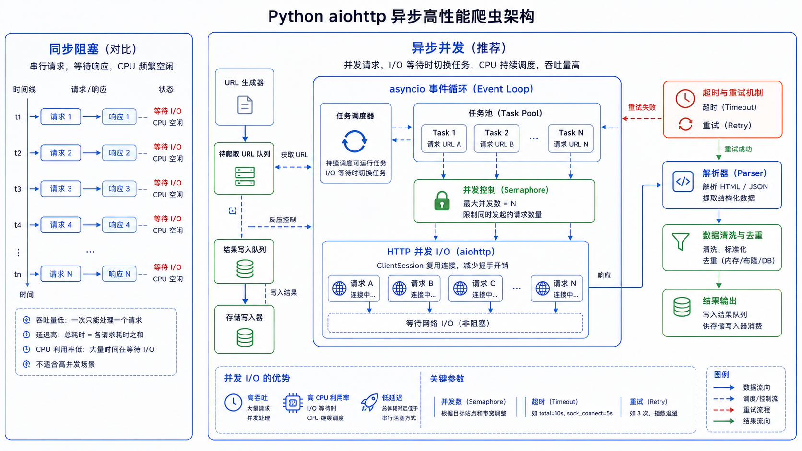

> 同步爬虫效率低下，使用异步编程可以大幅提升爬取效率。



## 性能对比

| 方式 | 1000个页面 | 耗时 |
|------|-----------|------|
| 同步爬取 | 1秒/页面 | 约17分钟 |
| 异步爬取 | 100并发 | 约10秒 |

## 同步 vs 异步

### 同步爬虫

```python
import requests
import time

def sync_crawl(urls):
    """同步爬取"""
    start_time = time.time()

    for url in urls:
        response = requests.get(url)
        print(f"爬取完成: {url}, 状态码: {response.status_code}")

    end_time = time.time()
    print(f"总耗时: {end_time - start_time:.2f} 秒")
```

### 异步爬虫

```python
import asyncio
import aiohttp
import time

async def async_crawl(urls):
    """异步爬取"""
    start_time = time.time()

    async with aiohttp.ClientSession() as session:
        tasks = [crawl_one(session, url) for url in urls]
        await asyncio.gather(*tasks)

    end_time = time.time()
    print(f"总耗时: {end_time - start_time:.2f} 秒")

async def crawl_one(session, url):
    """爬取单个页面"""
    async with session.get(url) as response:
        print(f"爬取完成: {url}, 状态码: {response.status}")

# 运行
urls = ['https://example.com/page/1', 'https://example.com/page/2']
asyncio.run(async_crawl(urls))
```

## asyncio 基础

### 核心概念

| 概念 | 说明 |
|------|------|
| **协程** | 可暂停和恢复执行的函数 |
| **事件循环** | 调度和执行协程的核心 |
| **async/await** | 定义异步函数和等待协程 |

### 基本语法

```python
import asyncio

async def my_coroutine():
    """协程函数"""
    print("开始执行")
    await asyncio.sleep(1)  # 暂停1秒
    print("执行完成")

# 运行协程
asyncio.run(my_coroutine())

# 并发执行多个任务
async def task1():
    print("Task 1 开始")
    await asyncio.sleep(2)
    print("Task 1 完成")

async def task2():
    print("Task 2 开始")
    await asyncio.sleep(1)
    print("Task 2 完成")

async def main():
    await asyncio.gather(task1(), task2())

asyncio.run(main())
```

## aiohttp 异步 HTTP

### 安装

```bash
pip install aiohttp
```

### 基本使用

```python
import asyncio
import aiohttp

async def fetch(session, url):
    """异步获取页面"""
    async with session.get(url) as response:
        return await response.text()

async def main():
    async with aiohttp.ClientSession() as session:
        html = await fetch(session, 'https://example.com')
        print(html[:100])

asyncio.run(main())
```

### 带参数请求

```python
import asyncio
import aiohttp

async def main():
    async with aiohttp.ClientSession() as session:
        # GET 请求
        params = {'wd': 'python', 'pn': 1}
        async with session.get('https://www.baidu.com/s', params=params) as response:
            print(await response.text())

        # POST 请求
        data = {'username': 'user', 'password': 'pass'}
        async with session.post('https://example.com/login', data=data) as response:
            print(await response.json())

        # 自定义请求头
        headers = {'User-Agent': 'Mozilla/5.0'}
        async with session.get('https://example.com', headers=headers) as response:
            print(await response.text())

asyncio.run(main())
```

### 异常处理

```python
import asyncio
import aiohttp

async def safe_fetch(session, url):
    """安全的异步获取"""
    try:
        async with session.get(url, timeout=aiohttp.ClientTimeout(total=10)) as response:
            if response.status == 200:
                return await response.text()
            else:
                print(f"HTTP {response.status}")
                return None
    except asyncio.TimeoutError:
        print(f"请求超时: {url}")
    except Exception as e:
        print(f"请求失败: {e}")
    return None
```

## 并发控制

### 限制并发数

```python
import asyncio
import aiohttp

async def fetch_with_limit(semaphore, session, url):
    """限制并发数"""
    async with semaphore:
        async with session.get(url) as response:
            return await response.text()

async def main():
    # 限制同时最多10个请求
    semaphore = asyncio.Semaphore(10)

    async with aiohttp.ClientSession() as session:
        tasks = [
            fetch_with_limit(semaphore, session, f'https://example.com/page/{i}')
            for i in range(100)
        ]
        results = await asyncio.gather(*tasks)
        print(f"成功爬取 {len([r for r in results if r])} 个页面")

asyncio.run(main())
```

### 异步队列

```python
import asyncio
import aiohttp

async def worker(queue, session):
    """工作协程"""
    while True:
        url = await queue.get()
        if url is None:
            break

        try:
            async with session.get(url) as response:
                print(f"爬取成功: {url}")
        except Exception as e:
            print(f"爬取失败: {url}: {e}")
        finally:
            queue.task_done()

async def main():
    queue = asyncio.Queue()
    urls = [f'https://example.com/page/{i}' for i in range(100)]

    # 添加 URL 到队列
    for url in urls:
        await queue.put(url)

    # 添加结束标记
    for _ in range(5):
        await queue.put(None)

    async with aiohttp.ClientSession() as session:
        workers = [asyncio.create_task(worker(queue, session)) for _ in range(5)]
        await queue.join()
        for w in workers:
            w.cancel()

asyncio.run(main())
```

## 多线程爬虫

### ThreadPoolExecutor

```python
import requests
from concurrent.futures import ThreadPoolExecutor
import time

def fetch(url):
    """同步获取"""
    response = requests.get(url)
    return response.status_code

def main():
    urls = [f'https://example.com/page/{i}' for i in range(100)]

    start_time = time.time()

    # 最多10个线程
    with ThreadPoolExecutor(max_workers=10) as executor:
        results = list(executor.map(fetch, urls))

    end_time = time.time()
    print(f"总耗时: {end_time - start_time:.2f} 秒")
    print(f"成功: {len([r for r in results if r == 200])}")

if __name__ == '__main__':
    main()
```

## 性能优化技巧

| 技巧 | 说明 |
|------|------|
| **并发请求** | 使用异步或多线程同时发送多个请求 |
| **连接复用** | 使用 session 复用 TCP 连接 |
| **请求合并** | 将多个小请求合并为批量请求 |
| **本地缓存** | 避免重复请求相同内容 |
| **分布式爬虫** | 多机器协同爬取 |

> **注意**：提高爬取速度的同时，也要注意遵守网站的爬虫协议，设置合理的访问频率，避免对目标网站造成负担。

## 异步数据解析

### 异步 BeautifulSoup

```python
import asyncio
import aiohttp
from bs4 import BeautifulSoup

async def fetch_and_parse(session, url):
    """异步获取并解析"""
    async with session.get(url) as response:
        html = await response.text()
        soup = BeautifulSoup(html, 'html.parser')
        return {
            'title': soup.find('h1').text if soup.find('h1') else '',
            'links': [a.get('href') for a in soup.find_all('a')],
            'images': [img.get('src') for img in soup.find_all('img')],
        }

async def main():
    async with aiohttp.ClientSession() as session:
        urls = [f'https://example.com/{i}' for i in range(10)]
        tasks = [fetch_and_parse(session, url) for url in urls]
        results = await asyncio.gather(*tasks)
        return results

asyncio.run(main())
```

### 异步正则解析

```python
import asyncio
import aiohttp
import re

async def fetch_with_regex(session, url):
    """异步获取并用正则解析"""
    async with session.get(url) as response:
        html = await response.text()
        
        titles = re.findall(r'<h1>(.*?)</h1>', html)
        emails = re.findall(r'[\w\.-]+@[\w\.-]+\.\w+', html)
        prices = re.findall(r'¥(\d+\.?\d*)', html)
        
        return {
            'titles': titles,
            'emails': emails,
            'prices': prices
        }

async def main():
    async with aiohttp.ClientSession() as session:
        tasks = [fetch_with_regex(session, f'https://example.com/{i}') for i in range(5)]
        results = await asyncio.gather(*tasks)
        return results
```

## 异步数据库操作

### aiomysql 异步 MySQL

```python
import asyncio
import aiomysql

async def save_to_mysql(pool, data):
    """异步保存到MySQL"""
    async with pool.acquire() as conn:
        async with conn.cursor() as cur:
            await cur.execute(
                "INSERT INTO items (title, url, price) VALUES (%s, %s, %s)",
                (data['title'], data['url'], data['price'])
            )
            await conn.commit()

async def main():
    pool = await aiomysql.create_pool(
        host='localhost',
        port=3306,
        user='root',
        password='',
        db='spider',
        minsize=5,
        maxsize=10
    )
    
    items = [
        {'title': 'Product 1', 'url': 'https://example.com/1', 'price': 99.9},
        {'title': 'Product 2', 'url': 'https://example.com/2', 'price': 199.9},
    ]
    
    tasks = [save_to_mysql(pool, item) for item in items]
    await asyncio.gather(*tasks)
    
    pool.close()
    await pool.wait_closed()

asyncio.run(main())
```

### aioredis 异步 Redis

```python
import asyncio
import aioredis

async def cache_data(redis, key, value):
    """异步缓存到Redis"""
    await redis.set(key, value, expire=3600)

async def get_cached(redis, key):
    """异步获取缓存"""
    return await redis.get(key)

async def main():
    redis = await aioredis.create_redis('redis://localhost:6379')
    
    await cache_data(redis, 'item:1', 'Product 1 data')
    result = await get_cached(redis, 'item:1')
    
    redis.close()
    await redis.wait_closed()

asyncio.run(main())
```

### 完整的异步爬虫存储示例

```python
import asyncio
import aiohttp
import aiomysql
from bs4 import BeautifulSoup

class AsyncSpiderWithDB:
    def __init__(self):
        self.pool = None
    
    async def init_db(self):
        """初始化数据库连接池"""
        self.pool = await aiomysql.create_pool(
            host='localhost',
            port=3306,
            user='root',
            password='',
            db='spider',
            minsize=5,
            maxsize=10
        )
    
    async def save_to_db(self, data):
        """保存数据到数据库"""
        async with self.pool.acquire() as conn:
            async with conn.cursor() as cur:
                await cur.execute(
                    "INSERT INTO articles (title, url, content) VALUES (%s, %s, %s)",
                    (data['title'], data['url'], data['content'])
                )
                await conn.commit()
    
    async def fetch_page(self, session, url):
        """爬取单个页面"""
        try:
            async with session.get(url, timeout=aiohttp.ClientTimeout(total=30)) as response:
                if response.status == 200:
                    html = await response.text()
                    soup = BeautifulSoup(html, 'html.parser')
                    return {
                        'title': soup.find('h1').text if soup.find('h1') else '',
                        'url': url,
                        'content': soup.get_text()[:500]
                    }
        except Exception as e:
            print(f"Error fetching {url}: {e}")
        return None
    
    async def crawl(self, urls):
        """主爬取函数"""
        await self.init_db()
        
        async with aiohttp.ClientSession() as session:
            tasks = [self.fetch_page(session, url) for url in urls]
            results = await asyncio.gather(*tasks)
            
            valid_results = [r for r in results if r]
            
            save_tasks = [self.save_to_db(item) for item in valid_results]
            await asyncio.gather(*save_tasks)
            
            print(f"成功爬取并保存 {len(valid_results)} 个页面")
        
        self.pool.close()
        await self.pool.wait_closed()

if __name__ == '__main__':
    spider = AsyncSpiderWithDB()
    urls = [f'https://example.com/{i}' for i in range(100)]
    asyncio.run(spider.crawl(urls))
```

## Scrapy-Redis 分布式爬虫

### 安装

```bash
pip install scrapy-redis
```

### 项目配置

```python
# settings.py

# 使用Redis调度器
SCHEDULER = "scrapy_redis.scheduler.Scheduler"

# 持久化请求，不清理Redis
SCHEDULER_PERSIST = True

# Redis连接配置
REDIS_URL = 'redis://localhost:6379/0'

# 使用Redis去重
DUPEFILTER_CLASS = "scrapy_redis.dupefilter.RFPDupeFilter"

# 开启去重
DUPEFILTER_CLASS = 'scrapy_redis.dupefilter.RFPDupeFilter'

# 优先级队列
SCHEDULER_QUEUE_CLASS = 'scrapy_redis.queue.SpiderPriorityQueue'

# 可选：Spider队列
# SCHEDULER_QUEUE_CLASS = 'scrapy_redis.queue.SpiderQueue'

# 开启暂停恢复
SCHEDULER_PERSIST = True
```

### Spider 示例

```python
import scrapy
from scrapy_redis.spiders import RedisSpider

class ProductSpider(RedisSpider):
    name = "product"
    allowed_domains = ["example.com"]
    
    # Redis KEY，存储起始URL
    redis_key = 'product:start_urls'
    
    def parse(self, response):
        for product in response.css('div.product'):
            yield {
                'title': product.css('h3::text').get(),
                'price': product.css('.price::text').get(),
                'url': response.url,
            }
        
        # 跟进分页
        next_page = response.css('a.next::attr(href)').get()
        if next_page:
            yield response.follow(next_page, callback=self.parse)
```

### 启动分布式爬虫

```bash
# 主节点
scrapy runspider product_spider.py

# 从节点（可以启动多个）
scrapy runspider product_spider.py

# 或者使用scrapyd部署
```

### Redis 命令管理

```bash
# 查看队列长度
redis-cli LLEN product:start_urls

# 添加起始URL
redis-cli LPUSH product:start_urls "https://example.com/category/1"

# 查看去重队列
redis-cli KEYS "*dupefilter*"

# 清空队列
redis-cli FLUSHDB
```

## 进阶实战案例

### 完整异步爬虫项目

```python
import asyncio
import aiohttp
import aiomysql
from bs4 import BeautifulSoup
from datetime import datetime
import logging

logging.basicConfig(level=logging.INFO)
logger = logging.getLogger(__name__)

class AsyncCrawler:
    def __init__(self, concurrency=10):
        self.concurrency = concurrency
        self.semaphore = asyncio.Semaphore(concurrency)
        self.stats = {'success': 0, 'error': 0}
    
    async def fetch(self, session, url):
        """带并发控制的异步获取"""
        async with self.semaphore:
            try:
                async with session.get(url, timeout=aiohttp.ClientTimeout(total=30)) as response:
                    if response.status == 200:
                        self.stats['success'] += 1
                        logger.info(f"✅ 成功: {url}")
                        return await response.text()
                    else:
                        self.stats['error'] += 1
                        logger.warning(f"⚠️ 状态码 {response.status}: {url}")
            except asyncio.TimeoutError:
                logger.error(f"⏱️ 超时: {url}")
            except Exception as e:
                logger.error(f"❌ 错误: {url} - {e}")
            return None
    
    async def parse(self, html):
        """解析HTML"""
        soup = BeautifulSoup(html, 'html.parser')
        items = []
        
        for item in soup.select('.article-item'):
            items.append({
                'title': item.select_one('h3').text.strip(),
                'url': item.select_one('a').get('href'),
                'price': item.select_one('.price').text.strip(),
                'crawled_at': datetime.now().isoformat()
            })
        
        return items
    
    async def save(self, pool, items):
        """保存到数据库"""
        async with pool.acquire() as conn:
            async with conn.cursor() as cur:
                for item in items:
                    try:
                        await cur.execute(
                            """INSERT INTO products (title, url, price, crawled_at) 
                               VALUES (%s, %s, %s, %s)""",
                            (item['title'], item['url'], item['price'], item['crawled_at'])
                        )
                    except Exception as e:
                        logger.error(f"保存失败: {e}")
                await conn.commit()
    
    async def crawl(self, urls):
        """主爬取流程"""
        connector = aiohttp.TCPConnector(limit=self.concurrency)
        
        async with aiohttp.ClientSession(connector=connector) as session:
            htmls = await asyncio.gather(*[self.fetch(session, url) for url in urls])
            
            all_items = []
            for html in htmls:
                if html:
                    items = await self.parse(html)
                    all_items.extend(items)
            
            logger.info(f"共解析 {len(all_items)} 个商品")
            return all_items

if __name__ == '__main__':
    crawler = AsyncCrawler(concurrency=20)
    urls = [f'https://example.com/products?page={i}' for i in range(1, 51)]
    
    asyncio.run(crawler.crawl(urls))
```

## 小结

- **asyncio**：Python 异步编程核心，配合 aiohttp 实现高效爬虫
- **并发控制**：使用 Semaphore 限制并发数，避免被封
- **多线程**：适用于 IO 密集型任务
- **性能优化**：连接复用、请求合并、本地缓存
- **异步解析**：BeautifulSoup、正则表达式在异步环境中的应用
- **异步数据库**：aiomysql、aioredis 实现高效数据持久化
- **分布式爬虫**：Scrapy-Redis 实现多节点协同爬取
- **生产环境**：监控、日志、异常处理缺一不可
