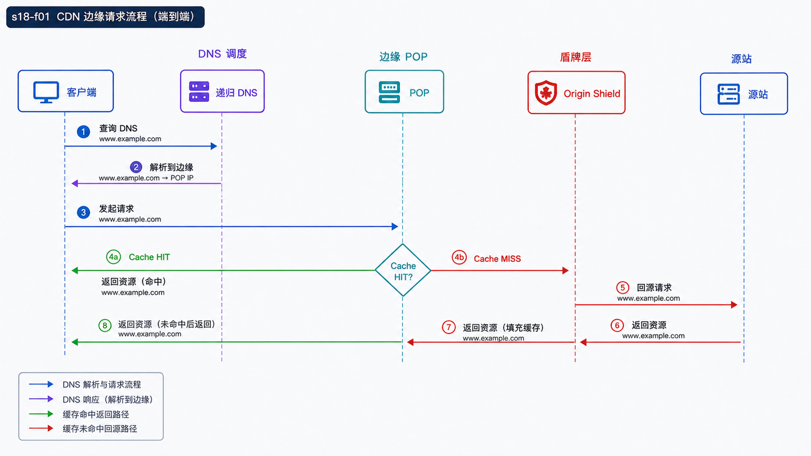
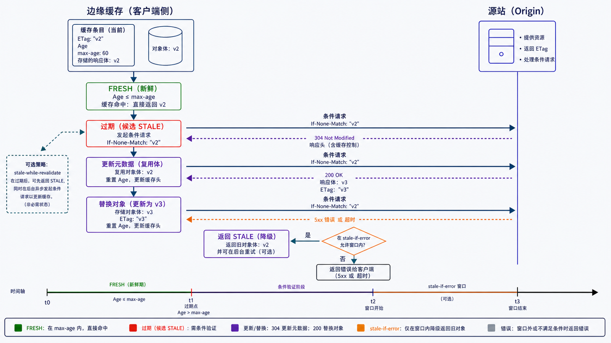

## 学习导航

**前置依赖**：DNS、HTTP 缓存、反向代理和 TLS。

**核心问题**：一次请求如何被调度到边缘节点，边缘又依据什么决定命中、验证、回源或拒绝？

## 场景与直觉

`www.example.com` 通过 DNS 或 Anycast 等机制把用户引向合适边缘。边缘终止连接并查找缓存键；命中可直接返回，过期可条件回源，未命中则请求源站并按响应策略缓存。

## 核心机制

<!-- network-figure:s18-f01:start -->



<!-- network-figure:s18-f01:end -->

```text
Client -> DNS/Anycast -> Edge POP -> Cache lookup
                                  | HIT -> response
                                  | STALE -> revalidate/serve stale
                                  | MISS -> Origin Shield -> Origin
```

缓存键至少受 URL 影响，也可能包含方法、Host、查询参数和 `Vary` 指定的请求字段。键过粗会串内容，过细会降低命中率。

## 状态与失败边界

<!-- network-figure:s18-f02:start -->



<!-- network-figure:s18-f02:end -->

`Cache-Control` 定义可缓存性、复用范围和新鲜度；ETag/Last-Modified 支持验证。`stale-while-revalidate` 可在后台验证时服务旧内容，`stale-if-error` 可在源站失败时有界降级。

缓存击穿发生在热门对象同时失效并并发回源时，可用请求合并、抖动 TTL、预热和 Origin Shield 缓解。缓存雪崩与源站过载必须通过限流、熔断和容量计划处理。

## 最小可复现实验

```bash
curl -I https://www.example.com/
curl -I -H 'Cache-Control: no-cache' https://www.example.com/
```

比较 `Age`、`Cache-Control`、`ETag`、`Via` 或厂商缓存状态字段。字段名称因 CDN 而异，不能把某一家实现当作标准协议。

## 常见误区与适用边界

- CDN 不只缓存静态文件，也可代理动态请求，但动态缓存必须严格定义键和私有数据边界。
- 清除缓存不是瞬时全球事务，应验证各区域状态。
- HTTPS 不阻止 CDN 缓存；CDN 只需在受信边界终止 TLS。
- 高命中率可能掩盖错误缓存，必须与正确性、回源量和尾延迟共同观察。

## 自检题

1. `Vary: Accept-Encoding` 为什么会影响缓存键？
2. 热点对象同时过期为什么会冲击源站？
3. 哪些响应不应进入共享缓存？

<details>
<summary>查看答案</summary>

1. 不同编码的表示不能混用。2. 大量边缘请求同时 MISS/验证并回源。3. 含用户私有数据、授权响应且无明确共享缓存许可的内容。

</details>

## 本篇总结

CDN 是 DNS/路由、代理、缓存、TLS 与源站保护的组合系统；性能收益必须受正确性和失效策略约束。

## 下一篇

下一篇转向浏览器安全边界，理解同源策略与 CORS。

## 资料来源与版本基线

- [RFC 9111: HTTP Caching](https://www.rfc-editor.org/rfc/rfc9111.html)
- [RFC 5861: HTTP Cache-Control Extensions for Stale Content](https://www.rfc-editor.org/rfc/rfc5861.html)
