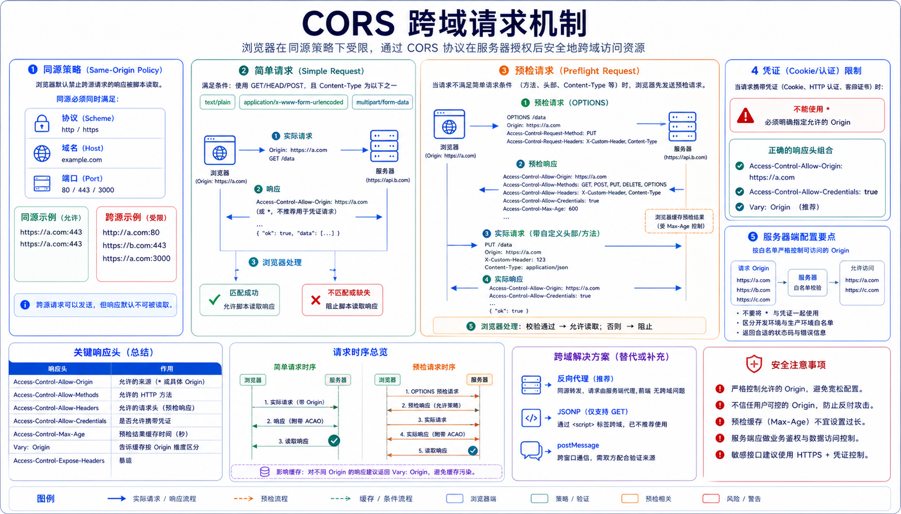

## 概述

CORS（Cross-Origin Resource Sharing）是 W3C 制定的跨域资源共享标准，通过 HTTP 头部允许浏览器跨域请求资源。



## 同源策略

### 什么是同源

同源需要同时满足以下三个条件：

| 条件 | 示例 |
|------|------|
| 协议相同 | `http://` 和 `https://` 不同 |
| 域名相同 | `example.com` 和 `api.example.com` 不同 |
| 端口相同 | `:80` 和 `:8080` 不同 |

```javascript
// 同源示例
http://example.com:80/page.html
http://example.com:80/api/data     ✓ 同源

// 跨域示例
https://example.com/page.html     ✗ 协议不同
http://api.example.com/page.html  ✗ 域名不同
http://example.com:8080/page.html ✗ 端口不同
```

### 限制范围

| 行为 | 是否限制 |
|------|----------|
| 跨域读取 Cookie | 受限制 |
| 跨域读取 DOM | 受限制 |
| 跨域发送请求 | 受限制（但可以发送） |
| 跨域获取响应 | 受限制 |

## 其他跨域方案

### JSONP

JSONP 利用 script 标签不受同源策略限制的特性实现跨域，虽然已逐渐被 CORS 取代，但在某些老旧系统中仍有使用：

```javascript
function jsonp(url, callback) {
    const callbackName = 'jsonp_callback_' + Date.now()

    window[callbackName] = (data) => {
        callback(data)
        delete window[callbackName]
    }

    const script = document.createElement('script')
    script.src = `${url}?callback=${callbackName}`
    document.body.appendChild(script)

    script.onload = () => script.remove()
}

jsonp('http://api.example.com/data', (data) => {
    console.log(data)
})
```

```python
from flask import Flask, request, jsonify

app = Flask(__name__)

@app.route('/data')
def get_data():
    callback = request.args.get('callback')
    data = {'message': 'Hello'}

    if callback:
        return f"{callback}({json.dumps(data)})"

    return jsonify(data)
```

**JSONP 限制**：
- 仅支持 GET 请求
- 存在 XSS 安全风险
- 无法获取响应头
- 需要服务端配合

### 代理服务器

通过同源服务器转发请求，绕过后端 CORS 限制：

```nginx
location /api/ {
    proxy_pass http://target-server/;
    proxy_set_header Host $host;
    proxy_set_header X-Real-IP $remote_addr;
}
```

```javascript
// 前端请求同源代理
fetch('/api/data')
    .then(res => res.json())
    .then(data => console.log(data))
```

**代理方式优点**：
- 不需要修改后端代码
- 可以隐藏真实 API 地址
- 可以做统一的认证和限流

### postMessage

用于 iframe 或多窗口间的通信：

```javascript
// 发送消息
window.parent.postMessage({
    type: 'auth',
    token: 'xxx'
}, 'https://parent.com')

// 接收消息
window.addEventListener('message', (event) => {
    if (event.origin !== 'https://parent.com') return

    console.log(event.data)
})
```

**postMessage 使用场景**：
- 嵌入第三方 iframe
- 多窗口间数据传递
- 微前端场景下的通信

## CORS 机制

### 简单请求

满足以下条件的请求为简单请求：

1. 方法为 GET、POST、HEAD
2. 只使用以下头部：
   - Accept
   - Accept-Language
   - Content-Language
   - Content-Type（仅限 `application/x-www-form-urlencoded`、`multipart/form-data`、`text/plain`）
3. 没有自定义头部

```http
# 请求
GET /api/data HTTP/1.1
Origin: http://example.com
Host: api.target.com

# 响应
HTTP/1.1 200 OK
Access-Control-Allow-Origin: http://example.com
Content-Type: application/json

{"data": "value"}
```

### 预检请求（Preflight）

不满足简单请求条件的请求会先发送预检请求：

```http
# 预检请求
OPTIONS /api/data HTTP/1.1
Origin: http://example.com
Access-Control-Request-Method: PUT
Access-Control-Request-Headers: Content-Type,Authorization

# 预检响应
HTTP/1.1 200 OK
Access-Control-Allow-Origin: http://example.com
Access-Control-Allow-Methods: GET,POST,PUT,DELETE
Access-Control-Allow-Headers: Content-Type,Authorization
Access-Control-Max-Age: 86400

# 实际请求
PUT /api/data HTTP/1.1
Origin: http://example.com
Content-Type: application/json
Authorization: Bearer token

{"data": "value"}
```

## CORS 响应头部

| 头部 | 说明 |
|------|------|
| **Access-Control-Allow-Origin** | 允许的来源（`*` 或具体域名） |
| **Access-Control-Allow-Methods** | 允许的 HTTP 方法 |
| **Access-Control-Allow-Headers** | 允许的请求头部 |
| **Access-Control-Allow-Credentials** | 是否允许携带 Cookie |
| **Access-Control-Expose-Headers** | 允许前端访问的响应头 |
| **Access-Control-Max-Age** | 预检结果的缓存时间 |

## 服务端配置

### Express.js

```javascript
const express = require('express');
const app = express();

// 全局配置
app.use((req, res, next) => {
    res.header('Access-Control-Allow-Origin', 'http://example.com');
    res.header('Access-Control-Allow-Methods', 'GET,POST,PUT,DELETE');
    res.header('Access-Control-Allow-Headers', 'Content-Type,Authorization');
    res.header('Access-Control-Allow-Credentials', 'true');
    res.header('Access-Control-Max-Age', '86400');

    if (req.method === 'OPTIONS') {
        return res.sendStatus(200);
    }
    next();
});

// 使用 cors 中间件
const cors = require('cors');
app.use(cors({
    origin: ['http://example.com', 'http://www.example.com'],
    methods: ['GET', 'POST', 'PUT', 'DELETE'],
    allowedHeaders: ['Content-Type', 'Authorization'],
    credentials: true,
    maxAge: 86400
}));

// 动态配置
app.use(cors({
    origin: (origin, callback) => {
        const allowed = ['http://example.com', 'http://localhost:3000'];
        if (!origin || allowed.includes(origin)) {
            callback(null, true);
        } else {
            callback(new Error('不允许的来源'));
        }
    }
}));
```

### Flask

```python
from flask import Flask, jsonify
from flask_cors import CORS

app = Flask(__name__)

# 全局配置
CORS(app, resources={
    r"/api/*": {
        "origins": ["http://example.com"],
        "methods": ["GET", "POST", "PUT", "DELETE"],
        "allow_headers": ["Content-Type", "Authorization"],
        "supports_credentials": True
    }
})

# 手动配置
@app.route('/api/data')
def get_data():
    response = jsonify({'data': 'value'})
    response.headers['Access-Control-Allow-Origin'] = 'http://example.com'
    response.headers['Access-Control-Allow-Credentials'] = 'true'
    return response

# 处理预检请求
@app.route('/api/data', methods=['OPTIONS'])
def options_handler():
    response = make_response()
    response.headers['Access-Control-Allow-Origin'] = 'http://example.com'
    response.headers['Access-Control-Allow-Methods'] = 'GET,POST,PUT,DELETE'
    response.headers['Access-Control-Allow-Headers'] = 'Content-Type,Authorization'
    response.headers['Access-Control-Max-Age'] = '86400'
    return response
```

### Nginx

```nginx
server {
    listen 80;
    server_name api.example.com;

    location / {
        # 允许的来源
        add_header 'Access-Control-Allow-Origin' 'http://example.com' always;

        # 允许的方法
        add_header 'Access-Control-Allow-Methods' 'GET, POST, PUT, DELETE, OPTIONS' always;

        # 允许的头部
        add_header 'Access-Control-Allow-Headers' 'Content-Type, Authorization' always;

        # 允许携带凭证
        add_header 'Access-Control-Allow-Credentials' 'true' always;

        # 预检缓存时间
        add_header 'Access-Control-Max-Age' 86400 always;

        # 处理预检请求
        if ($request_method = 'OPTIONS') {
            add_header 'Access-Control-Allow-Origin' 'http://example.com' always;
            add_header 'Access-Control-Allow-Methods' 'GET, POST, PUT, DELETE, OPTIONS' always;
            add_header 'Access-Control-Allow-Headers' 'Content-Type, Authorization' always;
            add_header 'Access-Control-Max-Age' 86400 always;
            return 204;
        }

        proxy_pass http://backend;
    }
}
```

## 前端调用

### Fetch API

```javascript
// 简单请求
fetch('http://api.example.com/data')
    .then(response => response.json())
    .then(data => console.log(data));

// 带凭证的请求
fetch('http://api.example.com/data', {
    credentials: 'include'  // 携带 Cookie
})
    .then(response => response.json());

// 预检请求
fetch('http://api.example.com/data', {
    method: 'PUT',
    headers: {
        'Content-Type': 'application/json',
        'Authorization': 'Bearer token'
    },
    credentials: 'include'
})
    .then(response => response.json());
```

### Axios

```javascript
import axios from 'axios';

// 全局配置
axios.defaults.withCredentials = true;
axios.defaults.baseURL = 'http://api.example.com';

// 请求拦截器
axios.interceptors.request.use(config => {
    config.headers['Authorization'] = `Bearer ${getToken()}`;
    return config;
});

// 响应拦截器
axios.interceptors.response.use(
    response => response.data,
    error => {
        if (error.response?.status === 401) {
            // 处理未授权
        }
        return Promise.reject(error);
    }
);

// 使用
axios.get('/data')
    .then(data => console.log(data));
```

## 常见问题

### 问题一：Cookie 不生效

```javascript
// 服务端
res.header('Access-Control-Allow-Origin', 'http://example.com');  // 不能是 *
res.header('Access-Control-Allow-Credentials', 'true');

// 前端
fetch(url, {
    credentials: 'include'  // 必须设置
});
```

### 问题二：自定义头部失败

```python
# 预检请求中没有声明自定义头部会导致失败

# 正确配置
CORS(app, allowedHeaders=['X-Custom-Header', 'Content-Type'])
```

### 问题三：多个来源

```python
# 使用动态判断
@app.before_request
def handle_cors():
    allowed_origins = ['http://example.com', 'http://localhost:3000']
    origin = request.headers.get('Origin')

    if origin in allowed_origins:
        response = make_response()
        response.headers['Access-Control-Allow-Origin'] = origin
        response.headers['Access-Control-Allow-Credentials'] = 'true'
        return response
```

## 安全建议

### 不要使用 `Access-Control-Allow-Origin: *`

```python
# 动态验证来源
@app.before_request
def validate_origin():
    allowed = ['http://example.com', 'https://example.com']
    origin = request.headers.get('Origin')

    if origin not in allowed:
        return jsonify({'error': '不允许的来源'}), 403

    response = make_response()
    response.headers['Access-Control-Allow-Origin'] = origin
    response.headers['Access-Control-Allow-Credentials'] = 'true'
    return response
```

### 限制允许的方法

```python
# 只允许必要的接口方法
res.header('Access-Control-Allow-Methods', 'GET, POST')
```

### 验证来源白名单

```python
# 白名单机制
def is_allowed_origin(origin):
    whitelist = [
        'https://example.com',
        'https://www.example.com',
        'https://app.example.com'
    ]
    return origin in whitelist
```

## 小结

跨域请求方案：

- **CORS**：现代标准，推荐方案，通过 HTTP 头部控制
- **JSONP**：古老方案，仅支持 GET，存在安全风险
- **代理服务器**：绕过的常用方式，不需要修改后端
- **postMessage**：页面间通信，适用于 iframe 和多窗口

CORS 核心要点：

- **同源策略**：浏览器安全机制，限制跨域请求
- **CORS 头部**：服务端通过响应头控制跨域访问
- **预检请求**：非简单请求先发送 OPTIONS
- **凭证处理**：需要 `Access-Control-Allow-Credentials`
- **安全优先**：使用具体域名而非 `*`

> 相关阅读：
> - [HTTP 协议：请求方法、状态码、头部字段](/网络/HTTP-协议：请求方法、状态码、头部字段) - HTTP 协议基础
> - [WebSocket 协议原理和使用方法](/网络/WebSocket-协议原理和使用方法) - 实时通信
