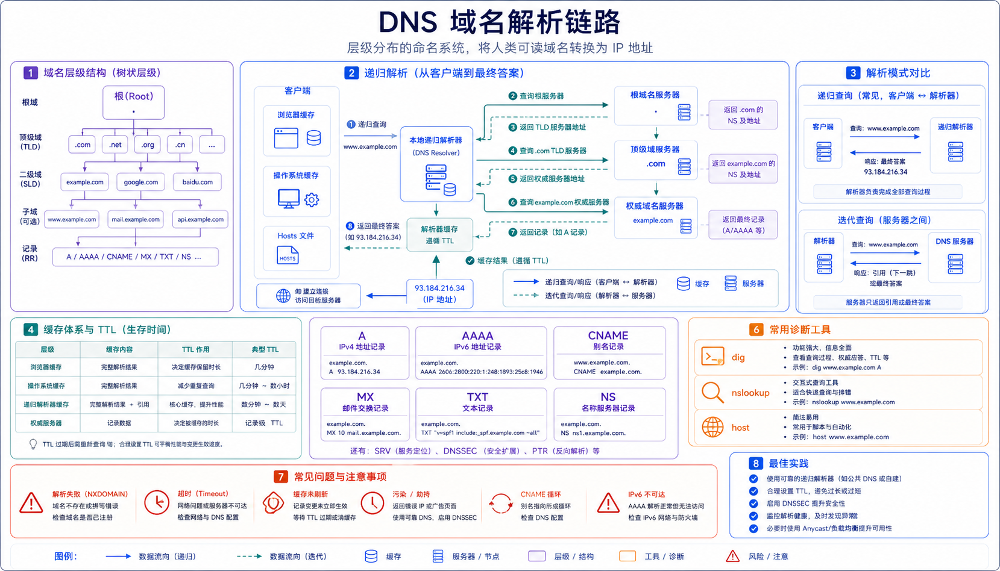

## 概述

DNS（Domain Name System，域名系统）是互联网的基础设施之一，负责将人类可读的域名（如 `www.example.com`）转换为机器可读的 IP 地址（如 `93.184.216.34`）。没有 DNS，我们只能通过记忆 IP 地址来访问网站，这显然是不现实的。

```
用户输入 www.example.com
         ↓
    DNS 解析
         ↓
返回 IP 地址 93.184.216.34
         ↓
浏览器连接到目标服务器
```



## 域名结构

### 层级结构

域名采用树状层级结构，从右到左级别递减：

```
┌─────────────────────────────────────────────────────────────┐
│                        根域 (.)                             │
│                              │                              │
│          ┌───────────────────┼───────────────────┐         │
│          │                   │                   │         │
│        .com                  .org               .cn        │
│          │                   │                   │         │
│     ┌────┴────┐        ┌────┴────┐        ┌────┴────┐     │
│  example   google      wikipedia   github    taobao       │
│     │         │           │          │          │         │
│  www        www        www        www        www          │
└─────────────────────────────────────────────────────────────┘
```

### 域名级别说明

| 级别 | 示例 | 说明 |
|------|------|------|
| **根域** | `.` | DNS 树的最顶层，全球共 13 组根服务器 |
| **顶级域 (TLD)** | `.com` `.org` `.cn` `.edu` | 由 ICANN 管理 |
| **二级域** | `example.com` `google.com` | 可注册的最长级别 |
| **三级域** | `www.example.com` `api.github.com` | 子域名，可自由分配 |

### 常见顶级域分类

| 类型 | 示例 | 说明 |
|------|------|------|
| **通用顶级域** | `.com` `.org` `.net` `.edu` | 无行业限制 |
| **国家代码顶级域** | `.cn` `.jp` `.uk` `.us` | 国家/地区专属 |
| **新顶级域** | `.app` `.shop` `.cloud` `.io` | 近年新增 |

## DNS 查询流程

### 完整查询链路

当你在浏览器中输入 `www.example.com` 时，完整的 DNS 查询流程如下：

```
┌─────────┐                    ┌─────────┐                   ┌─────────┐
│  客户端  │                    │ 本地DNS │                   │ 根服务器 │
│  浏览器  │                    │  缓存   │                   │          │
└────┬────┘                    └────┬────┘                   └────┬────┘
     │                              │                            │
     │  1. 查询 www.example.com    │                            │
     │─────────────────────────────▶│                            │
     │                              │                            │
     │  2. 检查缓存                 │                            │
     │                              │                            │
     │◀─────────────────────────────│                            │
     │    缓存未命中                 │                            │
     │                              │                            │
     │  3. 查询根服务器              │                            │
     │─────────────────────────────▶│───────────────────────────▶│
     │                              │                            │
     │  4. 返回 .com 服务器地址      │                            │
     │◀─────────────────────────────│◀───────────────────────────│
     │                              │                            │
     │  5. 查询 .com 服务器          │                            │
     │─────────────────────────────▶│───────────────────────────▶│
     │                              │                            │
     │  6. 返回 example.com DNS     │                            │
     │◀─────────────────────────────│◀───────────────────────────│
     │                              │                            │
     │  7. 查询 example.com DNS     │                            │
     │─────────────────────────────▶│───────────────────────────▶│
     │                              │                            │
     │  8. 返回 IP: 93.184.216.34   │                            │
     │◀─────────────────────────────│◀───────────────────────────│
     │                              │                            │
     │  9. 缓存结果                  │                            │
     │                              │                            │
     │  10. 返回 IP 给浏览器         │                            │
     │◀─────────────────────────────│                            │
```

### 递归查询 vs 迭代查询

```
┌─────────────────────────────────────────────────────────────────┐
│                      递归查询 (Recursive Query)                   │
│                                                                  │
│   客户端 ──▶ 本地DNS ──▶ 根DNS ──▶ TLD DNS ──▶ 权威DNS           │
│                  ←─────────── 返回最终结果 ────────────           │
│                                                                  │
│   特点：客户端只需发送一次请求，DNS服务器完成全部解析工作          │
└─────────────────────────────────────────────────────────────────┘

┌─────────────────────────────────────────────────────────────────┐
│                      迭代查询 (Iterative Query)                  │
│                                                                  │
│   客户端 ──▶ 本地DNS ──▶ 根DNS (返回TLD地址)                     │
│        │                  ↓                                      │
│        └───────◀─────── TLD DNS (返回权威DNS地址)                │
│        │                  ↓                                      │
│        └───────◀─────── 权威DNS (返回最终IP)                     │
│                                                                  │
│   特点：每个DNS服务器只返回下一个应该查询的地址                   │
└─────────────────────────────────────────────────────────────────┘
```

## DNS 服务器类型

### 1. 根服务器 (Root Server)

全球共有 13 组根服务器（A-M），负责管理顶级域的地址：

| 服务器 | 运营机构 | IP 地址 |
|--------|----------|----------|
| A | Verisign | 198.41.0.4 |
| B | USC-ISI | 192.58.128.30 |
| C | Cogent | 192.33.4.12 |
| ... | ... | ... |
| M | WIDE | 202.12.27.33 |

### 2. 顶级域服务器 (TLD Server)

管理顶级域（如 .com、.org）的 DNS 服务器：

```bash
# 查询 .com 顶级域服务器
whois -h whois.verisign-grs.com com

# 查看 com 域名的 NS 记录
dig NS com
```

### 3. 权威服务器 (Authoritative Server)

存储域名最终解析结果的服务器，是查询的终点：

```bash
# 查询 example.com 的权威服务器
dig +short @a.iana-servers.net example.com
# 输出：93.184.216.34
```

### 4. 递归解析器 (Recursive Resolver)

通常由 ISP 或公共 DNS 服务商运营，替客户端完成完整的 DNS 查询：

| 服务商 | DNS 服务器 |
|--------|------------|
| Google | 8.8.8.8 / 8.8.4.4 |
| Cloudflare | 1.1.1.1 / 1.0.0.1 |
| 阿里云 | 223.5.5.5 / 223.6.6.6 |
| 腾讯云 | 119.29.29.29 / 182.254.118.118 |

## DNS 记录类型

### 常见记录类型

| 类型 | 用途 | 示例 |
|------|------|------|
| **A** | IPv4 地址映射 | `example.com → 93.184.216.34` |
| **AAAA** | IPv6 地址映射 | `example.com → 2606:2800:220:1::` |
| **CNAME** | 别名指向 | `www.example.com → example.com` |
| **MX** | 邮件服务器 | `example.com → mail.example.com` |
| **NS** | 域名服务器 | `example.com → ns1.example.com` |
| **TXT** | 文本记录 | 用于验证、SPF 等 |
| **PTR** | IP 反向解析 | `34.216.184.93.in-addr.arpa → example.com` |
| **SOA** | 起始授权记录 | 域名的基本配置信息 |
| **SRV** | 服务定位记录 | `_http._tcp.example.com` |

### A 记录示例

```bash
# 查看 A 记录
dig A example.com

# 输出
; <<>> DiG 9.16.1 <<>> A example.com
;; global options: +cmd
;; Got answer:
;; ->>HEADER<<- opcode: QUERY, status: NOERROR, id: 12345
;; flags: qr rd ra; QUERY: 1, ANSWER: 1, AUTHORITY: 0, ADDITIONAL: 0

;; QUESTION SECTION:
;example.com.                  IN      A

;; ANSWER SECTION:
example.com.           86400   IN      A       93.184.216.34
```

### CNAME 记录示例

```bash
# CNAME 用于创建域名别名
dig CNAME www.example.com

# 输出
www.example.com.      3600    IN      CNAME    example.com.
example.com.          86400   IN      A       93.184.216.34
```

### MX 记录示例

```bash
# 查看邮件服务器
dig MX example.com

# 输出
example.com.           3600    IN      MX      10 mail.example.com.
example.com.           3600    IN      MX      20 mail2.example.com.
```

### AAAA 记录（IPv6）

```bash
dig AAAA ipv6.example.com

# 输出
ipv6.example.com.      3600    IN      AAAA    2606:2800:220:1:248:1893:25c8:1946
```

## DNS 查询工具

### dig 命令

```bash
# 基本查询
dig example.com

# 指定 DNS 服务器
dig @8.8.8.8 example.com

# 仅查询 A 记录
dig +short A example.com

# 查询 NS 记录
dig NS example.com

# 查询 MX 记录
dig MX example.com

# 追踪查询过程
dig +trace example.com

# 反向查询
dig -x 93.184.216.34

# 查看完整响应
dig +noall +answer example.com
```

### nslookup 命令

```bash
# 基本查询
nslookup example.com

# 指定 DNS 服务器
nslookup example.com 8.8.8.8

# 查询 MX 记录
nslookup -type=MX example.com

# 进入交互模式
nslookup
> server 8.8.8.8
> set type=A
> example.com
```

### host 命令

```bash
# 基本查询
host example.com

# 显示详细信息
host -a example.com

# 反向查询
host 93.184.216.34

# 查找邮件服务器
host -t MX example.com
```

### ping 命令

```bash
# 通过 ping 解析域名
ping -c 1 example.com
```

## DNS 缓存机制

### 浏览器缓存

现代浏览器自带 DNS 缓存：

```javascript
// 查看浏览器的 DNS 缓存策略
// Chrome: about://net-internals/#dns 可以清除 DNS 缓存
```

### 操作系统缓存

```bash
# Windows 查看 DNS 缓存
ipconfig /displaydns

# 清除 DNS 缓存
ipconfig /flushdns

# Linux 查看 nscd 缓存
systemctl status nscd

# 清除 systemd-resolved 缓存
systemctl restart systemd-resolved
```

### DNS 服务器缓存

递归 DNS 服务器会缓存查询结果，缓存时间由 TTL 值决定：

```bash
# 查看 TTL 值
dig example.com

# TTL = 86400 表示缓存 1 天
```

### TTL 的影响

```python
# DNS TTL 影响
"""
当 DNS 记录 TTL 设置较低时：
- 优点：变更传播快，故障切换迅速
- 缺点：增加 DNS 服务器负载，解析延迟略高

当 DNS 记录 TTL 设置较高时：
- 优点：减轻 DNS 服务器负载，解析速度快
- 缺点：变更传播慢，故障切换延迟
"""

# 最佳实践
最佳实践 = 正常情况设置高 TTL（1-24小时）
         + 变更前临时降低 TTL（5-15分钟）
         + 变更后恢复高 TTL
```

## DNS 安全

### DNS 面临的安全威胁

| 威胁 | 描述 | 危害 |
|------|------|------|
| **DNS 欺骗** | 伪造 DNS 响应 | 用户访问恶意网站 |
| **DNS 缓存投毒** | 污染 DNS 缓存 | 大规模重定向 |
| **DDoS 攻击** | 攻击 DNS 服务器 | DNS 服务不可用 |
| **域名劫持** | 篡改域名注册信息 | 完全控制域名 |

### DNSSEC（DNS Security Extensions）

DNSSEC 通过数字签名验证 DNS 响应真实性：

```bash
# 查看 DNSSEC 状态
dig +dnssec example.com

# 输出包含 RRSIG 记录表示启用了 DNSSEC
```

### 验证 DNSSEC

```python
# Python 验证 DNSSEC
import dns.resolver

def check_dnssec(domain):
    try:
        answers = dns.resolver.resolve(domain, 'DNSKEY')
        print(f"DNSKEY 记录数: {len(answers)}")
        
        answers = dns.resolver.resolve(domain, 'DS')
        print(f"DS 记录数: {len(answers)}")
        return True
    except dns.resolver.NXDOMAIN:
        print("域名不存在")
        return False
    except Exception as e:
        print(f"DNSSEC 验证失败: {e}")
        return False
```

### DNS over HTTPS (DoH)

加密 DNS 查询，防止中间人攻击：

```bash
# 使用 Cloudflare DoH
curl -x https://cloudflare-dns.com/dns-query?name=example.com&type=A

# 使用 Google DoH
curl -x https://dns.google/dns?name=example.com&type=A
```

### DNS over TLS (DoT)

```bash
# 使用 DoT 查询
# 需要 openssl 支持
echo -n "example.com" | openssl s_client -connect 1.1.1.1:853 -servername .
```

## 实际应用场景

### 场景一：负载均衡

```bash
# 多个 A 记录实现负载均衡
dig A example.com

# 输出（轮询返回不同 IP）
# 第一次: 93.184.216.34
# 第二次: 93.184.216.35
# 第三次: 93.184.216.36
```

### 场景二：邮件路由

```bash
# 邮件服务器优先级
dig MX example.com

# 输出
# 10 mail1.example.com    # 优先级高，首先尝试
# 20 mail2.example.com    # 优先级低，作为备份
```

### 场景三：CDN 加速

```bash
# 大型网站使用 CNAME 指向 CDN
dig CNAME www.example.com

# 输出
# www.example.com → www.example.com.cdn.com
# www.example.com.cdn.com → CDN 边缘节点 IP
```

### 场景四：故障切换

```python
# 实现 DNS 健康检查和故障切换
import dns.resolver

class DNSSwitchover:
    def __init__(self, domain):
        self.domain = domain
        self.resolver = dns.resolver.Resolver()
        
    def get_healthy_ip(self):
        try:
            answers = self.resolver.resolve(self.domain, 'A')
            for rdata in answers:
                ip = str(rdata)
                if self.health_check(ip):
                    return ip
        except Exception as e:
            print(f"DNS 查询失败: {e}")
        return None
    
    def health_check(self, ip):
        # 实现健康检查逻辑
        return True
```

## 性能优化

### 减少 DNS 查询时间

```python
# 1. 使用快速的 DNS 服务器
fast_dns = [
    '1.1.1.1',      # Cloudflare
    '8.8.8.8',      # Google
    '223.5.5.5',    # 阿里云
]

# 2. 预解析关键域名
prefetch_domains = [
    'api.example.com',
    'static.example.com',
    'cdn.example.com',
]

# 3. 本地缓存
local_cache = {}

def resolve_with_cache(domain):
    if domain in local_cache:
        cached_ip, cached_time = local_cache[domain]
        if time.time() - cached_time < 300:  # 5分钟缓存
            return cached_ip
    
    ip = dns_resolve(domain)
    local_cache[domain] = (ip, time.time())
    return ip
```

### DNS 预解析

```html
<!-- HTML 预解析 -->
<link rel="dns-prefetch" href="//static.example.com">
<link rel="dns-prefetch" href="//api.example.com">

<!-- 或使用 Meta 标签 -->
<meta http-equiv="x-dns-prefetch" content="static.example.com">
```

```javascript
// JavaScript 预解析
const prefetch = document.createElement('link');
prefetch.rel = 'dns-prefetch';
prefetch.href = '//api.example.com';
document.head.appendChild(prefetch);

// 使用 Fetch DNS 预解析
const controller = new AbortController();
fetch('https://api.example.com', { signal: controller.signal })
    .then(response => console.log('DNS resolved'))
    .catch(err => console.log(err));
```

## 常见问题排查

### 问题一：DNS 解析失败

```bash
# 1. 检查网络连接
ping 8.8.8.8

# 2. 检查 DNS 配置
cat /etc/resolv.conf

# 3. 测试 DNS 服务器
dig @8.8.8.8 google.com

# 4. 清除本地缓存
# Windows
ipconfig /flushdns
# Linux
sudo systemd-resolve --flush-caches
```

### 问题二：域名已过期

```bash
# 检查域名注册信息
whois example.com

# 查看到期日期和状态
```

### 问题三：TTL 缓存导致更新延迟

```bash
# 查询当前 TTL
dig example.com

# 降低 TTL 后等待足够时间
# 再次查询确认生效
```

### 问题四：CDN 解析异常

```bash
# 检查 CNAME 记录
dig CNAME www.example.com

# 绕过 CDN 直接解析源站
dig A example.com
```

## Python DNS 操作

### 使用 dnspython

```python
import dns.resolver
import dns.query
import dns.zone

# A 记录查询
def query_a_record(domain):
    try:
        answers = dns.resolver.resolve(domain, 'A')
        for rdata in answers:
            print(f"A 记录: {rdata.address}")
    except dns.resolver.NXDOMAIN:
        print(f"域名 {domain} 不存在")
    except dns.resolver.NoAnswer:
        print(f"无 A 记录")
    except Exception as e:
        print(f"查询失败: {e}")

# MX 记录查询
def query_mx_record(domain):
    try:
        answers = dns.resolver.resolve(domain, 'MX')
        for rdata in answers:
            print(f"MX {rdata.preference}: {rdata.exchange}")
    except Exception as e:
        print(f"查询失败: {e}")

# 批量查询
def batch_query(domains):
    for domain in domains:
        try:
            answers = dns.resolver.resolve(domain, 'A')
            ip = str(answers[0].address)
            print(f"{domain} → {ip}")
        except Exception as e:
            print(f"{domain} 查询失败")
```

## 小结

DNS 核心要点：

- **层级结构**：根域 → 顶级域 → 二级域 → 子域
- **查询流程**：客户端 → 本地 DNS → 根服务器 → TLD → 权威服务器
- **记录类型**：A/AAAA/CNAME/MX/NS/TXT 等
- **缓存机制**：浏览器、操作系统、DNS 服务器多层缓存
- **安全扩展**：DNSSEC、DoH、DoT 保护 DNS 安全
- **优化策略**：预解析、高 TTL、快速 DNS 服务器

> 相关阅读：
> - [TCP/IP 协议栈概述](/网络/TCP-IP-协议栈概述) - 网络协议基础
> - [HTTP 协议：请求方法、状态码、头部字段](/网络/HTTP-协议：请求方法、状态码、头部字段) - HTTP 协议详解
> - [CDN 加速原理](/网络/CDN-加速原理) - CDN 技术介绍（待补充）
