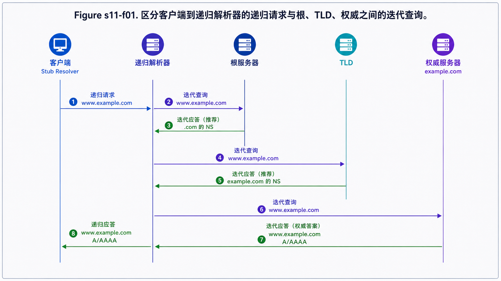
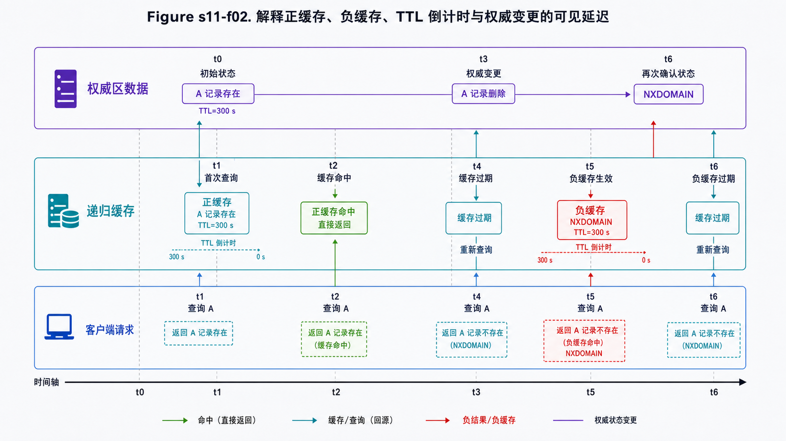

## 学习导航

**前置依赖**：UDP/TCP、IP 路由与缓存的基本概念。

**核心问题**：应用查询 `www.example.com` 时，谁负责递归、谁提供权威答案，缓存又如何影响正确性和变更速度？

## 场景与直觉

应用通常调用操作系统的存根解析器，再把问题交给递归解析器。递归解析器若无缓存，会从根、顶级域和权威服务器逐级获得转介或答案。客户端与递归解析器之间的“递归查询”，不同于解析器访问各级服务器时的“迭代查询”。

## 核心机制

<!-- network-figure:s11-f01:start -->



<!-- network-figure:s11-f01:end -->

DNS 名称空间是一棵树，管理责任通过 Zone 委派。权威服务器保存特定 Zone 的原始记录；递归解析器替客户端追踪答案并缓存结果。

| 记录     | 含义               | 常见边界                   |
| -------- | ------------------ | -------------------------- |
| A / AAAA | 名称到 IPv4 / IPv6 | 可能返回多个地址           |
| CNAME    | 别名指向规范名称   | 不能与同名其他数据随意共存 |
| NS       | Zone 的权威服务器  | 委派需配合必要 glue        |
| MX       | 邮件交换器及优先级 | 目标是主机名，不是 IP      |
| TXT      | 通用文本数据       | 常用于域名验证与邮件策略   |

## 报文与缓存状态

<!-- network-figure:s11-f02:start -->



<!-- network-figure:s11-f02:end -->

响应中的 `RCODE`、AA、TC、RD、RA 等标志必须结合解释。传统 DNS 常用 UDP；响应截断、区域传送等场景可使用 TCP。现代加密传输如 DoT/DoH 改变传输与隐私边界，不改变 DNS 记录本身的基本语义。

TTL 表示缓存记录最多可复用多久。NXDOMAIN 等否定答案也可以缓存；修改权威记录后，旧缓存不会被全球瞬间推送清除。

## 最小可复现实验

```bash
nslookup www.example.com

# 安装 dig 的环境可观察完整标志和 TTL
dig www.example.com A
dig +trace www.example.com
```

结果会因递归解析器、地理位置和 CDN 调度不同而变化。排障时记录查询名称、类型、使用的解析器、响应码和 TTL。

## 常见误区与适用边界

- 递归解析器不是根服务器；根服务器通常返回转介而非最终业务地址。
- CNAME 不是 HTTP 重定向，浏览器地址栏不会因此改变。
- “清空本机 DNS 缓存”无法清除递归解析器或权威之外的缓存。
- DNSSEC 提供数据来源认证与完整性，不负责加密查询内容。

## 自检题

1. 递归查询与迭代查询的责任主体有什么不同？
2. 为什么降低 TTL 后仍要等待旧 TTL 到期再切换？
3. `SERVFAIL` 与 `NXDOMAIN` 表达的失败有何不同？

<details>
<summary>查看答案</summary>

1. 递归解析器替客户端追踪最终答案；迭代查询得到答案或下一步转介。2. 已缓存的旧记录仍按当时 TTL 有效。3. NXDOMAIN 表示名称不存在；SERVFAIL 表示服务器无法完成处理，名称未必不存在。

</details>

## 本篇总结

DNS 是分层、委派、缓存的分布式数据库；有效排障必须区分存根、递归、权威和缓存层。

## 下一篇

下一篇使用解析出的地址建立 HTTP/1.1 请求，理解方法、状态码、头部和缓存语义。

## 资料来源与版本基线

- [RFC 1034: Domain Names—Concepts and Facilities](https://www.rfc-editor.org/rfc/rfc1034.html)
- [RFC 1035: Domain Names—Implementation and Specification](https://www.rfc-editor.org/rfc/rfc1035.html)
- [RFC 2308: Negative Caching of DNS Queries](https://www.rfc-editor.org/rfc/rfc2308.html)
