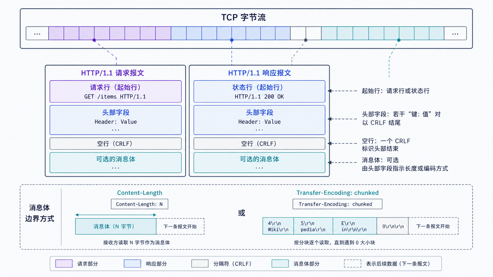
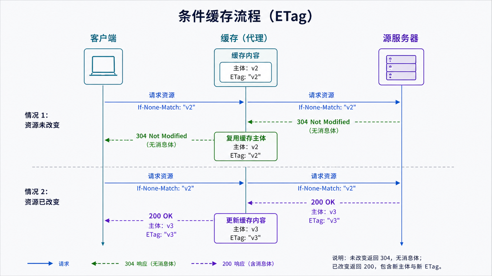

## 学习导航

**前置依赖**：DNS、TCP 字节流和长连接。

**核心问题**：HTTP 如何在字节流上表达资源操作、响应结果、元数据和消息边界？

## 场景与直觉

客户端通过 TCP/TLS 连接 `www.example.com:443` 后发送请求。HTTP 语义与具体版本的线格式分离：GET、状态码、字段和缓存含义可映射到 HTTP/1.1、HTTP/2 或 HTTP/3。

## 核心机制

<!-- network-figure:s12-f01:start -->



<!-- network-figure:s12-f01:end -->

```http
GET /api/items?limit=10 HTTP/1.1
Host: www.example.com
Accept: application/json
If-None-Match: "items-v7"
```

方法表达请求语义。安全方法预期只读；幂等方法重复执行应与执行一次具有相同预期效果，但网络调用仍可能产生日志、计费等附带影响。POST 不是天然不可重试，是否安全取决于应用协议是否提供幂等键或可确认结果。

## 消息边界与状态

<!-- network-figure:s12-f02:start -->



<!-- network-figure:s12-f02:end -->

HTTP/1.1 在 TCP 字节流上用起始行、字段和内容组成消息。正文长度可由 `Content-Length`、分块传输编码或连接关闭等规则确定；冲突的消息长度信息可能形成请求走私风险。

状态码按类别表达处理结果：1xx 临时响应，2xx 成功，3xx 重定向，4xx 客户端请求问题，5xx 服务端处理失败。状态码不是业务成功的唯一标准，响应体仍需遵循应用契约。

条件请求把缓存验证与并发控制结合起来：`If-None-Match` 可得到 304，`If-Match` 可防止覆盖已变化资源。

## 最小可复现实验

```python
from http.client import HTTPSConnection

conn = HTTPSConnection("www.example.com", timeout=5)
conn.request("HEAD", "/")
response = conn.getresponse()
print(response.status, response.reason)
for name, value in response.getheaders():
    if name.lower() in {"content-length", "etag", "cache-control"}:
        print(name, value)
conn.close()
```

网络结果可能变化；测试重点是能解析状态与字段，并为超时和 TLS 错误设置明确边界。

## 常见误区与适用边界

- GET 可带条件和复杂查询，不等于“只能传少量数据”；但敏感信息不应放入可记录的 URL。
- 304 不包含新的完整表示，客户端需复用已有缓存内容并更新元数据。
- HTTP Keep-Alive 不等于应用永不超时，客户端、代理和服务器都有生命周期限制。
- `Connection` 等逐跳字段不能被代理无条件转发。

## 自检题

1. 安全方法和幂等方法有什么区别？
2. 为什么 TCP 已有连接边界，HTTP 仍需消息边界？
3. ETag 条件请求如何减少传输并避免并发覆盖？

<details>
<summary>查看答案</summary>

1. 安全强调不请求状态变更，幂等强调重复执行效果。2. TCP 只有连续字节流，可在同一连接承载多个 HTTP 消息。3. `If-None-Match` 可验证缓存，`If-Match` 可要求只在版本未变时更新。

</details>

## 本篇总结

HTTP 定义资源交互语义和消息契约；连接复用、缓存和重试必须服从这些语义，而不是只看传输是否成功。

## 下一篇

下一篇学习 HTTP/2 如何把消息映射为帧和流，并理解 TCP 级队头阻塞仍然存在。

## 资料来源与版本基线

- [RFC 9110: HTTP Semantics](https://www.rfc-editor.org/rfc/rfc9110.html)
- [RFC 9111: HTTP Caching](https://www.rfc-editor.org/rfc/rfc9111.html)
- [RFC 9112: HTTP/1.1](https://www.rfc-editor.org/rfc/rfc9112.html)
