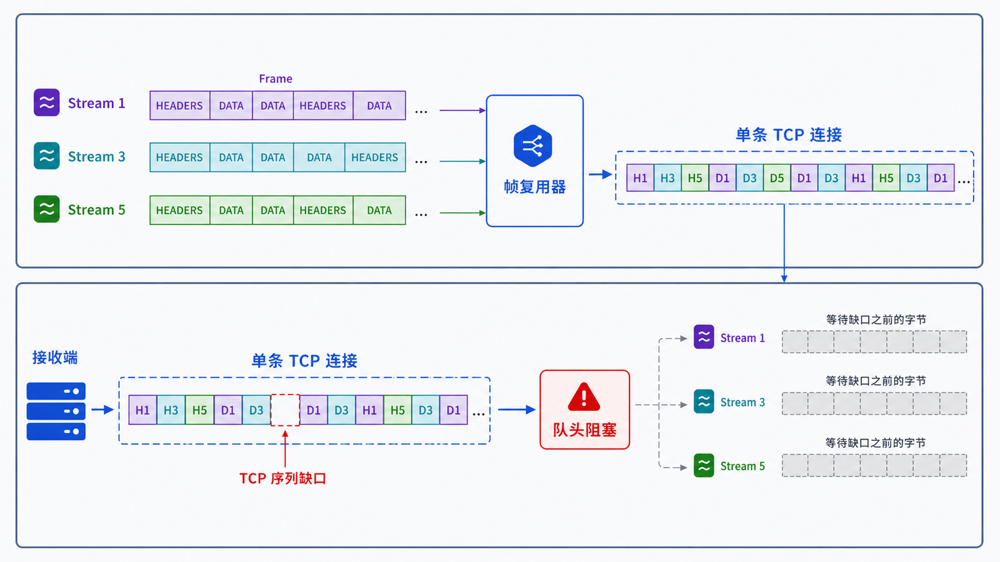
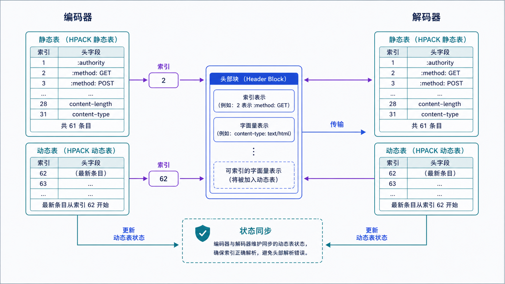

## 学习导航

**前置依赖**：HTTP 语义、TCP 字节流与流量控制。

**核心问题**：HTTP/2 如何在一条 TCP 连接上并发承载多个请求，又为什么仍会被一个丢失的 TCP 段拖慢？

## 场景与直觉

HTTP/1.1 的一个连接通常需要按顺序解析响应；浏览器常开多个连接缓解排队。HTTP/2 把请求和响应拆成二进制帧并归属到独立流，让帧可以交错传输。

## 核心机制

<!-- network-figure:s13-f01:start -->



<!-- network-figure:s13-f01:end -->

HTTP/2 连接包含多个流，流包含按顺序排列的帧。HEADERS 承载字段块，DATA 承载内容，SETTINGS 协商连接参数，WINDOW_UPDATE 调整连接级或流级流量控制窗口。

```text
TCP connection
  Stream 1: HEADERS --- DATA -------- DATA
  Stream 3:     HEADERS --- DATA
  Stream 5:          HEADERS ---- DATA ----
```

HTTP/2 消除了 HTTP/1.1 层面的响应排队，但所有流仍共享同一条有序 TCP 字节流：某个 TCP 段丢失时，后续字节即使已到达也不能交给 HTTP/2 解析，形成传输层队头阻塞。

## HPACK 与状态

<!-- network-figure:s13-f02:start -->



<!-- network-figure:s13-f02:end -->

HPACK 使用静态表、动态表和整数/字符串编码压缩重复字段。动态表是连接级共享状态，因此实现必须限制表大小并防止内存或压缩侧信道风险。

流有 idle、open、half-closed、closed 等状态。`RST_STREAM` 终止单个流，`GOAWAY` 表示连接将停止接受更高编号的新流，客户端应根据幂等性决定是否在新连接重试。

## 最小可复现实验

```bash
curl --http2 -I -v https://www.example.com/
```

观察 ALPN 是否协商 `h2`、响应版本和连接复用信息。curl 构建可能不支持 HTTP/2，先用 `curl --version` 核对能力。

## 常见误区与适用边界

- 多路复用不等于无限并发，服务端可通过 SETTINGS 限制并发流数。
- HTTP/2 流量控制不同于 TCP 流量控制，两层都会限制吞吐。
- Server Push 并不总能提升性能，现代客户端和服务端支持策略可能不同。
- 不要把 HTTP/2 的 Stream 与 TCP 连接或应用线程一一对应。

## 自检题

1. HTTP/2 多路复用解决了哪一层的排队？
2. 为什么单个 TCP 段丢失会影响多个 HTTP/2 流？
3. GOAWAY 后哪些请求可能需要重试？

<details>
<summary>查看答案</summary>

1. HTTP/1.1 消息层的串行排队。2. 所有流的帧共享 TCP 的有序字节流。3. 未被服务端处理、流 ID 高于 GOAWAY 最后处理流的请求；仍需按请求幂等性决定。

</details>

## 本篇总结

HTTP/2 用帧和流提高单连接并发，但没有改变底层 TCP 的全连接有序交付语义。

## 下一篇

下一篇建立 TLS 所需的密码学部件：加密、认证、哈希与数字签名。

## 资料来源与版本基线

- [RFC 9113: HTTP/2](https://www.rfc-editor.org/rfc/rfc9113.html)
- [RFC 7541: HPACK](https://www.rfc-editor.org/rfc/rfc7541.html)
