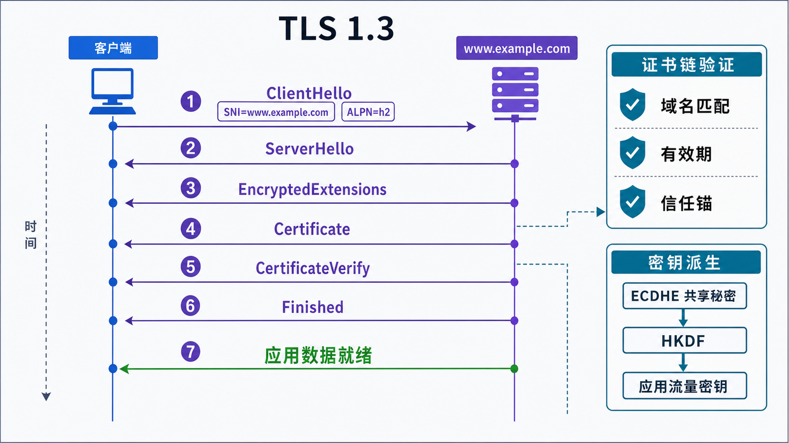
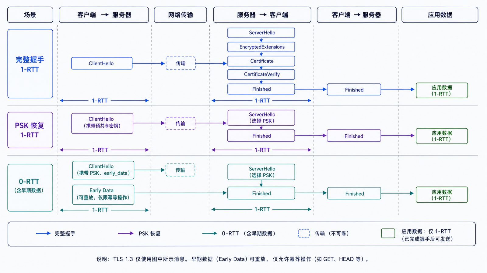

## 学习导航

**前置依赖**：HTTP、密钥协商、数字签名和 AEAD。

**核心问题**：客户端如何确认连接的是目标站点，并与其建立只有双方掌握的会话密钥？

## 场景与直觉

HTTPS 是 HTTP 语义运行在 TLS 保护的连接上。TLS 1.3 握手协商版本与算法、执行密钥交换、验证服务端身份，再派生握手和应用流量密钥。

## 核心机制

<!-- network-figure:s15-f01:start -->



<!-- network-figure:s15-f01:end -->

```text
ClientHello (versions, key_share, SNI, ALPN)
  -> ServerHello (selected version, key_share)
  <- EncryptedExtensions
  <- Certificate + CertificateVerify
  <- Finished
  -> Finished
  <=> encrypted application data
```

证书把域名、公钥和签发者声明绑定起来。客户端验证有效期、域名、用途、签名链、信任锚和可能的撤销信息。握手成功不意味着应用已授权用户。

## 状态、密钥与恢复

<!-- network-figure:s15-f02:start -->



<!-- network-figure:s15-f02:end -->

TLS 1.3 使用 HKDF 从共享秘密和握手转录派生不同阶段、不同方向的密钥。前向保密来自临时 (EC)DHE：未来泄露证书私钥不应直接解密过去捕获的会话。

会话恢复可减少握手成本。0-RTT early data 可能被重放，因此只能用于应用明确允许重放的操作，不能仅因传输成功就执行不可幂等写入。

## 最小可复现实验

```python
import socket
import ssl

context = ssl.create_default_context()
with socket.create_connection(("www.example.com", 443), timeout=5) as raw:
    with context.wrap_socket(raw, server_hostname="www.example.com") as tls:
        print("version:", tls.version())
        print("cipher:", tls.cipher()[0])
        print("subject:", tls.getpeercert().get("subject"))
```

验证失败时不要关闭证书检查来“修好”连接，应检查系统时间、域名、链、中间证书和信任根。

## 常见误区与适用边界

- SSL 是历史称呼，现代部署应以 TLS 版本和密码套件为准。
- 证书加密网页内容的说法不准确；证书主要参与身份验证和握手认证。
- HSTS 只能在客户端已知策略后强制 HTTPS，首次访问和预加载有不同边界。
- TLS 终止在反向代理时，代理到源站的链路仍需单独定义信任与保护。

## 自检题

1. 为什么客户端需要发送 SNI？
2. 证书有效但域名不匹配时能否继续信任？
3. 0-RTT 为什么不能默认承载付款操作？

<details>
<summary>查看答案</summary>

1. 同一地址可能托管多个站点，服务端需选择证书和配置。2. 不能，身份绑定失败。3. Early data 存在重放风险，付款不是天然幂等。

</details>

## 本篇总结

TLS 将密钥协商、证书身份、握手签名和 AEAD 组合成经过认证的安全通道；HTTPS 仍需应用层授权和安全语义。

## 下一篇

下一篇学习 QUIC 如何把 TLS 1.3 与多流传输结合，并承载 HTTP/3。

## 资料来源与版本基线

- [RFC 8446: TLS 1.3](https://www.rfc-editor.org/rfc/rfc8446.html)
- [RFC 5280: Internet X.509 PKI Certificate Profile](https://www.rfc-editor.org/rfc/rfc5280.html)
