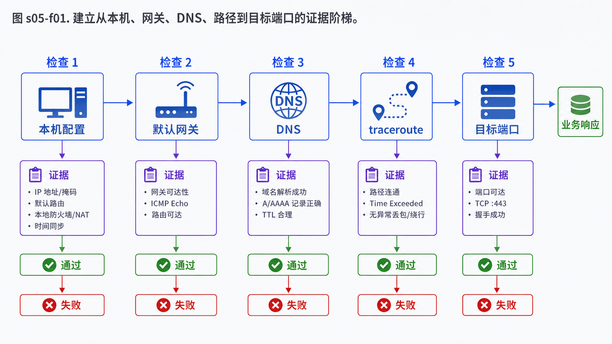

## 学习导航

**前置依赖**：IP、路由、TTL/Hop Limit。

**核心问题**：如何用有限的 ICMP 和路径反馈判断故障发生在本机、下一跳、中间路径还是目标服务？

## 场景与直觉

客户端无法访问 `203.0.113.20:443`。排障不应从“重启服务”开始，而应逐步建立证据：本地地址是否正确、网关是否可达、DNS 是否正确、路径是否存在、目标端口是否响应。

## 核心机制

`ping` 常发送 ICMP Echo Request，并根据 Echo Reply 统计往返时延与丢包。`traceroute` 发送逐步增加 TTL/Hop Limit 的探测包；路由器将其减到零时返回 Time Exceeded，因此显露一跳。

不同实现可使用 UDP、ICMP Echo 或 TCP SYN 探测。中间设备可能限速或过滤 ICMP，所以星号不自动等于业务流量中断；某一跳高延迟而后续恢复，也可能只是该路由器降低了控制平面响应优先级。

## 数据与判断顺序

<!-- network-figure:s05-f01:start -->



<!-- network-figure:s05-f01:end -->

```text
地址/接口 -> 本地网关 -> DNS -> 公网 IP -> 路径 -> 目标端口 -> TLS/应用
```

每一步只回答一个问题。域名 ping 失败可能是 DNS、ICMP 策略或网络问题；不能据此直接断言网站宕机。

## 最小可复现实验

```bash
# Windows
ping 192.0.2.1
tracert -d 203.0.113.20

# Linux/macOS
ping -c 4 192.0.2.1
traceroute -n 203.0.113.20
```

文档地址通常不会真实响应；实际练习应替换为你有权测试的网关或实验主机。记录命令、时间、源网络和目标，因为路径会随路由策略变化。

## 常见误区与适用边界

- ICMP 不可达消息有多种代码，需结合原始探测协议解释。
- `100% packet loss` 可能只是禁回 Echo，不能证明 TCP 443 不可用。
- traceroute 展示的是一次或几次探测的路径，不保证正反向路径相同。
- MTR 的中间跳丢包只有在后续跳也延续时才更值得怀疑。

## 自检题

1. traceroute 为什么能逐跳显示路由器？
2. 中间一跳显示 80% 丢包、终点 0% 丢包，最合理解释是什么？
3. ping 域名失败后应如何把 DNS 与 ICMP 问题拆开？

<details>
<summary>查看答案</summary>

1. 递增 TTL，利用路由器的 Time Exceeded 响应。2. 中间设备可能限速控制平面响应，转发数据仍正常。3. 先用 `nslookup`/`dig` 验证解析，再直接探测解析出的 IP，并用 TCP 工具验证实际端口。

</details>

## 本篇总结

诊断工具提供的是证据而不是结论。有效排障要控制变量、记录探测类型，并区分控制平面响应和真实业务转发。

## 下一篇

下一篇进入传输层，理解端口、Socket、五元组和 UDP 数据报。

## 资料来源与版本基线

- [RFC 792: Internet Control Message Protocol](https://www.rfc-editor.org/rfc/rfc792.html)
- [RFC 4443: ICMPv6](https://www.rfc-editor.org/rfc/rfc4443.html)
