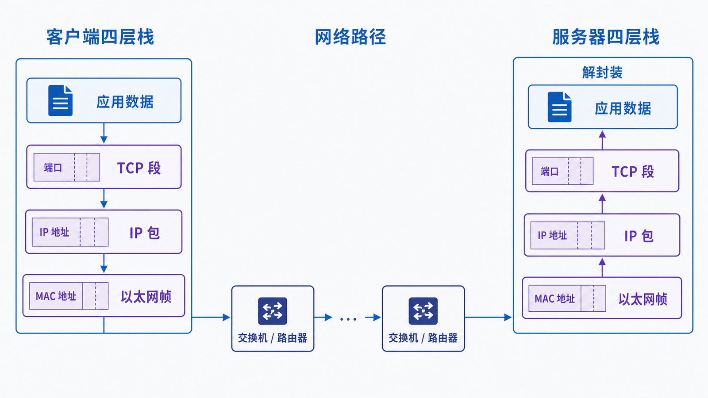
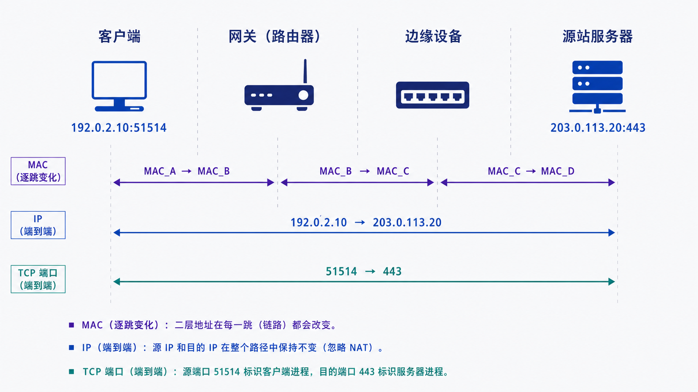

## 学习导航

**前置知识**：会使用命令行，知道客户端和服务器的基本含义。

**核心问题**：浏览器中的一段 HTTP 数据，为什么能穿过局域网、路由器和互联网，到达正确服务器上的正确进程？

学完后你应该能：

1. 说出 TCP/IP 四层各自解决的问题；
2. 沿发送和接收方向解释封装、解封装；
3. 区分 MAC 地址、IP 地址和端口的作用范围；
4. 判断一次失败更可能位于哪一层。

## 场景与直觉

贯穿全系列的客户端是 `192.0.2.10`，它访问 `https://www.example.com/`。DNS 返回服务器地址 `203.0.113.20`，默认网关是 `192.0.2.1`。这些地址来自文档专用网段，不指向真实生产主机。

应用并不是把“网页请求”直接交给网线。每一层只处理自己负责的局部问题，并把结果交给下一层：应用层描述请求含义，传输层找到进程并提供传输语义，网际层跨网络选择下一跳，链路层完成当前一跳的帧交付。

## 核心机制：分层与封装

<!-- network-figure:s01-f01:start -->



<!-- network-figure:s01-f01:end -->

| TCP/IP 层 | 常见协议             | 数据单元   | 主要问题           | 关键标识          |
| --------- | -------------------- | ---------- | ------------------ | ----------------- |
| 应用层    | HTTP、DNS、TLS       | 消息       | 数据表示和业务语义 | URL、域名、方法   |
| 传输层    | TCP、UDP             | 段或数据报 | 进程到进程的传输   | 端口、序列号      |
| 网际层    | IPv4、IPv6、ICMP     | IP 包      | 跨网络寻址和路由   | IP、TTL/Hop Limit |
| 链路层    | Ethernet、Wi-Fi、ARP | 帧         | 当前链路上的交付   | MAC、VLAN         |

发送端自上而下添加头部，接收端自下而上验证并移除头部。HTTP 字节在 TCP 中没有“请求边界”；TCP 只提供有序字节流，HTTP 自己通过报文语法恢复边界。

## 报文、寻址与状态变化

<!-- network-figure:s01-f02:start -->



<!-- network-figure:s01-f02:end -->

一次发送可以抽象为：

```text
HTTP 请求
  -> TLS 记录（HTTPS）
  -> TCP 段：源端口 51514，目的端口 443
  -> IP 包：192.0.2.10 -> 203.0.113.20
  -> 以太网帧：客户端 MAC -> 默认网关 MAC
```

跨越路由器时，IP 的源/目的地址通常保持不变，链路层 MAC 地址会为下一跳重写，TTL 每经过一个路由器减一。若经过 NAT，IP 和端口还可能被边界设备改写。

## 最小可复现实验

使用 Python 查看域名解析结果和一次 TCP 连接的本地/远端端点：

```python
import socket

host = "www.example.com"
ip = socket.gethostbyname(host)
print("resolved:", ip)

with socket.create_connection((host, 443), timeout=5) as conn:
    print("local:", conn.getsockname())
    print("peer:", conn.getpeername())
```

输出中的本地临时端口由操作系统分配；IP 可能随时间和地点变化。解析成功但连接超时，说明应继续检查路由、ACL、服务监听或链路质量，不能只归因于 DNS。

## 常见误区与适用边界

- **“交换机只属于二层，路由器只属于三层。”** 这是理解职责的模型，不是设备能力清单；现代设备可能同时实现多层功能。
- **“一个 HTTP 请求对应一个 TCP 包。”** 请求可能被拆成多个段，多个小写入也可能合并发送。
- **“抓到目的 IP 就能定位应用。”** 同一 IP 上可有多个端口、进程和虚拟主机。
- 分层模型适合定位职责，但真实实现会有硬件卸载、隧道和跨层优化，抓包位置不同也会看到不同形态。

## 自检题

1. 为什么访问远端服务器时，以太网帧的目的 MAC 通常不是服务器 MAC？
2. TCP 为什么不能直接替代 IP？
3. DNS 成功后 HTTPS 仍失败，至少列出三层可能原因。

<details>
<summary>查看答案</summary>

1. 链路层只负责当前一跳，客户端先把帧交给默认网关。2. TCP 解决进程间可靠传输，IP 才解决跨网络寻址和路由。3. 可检查 IP 路由、TCP 端口/防火墙、TLS 证书或协议协商、HTTP 服务状态。

</details>

## 本篇总结

网络通信不是一条不可拆分的管道，而是一组具有不同地址、状态和失败语义的层次。后续每篇都会沿这张坐标系深入一层。

## 下一篇

下一篇进入当前第一跳：主机如何通过 ARP 找到下一跳 MAC，交换机又如何转发帧。

## 资料来源与版本基线

- [RFC 1122: Requirements for Internet Hosts](https://www.rfc-editor.org/rfc/rfc1122.html)
- [RFC 8200: Internet Protocol, Version 6](https://www.rfc-editor.org/rfc/rfc8200.html)
- [RFC 9293: Transmission Control Protocol](https://www.rfc-editor.org/rfc/rfc9293.html)
