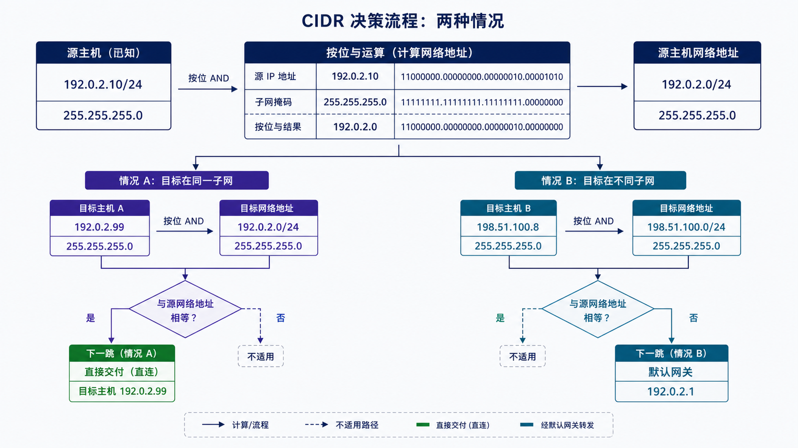
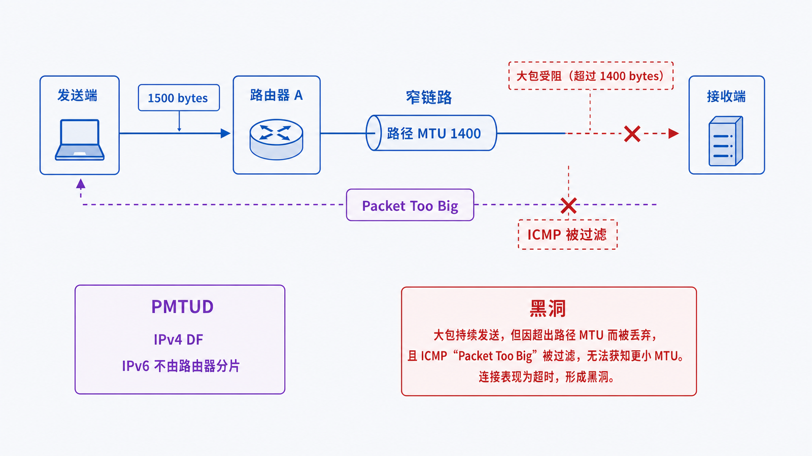

## 学习导航

**前置依赖**：知道局域网通过 MAC 和交换机完成当前一跳交付。

**核心问题**：主机如何仅凭 IP、前缀长度和路由表判断目标在本地还是应交给网关？

学完后你应能计算 IPv4 网段与主机范围，读懂 IPv6 前缀，并解释 MTU 与分片/丢包之间的关系。

## 场景与直觉

客户端为 `192.0.2.10/24`。`/24` 表示前 24 位是网络前缀。把目标 `192.0.2.20` 与掩码按位与，结果与本机相同，因此可在本地链路交付；`203.0.113.20` 不同，需查路由表。

## 核心机制

IPv4 地址共 32 位，CIDR 使用 `/n` 表示网络前缀长度。以 `192.0.2.10/24` 为例：

- 网络地址：`192.0.2.0`
- 广播地址：`192.0.2.255`
- 常见可用主机范围：`192.0.2.1` 至 `192.0.2.254`

IPv6 地址为 128 位，`2001:db8:1::10/64` 的前 64 位为子网前缀。IPv6 没有广播，邻居发现和组播承担相应职责。

路由选择不等于“只有默认网关”。系统先匹配最具体路由；都不匹配时才使用默认路由 `0.0.0.0/0` 或 `::/0`。

## 数据与 Shape：CIDR 计算

<!-- network-figure:s03-f01:start -->



<!-- network-figure:s03-f01:end -->

```python
from ipaddress import ip_interface, ip_address

iface = ip_interface("192.0.2.10/24")
for target in ("192.0.2.20", "203.0.113.20"):
    local = ip_address(target) in iface.network
    print(target, "local" if local else "via route table")

print("network:", iface.network.network_address)
print("broadcast:", iface.network.broadcast_address)
```

输入是接口地址与前缀，输出是网络对象、地址范围和成员判断；不要用字符串前缀比较 IP。

## MTU 与路径边界

<!-- network-figure:s03-f02:start -->



<!-- network-figure:s03-f02:end -->

MTU 是一条链路可承载的最大网络层包大小。路径 MTU 是整条路径上的最小 MTU。IPv4 可能由路由器分片，但设置 DF 时会依赖 ICMP 反馈；IPv6 路由器不执行分片，由发送端根据 Packet Too Big 消息调整。屏蔽关键 ICMP 可能造成“能握手、传大包卡住”的黑洞。

## 最小可复现实验

```bash
# Windows：查看接口和路由
ipconfig /all
route print

# Linux
ip address show
ip route show
```

先找接口前缀，再手算一个同网段和异网段目标，与路由表结果核对。

## 常见误区与适用边界

- `/24` 不是固定属于某个“C 类地址”，CIDR 已不依赖旧式分类网络。
- 默认网关必须在主机可直接到达的链路上，否则连网关本身都无法交付。
- 私有地址不天然安全，安全性取决于边界策略和访问控制。
- 文档示例使用 `192.0.2.0/24`、`198.51.100.0/24`、`203.0.113.0/24` 和 `2001:db8::/32`，不要将其配置为公网服务地址。

## 自检题

1. `192.0.2.129/25` 的网络地址是什么？
2. 为什么 IPv6 路由器收到过大的包不会像传统 IPv4 那样分片？
3. 同一目标同时匹配 `/8`、`/24` 和默认路由时选哪条？

<details>
<summary>查看答案</summary>

1. `192.0.2.128/25`。2. IPv6 将分片责任放在端点，通过 Packet Too Big 发现路径 MTU。3. 选 `/24`，因为最长前缀最具体。

</details>

## 本篇总结

IP 前缀决定本地交付范围，路由表决定非本地流量的下一跳，MTU 决定单个包能否沿路径无分片传输。

## 下一篇

下一篇把“查路由表”展开为最长前缀匹配、NAT/PAT 和端口转发。

## 资料来源与版本基线

- [RFC 4632: Classless Inter-domain Routing](https://www.rfc-editor.org/rfc/rfc4632.html)
- [RFC 5737: IPv4 Address Blocks for Documentation](https://www.rfc-editor.org/rfc/rfc5737.html)
- [RFC 8200: IPv6 Specification](https://www.rfc-editor.org/rfc/rfc8200.html)
- [RFC 8201: Path MTU Discovery for IPv6](https://www.rfc-editor.org/rfc/rfc8201.html)
