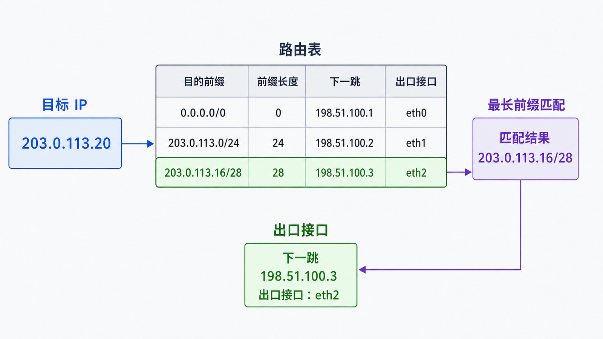
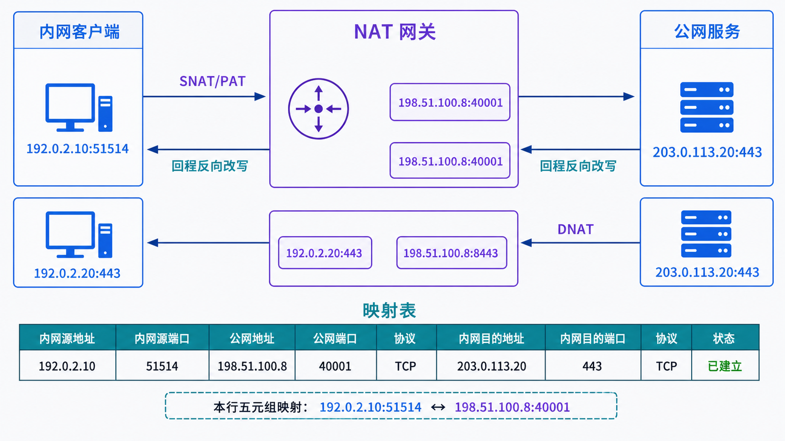

## 学习导航

**前置依赖**：CIDR、默认网关、端口尚可先理解为“进程编号”。

**核心问题**：路由器如何选择下一跳，边界设备又为什么要改写地址和端口？

学完后你应能区分路由、SNAT、DNAT、PAT 与应用代理，并能设计最小暴露面的端口映射。

## 场景与直觉

内网客户端 `192.0.2.10:51514` 访问公网 `203.0.113.20:443`。边界 NAT 可能把源改成 `198.51.100.8:40001`。返回包命中状态表后再还原为内网五元组。

## 核心机制

<!-- network-figure:s04-f01:start -->



<!-- network-figure:s04-f01:end -->

路由器对目的 IP 做最长前缀匹配，得到出接口与下一跳。NAT 是边界上的地址改写机制，PAT 进一步利用端口让多个内网连接共享一个公网地址。

| 机制     | 改写方向             | 典型用途                               |
| -------- | -------------------- | -------------------------------------- |
| SNAT/PAT | 改源地址或源端口     | 内网主动访问外网                       |
| DNAT     | 改目的地址或目的端口 | 把公网入口转到内网服务                 |
| 端口转发 | DNAT 加回程处理      | `198.51.100.8:8443` → `192.0.2.20:443` |
| 反向代理 | 终止并新建应用连接   | 按域名、路径或头部路由                 |

## 状态与调用链

<!-- network-figure:s04-f02:start -->



<!-- network-figure:s04-f02:end -->

有状态 NAT 必须记录正向和反向映射。若只配置入站 DNAT，却让回程绕过该设备，客户端会收到来源不一致的响应或根本收不到响应。

```text
客户端五元组
192.0.2.10:51514 -> 203.0.113.20:443/TCP
        |
        | SNAT/PAT
        v
198.51.100.8:40001 -> 203.0.113.20:443/TCP
```

## 最小可复现实验

下面只用于阅读规则语义，执行需要 Linux 管理权限并可能影响网络；不要在远程生产主机上直接照抄。

```bash
# 查看路由和连接跟踪状态，而不是立即改规则
ip route show
ss -nt
sudo conntrack -L 2>/dev/null | head
```

验证端口转发时应同时检查：入口监听、转发规则、内网服务、回程路由和防火墙计数器。

## 常见误区与适用边界

- NAT 不等于防火墙；没有显式入站映射并不代表不存在其他暴露路径。
- Docker/Kubernetes 的“端口映射”可能由 iptables/nftables、代理进程或数据平面共同实现，不能只凭命令表象判断。
- SSH 本地、远程和动态转发建立的是加密隧道或代理，不等同于通用路由器 DNAT。
- 端口可达只证明某个传输入口响应，不证明应用身份、权限或业务正确。

## 自检题

1. 为什么多个内网客户端可共享一个公网 IP？
2. DNAT 后回程绕过 NAT 设备可能出现什么问题？
3. 什么时候应选反向代理而不是四层端口转发？

<details>
<summary>查看答案</summary>

1. PAT 用不同外部源端口区分连接。2. 返回五元组无法被正确还原，连接失败。3. 需要 TLS 终止、按域名/路径路由、应用鉴权或可观测性时。

</details>

## 本篇总结

路由决定“往哪里走”，NAT/PAT 改写“报文看起来来自哪里或要到哪里”，端口转发则把入站入口绑定到内部服务。

## 下一篇

下一篇使用 ICMP、ping 和 traceroute 验证地址、路由与路径假设。

## 资料来源与版本基线

- [RFC 1812: Requirements for IPv4 Routers](https://www.rfc-editor.org/rfc/rfc1812.html)
- [RFC 3022: Traditional IP Network Address Translator](https://www.rfc-editor.org/rfc/rfc3022.html)
- [RFC 4787: NAT Behavioral Requirements for UDP](https://www.rfc-editor.org/rfc/rfc4787.html)
