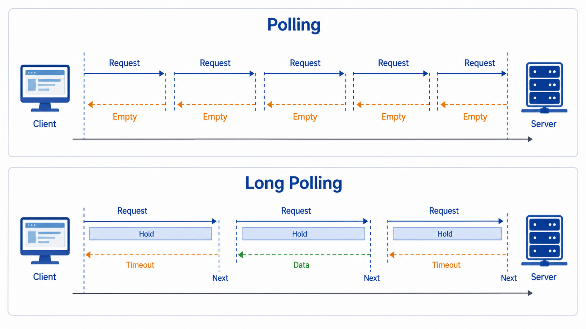

## 概述

在 Web 实时通信中，轮询（Polling）和长轮询（Long Polling）是两种实现服务端推送的经典技术。虽然 WebSocket 提供了更优雅的解决方案，但在某些场景下，了解这两种技术仍然非常重要。



```
┌─────────────────────────────────────────────────────────────────┐
│                      实时通信技术对比                            │
├─────────────────────────────────────────────────────────────────┤
│                                                                  │
│   Polling    ──────▶│◀──────▶│◀──────▶│◀──────▶│◀────────       │
│                     定时请求  定时请求  定时请求  定时请求        │
│                                                                  │
│   Long Polling ────▶│◀──────────────│◀─────────────────▶       │
│                     建立连接   等待   返回数据  重新建立          │
│                                                                  │
│   WebSocket ──────────────────▶│◀────────────────────────       │
│                     建立一次连接，持续双向通信                   │
│                                                                  │
└─────────────────────────────────────────────────────────────────┘
```

## 一、Polling（轮询）

### 1.1 什么是轮询

轮询是一种客户端定期向服务器发送请求以检查更新数据的技术。服务器返回最新数据（或空响应），客户端根据响应更新界面。

### 1.2 工作原理

```
客户端                        服务器
    │                            │
    │──── GET /api/events ──────▶│  请求获取最新事件
    │                            │
    │◀─── 200 OK [{event: 1}] ───│  返回事件数据
    │                            │
    │    [处理数据，更新界面]     │
    │                            │
    │──── GET /api/events ──────▶│  3秒后再次请求
    │                            │
    │◀─── 200 OK [{event: 1}] ───│  无新数据
    │                            │
    │    [处理数据，无更新]       │
    │                            │
    │──── GET /api/events ──────▶│  3秒后再次请求
    │                            │
    │◀─── 200 OK [{event: 2}] ───│  有新数据
    │                            │
    │    [处理数据，更新界面]     │
    │                            │
```

### 1.3 客户端实现

#### 原生 JavaScript 实现

```javascript
class PollingClient {
    constructor(url, interval = 3000) {
        this.url = url;
        this.interval = interval;
        this.timer = null;
        this.isRunning = false;
        this.lastEventId = 0;
    }

    start() {
        if (this.isRunning) return;
        this.isRunning = true;
        this.poll();
    }

    poll() {
        if (!this.isRunning) return;

        fetch(`${this.url}?lastId=${this.lastEventId}`)
            .then(response => response.json())
            .then(data => {
                this.handleData(data);
            })
            .catch(error => {
                console.error('轮询失败:', error);
            })
            .finally(() => {
                // 无论成功失败，都继续轮询
                this.timer = setTimeout(() => this.poll(), this.interval);
            });
    }

    handleData(data) {
        if (data.events && data.events.length > 0) {
            data.events.forEach(event => {
                console.log('收到事件:', event);
                this.lastEventId = event.id;
                this.onEvent(event);
            });
        }
    }

    onEvent(event) {
        // 子类重写此方法处理事件
        console.log('处理事件:', event);
    }

    stop() {
        this.isRunning = false;
        if (this.timer) {
            clearTimeout(this.timer);
            this.timer = null;
        }
    }
}

// 使用示例
const client = new PollingClient('/api/events', 2000);
client.start();
```

#### 带背压控制的轮询

```javascript
class AdaptivePollingClient {
    constructor(url) {
        this.url = url;
        this.baseInterval = 1000;
        this.minInterval = 500;
        this.maxInterval = 30000;
        this.currentInterval = this.baseInterval;
        this.consecutiveEmpty = 0;
    }

    async poll() {
        try {
            const response = await fetch(this.url);
            const data = await response.json();

            if (data.hasUpdate) {
                this.consecutiveEmpty = 0;
                this.currentInterval = this.baseInterval;
                this.handleUpdate(data);
            } else {
                this.consecutiveEmpty++;
                // 指数退避，避免无意义请求
                this.currentInterval = Math.min(
                    this.currentInterval * 1.5,
                    this.maxInterval
                );
            }
        } catch (error) {
            console.error('请求失败:', error);
            this.currentInterval = this.maxInterval;
        }

        setTimeout(() => this.poll(), this.currentInterval);
    }

    handleUpdate(data) {
        console.log('收到更新:', data);
    }

    start() {
        this.poll();
    }
}
```

### 1.4 服务端实现

#### Express.js 实现

```javascript
const express = require('express');
const app = express();

// 模拟事件存储
let events = [
    { id: 1, message: '系统启动', timestamp: Date.now() }
];

// 获取事件接口
app.get('/api/events', (req, res) => {
    const lastId = parseInt(req.query.lastId) || 0;
    const newEvents = events.filter(e => e.id > lastId);

    res.json({
        events: newEvents,
        serverTime: Date.now()
    });
});

// 添加新事件（用于测试）
app.post('/api/events', (req, res) => {
    const event = {
        id: events.length + 1,
        message: req.body.message,
        timestamp: Date.now()
    };
    events.push(event);
    res.json({ success: true, event });
});

app.listen(3000);
```

#### Flask 实现

```python
from flask import Flask, jsonify, request
import time

app = Flask(__name__)

events = [{'id': 1, 'message': '系统启动', 'timestamp': int(time.time() * 1000)}]

@app.route('/api/events', methods=['GET'])
def get_events():
    last_id = int(request.args.get('lastId', 0))
    new_events = [e for e in events if e['id'] > last_id]

    return jsonify({
        'events': new_events,
        'serverTime': int(time.time() * 1000)
    })

@app.route('/api/events', methods=['POST'])
def add_event():
    event = {
        'id': len(events) + 1,
        'message': request.json.get('message', ''),
        'timestamp': int(time.time() * 1000)
    }
    events.append(event)
    return jsonify({'success': True, 'event': event})
```

### 1.5 优缺点分析

| 优点 | 缺点 |
|------|------|
| 实现简单，易于理解 | 高频请求浪费带宽和服务器资源 |
| 兼容性极好（所有浏览器） | 延迟取决于轮询间隔 |
| 无需服务端特殊支持 | 可能产生大量无效请求 |
| 易于调试和监控 | 频繁请求增加服务器负载 |
| 适合低频更新场景 | 不是真正的实时推送 |

### 1.6 适用场景

- 低频数据更新场景（如新闻、天气）
- 需要兼容老旧浏览器
- 简单状态监控
- 临时解决方案或原型开发

## 二、Long Polling（长轮询）

### 2.1 什么是长轮询

长轮询是轮询的改进版本。当客户端发送请求后，如果服务器没有新数据，服务器会**保持连接打开**，直到有新数据或超时才返回响应。相比普通轮询，大大减少了无效请求。

### 2.2 工作原理

```
客户端                        服务器
    │                            │
    │──── GET /api/events ──────▶│  请求获取最新事件
    │                            │
    │                            │  [暂无新数据，保持连接]
    │                            │
    │                            │  [等待...]
    │                            │
    │                            │  [有新数据到达]
    │                            │
    │◀─── 200 OK [{event: 2}] ───│  返回新事件
    │                            │
    │    [处理数据]               │
    │                            │
    │──── GET /api/events ──────▶│  立即发起下一次请求
    │                            │
    │                            │  [暂无新数据，保持连接]
    │                            │
    │                            │  [等待...]
    │                            │
    │◀─── 200 OK [{event: 3}] ───│  返回新事件
```

### 2.3 客户端实现

#### 原生 JavaScript 实现

```javascript
class LongPollingClient {
    constructor(url, options = {}) {
        this.url = url;
        this.timeout = options.timeout || 30000;  // 超时时间 30 秒
        this.retryDelay = options.retryDelay || 1000;  // 重试延迟
        this.lastEventId = 0;
        this.isRunning = false;
        this.abortController = null;
    }

    async poll() {
        if (!this.isRunning) return;

        this.abortController = new AbortController();
        const timeoutId = setTimeout(() => {
            this.abortController.abort();
        }, this.timeout);

        try {
            const response = await fetch(`${this.url}?lastId=${this.lastEventId}`, {
                signal: this.abortController.signal
            });

            clearTimeout(timeoutId);

            if (!response.ok) {
                throw new Error(`HTTP ${response.status}`);
            }

            const data = await response.json();
            await this.handleData(data);

        } catch (error) {
            if (error.name === 'AbortError') {
                console.log('请求超时，重新发起');
            } else {
                console.error('请求失败:', error);
                await this.delay(this.retryDelay);
            }
        }

        // 继续下一次轮询
        if (this.isRunning) {
            this.poll();
        }
    }

    async handleData(data) {
        if (data.events && data.events.length > 0) {
            for (const event of data.events) {
                this.lastEventId = Math.max(this.lastEventId, event.id);
                await this.onEvent(event);
            }
        }
    }

    async onEvent(event) {
        console.log('收到事件:', event);
    }

    delay(ms) {
        return new Promise(resolve => setTimeout(resolve, ms));
    }

    start() {
        this.isRunning = true;
        this.poll();
    }

    stop() {
        this.isRunning = false;
        if (this.abortController) {
            this.abortController.abort();
        }
    }
}

// 使用示例
const client = new LongPollingClient('/api/events', {
    timeout: 30000,
    retryDelay: 1000
});

client.onEvent = async (event) => {
    // 更新通知
    showNotification(event.message);
};

client.start();
```

#### 使用 async/await 的实现

```javascript
class AsyncLongPollingClient {
    constructor(url, options = {}) {
        this.url = url;
        this.timeout = options.timeout || 30000;
        this.retryDelay = options.retryDelay || 1000;
        this.lastEventId = 0;
        this.isRunning = false;
    }

    async poll() {
        while (this.isRunning) {
            try {
                const controller = new AbortController();
                const timeoutId = setTimeout(() => controller.abort(), this.timeout);

                const response = await fetch(`${this.url}?lastId=${this.lastEventId}`, {
                    signal: controller.signal
                });

                clearTimeout(timeoutId);

                if (response.ok) {
                    const data = await response.json();
                    this.handleData(data);
                }
            } catch (error) {
                console.error('轮询错误:', error);
                await this.sleep(this.retryDelay);
            }
        }
    }

    handleData(data) {
        if (data.events && data.events.length > 0) {
            data.events.forEach(event => {
                this.lastEventId = event.id;
                this.onEvent(event);
            });
        }
    }

    onEvent(event) {
        // 处理事件
        console.log('事件:', event);
    }

    sleep(ms) {
        return new Promise(resolve => setTimeout(resolve, ms));
    }

    start() {
        this.isRunning = true;
        this.poll();
    }

    stop() {
        this.isRunning = false;
    }
}
```

### 2.4 服务端实现

#### Express.js 实现（带超时控制）

```javascript
const express = require('express');
const app = express();

// 事件队列
const eventQueue = [];
const MAX_WAIT_TIME = 30000;  // 最大等待 30 秒

// 获取事件 - 长轮询实现
app.get('/api/events', (req, res) => {
    const lastId = parseInt(req.query.lastId) || 0;

    // 检查是否有新事件
    const newEvents = eventQueue.filter(e => e.id > lastId);

    if (newEvents.length > 0) {
        // 有新事件，立即返回
        return res.json({
            events: newEvents,
            serverTime: Date.now()
        });
    }

    // 无新事件，设置超时
    const timeoutId = setTimeout(() => {
        // 超时返回空结果
        if (!res.headersSent) {
            res.json({
                events: [],
                serverTime: Date.now(),
                timeout: true
            });
        }
    }, MAX_WAIT_TIME);

    // 监听新事件
    const checkInterval = setInterval(() => {
        const freshEvents = eventQueue.filter(e => e.id > lastId);
        if (freshEvents.length > 0) {
            clearTimeout(timeoutId);
            clearInterval(checkInterval);
            if (!res.headersSent) {
                res.json({
                    events: freshEvents,
                    serverTime: Date.now()
                });
            }
        }
    }, 500);  // 每 500ms 检查一次
});

// 添加事件（模拟推送）
app.post('/api/events', (req, res) => {
    const event = {
        id: Date.now(),
        message: req.body.message,
        timestamp: Date.now()
    };
    eventQueue.push(event);
    res.json({ success: true, event });
});

app.listen(3000);
```

#### Flask 实现（带事件机制）

```python
from flask import Flask, jsonify, request
import threading
import time

app = Flask(__name__)

event_queue = []
MAX_WAIT_TIME = 30  # 秒
lock = threading.Lock()

def wait_for_event(last_id, timeout):
    """等待新事件的辅助函数"""
    start_time = time.time()

    while time.time() - start_time < timeout:
        with lock:
            new_events = [e for e in event_queue if e['id'] > last_id]
            if new_events:
                return new_events

        time.sleep(0.5)  # 每 500ms 检查一次

    return []

@app.route('/api/events', methods=['GET'])
def get_events():
    last_id = int(request.args.get('lastId', 0))
    timeout = int(request.args.get('timeout', MAX_WAIT_TIME))

    # 限制超时时间
    timeout = min(timeout, MAX_WAIT_TIME)

    events = wait_for_event(last_id, timeout)

    return jsonify({
        'events': events,
        'serverTime': int(time.time() * 1000)
    })

@app.route('/api/events', methods=['POST'])
def add_event():
    event = {
        'id': int(time.time() * 1000),
        'message': request.json.get('message', ''),
        'timestamp': int(time.time() * 1000)
    }

    with lock:
        event_queue.append(event)

    return jsonify({'success': True, 'event': event})
```

### 2.5 优缺点分析

| 优点 | 缺点 |
|------|------|
| 比普通轮询减少无效请求 | 实现比普通轮询复杂 |
| 延迟接近实时（事件发生时） | 服务器需要维持长连接 |
| 节省带宽和服务器资源 | 需要正确处理超时和重连 |
| 兼容性仍然很好 | 并发连接数仍然较高 |

### 2.6 适用场景

- 中等实时性需求（秒级延迟可接受）
- 消息通知系统
- 在线客服
- 多人协作场景（轻量级）
- 需要良好兼容性但又需要实时性

## 三、Polling vs Long Polling 对比

### 3.1 核心对比

| 对比项 | Polling | Long Polling |
|--------|---------|--------------|
| **请求频率** | 固定间隔（通常 1-5 秒） | 有数据时立即返回，无数据时等待 |
| **响应延迟** | 最大等于轮询间隔 | 接近实时 |
| **请求数量** | 多（每个间隔都请求） | 少（按需请求） |
| **服务器负载** | 较高 | 较低 |
| **网络开销** | 较大 | 较小 |
| **实现复杂度** | 低 | 中 |
| **适用更新频率** | 低/中 | 中/高 |

### 3.2 时序对比图

```
Polling（间隔 5 秒）:

时间  0s    5s    10s    15s    20s    25s    30s
     │      │      │      │      │      │      │
客户端  ──▶   ──▶   ──▶   ──▶   ──▶   ──▶   ──▶
     ◀─┘    ◀─┘    ◀─┘    ◀─┘    ◀─┘    ◀─┘    ◀─┘
     响应    响应    响应    响应    响应    响应    响应
             ↑                                        ↑
         新事件                        新事件（延迟5秒）

Long Polling:

时间  0s              8s              16s              24s
     │                │                │                │
客户端  ───────────▶ │ ◀───────────── │ ◀─────────────
               保持连接        返回新事件    新事件到达
                            立即再次请求
                    ↑                ↑
                新事件              新事件（延迟 0 秒）
```

### 3.3 选择建议

```
选择决策树：

是否需要接近实时的更新？
    │
    ├── 否 → 选择 Polling（简单实现，低频更新）
    │
    └── 是 → 考虑以下因素：
                │
                ├── 需要双向通信？ → 选择 WebSocket
                │
                ├── 只支持简单轮询？ → 选择 Long Polling
                │
                └── 需要兼容老旧浏览器？ → 选择 Long Polling
```

## 四、与 WebSocket 对比

### 4.1 技术对比

| 对比项 | Polling | Long Polling | WebSocket |
|--------|---------|--------------|-----------|
| **协议** | HTTP | HTTP | WebSocket |
| **连接方式** | 短连接 | 长连接 | 持久连接 |
| **通信方向** | 半双工 | 半双工 | 全双工 |
| **实时性** | 较低 | 中等 | 高 |
| **服务器负载** | 高 | 中 | 低 |
| **复杂度** | 低 | 中 | 中 |
| **兼容性** | 最佳 | 好 | 需要浏览器支持 |
| **断线重连** | 自动 | 需要手动处理 | 需要手动处理 |

### 4.2 性能对比

```python
# 假设场景：每分钟有 10 次更新

"""
Polling（每 3 秒轮询一次）：
- 60 秒内发送 20 次请求
- 其中 10 次返回新数据，10 次空响应
- 带宽消耗：较高

Long Polling（平均等待 3 秒）：
- 60 秒内发送 10 次请求
- 每次请求都返回新数据
- 带宽消耗：中等

WebSocket（持续连接）：
- 建立 1 次连接
- 60 秒内无 HTTP 开销
- 服务器推送 10 次
- 带宽消耗：最低
"""
```

### 4.3 选择指南

| 场景 | 推荐方案 | 理由 |
|------|----------|------|
| 低频更新（分钟级） | Polling | 实现简单，足够用 |
| 中等实时性（秒级） | Long Polling | 减少无效请求 |
| 高实时性（毫秒级） | WebSocket | 全双工，低延迟 |
| 需要服务器推送 | WebSocket | 真正的服务器推送 |
| 兼容老旧浏览器 | Long Polling | HTTP 兼容性最好 |
| 临时/简单实现 | Polling | 最简单 |
| 生产环境高并发 | WebSocket | 性能最优 |

## 五、实际应用示例

### 5.1 消息通知系统（Long Polling）

```javascript
class NotificationSystem {
    constructor() {
        this.pollingClient = null;
        this.notifications = [];
    }

    init() {
        this.pollingClient = new LongPollingClient('/api/notifications', {
            timeout: 25000,  // 留 5 秒余量
            retryDelay: 2000
        });

        this.pollingClient.onEvent = (notification) => {
            this.handleNotification(notification);
        };

        this.pollingClient.start();
    }

    handleNotification(notification) {
        this.notifications.unshift(notification);
        this.showToast(notification);
        this.updateBadge();
    }

    showToast(notification) {
        console.log('新通知:', notification);
        // 实现 toast 逻辑
    }

    updateBadge() {
        const badge = document.getElementById('notification-badge');
        badge.textContent = this.notifications.length;
        badge.style.display = this.notifications.length > 0 ? 'block' : 'none';
    }

    destroy() {
        if (this.pollingClient) {
            this.pollingClient.stop();
        }
    }
}
```

### 5.2 股票行情系统（Long Polling）

```javascript
class StockTicker {
    constructor(symbols) {
        this.symbols = symbols;
        this.prices = {};
        this.client = null;
    }

    start() {
        this.client = new LongPollingClient('/api/quotes', {
            timeout: 20000
        });

        this.client.onEvent = (quote) => {
            this.updatePrice(quote);
        };

        this.client.start();
    }

    updatePrice(quote) {
        const oldPrice = this.prices[quote.symbol];
        this.prices[quote.symbol] = quote.price;

        // 价格变化时高亮显示
        if (oldPrice && oldPrice !== quote.price) {
            const direction = quote.price > oldPrice ? 'up' : 'down';
            this.highlightChange(quote.symbol, direction);
        }

        this.renderPrice(quote);
    }

    renderPrice(quote) {
        console.log(`${quote.symbol}: ${quote.price}`);
    }

    highlightChange(symbol, direction) {
        const element = document.querySelector(`[data-symbol="${symbol}"]`);
        element.classList.add(`price-${direction}`);
        setTimeout(() => element.classList.remove(`price-${direction}`), 500);
    }
}
```

### 5.3 服务端实现（带事件订阅）

```python
from flask import Flask, jsonify, request
import threading
import time

app = Flask(__name__)

class EventBus:
    def __init__(self):
        self.subscribers = {}
        self.lock = threading.Lock()

    def subscribe(self, client_id, last_event_id=0):
        with self.lock:
            self.subscribers[client_id] = {
                'last_event_id': last_event_id,
                'condition': threading.Condition()
            }
        return self.wait_for_events(client_id, 25)  # 25秒超时

    def wait_for_events(self, client_id, timeout):
        with self.lock:
            subscriber = self.subscribers.get(client_id)
            if not subscriber:
                return []

        with subscriber['condition']:
            # 等待新事件或超时
            subscriber['condition'].wait(timeout=timeout)

        with self.lock:
            subscriber = self.subscribers.get(client_id)
            if not subscriber:
                return []

            last_id = subscriber['last_event_id']
            events = self.get_new_events(client_id, last_id)
            subscriber['last_event_id'] = max([e['id'] for e in events] or [last_id])

        return events

    def publish(self, event_type, data):
        with self.lock:
            event = {
                'id': int(time.time() * 1000),
                'type': event_type,
                'data': data,
                'timestamp': time.time()
            }

            for client_id, subscriber in self.subscribers.items():
                subscriber['condition'].notify_all()

            return event

    def get_new_events(self, client_id, last_id):
        # 实际从数据库或缓存获取
        return []

event_bus = EventBus()

@app.route('/api/subscribe', methods=['GET'])
def subscribe():
    client_id = request.headers.get('X-Client-ID', 'default')
    last_id = int(request.args.get('lastId', 0))
    events = event_bus.subscribe(client_id, last_id)

    return jsonify({
        'events': events,
        'serverTime': int(time.time() * 1000)
    })

@app.route('/api/publish', methods=['POST'])
def publish():
    event_type = request.json.get('type')
    data = request.json.get('data')
    event = event_bus.publish(event_type, data)
    return jsonify({'success': True, 'event': event})
```

## 六、最佳实践

### 6.1 错误处理和重连

```javascript
class ResilientPollingClient {
    constructor(url, options = {}) {
        this.url = url;
        this.options = options;
        this.maxRetries = options.maxRetries || 5;
        this.retryCount = 0;
        this.baseDelay = options.retryDelay || 1000;
    }

    async poll() {
        while (true) {
            try {
                await this.fetchEvents();
                this.retryCount = 0;
            } catch (error) {
                this.retryCount++;
                if (this.retryCount >= this.maxRetries) {
                    console.error('重试次数超过限制');
                    this.onMaxRetriesExceeded();
                    break;
                }

                const delay = this.calculateBackoff();
                console.log(`${delay}ms 后重试...`);
                await this.sleep(delay);
            }
        }
    }

    calculateBackoff() {
        // 指数退避 + 随机抖动
        const exponentialDelay = this.baseDelay * Math.pow(2, this.retryCount);
        const jitter = Math.random() * 1000;
        return Math.min(exponentialDelay + jitter, 30000);
    }

    async fetchEvents() {
        // 实现获取事件逻辑
    }

    sleep(ms) {
        return new Promise(resolve => setTimeout(resolve, ms));
    }

    onMaxRetriesExceeded() {
        // 最大重试次数超过后的处理
    }
}
```

### 6.2 连接状态管理

```javascript
class ConnectionManager {
    constructor() {
        this.isConnected = false;
        this.listeners = {
            connect: [],
            disconnect: [],
            error: []
        };
    }

    on(event, callback) {
        if (this.listeners[event]) {
            this.listeners[event].push(callback);
        }
    }

    emit(event, data) {
        if (this.listeners[event]) {
            this.listeners[event].forEach(cb => cb(data));
        }
    }

    setConnected(value) {
        const wasConnected = this.isConnected;
        this.isConnected = value;

        if (!wasConnected && value) {
            this.emit('connect');
        } else if (wasConnected && !value) {
            this.emit('disconnect');
        }
    }
}
```

## 七、总结对比

### 7.1 快速参考

| 特性 | Polling | Long Polling | WebSocket |
|------|---------|--------------|-----------|
| **请求频率** | 固定间隔 | 按需 | 持续 |
| **延迟** | 轮询间隔 | 接近实时 | 实时 |
| **实现难度** | ⭐ | ⭐⭐ | ⭐⭐ |
| **服务器负载** | ⭐⭐⭐ | ⭐⭐ | ⭐ |
| **带宽使用** | 较高 | 中等 | 低 |
| **兼容性** | 最佳 | 好 | 中 |

### 7.2 选型建议

```
┌────────────────────────────────────────────────────────────┐
│                      选型决策                             │
├────────────────────────────────────────────────────────────┤
│                                                            │
│  更新频率低（分钟级）→ Polling                              │
│                                                            │
│  更新频率中（秒级）  → Long Polling                        │
│                                                            │
│  更新频率高（毫秒级）→ WebSocket                           │
│                                                            │
│  需要兼容旧浏览器  → Long Polling                          │
│                                                            │
│  简单原型/临时方案 → Polling                               │
│                                                            │
│  生产环境高并发   → WebSocket                              │
│                                                            │
└────────────────────────────────────────────────────────────┘
```

> 相关阅读：
> - [WebSocket 协议原理和使用方法](/网络/WebSocket-协议原理和使用方法) - WebSocket 详细介绍
> - [HTTP 协议：请求方法、状态码、头部字段](/网络/HTTP-协议：请求方法、状态码、头部字段) - HTTP 协议基础
> - [长连接、短连接与心跳包](/网络/长连接、短连接与心跳包) - 连接管理机制
