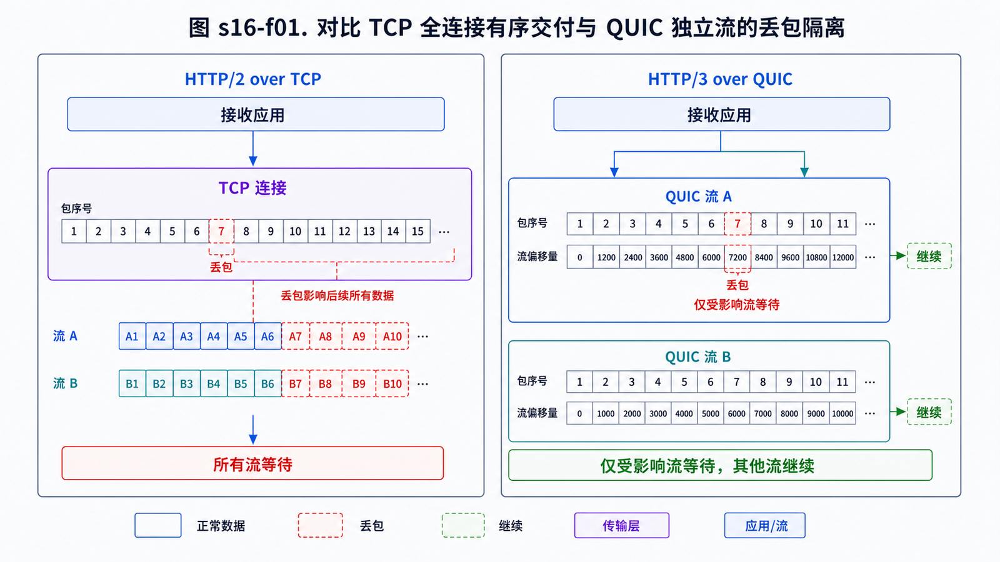
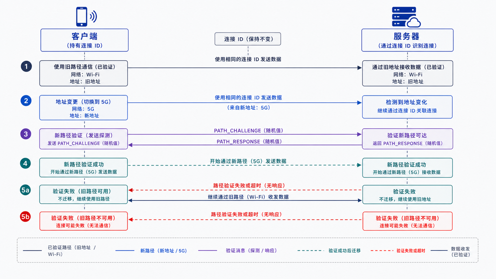

## 学习导航

**前置依赖**：UDP、TCP 拥塞控制、HTTP/2 流和 TLS 1.3。

**核心问题**：QUIC 如何在 UDP 之上提供可靠多流传输，并避免一个流的丢包阻塞其他流？

## 场景与直觉

HTTP/2 的流最终共享 TCP 字节序列。QUIC 将可靠、有序交付限定在每个流内；一个流丢失数据时，其他流仍可处理已完整到达的数据。QUIC 本身不是“无序协议”，而是按流提供顺序。

## 核心机制

<!-- network-figure:s16-f01:start -->



<!-- network-figure:s16-f01:end -->

QUIC v1 把传输握手与 TLS 1.3 密钥建立集成，提供连接级与流级流量控制、丢包检测、拥塞控制和连接 ID。HTTP/3 把 HTTP 语义映射到 QUIC 流，并使用 QPACK 压缩字段。

```text
HTTP semantics
  -> HTTP/3 frames + QPACK
  -> QUIC streams / recovery / flow control
  -> TLS 1.3 packet protection
  -> UDP / IP
```

## 状态与失败边界

<!-- network-figure:s16-f02:start -->



<!-- network-figure:s16-f02:end -->

QUIC 使用 Packet Number 空间和 ACK range 进行确认；重传的是丢失帧承载的信息，而不是原 UDP 数据报的字节副本。连接 ID 允许网络地址变化后继续识别连接，但迁移仍需路径验证。

0-RTT 可在恢复连接时提前发送应用数据，仍受重放边界约束。UDP 被网络阻断时，客户端通常需要回退到基于 TCP 的 HTTP 版本。

## 最小可复现实验

```bash
curl --version
curl --http3-only -I -v https://www.example.com/
```

先确认 curl 构建包含 HTTP/3。失败时区分“不支持该选项”“UDP/QUIC 建连失败”“TLS/证书失败”和“HTTP 响应失败”。

## 常见误区与适用边界

- QUIC 使用 UDP 不代表不可靠；可靠性由 QUIC 实现。
- HTTP/3 仍可能发生同一流内的阻塞和 QPACK 相关等待。
- 连接迁移不是绕过鉴权，应用会话仍需验证。
- 在无丢包、短 RTT 环境中，HTTP/3 不保证一定比成熟 HTTP/2 更快。

## 自检题

1. QUIC 如何缩小队头阻塞范围？
2. Connection ID 为什么有助于网络切换？
3. HTTP/3 建连失败时为什么要保留回退策略？

<details>
<summary>查看答案</summary>

1. 有序交付按流维护，一个流的缺口不阻塞其他流。2. 地址变化后仍可关联同一逻辑连接，并通过路径验证迁移。3. 某些网络会屏蔽或限制 UDP，服务仍需可达。

</details>

## 本篇总结

QUIC 将安全握手、可靠多流和连接迁移组合到用户态传输协议中；HTTP/3 则复用 HTTP 语义并适配该传输模型。

## 下一篇

下一篇回到部署边界，比较正向代理、反向代理和负载均衡。

## 资料来源与版本基线

- [RFC 9000: QUIC Transport](https://www.rfc-editor.org/rfc/rfc9000.html)
- [RFC 9001: Using TLS to Secure QUIC](https://www.rfc-editor.org/rfc/rfc9001.html)
- [RFC 9114: HTTP/3](https://www.rfc-editor.org/rfc/rfc9114.html)
