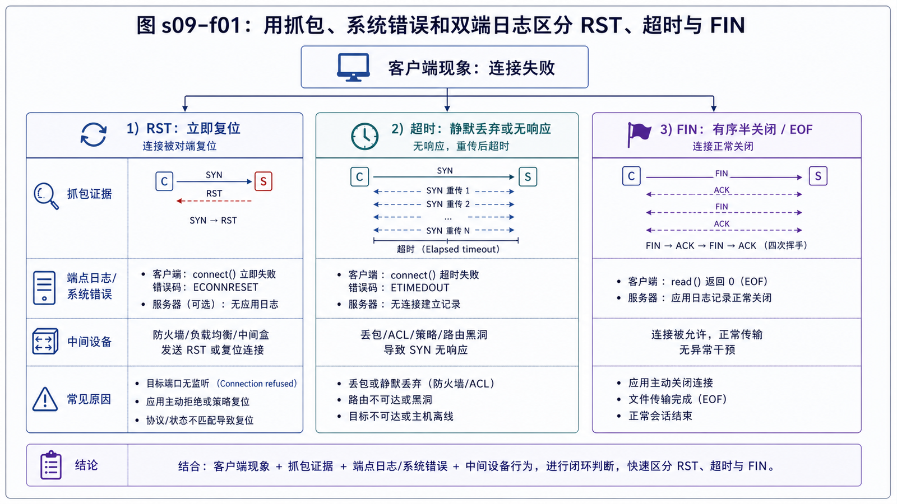

## 学习导航

**前置依赖**：TCP 状态机、ACK、重传和窗口。

**核心问题**：应用看到 `connection reset` 或超时时，怎样判断是谁、在什么状态、因为什么终止了连接？

## 场景与直觉

FIN 表示有序关闭一个发送方向；RST 表示连接被立即中止；超时则意味着在期限内没有得到足够反馈。三者对重试、幂等和数据完整性的影响不同。

## 核心机制

常见 RST 场景包括：连接到未监听端口、应用使用 abortive close、主机没有对应连接状态、中间设备主动阻断、收到不符合当前窗口/状态的段。不能只凭“抓到 RST”就断言是服务器应用主动拒绝。

Keepalive 是长时间空闲后的 TCP 级探测，默认参数常以小时计；它不携带业务语义，也不能替代应用心跳。应用超时则是业务对“最多等待多久”的决策。

## 证据链

<!-- network-figure:s09-f01:start -->



<!-- network-figure:s09-f01:end -->

```text
应用异常与时间
  -> 本机 socket 状态/错误码
  -> 双端日志与请求 ID
  -> 双端或边界抓包
  -> RST 的源地址、序列号、前序报文
  -> NAT、负载均衡、防火墙的空闲超时
```

只在单点抓包可能受硬件卸载、NAT 和非对称路由影响；关键故障应尽量获取两端证据。

## 最小可复现实验

```python
import socket

sock = socket.socket()
sock.settimeout(0.2)
try:
    sock.connect(("192.0.2.1", 9))
except (ConnectionRefusedError, TimeoutError, OSError) as exc:
    print(type(exc).__name__, str(exc))
finally:
    sock.close()
```

文档地址的结果取决于本机路由和防火墙；实验重点是区分“立即拒绝”和“等待超时”，不是要求固定错误文本。

## 常见误区与适用边界

- RST 不等于丢包，反而是一条明确的终止反馈。
- 超时不等于对端宕机，也可能是路径过滤、回程路由或队列延迟。
- 盲目重试非幂等请求可能制造重复副作用。
- TCP Keepalive 参数是系统级机制，应用仍应定义自己的租约、心跳和截止时间。

## 自检题

1. FIN 与 RST 对未读数据的语义有何不同？
2. 客户端立即收到拒绝与等待 30 秒超时，排障方向有何不同？
3. 为什么只看一侧抓包可能误判 RST 来源？

<details>
<summary>查看答案</summary>

1. FIN 是有序关闭，RST 立即中止且未消费数据可能丢失。2. 立即拒绝通常说明目标可达但端口/策略拒绝；超时更像静默丢弃、路由或严重拥塞。3. NAT、代理、非对称路径及抓包位置会改写或隐藏真实端点。

</details>

## 本篇总结

复位、超时和正常关闭是不同终态。定位时必须结合连接状态、前序报文、双端日志和中间设备超时。

## 下一篇

下一篇上升到应用连接管理，设计长短连接、连接池、心跳与重连。

## 资料来源与版本基线

- [RFC 9293: Transmission Control Protocol](https://www.rfc-editor.org/rfc/rfc9293.html)
- [RFC 5961: Improving TCP's Robustness to Blind In-Window Attacks](https://www.rfc-editor.org/rfc/rfc5961.html)
