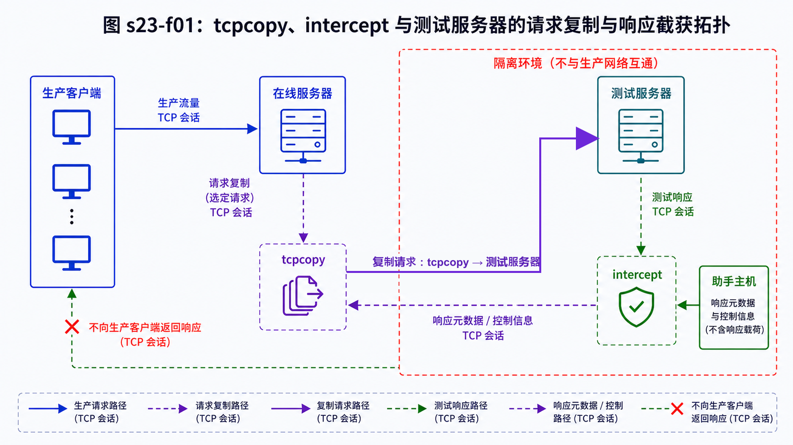
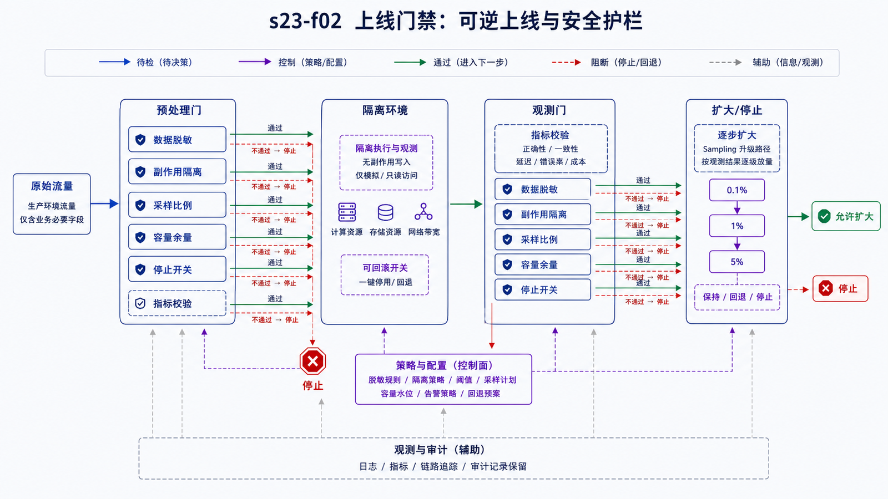

## 学习导航

**前置依赖**：TCP 状态机、NAT/路由、性能测试和应用幂等性。

**核心问题**：如何把生产请求复制到隔离测试系统，同时避免响应干扰生产、数据泄露和重复副作用？

## 场景与直觉

合成压测难以覆盖真实请求分布。TCPCopy 可在网络层复制在线 TCP 请求到测试环境，并配合 intercept 处理返回路径，使测试系统完成 TCP 交互而不把响应发回真实客户端。

## 核心机制

<!-- network-figure:s23-f01:start -->



<!-- network-figure:s23-f01:end -->

```text
Real Client -> Online Server
                 |
                 | copied request packets
                 v
             Test Server -> intercept
```

工具处理的是 TCP 流量，不理解订单、付款或用户隐私。能重放不等于可以安全重放；测试环境必须隔离外部写依赖、通知、支付和真实账号。

## 状态与数据边界

复制链路要保持必要的 TCP 状态、路由和响应截获。测试服务若回连生产数据库、消息队列或第三方 API，复制请求可能造成真实副作用。敏感字段应在进入测试边界前脱敏，访问权限和留存周期应审计。

## 最小验证流程

```bash
# 仅查看已安装版本；参数以实际版本官方文档为准
tcpcopy -v
intercept -v
```

本机未安装 TCPCopy，因此不伪造可运行部署命令。落地时先在完全隔离的实验网验证单连接，再逐步增加采样率，并同时比较请求结构、成功率、延迟分布和测试系统资源。

## 安全上线清单

<!-- network-figure:s23-f02:start -->



<!-- network-figure:s23-f02:end -->

1. 测试系统使用独立数据库、消息队列、凭据和域名；
2. 外部支付、短信、邮件和 Webhook 默认阻断；
3. 定义脱敏规则、采样比例、带宽和停止开关；
4. 记录工具版本、内核/路由配置和丢包情况；
5. 结果只用于当前复制模型，不能自动等价为真实客户端体验。

## 常见误区与适用边界

- 流量复制不是端到端回放，真实客户端网络和响应消费行为未被完整复制。
- 网络层复制不能自动维护应用幂等性。
- 测试环境更慢可能反过来造成复制链路积压，需监控工具本身。
- 加密流量复制到测试服务时仍涉及证书、密钥和数据合规边界。

## 自检题

1. 为什么必须阻断测试系统的外部副作用？
2. intercept 在拓扑中解决什么问题？
3. 复制流量的性能结果为什么不能直接等同真实用户体验？

<details>
<summary>查看答案</summary>

1. 复制请求可能重复付款、通知或写入真实数据。2. 处理测试服务返回包，使 TCP 交互成立且响应不干扰真实客户端。3. 客户端网络、响应读取、TLS/代理链和采样方式可能不同。

</details>

## 本篇总结

真实流量复制首先是安全与实验设计问题，其次才是工具命令。隔离、脱敏、停止开关和可验证拓扑是上线前置条件。

## 下一篇

本篇是系列终点。建议回到第一篇，沿一次请求重新解释每层地址、状态、缓存、安全与性能证据，完成全链路复盘。

## 资料来源与版本基线

- [TCPCopy 官方仓库](https://github.com/session-replay-tools/tcpcopy)
- [RFC 9293: Transmission Control Protocol](https://www.rfc-editor.org/rfc/rfc9293.html)
