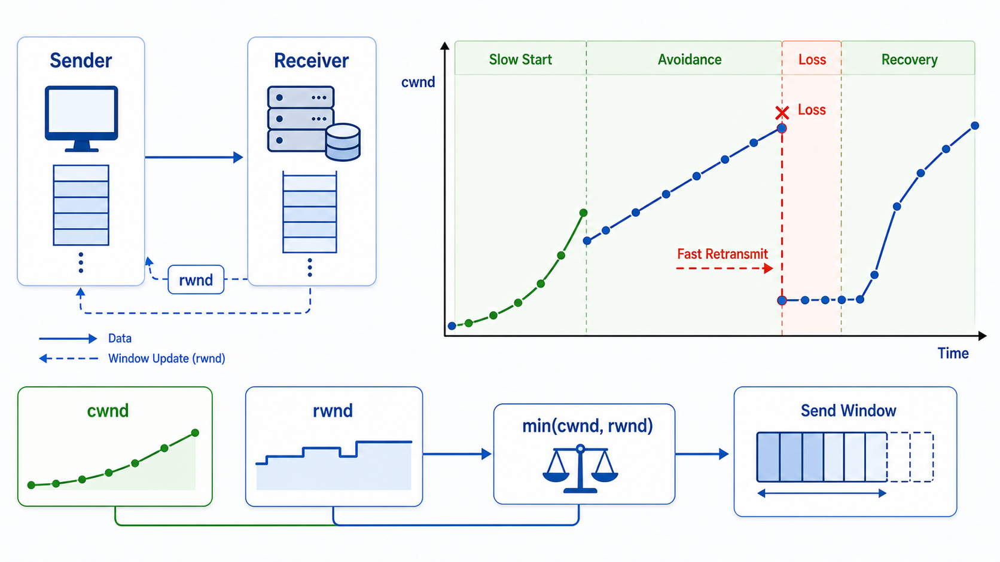

## 概述

本篇文章深入探讨 TCP 的流量控制和拥塞控制机制，这是保证网络稳定高效运行的关键技术。



## 滑动窗口详解

### 窗口结构

```python
# 滑动窗口示意
┌─────────────────────────────────────────────────────────────────┐
│  已发送已确认 │   已发送未确认   │    可发送    │   不能发送   │
│              │   (在飞数据)     │  (窗口内)    │   (窗口外)   │
├──────────────┼──────────────────┼──────────────┼──────────────┤
│              │    SND.UNA      │   SND.NXT    │              │
│              │◀─── SND.WND ────▶│              │              │
└─────────────────────────────────────────────────────────────────┘

# 指针位置
SND.UNA：窗口左边界（第一个未确认字节）
SND.NXT：下一个可发送字节
SND.WND：窗口大小
```

### 发送窗口变化

```python
# 初始状态
发送窗口：[0, 1000)
已发送：0-999
已确认：0-999

# 数据被确认后，窗口右移
发送窗口：[1000, 2000)

# 窗口收缩
如果 rwnd 变小，窗口同步缩小
```

### 接收窗口

```python
# 接收方窗口结构
┌─────────────────────────────────────────────────────────────────┐
│  已读取  │        可接收           │      不能接收       │
├──────────┼─────────────────────────┼────────────────────────────┤
│          │         RCV.NXT         │                          │
│          │◀───────── RCV.WND ──────▶│                          │
└─────────────────────────────────────────────────────────────────┘

# 接收方通告窗口大小
# 告诉发送方自己还有多少缓冲区空间
```

## 流量控制

### 原理

```python
# 流量控制目的
防止发送方发送过快，导致接收方缓冲区溢出

# 工作机制
接收方定期向发送方通告（advertised window）
发送方不能超过通告的窗口大小发送数据
```

### Zero Window 问题

```python
# 接收方缓冲区满
window = 0

# 发送方停止发送

# 定期发送 Zero Window Probe
# 询问接收方窗口是否打开

# 接收方恢复
window = 4096
ACK 携带新的窗口大小
```

### 窗口探测机制

```bash
# Zero Window Probe
发送方每 45-60 秒发送探测
接收方返回当前窗口大小

# 探测次数
超过一定次数认为连接失效
触发 RST 断开连接
```

## 拥塞控制

### 为什么要拥塞控制

```python
# 网络拥塞
- 路由器缓冲区满
- 丢包率增加
- 延迟增大
- 网络性能下降

# 拥塞控制目标
1. 避免网络过载
2. 公平分配带宽
3. 最大化网络利用率
```

### 拥塞控制算法

```
         慢启动                拥塞避免
           │                      │
           ▼                      ▼
    ┌────────────┐          ┌────────────┐
    │ cwnd 指数   │─────────▶│ cwnd 线性  │
    │   增长      │          │   增长     │
    └────────────┘          └────────────┘
           │                      │
           ▼                      ▼
    ┌────────────┐          ┌────────────┐
    │ ssthresh   │          │  丢包/超时  │
    │   阈值     │          │  降窗口     │
    └────────────┘          └────────────┘
```

### 慢启动（Slow Start）

```python
# 慢启动算法
cwnd = 1 MSS
ssthresh = 65535 bytes

# 每收到一个 ACK，cwnd 增加一个 MSS
# 指数增长

# 示例
轮次 1: cwnd = 1
轮次 2: cwnd = 2
轮次 3: cwnd = 4
轮次 4: cwnd = 8
...
直到达到 ssthresh 或发生丢包
```

### 拥塞避免（Congestion Avoidance）

```python
# 进入条件
cwnd >= ssthresh

# 算法
每收到一个 ACK，cwnd += MSS * MSS / cwnd
# 线性增长，接近加法增长

# 示例
假设 cwnd = 10 MSS，收到 10 个 ACK
cwnd += 10 * (1/10) = 11 MSS
```

### 快速重传与快速恢复

```python
# 快速重传触发条件
收到 3 个重复 ACK（dup ACKs）

# 快速重传
立即重传丢失的报文段

# 快速恢复
ssthresh = cwnd / 2
cwnd = ssthresh + 3 * MSS
# 继续发送新的数据

# 为什么加 3
因为收到 3 个重复 ACK
说明 3 个报文段已到达接收方
```

### 超时重传

```python
# 超时触发
RTO 超时未收到 ACK

# 处理
ssthresh = cwnd / 2
cwnd = 1 MSS
# 重新进入慢启动
```

### 拥塞控制状态图

```
          初始状态
              │
              ▼
         cwnd = 1
              │
         ┌────┴────┐
         │         │
         ▼         ▼
     cwnd < ssthresh   cwnd >= ssthresh
         │         │
         ▼         ▼
    慢启动        拥塞避免
         │         │
         │    ┌────┴────┐
         │    │         │
         │    ▼         ▼
         │  3 dup ACK   超时
         │    │         │
         │    ▼         ▼
         │ 快速恢复   慢启动
         │    │         │
         │    └────┬────┘
         │         │
         └────►回到拥塞避免◄────┘
```

## cwnd 与 rwnd

```python
# 发送窗口限制
发送窗口 = min(cwnd, rwnd)

# cwnd（拥塞窗口）
发送方根据拥塞控制计算
取决于网络状态

# rwnd（接收窗口）
接收方通告
取决于接收方缓冲区

# 发送数据量不能超过两者中的较小值
```

## TCP Reno vs TCP Tahoe

| 算法 | 快速恢复 | 丢包处理 |
|------|----------|----------|
| **TCP Tahoe** | 无 | 慢启动 |
| **TCP Reno** | 有 | 快速恢复 |

```python
# TCP Tahoe
丢包 → ssthresh = cwnd/2, cwnd = 1, 慢启动

# TCP Reno
3 个 dup ACK → ssthresh = cwnd/2, cwnd = cwnd/2 + 3, 快速恢复
超时 → ssthresh = cwnd/2, cwnd = 1, 慢启动
```

## BBR 拥塞算法

```python
# BBR（Bottleneck Bandwidth and RTT）
# Google 2016 年提出

# 核心思想
测量最大带宽和最小 RTT
以这两者为基准控制发送速率

# 不同于 Reno/Tahoe
基于丢包检测
BBR 基于带宽和 RTT 测量

# 四个阶段
1. Startup：快速增加带宽
2. Drain：排出缓存
3. ProbeBW：探测带宽
4. ProbeRTT：探测 RTT
```

## 高延迟链路的优化

### 带宽延迟积

```python
# 带宽延迟积（BDP）
BDP = 带宽 * RTT

# 示例
带宽：100 Mbps
RTT：100 ms
BDP = 100 Mbps * 0.1s = 10 Mb = 1.25 MB

# 为了充分利用带宽
需要足够大的拥塞窗口
```

### 窗口扩大

```python
# 16 位窗口字段最大 65535 字节
# 对于高带宽延迟积网络不够

# 使用窗口扩大选项
扩大因子：0-14
实际窗口 = 通告窗口 * 2^扩大因子

# 示例
通告窗口：65535
扩大因子：4
实际窗口：65535 * 16 = 1,048,560 字节
```

## Nagle 算法与延迟 ACK

### Nagle 算法

```python
# 目的
减少小报文段数量
提高网络效率

# 规则
只有当所有数据都被确认后
才能发送新的小数据

# 延迟发送
发送小数据后等待 ACK
收到 ACK 后再发送
```

### 延迟 ACK

```python
# 目的
减少 ACK 数量
减轻网络负担

# 规则
收到数据后延迟一段时间再 ACK
可以合并多个 ACK

# 典型延迟
200-500 ms
```

### 交互影响

```python
# Nagle + 延迟 ACK 可能导致性能问题

# 场景
发送一个字节
等待延迟 ACK
Nagle 阻止发送后续数据
导致高延迟

# 解决
禁用 Nagle：TCP_NODELAY
禁用延迟 ACK：quick_ack 模式
```

## TCP 保活（Keepalive）

```python
# 保活机制
检测空闲连接是否仍然存活

# 机制
空闲 2 小时后发送探测
每 75 秒探测一次
连续 9 次无响应则断开

# 配置
tcp_keepalive_time = 7200      # 空闲时间
tcp_keepalive_intvl = 75      # 探测间隔
tcp_keepalive_probes = 9      # 探测次数
```

## TCP 选项详解

### MSS（Maximum Segment Size）

```python
# 默认 MSS
以太网：1460 字节
PPPoE：1492 字节

# 设置
TCP 三次握手时通告 MSS
双方使用较小的 MSS
```

### SACK（Selective Acknowledgment）

```python
# 选择性确认
允许确认非连续的数据块

# 优点
减少重传
提高效率

# 格式
SACK 选项包含多个数据块范围
```

### 时间戳

```python
# 用途
1. RTTM：精确测量 RTT
2. PAWS：防止旧数据干扰

# 原理
每个报文携带时间戳
ACK 时回显时间戳
计算 RTT = ACK时间 - 时间戳
```

## 高并发连接优化

### 内核参数调优

```bash
# /etc/sysctl.conf

# 连接队列
net.core.somaxconn = 65535
net.ipv4.tcp_max_syn_backlog = 65535

# 内存
net.ipv4.tcp_mem = 786432 1048576 1572864
net.ipv4.tcp_wmem = 4096 16384 4194304
net.ipv4.tcp_rmem = 4096 87380 4194304

# TIME_WAIT
net.ipv4.tcp_tw_reuse = 1
net.ipv4.tcp_tw_recycle = 1
net.ipv4.tcp_fin_timeout = 15

# 其他
net.ipv4.tcp_keepalive_time = 600
net.ipv4.tcp_keepalive_probes = 3
net.ipv4.tcp_keepalive_intvl = 15
```

### Socket 选项

```python
import socket

# 绑定地址重用
sock.setsockopt(socket.SOL_SOCKET, socket.SO_REUSEADDR, 1)

# 设置 TCP 无延迟
sock.setsockopt(socket.IPPROTO_TCP, socket.TCP_NODELAY, 1)

# 设置 keepalive
sock.setsockopt(socket.SOL_SOCKET, socket.SO_KEEPALIVE, 1)

# 绑定特定网卡
sock.bind(('192.168.1.100', 8080))
```

## 小结

TCP 流量控制和拥塞控制要点：

- **滑动窗口**：流量控制的基础
- **Zero Window**：防止接收方溢出
- **拥塞窗口**：根据网络状态调整
- **慢启动**：从 1 开始指数增长
- **拥塞避免**：达到阈值后线性增长
- **快速重传**：3 个 dup ACK 触发
- **快速恢复**：避免重回慢启动
- **BBR**：基于测量的新算法

> 相关阅读：
> - [TCP协议特性（上）：连接管理、滑动窗口](/网络/TCP协议特性（上）：连接管理、滑动窗口) - TCP 基础特性
> - [TCP/IP 协议栈概述](/网络/TCP-IP-协议栈概述) - 协议栈基础
> - [长连接、短连接与心跳包](/网络/长连接、短连接与心跳包) - 连接管理机制
> - [HTTP/3 与 QUIC 协议](/网络/HTTP3-与-QUIC-协议) - QUIC 拥塞控制
