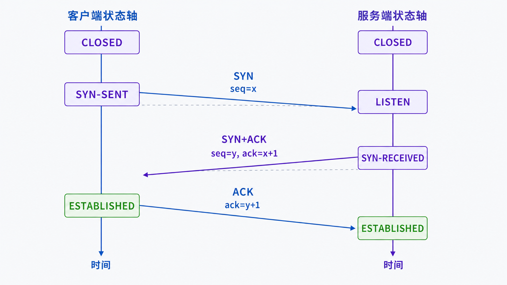
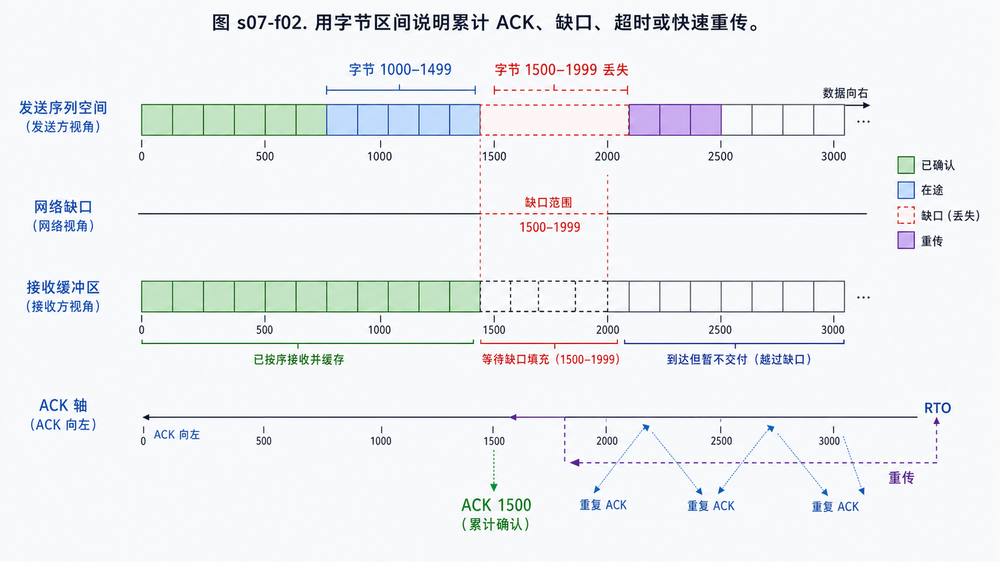

## 学习导航

**前置依赖**：端口、Socket、五元组与 IP 路由。

**核心问题**：TCP 如何让两个进程对同一连接、字节顺序和已接收范围形成一致认识？

## 场景与直觉

客户端 `192.0.2.10:51514` 连接 `203.0.113.20:443`。两端不能假设网络可靠，因此需要先同步初始序列号，再用累计 ACK、计时器和重传修复丢失。

## 核心机制

<!-- network-figure:s07-f01:start -->



<!-- network-figure:s07-f01:end -->

三次握手不仅确认“双方在线”，还交换初始序列号和选项，并证明双方的收发路径可用。简化流程为：

```text
Client                              Server
CLOSED                              LISTEN
  | --- SYN, seq=x ----------------> |
  | <- SYN+ACK, seq=y, ack=x+1 ----- |
  | --- ACK, ack=y+1 --------------> |
ESTABLISHED                      ESTABLISHED
```

TCP 序列号标识字节位置，ACK 表示“下一个期望字节”。发送端保留未确认数据；超时或重复 ACK 等信号可触发重传。TCP 提供字节流，不保留应用写入边界。

## 状态与关闭

<!-- network-figure:s07-f02:start -->



<!-- network-figure:s07-f02:end -->

主动关闭方发送 FIN，表示本方向不再发送数据；对端仍可继续发送，因此全双工关闭常表现为四个报文。主动关闭方进入 TIME_WAIT，以吸收旧报文并在必要时重发最终 ACK。

RST 是异常终止，不执行有序关闭。应用看到 EOF、超时和 reset 时，语义不同，不能统一当作“网络断开”。

## 最小可复现实验

```python
def ack_after_segment(seq: int, payload_length: int, syn=False, fin=False) -> int:
    consumed = payload_length + int(syn) + int(fin)
    return (seq + consumed) % (2**32)

assert ack_after_segment(1000, 20) == 1020
assert ack_after_segment(1000, 0, syn=True) == 1001
assert ack_after_segment(1000, 0, fin=True) == 1001
print("sequence accounting ok")
```

这个实验验证序列空间：SYN 和 FIN 各消耗一个序列号，纯 ACK 不消耗。

## 常见误区与适用边界

- 三次握手不能证明应用已经准备好处理业务，只证明 TCP 连接建立。
- ACK 到达不等于业务已落库，只表示对端 TCP 栈确认字节。
- 粘包/拆包不是 TCP 错误，而是应用没有明确消息边界。
- TIME_WAIT 是正确性机制；优化前应先确认是否真是资源瓶颈。

## 自检题

1. 为什么握手不是两次？
2. 收到 `ack=5001` 能推断什么，不能推断什么？
3. 为什么 FIN 之后对端仍可能发送数据？

<details>
<summary>查看答案</summary>

1. 第三次 ACK 让服务端确认客户端收到自己的初始序列号，并避免旧 SYN 造成错误状态。2. 可推断 5001 之前的字节被 TCP 累计确认，不能推断业务已处理。3. TCP 是全双工，两方向独立关闭。

</details>

## 本篇总结

TCP 通过连接状态机、序列空间、累计确认和重传把不可靠 IP 服务转换为可靠字节流。

## 下一篇

下一篇解释接收方能力和网络拥塞如何共同限制发送窗口。

## 资料来源与版本基线

- [RFC 9293: Transmission Control Protocol](https://www.rfc-editor.org/rfc/rfc9293.html)
- [RFC 6298: Computing TCP's Retransmission Timer](https://www.rfc-editor.org/rfc/rfc6298.html)
