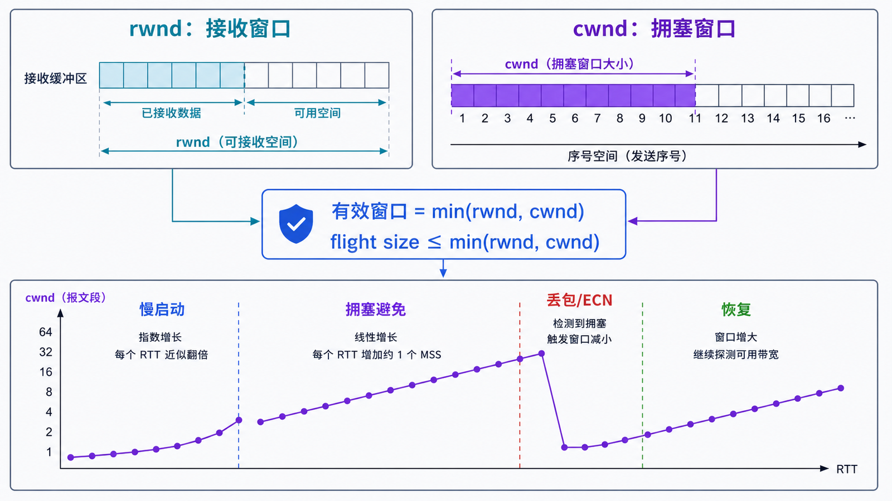
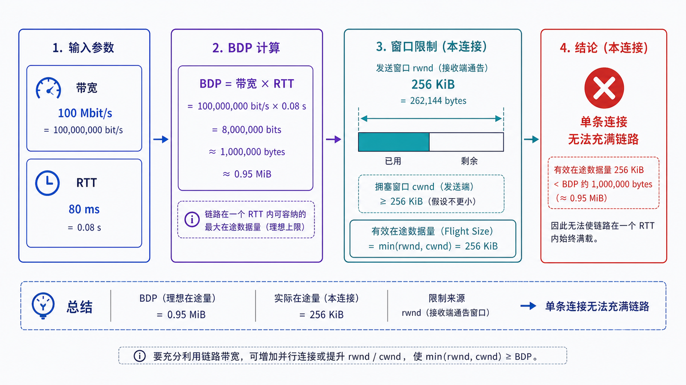

## 学习导航

**前置依赖**：TCP 序列号、累计 ACK 与重传。

**核心问题**：发送端已经有大量数据时，为什么不能无限制地发；接收方慢和网络拥塞又如何区分？

## 场景与直觉

接收应用读取慢会填满接收缓冲区；网络路径过载会导致排队和丢包。前者由流量控制处理，后者由拥塞控制处理。实际可发送窗口近似为：

\[
send_window = \min(rwnd, cwnd)
\]

## 核心机制

<!-- network-figure:s08-f01:start -->



<!-- network-figure:s08-f01:end -->

- `rwnd` 由接收端通告，保护接收缓冲区；窗口为零时发送端使用持久计时机制探测更新。
- `cwnd` 由发送端拥塞算法维护，反映当前对网络承载能力的估计。
- `ssthresh` 决定慢启动与拥塞避免的切换区间。
- RTT 与重传超时用于判断反馈节奏；RTO 不能简单设置为固定常数。

## 数据、公式与状态变化

<!-- network-figure:s08-f02:start -->



<!-- network-figure:s08-f02:end -->

带宽时延积 BDP 表示让路径保持“管道填满”所需的在途数据量：

\[
BDP = bandwidth \times RTT
\]

例如 100 Mbit/s、RTT 80 ms 的路径，BDP 约为 1 MB。若窗口远小于 BDP，即使没有丢包也难以利用带宽。

```python
def bdp_bytes(bandwidth_mbps: float, rtt_ms: float) -> float:
    return bandwidth_mbps * 1_000_000 / 8 * rtt_ms / 1_000

assert bdp_bytes(100, 80) == 1_000_000
print(f"BDP={bdp_bytes(100, 80) / 1_000_000:.1f} MB")
```

丢包可能触发快速重传、窗口降低或超时回退，具体行为取决于算法和操作系统。Reno、CUBIC、BBR 的信号与增长方式不同，不能用一条示意曲线代表所有实现。

## 最小验证路径

```bash
# Linux：查看连接、拥塞算法和 TCP 统计
ss -ti
sysctl net.ipv4.tcp_congestion_control
nstat -az | grep -E 'TcpRetransSegs|TcpExtTCPLoss'
```

命令需要在实际连接存在时观察。应同时记录 RTT、重传、应用吞吐和接收窗口，避免只看带宽占用。

## 常见误区与适用边界

- 滑动窗口不只等于接收窗口；发送上限还受 cwnd、发送缓冲区和应用供数速度影响。
- 高 RTT 不等于拥塞，但会拉长反馈周期并放大窗口不足的影响。
- 重传不一定来自拥塞，也可能是无线误码、路径变化或乱序。
- 调大内核缓冲区不是万能优化，可能增加内存和排队延迟。

## 自检题

1. `rwnd=64 KiB`、`cwnd=256 KiB` 时，哪一个限制发送？
2. 为什么高带宽、高 RTT 链路尤其需要关注窗口？
3. 接收窗口持续为零应首先检查哪一端？

<details>
<summary>查看答案</summary>

1. `rwnd`。2. BDP 大，需要更多在途数据才能填满管道。3. 接收端应用是否及时读取、接收缓冲区是否被占满。

</details>

## 本篇总结

流量控制保护接收端，拥塞控制保护网络，实际发送速率由多种窗口、反馈时延和应用行为共同决定。

## 下一篇

下一篇聚焦 TCP 异常终止：RST、超时、Keepalive 和抓包证据。

## 资料来源与版本基线

- [RFC 5681: TCP Congestion Control](https://www.rfc-editor.org/rfc/rfc5681.html)
- [RFC 6298: Retransmission Timer](https://www.rfc-editor.org/rfc/rfc6298.html)
- [RFC 9438: CUBIC for Fast and Long-Distance Networks](https://www.rfc-editor.org/rfc/rfc9438.html)
