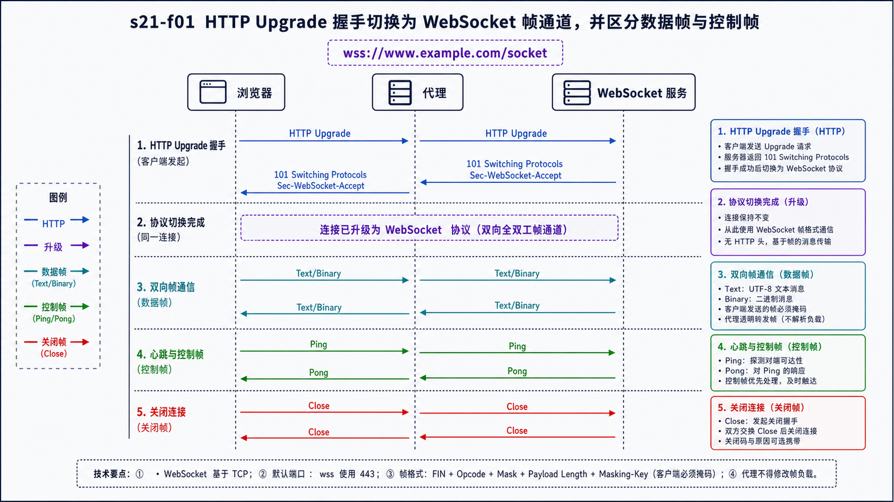
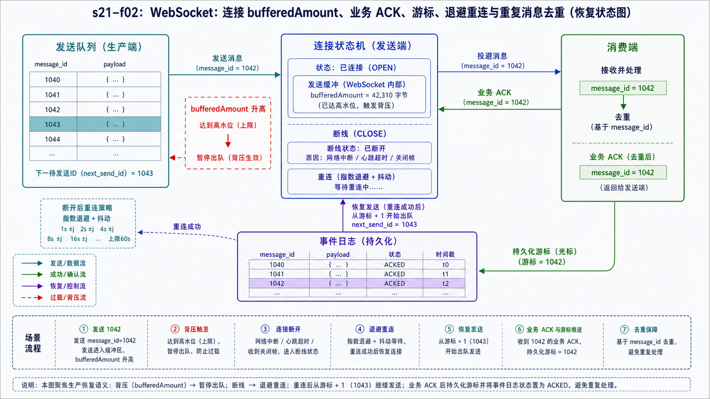

## 学习导航

**前置依赖**：HTTP、长连接、心跳、代理和同源/CORS 边界。

**核心问题**：WebSocket 如何从 HTTP 握手切换为双向帧协议，应用又如何管理消息、背压与断线恢复？

## 场景与直觉

客户端先发送 HTTP Upgrade 请求，服务端返回 101 后，同一连接开始交换 WebSocket 帧。此后不再是普通 HTTP 请求/响应，但代理和负载均衡仍需正确传递升级字段并设置空闲超时。

## 核心机制

<!-- network-figure:s21-f01:start -->



<!-- network-figure:s21-f01:end -->

握手中的 `Sec-WebSocket-Key` 与服务端计算的 `Sec-WebSocket-Accept` 防止缓存或非 WebSocket 服务误接受升级；它不是身份认证。浏览器客户端发送的帧必须 Mask，服务端帧不 Mask。

帧包含 FIN、opcode、长度、mask 等字段。文本/二进制消息可分片，Ping、Pong、Close 是控制帧。应用层应定义消息类型、版本、请求 ID、确认和错误结构。

## 状态与失败恢复

<!-- network-figure:s21-f02:start -->



<!-- network-figure:s21-f02:end -->

```text
CONNECTING -> OPEN -> CLOSING -> CLOSED
                 |       |
                 +-- network failure -> BACKOFF -> CONNECTING
```

浏览器 API 不直接暴露协议 Ping/Pong，应用常设计业务心跳。发送前观察 `bufferedAmount`，并设置队列上限；否则慢客户端会导致内存增长。重连后需重新认证、恢复订阅，并用游标补齐事件。

## 最小可复现实验

```javascript
const socket = new WebSocket("wss://www.example.com/socket");
socket.addEventListener("open", () =>
  socket.send(JSON.stringify({ type: "hello", version: 1 }))
);
socket.addEventListener("message", event =>
  console.log(JSON.parse(event.data))
);
socket.addEventListener("close", event =>
  console.log(event.code, event.reason)
);
socket.addEventListener("error", () => console.log("transport error"));
```

示例展示事件与消息契约，不要求文档地址提供 WebSocket 服务。

## 常见误区与适用边界

- WebSocket 握手成功不等于已认证，应在握手 Cookie、短期令牌或首条消息中建立身份。
- WebSocket 不使用 CORS 协议，但服务端仍应验证 `Origin`。
- TCP 可靠不等于消息已被业务处理，需要应用确认时应显式设计 ACK。
- 断线自动重连可能导致重复订阅或重放，必须带会话和游标。

## 自检题

1. `Sec-WebSocket-Accept` 是否证明用户身份？
2. 为什么服务端应检查 Origin？
3. `bufferedAmount` 持续增长说明什么？

<details>
<summary>查看答案</summary>

1. 否，它只验证握手结构。2. 防止恶意网页利用浏览器已有凭据建立跨站 WebSocket。3. 发送速度超过网络或对端消费速度，需要背压、降级或断开。

</details>

## 本篇总结

WebSocket 提供双向帧通道，但消息契约、身份、心跳、背压、恢复和幂等都由应用负责。

## 下一篇

下一篇建立统一性能度量，避免只用平均延迟或单次 QPS 评价网络系统。

## 资料来源与版本基线

- [RFC 6455: The WebSocket Protocol](https://www.rfc-editor.org/rfc/rfc6455.html)
- [WHATWG WebSockets Standard](https://websockets.spec.whatwg.org/)
