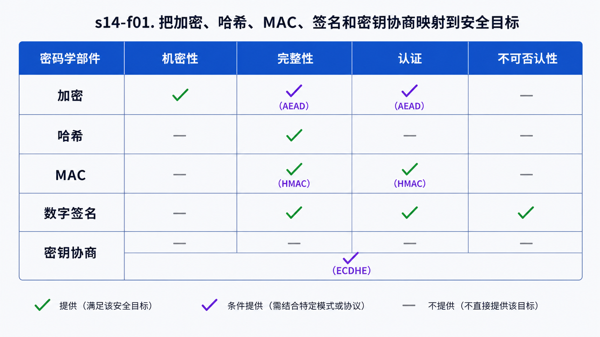
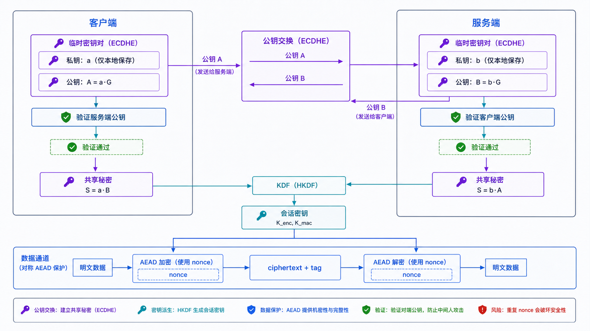

## 学习导航

**前置依赖**：知道网络数据可能被窃听、篡改或冒充。

**核心问题**：加密、MAC、哈希、密钥交换和数字签名分别解决什么问题，为什么安全协议要组合使用？

## 场景与直觉

对称加密速度快，适合大量数据，但通信双方必须共享密钥。公钥算法可用于密钥协商或签名，但更慢且用途受算法类型限制。TLS 不会“用 RSA 加密所有网页数据”，而是协商会话密钥后使用 AEAD 保护记录。

## 核心机制

<!-- network-figure:s14-f01:start -->



<!-- network-figure:s14-f01:end -->

| 机制     | 输入与密钥                  | 主要目标           | 典型例子                   |
| -------- | --------------------------- | ------------------ | -------------------------- |
| 哈希     | 消息，无密钥                | 摘要、构造其他机制 | SHA-256                    |
| MAC      | 消息，共享密钥              | 完整性与来源认证   | HMAC                       |
| AEAD     | 明文、密钥、nonce、附加数据 | 机密性与完整性     | AES-GCM、ChaCha20-Poly1305 |
| 密钥协商 | 双方密钥材料                | 建立共享秘密       | (EC)DHE                    |
| 数字签名 | 私钥签名、公钥验证          | 身份认证与完整性   | RSA-PSS、ECDSA、EdDSA      |

## 数据与失败边界

<!-- network-figure:s14-f02:start -->



<!-- network-figure:s14-f02:end -->

AEAD 的 nonce 必须满足算法要求；同一密钥下错误复用 nonce 可能破坏机密性和完整性。密码应通过专门的密码哈希/KDF 保存，不应直接使用快速通用哈希。

## 最小可复现实验

```python
import hashlib
import hmac

message = b"amount=100"
key = b"demo-key-not-for-production"
tag = hmac.new(key, message, hashlib.sha256).hexdigest()

assert hmac.compare_digest(tag, hmac.new(key, message, hashlib.sha256).hexdigest())
print(tag)
```

示例演示 MAC 的接口与常量时间比较，不代表生产密钥管理方案。

## 常见误区与适用边界

- Base64 是编码，不是加密。
- 哈希不能提供消息来源认证，攻击者可同时替换消息和普通哈希。
- 签名通常签摘要结构，但协议必须规定序列化和域分离，不能随意拼接字段。
- 不要自行设计密码协议；使用成熟库、协议和密钥管理系统。

## 自检题

1. 为什么只加密不认证仍可能不安全？
2. 哈希与 HMAC 的关键区别是什么？
3. TLS 为什么同时使用密钥协商、签名和对称 AEAD？

<details>
<summary>查看答案</summary>

1. 攻击者可能篡改密文并影响解密结果。2. HMAC 使用共享密钥，可认证来源；普通哈希没有密钥。3. 密钥协商建立共享秘密，签名认证握手身份，AEAD 高效保护后续数据。

</details>

## 本篇总结

密码学部件各有明确安全目标；协议安全来自正确组合、密钥生命周期和失败处理，而不是算法名称堆叠。

## 下一篇

下一篇把这些部件映射到 TLS 1.3 握手、证书链和 HTTPS 连接。

## 资料来源与版本基线

- [FIPS 197: Advanced Encryption Standard](https://csrc.nist.gov/pubs/fips/197/final)
- [RFC 8439: ChaCha20 and Poly1305 for IETF Protocols](https://www.rfc-editor.org/rfc/rfc8439.html)
- [RFC 8017: PKCS #1](https://www.rfc-editor.org/rfc/rfc8017.html)
