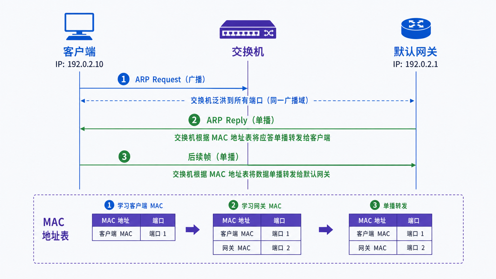
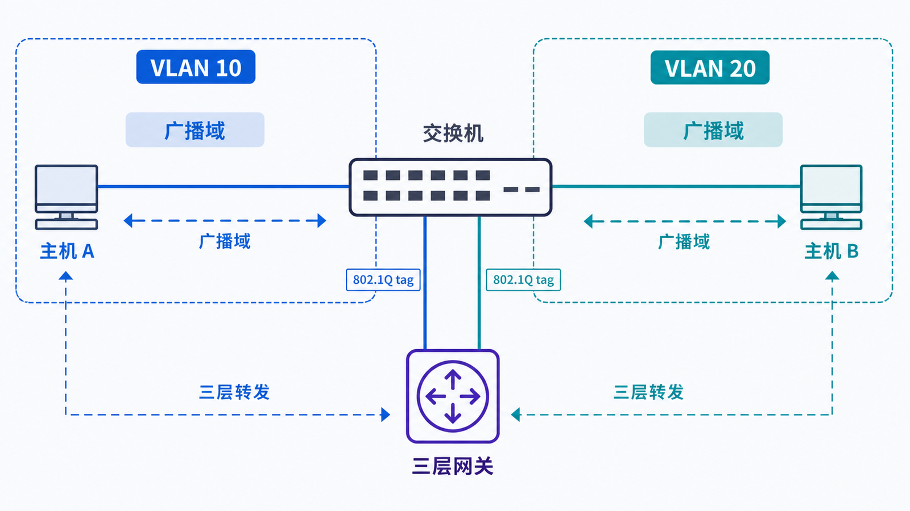

## 学习导航

**前置依赖**：理解 TCP/IP 分层和“当前一跳”的概念。

**核心问题**：主机知道目标 IP 后，如何在局域网内把帧交给目标主机或默认网关？

学完后你应能解释 MAC、ARP、交换表、广播域与 VLAN 的职责，并判断二层故障与三层故障的边界。

## 场景与直觉

客户端 `192.0.2.10/24` 要访问同网段的 `192.0.2.20` 时，可直接解析对方 MAC；访问 `203.0.113.20` 时，主机不会寻找远端服务器的 MAC，而是寻找默认网关 `192.0.2.1` 的 MAC。

## 核心机制

<!-- network-figure:s02-f01:start -->



<!-- network-figure:s02-f01:end -->

主机先用子网掩码判断目标是否同网段。随后 ARP 把“当前链路上的 IPv4 地址”解析成 MAC 地址：请求通常广播，响应通常单播。交换机学习帧的**源 MAC 与入端口**，再按目的 MAC 查询转发表。

| 组件   | 观察的信息           | 主要动作               | 不负责什么    |
| ------ | -------------------- | ---------------------- | ------------- |
| 网卡   | MAC、EtherType、VLAN | 收发帧                 | 跨网段路由    |
| 交换机 | 源/目的 MAC、VLAN    | 学习、转发、泛洪       | 解释 TCP 端口 |
| ARP    | IPv4 与 MAC 的绑定   | 请求、响应、缓存       | 跨路由器解析  |
| 路由器 | 目的 IP、路由表      | 选择下一跳、重写链路头 | 保留原帧 MAC  |

## 报文与状态变化

<!-- network-figure:s02-f02:start -->



<!-- network-figure:s02-f02:end -->

第一次通信时交换机可能还没有目标 MAC 记录，因此会在同一 VLAN 内泛洪未知单播。收到响应后，双方 ARP 缓存和交换机 MAC 表逐步建立；这些表都有老化时间，不能视为永久事实。

VLAN 把一个物理交换网络切成多个逻辑广播域。Access 端口通常承载一个 VLAN，Trunk 端口可携带带 802.1Q 标签的多个 VLAN。跨 VLAN 通信必须经过三层转发。

## 最小可复现实验

```bash
# Windows
arp -a

# Linux：查看邻居表和链路
ip neigh show
ip link show
```

先访问同网段主机，再查看邻居表；新条目应从 `INCOMPLETE` 等中间状态转为可用状态。命令输出依赖操作系统和网络权限，不应硬编码某个 MAC。

## 常见误区与适用边界

- ARP 只服务 IPv4；IPv6 使用 Neighbor Discovery。
- 交换机的未知单播泛洪不等于广播帧，两者原因不同。
- MAC 地址只在当前二层域有直接交付意义，不能替代 IP 路由。
- VLAN 提供隔离边界，但不是完整安全策略；仍需 ACL、防火墙和身份控制。

## 自检题

1. 访问外网时 ARP 查询的是谁？
2. 交换机为什么学习源 MAC 而不是目的 MAC？
3. 两台主机 IP 配置为同网段却位于不同 VLAN，会发生什么？

<details>
<summary>查看答案</summary>

1. 默认网关。2. 源 MAC 的到达端口是可验证事实，目的 MAC 的位置尚未知。3. 主机会尝试直接 ARP，但广播不能跨 VLAN，通信失败，除非修正地址规划并通过路由转发。

</details>

## 本篇总结

二层负责当前广播域内的帧交付，三层负责跨网段选择下一跳；ARP 是 IPv4 中连接这两层的桥梁。

## 下一篇

下一篇学习 IP 地址、CIDR 与网关判断，回答“同网段”到底如何计算。

## 资料来源与版本基线

- [RFC 826: Address Resolution Protocol](https://www.rfc-editor.org/rfc/rfc826.html)
- [RFC 4861: Neighbor Discovery for IPv6](https://www.rfc-editor.org/rfc/rfc4861.html)
