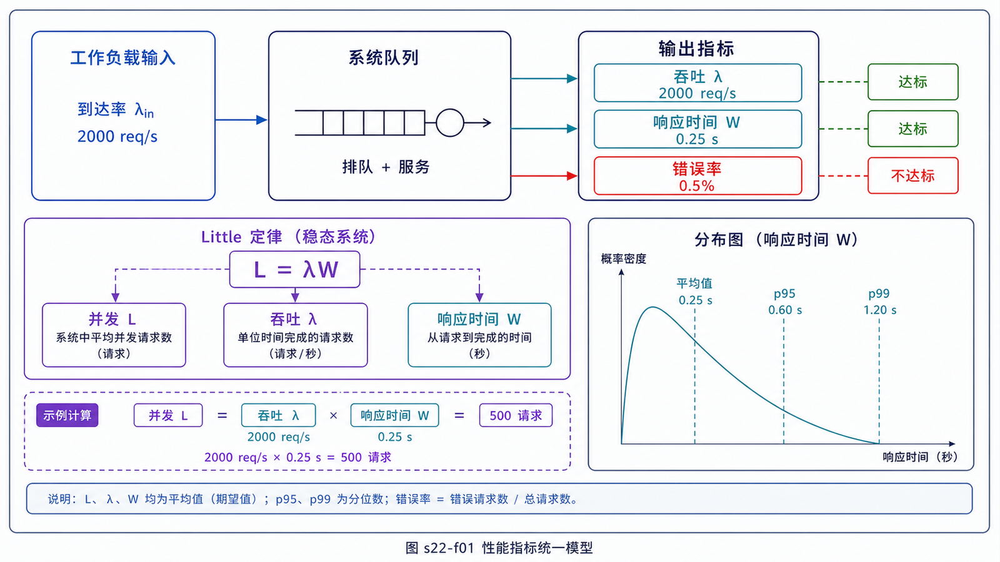
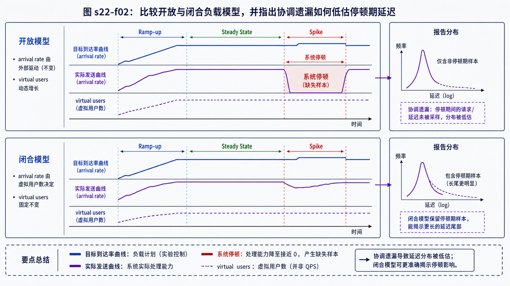

## 学习导航

**前置依赖**：连接生命周期、排队、重试与缓存。

**核心问题**：如何设计可比较的负载实验，并从吞吐、并发和延迟分布推断系统容量而不被平均值误导？

## 场景与直觉

“支持 10 万 QPS”没有说明请求内容、并发模型、错误率、延迟目标和测试时长，因此不是可复现结论。测试首先要固定工作负载和成功定义。

## 核心机制：指标与公式

<!-- network-figure:s22-f01:start -->



<!-- network-figure:s22-f01:end -->

- 吞吐：单位时间完成的成功操作数；QPS/TPS 必须明确操作粒度。
- 并发：某时刻处于系统内的请求或会话数。
- 延迟：从定义的起点到终点的耗时，应报告 p50、p95、p99 等分位数。
- 错误率：按超时、连接、协议、业务错误分类。

稳定系统中可用 Little 定律建立近似关系：

\[
L = \lambda W
\]

其中 `L` 为平均在途数量，`λ` 为平均完成率，`W` 为平均停留时间。单位必须一致。

## 数据与实验设计

<!-- network-figure:s22-f02:start -->



<!-- network-figure:s22-f02:end -->

```python
def estimated_concurrency(qps: float, latency_ms: float) -> float:
    return qps * latency_ms / 1000

assert estimated_concurrency(2_000, 250) == 500
print(estimated_concurrency(2_000, 250))
```

测试应包含预热、稳态、峰值、恢复阶段，并区分开放模型（按到达率发请求）和封闭模型（固定虚拟用户等待响应再发）。负载发生器资源也必须监控。

## 失败边界

平均延迟会掩盖尾部；客户端超时后不记录的慢请求会造成协调遗漏；无界重试会放大负载。缓存预热、连接复用、数据规模和依赖限额都会改变结果，必须写入报告。

## 最小测试清单

```text
目标与 SLO -> 请求与数据集 -> 到达模型 -> 预热
-> 阶梯加压 -> 稳态观测 -> 故障/恢复 -> 结果与环境归档
```

## 常见误区与适用边界

- TPS 与 QPS 不能脱离业务粒度直接比较。
- CPU 未满不代表无瓶颈，可能卡在锁、连接池、网络或依赖限额。
- 客户端并发数不等于服务端同时执行数，中间还有队列与连接复用。
- 单机实验只能支撑相应环境的结论，外推需说明假设。

## 自检题

1. 2000 QPS、平均延迟 250 ms 时平均在途请求约多少？
2. 为什么只报告平均延迟不够？
3. 测试吞吐突然下降时应先记录哪些关联指标？

<details>
<summary>查看答案</summary>

1. 约 500。2. 少量极慢请求会被平均值稀释，用户常受尾延迟影响。3. 错误/超时、p95/p99、CPU、内存、GC、连接池、队列、重试和下游指标。

</details>

## 本篇总结

性能结论必须绑定工作负载、延迟分布、错误边界和环境；容量是满足 SLO 的最大稳定负载，不是工具显示的单个峰值。

## 下一篇

最后一篇使用 TCPCopy 讨论真实流量复制、隔离、幂等与验证。

## 资料来源与版本基线

- [RFC 6349: Framework for TCP Throughput Testing](https://www.rfc-editor.org/rfc/rfc6349.html)
- [Grafana k6: Open and closed models](https://grafana.com/docs/k6/latest/using-k6/scenarios/concepts/open-vs-closed/)
