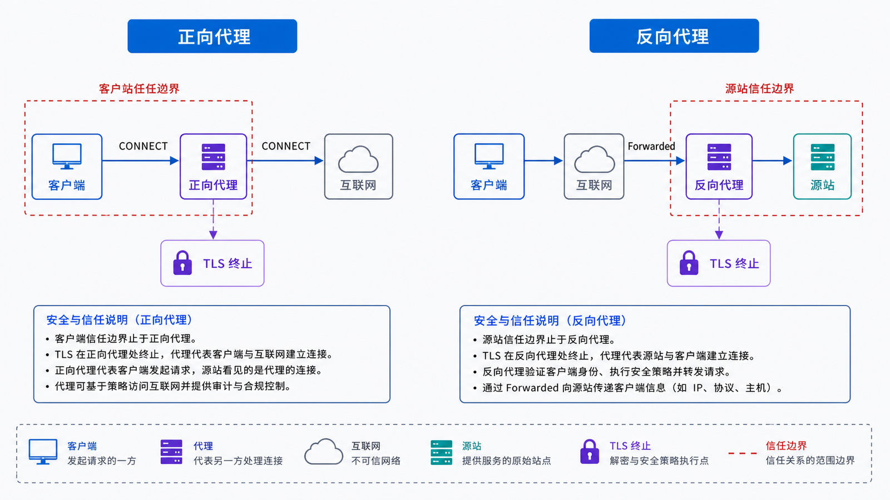
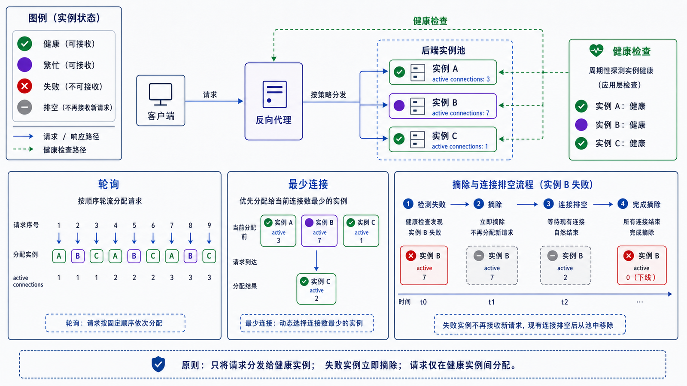

## 学习导航

**前置依赖**：TCP/TLS、HTTP 头部和端口转发。

**核心问题**：代理代表谁建立连接，在哪一层终止协议，又应如何传递客户端身份而不扩大信任？

## 场景与直觉

正向代理代表客户端访问外部服务，服务端通常看到代理地址；反向代理代表服务端接收客户端请求，客户端通常不知道具体上游。二者都可能终止一条连接并创建另一条连接。

## 核心机制

<!-- network-figure:s17-f01:start -->



<!-- network-figure:s17-f01:end -->

| 维度         | 正向代理                 | 反向代理                 |
| ------------ | ------------------------ | ------------------------ |
| 服务对象     | 客户端                   | 服务端/应用集群          |
| 主要隐藏对象 | 客户端网络细节           | 上游拓扑                 |
| 常见用途     | 出口控制、缓存、访问策略 | TLS 终止、路由、负载均衡 |

四层代理按连接和地址转发，七层代理理解 HTTP 等应用协议。反向代理可按主机、路径、字段路由，并使用轮询、最少连接、哈希等策略选择健康上游。

## 调用链与信任边界

<!-- network-figure:s17-f02:start -->



<!-- network-figure:s17-f02:end -->

```text
Client -> Edge Proxy -> Service Proxy -> Application
         TLS/client IP  request ID       business auth
```

`Forwarded`、`X-Forwarded-For` 等字段只有在请求确实来自可信代理时才可采信。边界代理应覆盖外部伪造值，内部服务按明确的代理链长度解析。

## 最小配置示例

```nginx
location /api/ {
  proxy_pass http://app_pool;
  proxy_set_header Host $host;
  proxy_set_header X-Request-ID $request_id;
  proxy_set_header X-Forwarded-For $proxy_add_x_forwarded_for;
  proxy_connect_timeout 2s;
  proxy_read_timeout 15s;
}
```

本机未安装 Nginx，配置按官方语法核对但未执行；生产还需定义上游、TLS、健康检查、重试和日志。

## 常见误区与适用边界

- 代理不是透明的“网线”，它改变连接、超时、错误来源和可观测性。
- 盲目重试 POST 可能重复写入；重试策略必须理解方法与应用幂等性。
- 负载均衡只分配流量，不自动解决共享状态、会话或数据库一致性。
- 客户端 IP 字段不是天然可信身份。

## 自检题

1. 四层端口转发与七层反向代理的关键差异是什么？
2. 为什么应用不能无条件信任 `X-Forwarded-For`？
3. 最少连接策略在哪些场景比轮询更合理？

<details>
<summary>查看答案</summary>

1. 七层代理终止并理解应用协议，可按 HTTP 语义路由。2. 外部客户端可以伪造，必须由可信边界重写并限定代理链。3. 请求时长差异大、每个上游当前负载差异明显时。

</details>

## 本篇总结

代理是协议终止与信任转换点。设计时需同时定义身份、超时、重试、健康和观测，而不只是转发地址。

## 下一篇

下一篇把 DNS、代理和 HTTP 缓存组合成 CDN 边缘分发链路。

## 资料来源与版本基线

- [RFC 7239: Forwarded HTTP Extension](https://www.rfc-editor.org/rfc/rfc7239.html)
- [Nginx HTTP Proxy Module](https://nginx.org/en/docs/http/ngx_http_proxy_module.html)
