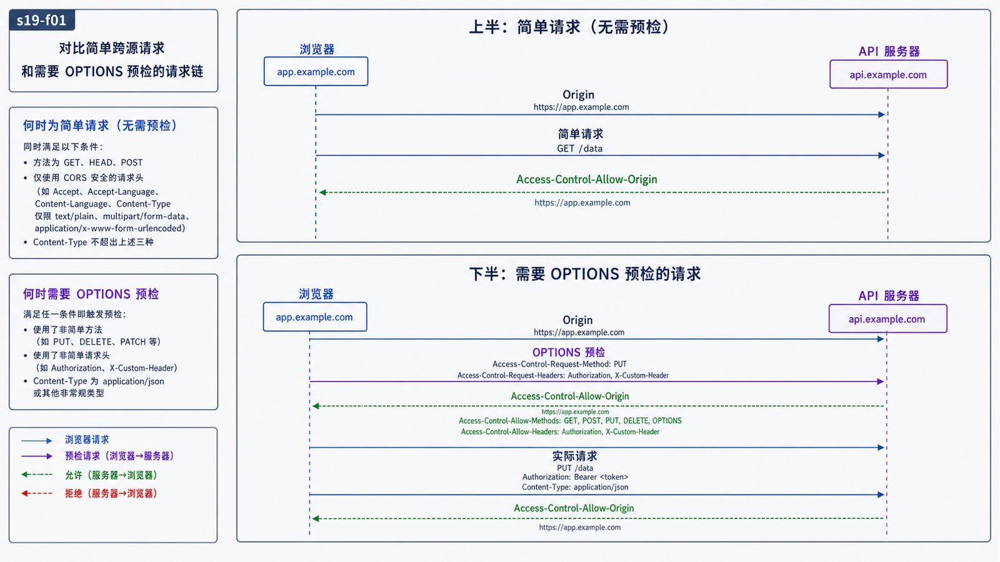
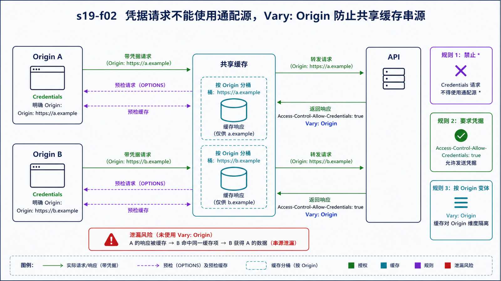

## 学习导航

**前置依赖**：HTTP 方法、字段、缓存与代理边界。

**核心问题**：浏览器为什么能把跨源请求发出去，却可能不把响应暴露给 JavaScript；服务端应如何精确授权？

## 场景与直觉

源由 scheme、host、port 三元组定义。页面 `https://app.example.com` 请求 `https://api.example.com` 属于跨源。CORS 是服务器通过响应字段选择哪些跨源响应可被浏览器脚本读取的协议，不是关闭同源策略。

## 核心机制

<!-- network-figure:s19-f01:start -->



<!-- network-figure:s19-f01:end -->

简单 CORS 请求可直接发送，并在响应阶段检查许可。使用非安全列表方法/字段或特定 Content-Type 时，浏览器先发 OPTIONS 预检，询问实际方法、字段和凭据是否允许。

```http
OPTIONS /orders HTTP/1.1
Origin: https://app.example.com
Access-Control-Request-Method: POST
Access-Control-Request-Headers: Idempotency-Key
```

允许响应应回显受信来源，并声明方法/字段。带凭据请求不能使用 `Access-Control-Allow-Origin: *`；还需设置 `Access-Control-Allow-Credentials: true`，客户端也必须选择发送凭据。

## 状态与缓存

<!-- network-figure:s19-f02:start -->



<!-- network-figure:s19-f02:end -->

预检结果有独立缓存。动态回显 Origin 时，响应通常应包含 `Vary: Origin`，避免共享缓存把一个来源的许可响应错误复用于另一个来源。

CORS 失败通常呈现为浏览器脚本的网络错误，但服务端可能已收到并执行请求。因此 CORS 不能代替 CSRF 防护、认证、授权或幂等控制。

## 最小可复现实验

```javascript
const response = await fetch("https://api.example.com/orders", {
  method: "POST",
  credentials: "include",
  headers: { "Content-Type": "application/json", "Idempotency-Key": "demo-1" },
  body: JSON.stringify({ item: "book" }),
});

console.log(response.status);
```

示例地址仅用于展示调用契约，不应期待实际成功。排障应在浏览器 Network 面板分别检查预检和实际请求。

## 常见误区与适用边界

- Postman/curl 不受浏览器同源策略约束，成功不能证明浏览器 CORS 配置正确。
- CORS 控制读取响应，不阻止所有跨站请求被发送。
- `no-cors` 不会绕过限制，只会得到受限 opaque 响应。
- 允许来源应使用严格白名单解析，避免字符串后缀匹配漏洞。

## 自检题

1. 为什么跨源 POST 可能已经写入数据，但前端仍报告 CORS 错误？
2. 带 Cookie 的请求为什么不能配置通配 Origin？
3. 动态 Origin 响应为什么需要 `Vary: Origin`？

<details>
<summary>查看答案</summary>

1. 浏览器可能在收到响应后阻止脚本读取，实际请求已执行。2. 规范要求凭据授权绑定明确来源。3. 防止共享缓存把一个来源的许可响应复用于其他来源。

</details>

## 本篇总结

CORS 是浏览器实施的响应共享协议。服务端仍必须独立完成身份认证、业务授权、CSRF 与重放防护。

## 下一篇

下一篇比较轮询、长轮询和 SSE 的实时通信成本与恢复模型。

## 资料来源与版本基线

- [WHATWG Fetch Standard—CORS Protocol](https://fetch.spec.whatwg.org/#http-cors-protocol)
- [MDN: CORS](https://developer.mozilla.org/docs/Web/HTTP/Guides/CORS)
