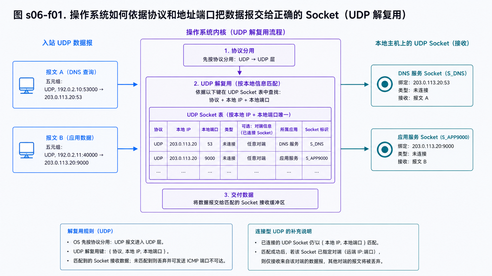
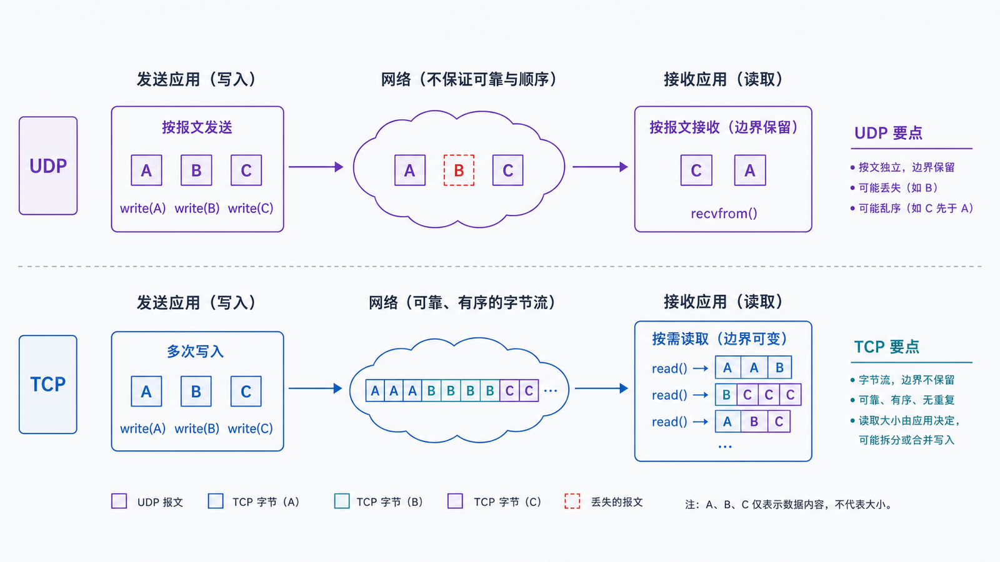

## 学习导航

**前置依赖**：理解 IP 负责主机间交付，ICMP 提供差错反馈。

**核心问题**：IP 包到达主机后，操作系统如何把数据交给正确进程；UDP 又提供了哪些保证？

## 场景与直觉

同一台服务器可以同时运行 DNS、HTTPS 和监控服务，因为传输层使用端口区分接收端点。一个常见连接由源 IP、源端口、目的 IP、目的端口和协议组成五元组。

## 核心机制

<!-- network-figure:s06-f01:start -->



<!-- network-figure:s06-f01:end -->

Socket 是操作系统暴露给应用的通信端点。端口是 16 位标识，范围为 0–65535；服务端通常绑定稳定端口，客户端通常使用临时端口。

UDP 保留消息边界：一次发送对应一个数据报。它提供校验和与端口复用，但不自动提供连接建立、可靠重传、有序交付、拥塞控制或流量控制。应用若需要这些能力，必须自行设计或选择建立在 UDP 之上的协议，例如 QUIC。

## 数据结构与状态

<!-- network-figure:s06-f02:start -->



<!-- network-figure:s06-f02:end -->

```text
UDP header
+-------------+-------------+
| source port | dest port   |
+-------------+-------------+
| length      | checksum    |
+-------------+-------------+
| application datagram ... |
+---------------------------+
```

无连接不等于无状态：操作系统仍维护 Socket、缓冲区和路由缓存，NAT/防火墙也可能维护映射超时。

## 最小可复现实验

```python
import socket

server = socket.socket(socket.AF_INET, socket.SOCK_DGRAM)
server.bind(("127.0.0.1", 0))
address = server.getsockname()

client = socket.socket(socket.AF_INET, socket.SOCK_DGRAM)
client.sendto(b"hello", address)
data, peer = server.recvfrom(1024)

print(data.decode(), peer, "->", address)
server.close()
client.close()
```

实验只走本机回环，输入是一个完整数据报，输出保留 `hello` 的边界。真实网络中数据报仍可能丢失、重复或乱序。

## 常见误区与适用边界

- UDP “更快”不是恒真命题；它只是机制更少，应用级重试设计不当可能更慢。
- `sendto()` 成功只表示数据交给本机协议栈，不代表对端应用已收到。
- UDP 数据报过大更容易触发分片或丢弃，应控制载荷并处理路径 MTU。
- 实时音视频常接受少量丢包以避免等待重传，但控制消息可能仍需可靠语义。

## 自检题

1. 两个客户端为什么可以同时访问同一服务器 UDP 端口？
2. UDP 是否保证一次 `sendto` 一定对应一次成功的 `recvfrom`？
3. 哪些需求提示你应选择 TCP 或 QUIC，而不是裸 UDP？

<details>
<summary>查看答案</summary>

1. 五元组中的源 IP/端口不同。2. 不保证，数据报可能丢失，接收缓冲区也有限。3. 需要可靠、有序、拥塞控制、安全握手或多流复用且不愿自行实现时。

</details>

## 本篇总结

端口把主机交付细化为进程交付，UDP 提供最小的数据报服务，但可靠性与拥塞友好性仍是应用责任。

## 下一篇

下一篇学习 TCP 如何通过状态机、序列号、ACK 与重传提供可靠字节流。

## 资料来源与版本基线

- [RFC 768: User Datagram Protocol](https://www.rfc-editor.org/rfc/rfc768.html)
- [RFC 8085: UDP Usage Guidelines](https://www.rfc-editor.org/rfc/rfc8085.html)
