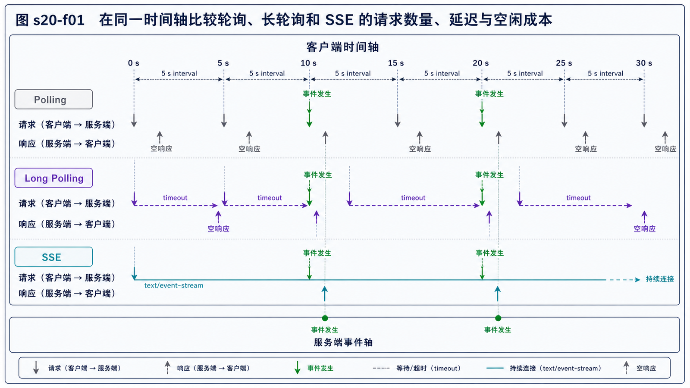
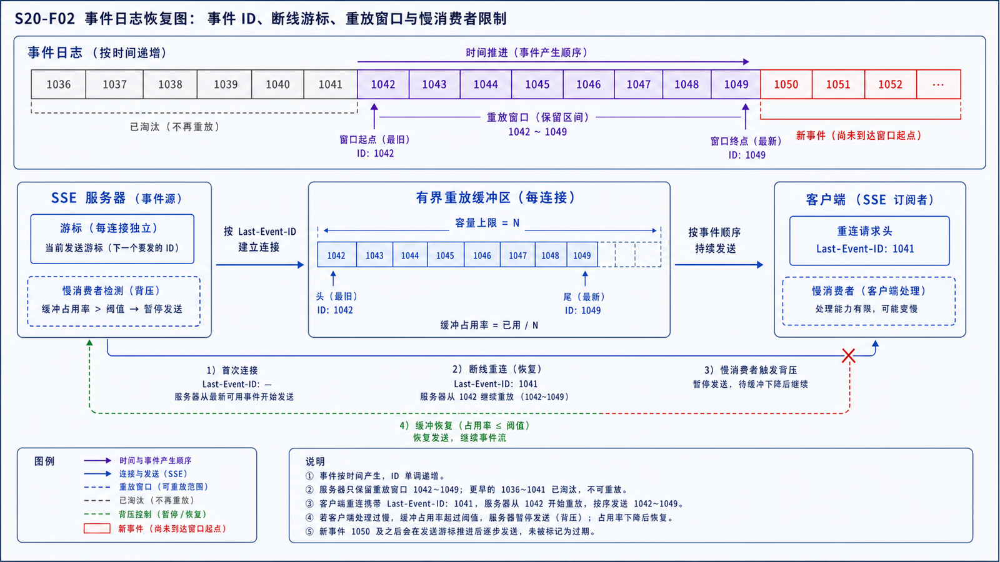

## 学习导航

**前置依赖**：HTTP、长连接、代理超时和 CORS。

**核心问题**：服务端状态变化后，客户端应通过固定查询、挂起请求还是单向事件流获知变化？

## 场景与直觉

订单状态更新频率不稳定。固定轮询简单但会产生空请求；长轮询把请求挂起到有事件或超时；SSE 保持一个 HTTP 响应流，持续发送文本事件。

## 核心机制

<!-- network-figure:s20-f01:start -->



<!-- network-figure:s20-f01:end -->

| 方案         | 方向           | 延迟       | 空闲成本       | 恢复方式                            |
| ------------ | -------------- | ---------- | -------------- | ----------------------------------- |
| Polling      | 客户端请求     | 受间隔限制 | 周期请求       | 下次轮询                            |
| Long Polling | 客户端请求     | 较低       | 挂起请求与重建 | 超时后立即重发                      |
| SSE          | 服务端到客户端 | 低         | 长响应流       | EventSource 自动重连、Last-Event-ID |

长轮询服务端必须有超时，客户端收到响应后再创建下一次请求。SSE 使用 `text/event-stream`，事件以空行分隔，可包含 `id`、`event`、`data` 和 `retry`。

## 状态与背压

<!-- network-figure:s20-f02:start -->



<!-- network-figure:s20-f02:end -->

所有方案都需要游标或事件 ID，避免重连后丢失或重复。服务端保留事件的时间必须覆盖合理断线窗口；客户端消费慢时要限制缓冲区并定义合并/丢弃策略。

```javascript
const source = new EventSource("/events", { withCredentials: true });
source.addEventListener("order", event => {
  const payload = JSON.parse(event.data);
  console.log(event.lastEventId, payload.status);
});
source.onerror = () => console.log("reconnecting");
```

## 最小行为实验

对同一事件源分别设置 1 秒和 10 秒轮询，记录 1 分钟内请求数、空响应比例和事件可见延迟。比较时必须使用相同事件时间线，不能只比较峰值吞吐。

## 常见误区与适用边界

- 长轮询不是永不返回，请求应有明确超时并处理代理上限。
- SSE 是单向服务器推送，客户端写操作仍使用普通 HTTP。
- 固定轮询在低频后台任务中可能是最可靠、成本最低的选择。
- 实时不等于零延迟，端到端还受调度、队列和客户端渲染影响。

## 自检题

1. 更新频率很低且允许 30 秒延迟时优先考虑什么？
2. SSE 重连后如何补齐断线期间事件？
3. 长轮询为什么应在响应后立即再发下一请求？

<details>
<summary>查看答案</summary>

1. 简单轮询。2. 使用事件 ID/游标和服务端保留窗口。3. 减少两个请求之间的不可见空档。

</details>

## 本篇总结

实时方案选择取决于方向、延迟目标、空闲成本、代理约束和恢复契约，不应机械追求长连接。

## 下一篇

下一篇深入需要双向消息与自定义帧语义的 WebSocket。

## 资料来源与版本基线

- [HTML Living Standard—Server-sent events](https://html.spec.whatwg.org/multipage/server-sent-events.html)
- [RFC 9110: HTTP Semantics](https://www.rfc-editor.org/rfc/rfc9110.html)
