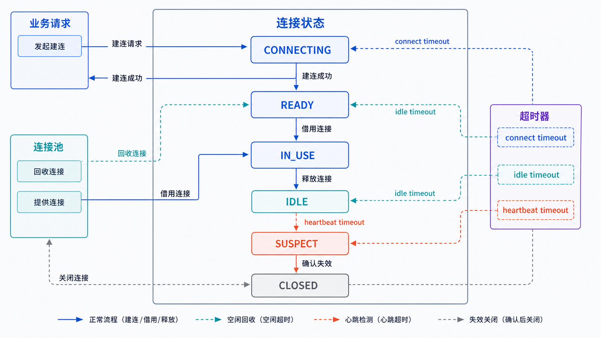
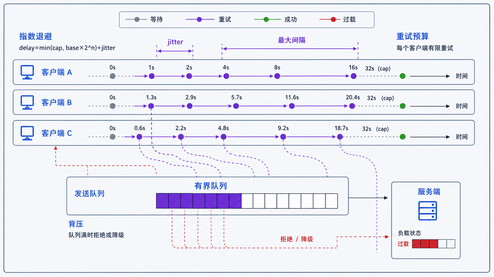

## 学习导航

**前置依赖**：TCP 建连/关闭、超时、RST 与 Keepalive。

**核心问题**：应用如何在延迟、资源、空闲超时和故障恢复之间选择连接生命周期？

## 场景与直觉

短连接为每次操作重新建连，状态简单但重复支付握手成本。长连接复用已建立通道，降低延迟，却必须处理空闲回收、半开连接、心跳、背压和服务滚动升级。

## 核心机制

<!-- network-figure:s10-f01:start -->



<!-- network-figure:s10-f01:end -->

| 策略   | 优点                 | 主要成本                  | 适用场景           |
| ------ | -------------------- | ------------------------- | ------------------ |
| 短连接 | 状态短、故障隔离直观 | 重复握手、端口与 CPU 开销 | 低频、一次性任务   |
| 长连接 | 低延迟、可双向推送   | 状态和恢复复杂            | 高频请求、实时消息 |
| 连接池 | 控制并发并复用连接   | 排队、泄漏、过期连接      | HTTP/数据库客户端  |

应用心跳应回答业务问题，例如“会话仍有效且处理循环仍在推进”，而不仅是 TCP 通道可写。心跳周期必须小于中间设备的空闲回收时间，同时避免形成同步风暴。

## 状态与失败恢复

<!-- network-figure:s10-f02:start -->



<!-- network-figure:s10-f02:end -->

```text
DISCONNECTED -> CONNECTING -> READY -> DEGRADED
      ^              |          |          |
      |              v          v          v
      +----------- BACKOFF <- CLOSED/FAILED
```

重连应使用指数退避、随机抖动和上限；恢复后要重新鉴权、恢复订阅，并判断未确认操作能否安全重放。发送队列必须有限，满时应阻塞、丢弃或降级，而不是无限占用内存。

## 最小可复现实验

```python
import random

def retry_delay(attempt: int, base=0.5, cap=30.0, jitter=0.2) -> float:
    delay = min(cap, base * 2**attempt)
    return delay * random.uniform(1 - jitter, 1 + jitter)

for attempt in range(6):
    value = retry_delay(attempt)
    assert 0 < value <= 36
    print(attempt, round(value, 2))
```

输入是连续失败次数，输出是带抖动的有界延迟。测试不应断言随机值完全相等。

## 常见误区与适用边界

- 长连接不是一种独立传输协议，TCP、HTTP/2、WebSocket 等都可能承载长生命周期。
- 心跳越频繁不一定越可靠，会增加电量、流量和服务压力。
- 自动重连不等于自动重放；写操作需幂等键或明确确认协议。
- 连接池上限过大可能把瓶颈推向下游，过小则造成排队。

## 自检题

1. 为什么 TCP Keepalive 不能完全替代应用心跳？
2. 大规模断网恢复时为什么需要随机抖动？
3. 发送队列已满时有哪些合法策略？

<details>
<summary>查看答案</summary>

1. 它只验证传输端点，不理解认证、订阅和处理循环。2. 避免所有客户端同时重连形成惊群。3. 背压阻塞、按优先级丢弃、合并更新、降级或关闭连接并告警。

</details>

## 本篇总结

连接生命周期是应用协议的一部分：建立、保活、排队、恢复和终止都必须有界且可观测。

## 下一篇

下一篇进入应用层的第一步：DNS 如何把域名解析为可连接地址。

## 资料来源与版本基线

- [RFC 1122: Requirements for Internet Hosts](https://www.rfc-editor.org/rfc/rfc1122.html)
- [RFC 9293: Transmission Control Protocol](https://www.rfc-editor.org/rfc/rfc9293.html)
