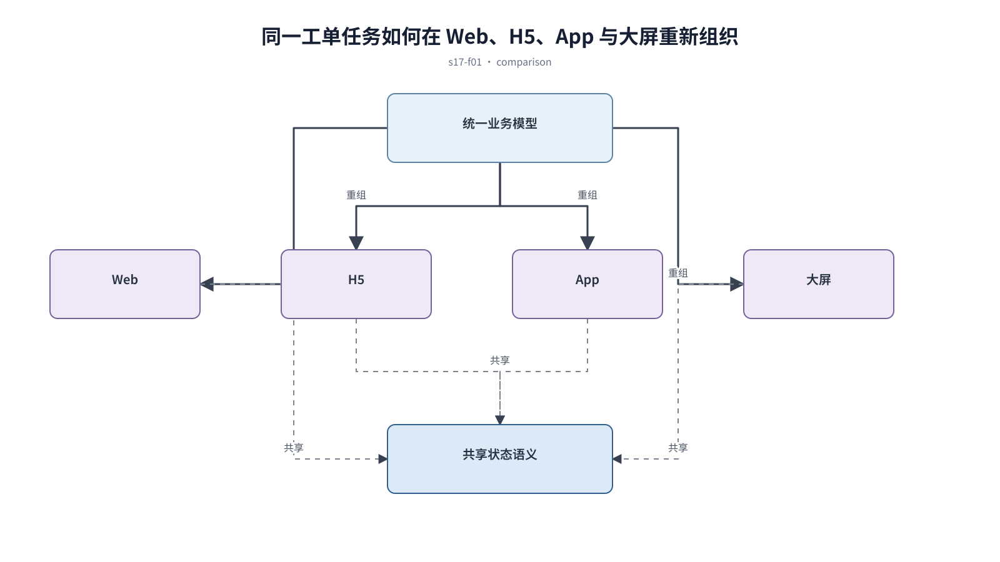

## 前置知识与学习目标

**前置知识：** 已有稳定对象、任务路径和内容优先级。

**本篇唯一核心问题：** 怎样让同一业务在 Web、H5、App 和大屏上按任务重组，而不是缩放？

读完后，你应该能够：能根据输入方式、观看距离、会话长度和任务频率选择各端结构。本篇沿用“跨端客户工单管理 SaaS”，核心对象统一为 `ticket`、`customer`、`assignee`、`status`、`priority` 与 `permission`。

上一章已经解决“怎样让内容型网站同时支持连续阅读、信息发现和克制转化”的问题；本篇把它作为输入，不再重复完整解释。

## 从真实问题出发

团队把桌面工单表格等比缩到手机，把后台首页等比放到大屏，两个端都难以使用。

先不要急着选择组件或颜色。应先写清楚当前用户、对象、触发条件、成功结果和失败后仍需保留的上下文，再判断界面应该表达什么。

## 核心机制

跨端一致指业务概念和状态一致，不指像素一致。Web 适合比较与多任务，H5 适合短链路，App 可利用系统能力和高频入口，大屏适合远距离监控与异常发现。

<!-- series-figure:s17-f01 -->



<!-- series-figure:end -->

### 1. 先保留对象、状态和关键动作，再按端删除、合并或下钻次要信息

先保留对象、状态和关键动作，再按端删除、合并或下钻次要信息。它先固定主路径和优先级，后续布局不得反过来改变业务判断。验收时要用真实任务观察用户能否找到下一步。

### 2. 移动端把并列区域改为线性任务流，把表格改为摘要加详情

移动端把并列区域改为线性任务流，把表格改为摘要加详情。它把抽象原则转换成可见结构。验收时应检查对象、标签、状态和操作是否逐项对应，而不是凭整体观感打分。

### 3. App 使用推送、相机等能力时提供权限解释和无权限降级

App 使用推送、相机等能力时提供权限解释和无权限降级。它负责异常与边界，必须使用空数据、慢请求、权限差异或冲突数据复测，不能只验证理想状态。

### 4. 大屏提高字号和对比度，刷新与告警可见，但复杂操作下放到工作端

大屏提高字号和对比度，刷新与告警可见，但复杂操作下放到工作端。它防止局部页面自行发明规则。跨端、跨主题或跨角色检查时，语义保持一致，呈现方式才允许重组。

## 关键角色、数据与状态

| 项目     | 在本篇中的含义                                                                       |
| -------- | ------------------------------------------------------------------------------------ |
| 输入     | 输入是统一业务模型与端能力                                                           |
| 业务对象 | `ticket` 是工单，`customer` 是客户，`assignee` 是当前负责人                          |
| 约束     | `permission` 决定可执行动作；`priority` 影响排序，不直接替代业务状态                 |
| 状态主线 | `draft → submitted → processing → resolved → closed`，只有满足权限和前置条件才能转换 |
| 输出     | 是共享语义、不同布局的端方案。                                                       |

输入是统一业务模型与端能力；中间状态是各端任务矩阵；输出是共享语义、不同布局的端方案。

## 最小实践：贯穿工单案例

同一 `ticket` 在 Web 展示表格与侧栏，在 H5 展示摘要卡和底部主操作，在 App 增加推送入口，在大屏只显示积压趋势和异常团队。

执行时使用下面的决策记录，避免示例只有结果而没有中间状态：

```text
输入：角色、ticket、当前 status、permission、终端与网络状态
检查：核心任务、业务规则、可见反馈、失败恢复、跨端差异
中间状态：记录用户动作、系统判断、状态变化和仍被保留的数据
输出：可验证的界面方案、实现约束与验收证据
失败边界：权限不足、空数据、超时、冲突、长文案和窄屏
```

这里的 `status` 表示业务状态；请求的 loading/error 是界面请求状态，两者不能混为一个字段。示例中的数值与规则只用于教学，接入真实项目时必须由产品规则、接口契约和数据字典确认。

## 常见误区

- **移动端只是缩窄桌面页面：** 这会让界面结论失去可验证依据；应回到输入、状态和恢复路径重新检查。
- **各端使用不同状态名：** 这会让界面结论失去可验证依据；应回到输入、状态和恢复路径重新检查。
- **大屏加入无法远距离识别的小型控件：** 这会让界面结论失去可验证依据；应回到输入、状态和恢复路径重新检查。

## 适用边界与不适用场景

- 仅有单一桌面工作场景的内部工具不必制造多端版本。
- 设备能力和离线需求会改变 App 数据同步策略，需要工程验证。

如果当前任务没有多对象关系、状态变化或失败恢复，不要为了套用本章而制造额外组件和流程。复杂度必须来自真实认知问题。

## 自检题

1. 用一句话说明：怎样让同一业务在 Web、H5、App 和大屏上按任务重组，而不是缩放？
2. 在工单案例中，输入、中间状态和输出分别是什么？
3. 本章方法在哪些场景不应直接套用？

<details>
<summary>查看答案</summary>

1. 跨端一致指业务概念和状态一致，不指像素一致。Web 适合比较与多任务，H5 适合短链路，App 可利用系统能力和高频入口，大屏适合远距离监控与异常发现。
2. 输入是统一业务模型与端能力；中间状态是各端任务矩阵；输出是共享语义、不同布局的端方案。
3. 仅有单一桌面工作场景的内部工具不必制造多端版本。设备能力和离线需求会改变 App 数据同步策略，需要工程验证。

</details>

## 本篇总结

能根据输入方式、观看距离、会话长度和任务频率选择各端结构。真正的完成标准不是“看起来合理”，而是每条规则都能追溯到任务、数据、状态或规范，并能通过边界场景验证。

## 下一篇衔接

下一篇将解决“怎样为触控目标、拇指可达性和手势失败设计可发现的移动端交互”。本篇输出的决策、约束和案例状态将作为它的直接输入。

## 资料来源

- [Apple HIG：Layout](https://developer.apple.com/design/human-interface-guidelines/layout)
- [Material Design 3：Adaptive design](https://m3.material.io/foundations/adaptive-design/overview)
- [MDN：Responsive design](https://developer.mozilla.org/en-US/docs/Learn_web_development/Core/CSS_layout/Responsive_Design)
