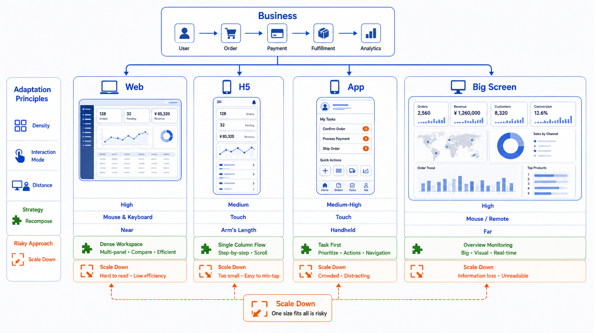

## 核心结论

多端适配不是把一个页面缩放到不同屏幕，而是把同一个业务任务放进不同使用场景。Web 端适合复杂操作，H5 适合轻任务，App 适合高频持续使用，大屏适合监控和展示。

真正可维护的多端系统，应该复用业务规则、设计令牌和核心组件，但不要强行复用完全相同的布局。



## Web 端

Web 端适合横向组织信息。常见结构是侧边导航、顶部工具栏、内容区、详情抽屉。它适合表格、树形结构、批量操作、多列详情和复杂筛选。

Web 端设计要强调效率：快捷筛选、列配置、批量选择、键盘操作、上下文保留，都比装饰更重要。

## H5

H5 通常来自扫码、分享、消息通知或活动入口。用户的注意力短，任务也应该短。H5 适合单列布局、分步骤表单、底部固定操作和简单结果反馈。

不要把完整后台塞进 H5。用户在手机浏览器里更适合完成一个明确动作，而不是处理复杂配置。

## App

App 适合高频、持续、个性化的使用场景。它可以使用底部导航、原生手势、通知、离线缓存、相机、定位等能力。

App 设计要尊重平台习惯。返回、转场、底部操作、手势反馈如果不自然，用户会很快感觉“这不像一个成熟 App”。

## 大屏

大屏不是放大的后台。它通常用于远距离查看、态势展示、异常预警和汇报演示。大屏要减少可点击控件，突出趋势、对比和异常。

## AI 开发提示词

```text
请把【业务页面】设计成 Web、H5、App、大屏四套布局。
不要简单缩放同一页面，请分别说明每个终端的用户任务、保留信息、隐藏信息、主操作和状态反馈。
```

## 检查清单

- 每个终端的主任务是否不同且明确？
- Web 是否保留效率工具？
- H5 是否围绕单任务设计？
- App 是否符合平台导航和触控习惯？
- 大屏是否能远距离识别核心指标？

## 参考来源

- Apple Human Interface Guidelines：https://developer.apple.com/design/human-interface-guidelines
- Material Design 3：https://m3.material.io/
- Microsoft Fluent 2：https://fluent2.microsoft.design/

