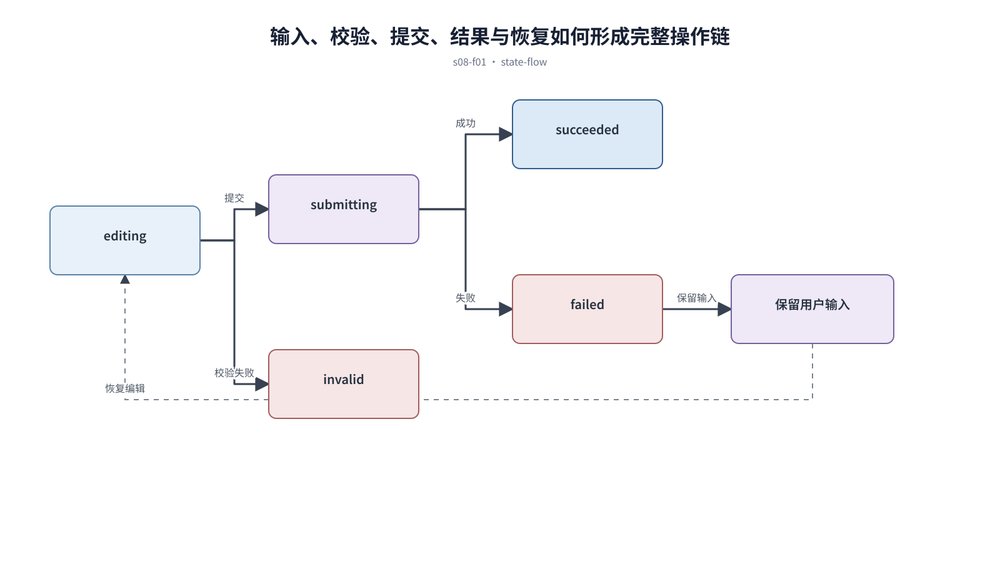

## 前置知识与学习目标

**前置知识：** 理解后台页面骨架和对象级操作位置。

**本篇唯一核心问题：** 怎样把表单、筛选、搜索和弹窗组成低错误、可撤销的操作链？

读完后，你应该能够：能为输入、校验、提交、确认和恢复定义清楚状态。本篇沿用“跨端客户工单管理 SaaS”，核心对象统一为 `ticket`、`customer`、`assignee`、`status`、`priority` 与 `permission`。

上一章已经解决“怎样围绕高频业务任务组织一个专业、可恢复的后台页面”的问题；本篇把它作为输入，不再重复完整解释。

## 从真实问题出发

客服在弹窗里修改工单并提交，接口失败后弹窗关闭，刚才填写的内容全部丢失。

先不要急着选择组件或颜色。应先写清楚当前用户、对象、触发条件、成功结果和失败后仍需保留的上下文，再判断界面应该表达什么。

## 核心机制

四类交互职责不同：表单收集结构化输入，筛选缩小已知集合，搜索定位未知对象，弹窗打断当前上下文处理短任务。它们共享输入—校验—提交—结果—恢复链路。

<!-- series-figure:s08-f01 -->



<!-- series-figure:end -->

### 1. 字段标签、帮助和错误信息靠近字段，校验时机与修复成本匹配

字段标签、帮助和错误信息靠近字段，校验时机与修复成本匹配。它先固定主路径和优先级，后续布局不得反过来改变业务判断。验收时要用真实任务观察用户能否找到下一步。

### 2. 筛选结果立即反馈当前条件，重置只清除筛选而不改变用户权限

筛选结果立即反馈当前条件，重置只清除筛选而不改变用户权限。它把抽象原则转换成可见结构。验收时应检查对象、标签、状态和操作是否逐项对应，而不是凭整体观感打分。

### 3. 搜索明确范围、历史和无结果建议，避免把模糊搜索伪装为精确查询

搜索明确范围、历史和无结果建议，避免把模糊搜索伪装为精确查询。它负责异常与边界，必须使用空数据、慢请求、权限差异或冲突数据复测，不能只验证理想状态。

### 4. 弹窗只承载短且聚焦的任务；长表单进入独立页面，并保护未保存内容

弹窗只承载短且聚焦的任务；长表单进入独立页面，并保护未保存内容。它防止局部页面自行发明规则。跨端、跨主题或跨角色检查时，语义保持一致，呈现方式才允许重组。

## 关键角色、数据与状态

| 项目     | 在本篇中的含义                                                                       |
| -------- | ------------------------------------------------------------------------------------ |
| 输入     | 输入是用户值与上下文                                                                 |
| 业务对象 | `ticket` 是工单，`customer` 是客户，`assignee` 是当前负责人                          |
| 约束     | `permission` 决定可执行动作；`priority` 影响排序，不直接替代业务状态                 |
| 状态主线 | `draft → submitted → processing → resolved → closed`，只有满足权限和前置条件才能转换 |
| 输出     | 为 succeeded 或保留输入的 failed。                                                   |

输入是用户值与上下文；中间状态为 pristine、editing、invalid、submitting；输出为 succeeded 或保留输入的 failed。

## 最小实践：贯穿工单案例

修改 `ticket.priority` 时先做本地必填校验，再提交版本号；若服务端返回冲突，弹窗保持打开并展示当前版本与用户修改。

执行时使用下面的决策记录，避免示例只有结果而没有中间状态：

```text
输入：角色、ticket、当前 status、permission、终端与网络状态
检查：核心任务、业务规则、可见反馈、失败恢复、跨端差异
中间状态：记录用户动作、系统判断、状态变化和仍被保留的数据
输出：可验证的界面方案、实现约束与验收证据
失败边界：权限不足、空数据、超时、冲突、长文案和窄屏
```

这里的 `status` 表示业务状态；请求的 loading/error 是界面请求状态，两者不能混为一个字段。示例中的数值与规则只用于教学，接入真实项目时必须由产品规则、接口契约和数据字典确认。

## 常见误区

- **输入一失焦就显示所有错误：** 这会让界面结论失去可验证依据；应回到输入、状态和恢复路径重新检查。
- **关闭弹窗等于默认放弃修改：** 这会让界面结论失去可验证依据；应回到输入、状态和恢复路径重新检查。
- **用搜索框承担复杂结构化筛选：** 这会让界面结论失去可验证依据；应回到输入、状态和恢复路径重新检查。

## 适用边界与不适用场景

- 批量导入和多步骤配置应使用向导或独立任务页。
- 高风险操作即使字段很少，也需要影响预览和二次确认。

如果当前任务没有多对象关系、状态变化或失败恢复，不要为了套用本章而制造额外组件和流程。复杂度必须来自真实认知问题。

## 自检题

1. 用一句话说明：怎样把表单、筛选、搜索和弹窗组成低错误、可撤销的操作链？
2. 在工单案例中，输入、中间状态和输出分别是什么？
3. 本章方法在哪些场景不应直接套用？

<details>
<summary>查看答案</summary>

1. 四类交互职责不同：表单收集结构化输入，筛选缩小已知集合，搜索定位未知对象，弹窗打断当前上下文处理短任务。它们共享输入—校验—提交—结果—恢复链路。
2. 输入是用户值与上下文；中间状态为 pristine、editing、invalid、submitting；输出为 succeeded 或保留输入的 failed。
3. 批量导入和多步骤配置应使用向导或独立任务页。高风险操作即使字段很少，也需要影响预览和二次确认。

</details>

## 本篇总结

能为输入、校验、提交、确认和恢复定义清楚状态。真正的完成标准不是“看起来合理”，而是每条规则都能追溯到任务、数据、状态或规范，并能通过边界场景验证。

## 下一篇衔接

下一篇将解决“怎样把加载、空、错误、权限和成功反馈建模为可恢复的界面状态机”。本篇输出的决策、约束和案例状态将作为它的直接输入。

## 资料来源

- [WAI：Form Instructions](https://www.w3.org/WAI/tutorials/forms/instructions/)
- [WAI-ARIA APG：Modal Dialog](https://www.w3.org/WAI/ARIA/apg/patterns/dialog-modal/)
- [Carbon：Form](https://carbondesignsystem.com/patterns/forms-pattern/)
